# 第 1 章　通过亲手制作晶体管电路学习运算放大器

<!-- 来源：PDF 第 15 页；原书第 1 页 -->

开始不妨先利用单个晶体管制作简单的运算放大器。一方面以该运算放大器测试其基本的特性，同时学习运算放大器的专业术语与工作原理。

## 1.1　运算放大器的概述

### 1.1.1　运算放大器具备的五个基本端子

请看图 1.1。运算放大器必定有以下的五个端子：

- 正向输入端子（Non-Inverting Input）；
- 反向输入端子（Inverting Input）；
- 正电源端子（写作 \\(V_{CC}\\)、\\(+V_{CC}\\)、\\(V^+\\)、\\(+V_S\\) 等等）；
- 负电源端子（写作 \\(V_{EE}\\)、\\(-V_{EE}\\)、\\(V^-\\)、\\(-V_S\\) 等等）；
- 输出端子（Output）。

除此之外，还具备有“相位（频率）补偿端子”和“偏移与零调整端子”。

### 1.1.2　两个输入端子与一个输出端子

#### 反向输入与正向输入

两个输入端子在运算放大器（OP Amp）记号之中写作“+”与“-”，并且如下识别：

- `+`：正向输入端子；
- `-`：反向输入端子。

在两个输入端子中的任何一个都可供加信号。运算放大器的正向输入端子至接地（Ground）间电压称为“正向输入电压 \\(V_{NI}\\)”，反向输入端子至接地间电压则称为“反向输入电压 \\(V_I\\)”。再者，以后接地（Ground）都写作 GND。

<!-- 来源：PDF 第 16 页；原书第 2 页 -->

#### 两个输入电压之差——差动输入电压 \\(V_{ID}\\)

这是正向输入端子与反向输入端子间的电压，即

\\[
V_{ID}=V_{NI}-V_I \tag{1.1}
\\]

#### 单端接输出（Single End Output）

当运算放大器的输出端子只有一个，输出端子至 GND 间电压即为输出电压。像这样信号端子对的一端被接地，就叫做单端接地（Single End）。

### 1.1.3　运算放大器的放大倍数——差动电压增益 \\(A_{VD}\\)

理想的运算放大器的输出电压 \\(V_O\\) 与差动输入电压 \\(V_{ID}\\) 成正比。该比例常数也就是放大倍数，叫做“差动电压增益 \\(A_{VD}\\)”。即

\\[
V_O=A_{VD}V_{ID} \tag{1.2}
\\]

对于交流信号的差动电压增益称为“开环增益（Open Loop Gain）”。一般记载于运算放大器的资料手册中的增益，是直流与差动电压增益，增益的特征是其值无限大。

### 1.1.4　运算放大器的电源电压

运算放大器基本上使用双电源。在正电源端子至 GND 间施加 \\(+5\sim+15\ \mathrm{V}\\) 左右的电压，在负电源端子至 GND 间则施以 \\(-5\sim-15\ \mathrm{V}\\) 左右的电压。不过，也有把负电源端子接地来使用单电源的情形（最近尤其以 5 V 单电源使用的事例特别多）。

另外，为使电路在图中看起来整洁，这里不把运算放大器的电源端子和电源线路画在电路图中。当然实际上必须如图 1.1 所示连接电源。

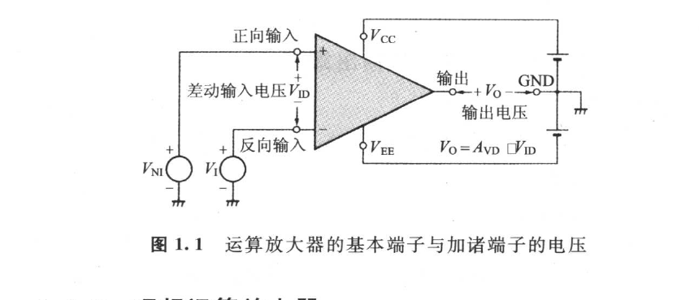

**图 1.1　运算放大器的基本端子与加诸端子的电压**

### 1.1.5　理想运算放大器

如图 1.2 所示，满足下列条件的运算放大器就叫做“理想运算放大器”。当然实际上并不存在理想运算放大器，但在应用电路设计与分析时，作为理想模式（Model）来思考就显得简单。

<!-- 来源：PDF 第 17 页；原书第 3 页 -->

- 输入失调（Offset）电压为零；
- DC 输入电流为零；
- 输入电阻为 \\(\infty\\)；
- 输出电阻为零；
- 差动电压增益为 \\(\infty\\)；
- 无限的高速响应；
- 不产生噪声。

接近理想的运算放大器被称为优越的运算放大器，实际所使用的乃是个别的参数（Parameter）接近理想值的运算放大器。

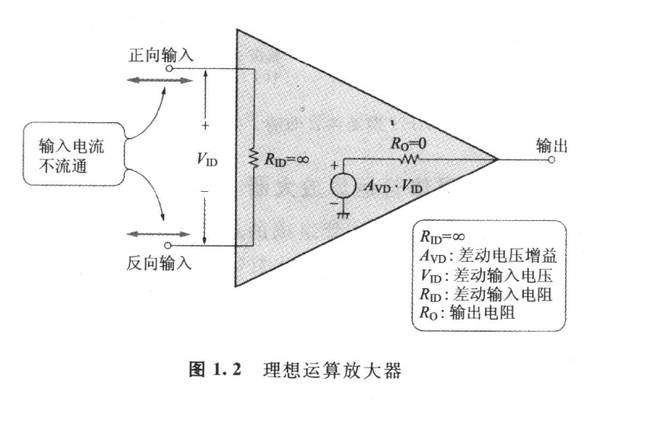

**图 1.2　理想运算放大器**

## 1.2　五晶体管运算放大器的实验

### 1.2.1　运算放大器的内含——由晶体管组成的放大电路

制作运算放大器之前，不妨简单地复习一下晶体管的工作原理。请看图 1.3。

倘若在 NPN 型晶体管的基极与发射极间施加正电压，而在集电极与发射极间供以正电压，就会有图 1.3(a) 所示流向的电流流通。而且，发射极电流 \\(I_E\\)、集电极电流 \\(I_C\\)、基极电流 \\(I_B\\) 之间的关系如下：

\\[
I_E=I_C+I_B \tag{1.3}
\\]

<!-- 来源：PDF 第 18 页；原书第 4 页 -->

集电极电流与基极电流成比例关系：

\\[
I_C=h_{FE}I_B \tag{1.4}
\\]

该比例常数 \\(h_{FE}\\) 叫做“直流电流放大倍数”。

基极-发射极间电压 \\(V_{BE}\\) 与基极电流 \\(I_B\\) 之间有如图 1.3(b) 所示的关系。PNP 型晶体管，虽然电压与电流的方向和 NPN 型晶体管完全相反，但是式 (1.3) 与式 (1.4) 及图 1.3(b) 所示的关系仍然成立。

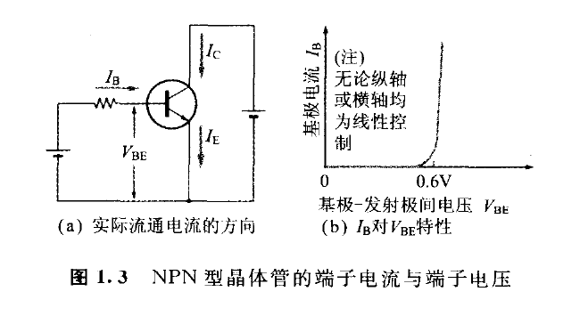

**图 1.3　NPN 型晶体管的端子电流与端子电压**

### 1.2.2　制作五晶体管运算放大器

在此所制作的是由晶体管组成的运算放大器，如图 1.4 所示。这是作者在《晶体管电路设计入门》（CQ 出版社）中所制作的东西。实物的运算放大器 IC 由众多的晶体管集成而成，但是在此是以理解工作原理为目的，而做成简易型运算放大器。

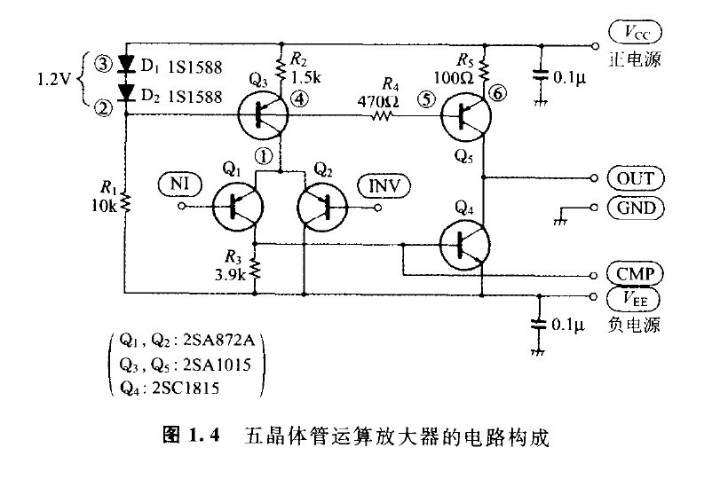

**图 1.4　五晶体管运算放大器的电路构成**

NI 是正向输入端子，INV 则为反向输入端子。电源端子至 GND 间的两个电容器是用以降低高频率下的电源阻抗，俗称“旁路电容器”。

<!-- 来源：PDF 第 19 页；原书第 5 页 -->

因电源电压为 \\(\pm15\ \mathrm{V}\\)，故以耐压达 25 V 以上的陶瓷（Ceramic）电容器或云母（Mica）电容器比较合适。

从晶体管 \\(Q_4\\) 的基极引出的 CMP 是为装设相位补偿电容器而设的端子。CMP 至 OUT 端子间是以陶瓷或者云母型电容器当作相位补偿用的连接。

此运算放大器电路的印制基板图案和完成的基板分别如图 1.5、照片 1.1 所示。在制作上使用万用印制（Universal Print）基板也可以，但配线距离要短，GND 线路尽量粗大。

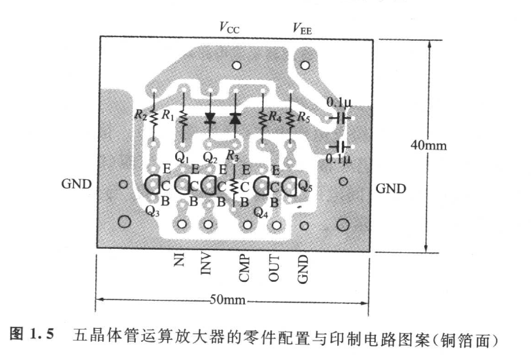

**图 1.5　五晶体管运算放大器的零件配置与印制电路图案（铜箔面）**

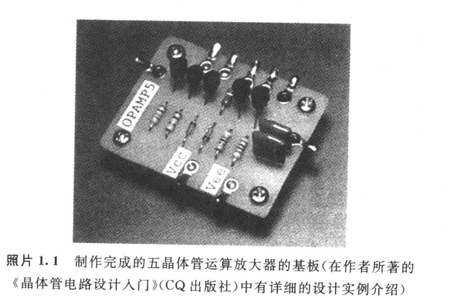

**照片 1.1　制作完成的五晶体管运算放大器的基板**（在作者所著的《晶体管电路设计入门》（CQ 出版社）中有详细的设计实例介绍）

### 1.2.3　五晶体管运算放大器的电路制作

多数的运算放大器集成电路均属于如图 1.6 所示的三级放大电路，但此处所制作的五晶体管运算放大器则属于两级放大电路。

<!-- 来源：PDF 第 20 页；原书第 6 页 -->

电路由几个方块所构成：

- 初级：差动放大电路（\\(Q_1\\)、\\(Q_2\\)、\\(Q_3\\)）；
- 二级：发射极（Emitter）接地放大电路（\\(Q_4\\)、\\(Q_5\\)）。

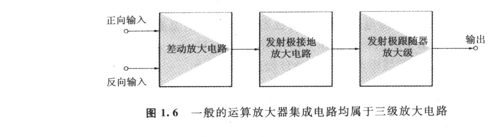

**图 1.6　一般的运算放大器集成电路均属于三级放大电路**

#### 可有效使用恒流电路

\\(Q_3\\) 与 \\(Q_5\\) 分别构成恒流电路（详如图 1.7）。恒流电路就是指电压虽有变化，但仍经常流有一定电流的电流源（图 1.7(b)）。即使各集电极-发射极间电压 \\(V_{CE}\\) 有所变化，但 \\(Q_3\\) 与 \\(Q_5\\) 的各集电极电流仍分别保持一定值。

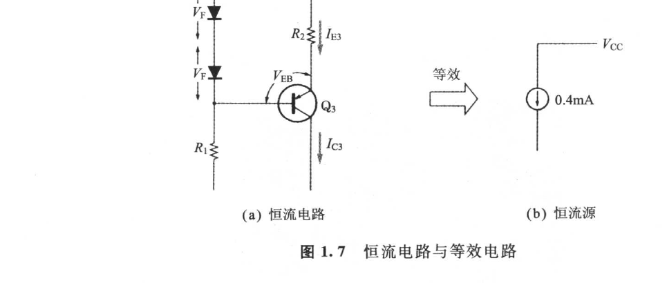

**图 1.7　恒流电路与等效电路**

下面不妨来计算 \\(Q_3\\) 的集电极电流。

先求 \\(Q_3\\) 的发射极电流 \\(I_{E3}\\) 为：

\\[
I_{E3}=\frac{2V_F-V_{EB3}}{R_2} \tag{1.5}
\\]

其中，\\(V_F\\) 为二极管 1S1588 的正向电压；\\(V_{EB3}\\) 为 \\(Q_3\\) 的发射极-基极间电压。

常温（300 K）下 \\(V_F\\) 与 \\(V_{EB3}\\) 约为 0.6 V（硅二极管、硅晶体管的情形），故

<!-- 来源：PDF 第 21 页；原书第 7 页 -->

\\[
I_{E3}\approx\frac{2\times0.6-0.6}{1.5\times10^3}\approx0.4\ \mathrm{mA} \tag{1.6}
\\]

而且，从式 (1.3) 与式 (1.4) 可求得 \\(I_{C3}\\) 为：

\\[
I_{C3}=\left(\frac{h_{FE}}{1+h_{FE}}\right)I_{E3} \tag{1.7}
\\]

\\(h_{FE}/(1+h_{FE})\\) 一般称为“基极接地（正向）电流放大倍数”\\(\alpha_F\\)。

晶体管 \\(Q_3\\)（2SA1015）的 \\(h_{FE}\\) 一般都在 70 以上，因而 \\(\alpha_F\\) 极其接近于 1，\\(Q_3\\) 的集电极电流大致与发射极电流相等。发射极电流与集电极-发射极间电压 \\(V_{CE}\\) 无关，而由式 (1.5) 决定，还有几乎完全不依存于 \\(h_{FE}\\) 与 \\(V_{CE}\\)。从而，\\(Q_3\\) 的集电极电流等于发射极电流，而可视为 0.4 mA 的恒流源。

#### 初级属于差动放大电路

请看图 1.8。图 1.8(a) 是初级差动放大电路的等效电路。图 1.4 上晶体管 \\(Q_2\\) 的集电极虽然直接连接于 \\(V_{EE}\\)，但为说明简单起见，假定在 \\(Q_2\\) 的集电极接一个与 \\(R_3\\) 电阻值相等的电阻，又假定 \\(Q_1\\) 与 \\(Q_2\\) 的特性相同。

在图 1.8(a) 中，\\(V_1-V_2\\) 为差动输入电压。当差动输入电压为零时，\\(Q_1\\) 的集电极电流 \\(I_{C1}\\) 与 \\(Q_2\\) 的集电极电流 \\(I_{C2}\\) 数值相同（约为 0.2 mA）。在此倘若 \\(V_1\\)、\\(V_2\\) 的一方或者双方发生变化，譬如有正的差动输入电压出现的话，则发生如图 1.8(b) 所示那样 \\(I_{C1}\\) 减少、\\(I_{C2}\\) 增加的现象。

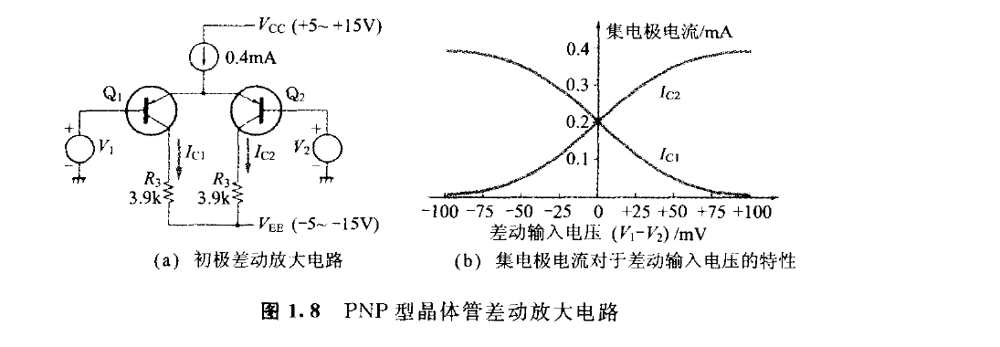

**图 1.8　PNP 型晶体管差动放大电路**

#### 第二级发射极接地放大电路

请看图 1.9。图 1.4 中的 \\(Q_5\\) 是作为 6 mA 的恒流电路发挥其作用。实际的应用电路，OUT 端子至 GND 间有负载电阻 \\(R_L\\) 接入，进而在 OUT 端子至 INV 端子间为施加负反馈而接入反馈电阻。

<!-- 来源：PDF 第 22 页；原书第 8 页 -->

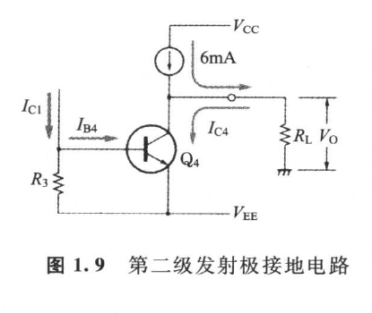

**图 1.9　第二级发射极接地电路**

在该状态下，当输入电压为零的时候，输出电压 \\(V_O\\) 也约略为零，流过负载电阻的电流事实上为零。此时依据基尔霍夫（Kirchhoff）法则，\\(Q_4\\) 的集电极电流将成为与恒流电路的电流相等的 6 mA。

倘若在此施加正的差动输入电压，则如上所述，\\(Q_1\\) 的集电极电流将减少，因而第二级的 \\(Q_4\\) 的基极电流减少，\\(Q_4\\) 的集电极电流呈比例随之减少，而且与该减少量大小相等的正电流将成为带正性的输出电流 \\(I_O\\)。流经负载电阻 \\(R_L\\)，产生正的输出电压 \\(V_O\\)，即

\\[
I_O=-\Delta I_{C4} \tag{1.8}
\\]

其中，\\(\Delta I_{C4}\\) 为 \\(Q_4\\) 的集电极电流的增量。

\\[
V_O=I_OR_L \tag{1.9}
\\]

### 1.2.4　作为正向放大器的实验

使用所制作的五晶体管运算放大器，不妨对基本的放大电路做个实验。

暂且把正向放大器表示如图 1.10，可获得与输入同相位（极性）的放大器，所以叫做正向放大器。

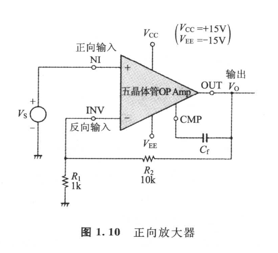

**图 1.10　正向放大器**

输入电压 \\(V_S\\) 施加于正向输入端子上。通过 \\(R_1\\) 与 \\(R_2\\) 把输出电压 \\(V_O\\) 予以分压反馈到反向输入端子。此时的分压比 \\(R_1/(R_1+R_2)\\) 叫做反馈率 \\(\beta\\)。一般把运算放大器的输出反馈到反向输入的话，就会得到负反馈（Negative Feedback）。

<!-- 来源：PDF 第 23 页；原书第 9 页 -->

#### 作为运算放大器的电压增益

负反馈后的电压增益 \\(V_O/V_S\\) 叫做闭环增益（Closed Loop Gain）\\(A_{CLS}\\)。如果解以下的联立方程式：

\\[
V_{NI}=V_S \tag{1.10a}
\\]

\\[
V_I=\beta V_O \tag{1.10b}
\\]

\\[
V_O=A(V_{NI}-V_I) \tag{1.10c}
\\]

其中，\\(V_{NI}\\) 为正向输入（对 GND）电压；\\(V_I\\) 为反向输入（对 GND）电压；\\(A\\) 为开环增益（Open Loop Gain）；\\(\beta\\) 为反馈率，\\(\beta=R_1/(R_1+R_2)\\)。

那么正向放大器的闭环增益 \\(A_{CLS}\\)，便可由下式求得：

\\[
A_{CLS}=\frac{A}{1+A\beta}
=\frac{1}{\beta}\left(\frac{1}{1+[1/(A\beta)]}\right) \tag{1.11}
\\]

在此，一般都称 \\(A\beta\\) 为环路增益（Loop Gain）。又称 \\(1+A\beta\\) 为“反馈量”。式 (1.11) 表示正向放大器的增益按 1／反馈量衰减。而当环路增益远大于 1 时，闭环增益则渐近于 \\(1/\beta\\)。

即，正向放大器的闭环增益为：

\\[
A_{CLS}\approx\frac{1}{\beta}=\frac{R_1+R_2}{R_1} \tag{1.12}
\\]

按图 1.10 的电路所示，因 \\(R_1=1\ \mathrm{k\Omega}\\)、\\(R_2=10\ \mathrm{k\Omega}\\)，所以 \\(A_{CLS}\\) 事实上是 11 倍。若用 dB（decibel，分贝）表示，即为：

\\[
A_{CLS}=20\lg 11=20.8\ \mathrm{dB} \tag{1.13}
\\]

实测的闭环增益与频率特性的关系如图 1.11 所示。频率特性虽然随相位补偿电容 \\(C_f\\) 的值而变，但是频率特性平坦部分的闭环增益仍为计算的 20.8 dB。

#### 截止频率（Cutoff Frequency）

以频率特性的平坦部分作基准，增益降低 3.01 dB 的频率叫做“功率减半截止频率”或“3 dB 截止频率”，甚至只简称为“截止频率”。在图 1.11 中，相位补偿电容 \\(C_f=15\ \mathrm{pF}\\) 的时候，截止频率约为 3 MHz；\\(C_f=150\ \mathrm{pF}\\) 时则约为 300 kHz。

像这样的运算放大器电路，相位补偿电容的值越小，则平坦部分的频带越大，但是过度降低就会导致频率特性出现峰值（Peak，参照图 1.11 中 \\(C_f=0\\) 的曲线），或者出现振荡。一般情况下，当出现 3 dB 以上的峰值时，多半是产生振荡的前兆，请务必加以注意。

<!-- 来源：PDF 第 24 页；原书第 10 页 -->

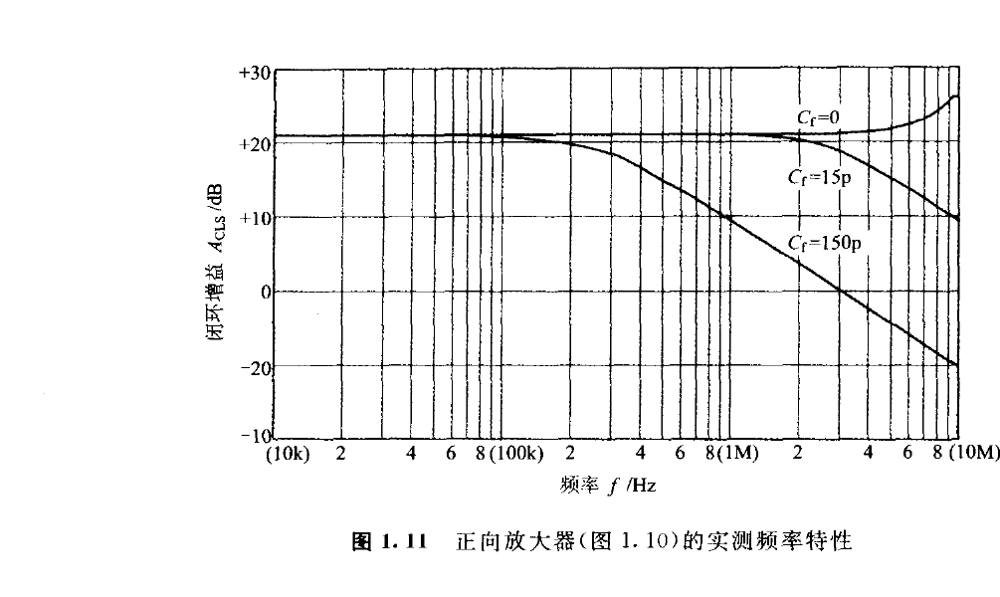

**图 1.11　正向放大器（图 1.10）的实测频率特性**

#### 失真率特性

现将正向放大器在图 1.10 的失真率特性表示于图 1.12。此失真率特性是经实测所得的结果，低输出时失真率恶化的原因是由残留噪声所导致的。

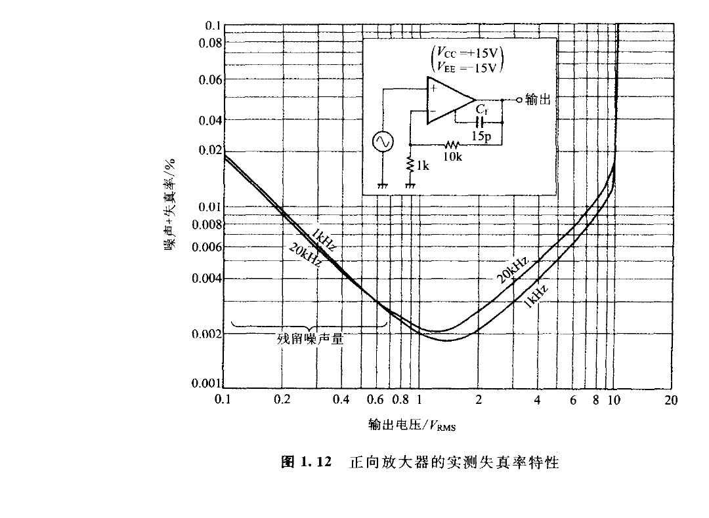

**图 1.12　正向放大器的实测失真率特性**

<!-- 来源：PDF 第 25 页；原书第 11 页 -->

### 1.2.5　电压跟随器电路的实验

请看图 1.13。此电路是具有反馈率 \\(\beta=1\\) 的负反馈——全反馈电路。因此，输出将出现与输入同相位（极性）的信号。用途是做信号的阻抗变换等等，全反馈的正向放大器叫做电压跟随器（Voltage Follower）。

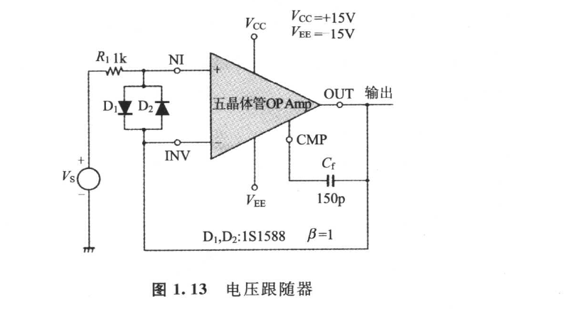

**图 1.13　电压跟随器**

依先前的式 (1.12)，电压跟随器的闭环增益事实上为 1 倍（0 dB）。电压跟随器电路经实测的频率特性如图 1.14 所示。相位补偿电容为 150 pF 时，截止频率约为 4 MHz。

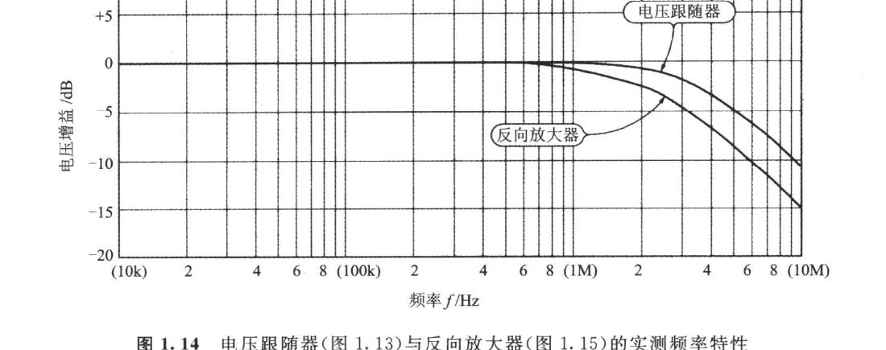

**图 1.14　电压跟随器（图 1.13）与反向放大器（图 1.15）的实测频率特性**

另外，图 1.13 中连接在输入端子间的两个二极管，是为了在升起和下降遇有陡峭的巨大振幅方波输入时，用以防止运算放大器内部晶体管 \\(Q_1\\) 与 \\(Q_2\\) 的各基极-发射极间的崩溃（Breakdown）而设的保护电路。

<!-- 来源：PDF 第 26 页；原书第 12 页 -->

此二极管在通常工作时可视为非导通（NI 与 INV 约略为同电位）。

### 1.2.6　反向放大器的实验

图 1.15 为反向放大器的构成。输入信号与输出信号的相位（极性）完全相反。运算放大器的正向输入端子接地，并将信号电压 \\(V_S\\) 施加于反向输入的串联电阻 \\(R_1\\) 的放大器叫做“反向放大器”。这是因输出的相位呈反向（即输入与输出的相位差为 \\(180^\circ\\)）的缘故。

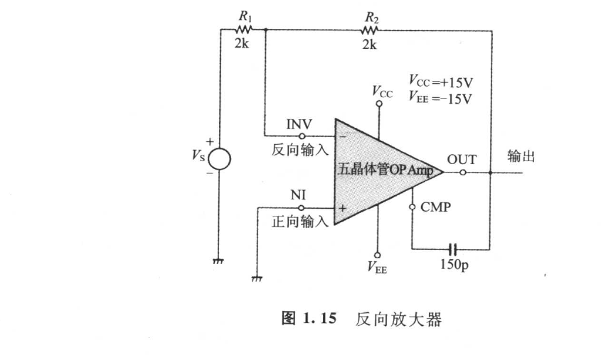

**图 1.15　反向放大器**

反向放大器的闭环增益 \\(A_{CLS}(=V_O/V_S)\\)，可由以下的联立方程式求得：

\\[
V_{NI}=0 \tag{1.14a}
\\]

\\[
V_O=A(V_{NI}-V_I) \tag{1.14b}
\\]

\\[
V_I=(1-\beta)V_S+\beta V_O \tag{1.14c}
\\]

式中，反馈率为：

\\[
\beta=\frac{R_1}{R_1+R_2}
\\]

因此：

\\[
A_{CLS}=-\frac{A(1-\beta)}{1+A\beta} \tag{1.15}
\\]

当电路的环路增益 \\(A\beta\\) 远大于 1 时，式 (1.15) 可以近似为：

\\[
A_{CLS}\approx-\frac{1-\beta}{\beta}=-\frac{R_2}{R_1} \tag{1.16}
\\]

右边的“-”符号表示相位反向的意思。

图 1.15 所示的使用五晶体管运算放大器的反向放大器经实测所得的频率特性如图 1.14 所示。

<!-- 来源：PDF 第 27 页；原书第 13 页 -->

闭环增益与电压跟随器同为 0 dB，但截止频率低于电压跟随器。

## 1.3　运算放大器的交流（AC）特性

### 1.3.1　最大输出电压振幅相对频率的特性

如果运算放大器使用在高于某一定频率的高频率领域工作时，其最大输出电压振幅将会降低。现将图 1.10 的正向放大器经实测的最大输出振幅相对频率的特性表示于图 1.16。

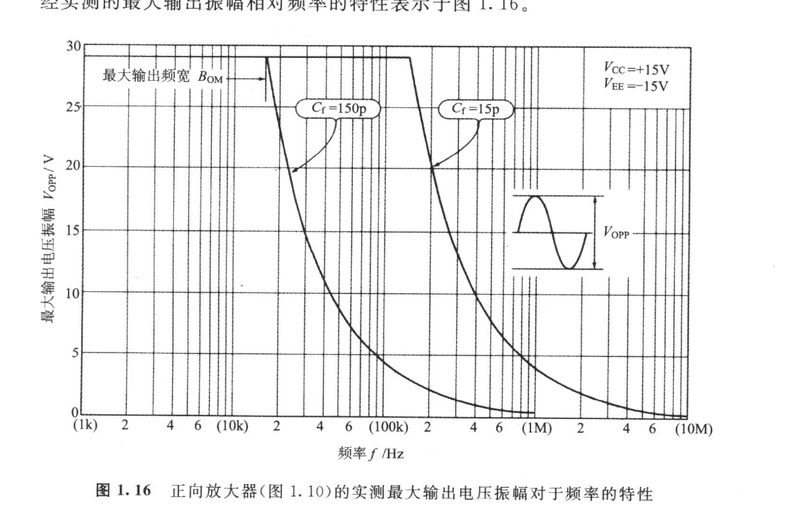

**图 1.16　正向放大器（图 1.10）的实测最大输出电压振幅对于频率的特性**

此时最大输出电压振幅开始降低的频率叫做“最大输出频带宽 \\(B_{OM}\\)”或“Full Power 响应频率”。

### 1.3.2　转换速率（Slew Rate）

倘若把频率高于最大输出频带宽的大振幅正弦波波形输入于运算放大器的话，运算放大器的输出将成为如图 1.17 所示的三角波。纵然加大输入振幅，但输出的三角波斜率（倾斜度）仍饱和于一定值。此时饱和的倾斜度的绝对值叫做转换速率（Slew Rate）。

<!-- 来源：PDF 第 28 页；原书第 14 页 -->

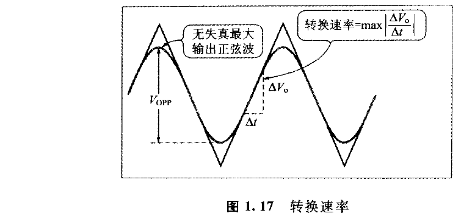

**图 1.17　转换速率**

转换速率与最大输出电压振幅相对频率的特性有密切的关系，表示为下式：

\\[
SR=\pi B_{OM}V_{OPP} \tag{1.17}
\\]

其中，\\(SR\\) 为转换速率，\\(B_{OM}\\) 为最大输出频带宽（Hz）；\\(V_{OPP}\\) 为当 \\(f=B_{OM}\\) 时的最大输出电压振幅。

譬如说相位补偿电容 \\(C_f=150\ \mathrm{pF}\\) 的情形，若把图 1.16 的 \\(B_{OM}\\) 与 \\(V_{OPP}\\) 代入式 (1.17) 的话，则

\\[
SR=3.14\times16500\times29=1.5\times10^6\ \mathrm{V/s}
\\]

即转换速率为 \\(1.5\ \mathrm{V/\mu s}\\)。

再者，输入大振幅方波时的响应波形倾斜度（图 1.18）也等于转换速率。

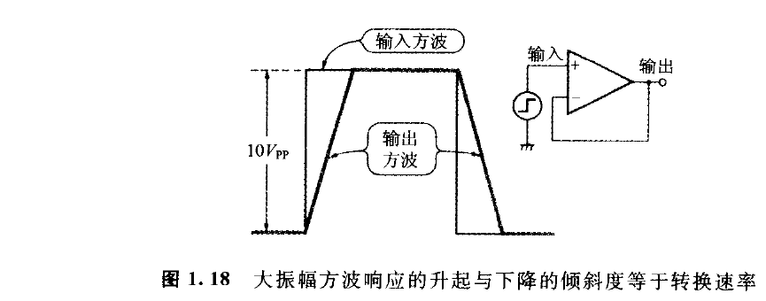

**图 1.18　大振幅方波响应的上升与下降的倾斜度等于转换速率**

### 1.3.3　其他的交流特性

运算放大器的交流特性除以上所述之外，还有共模抑制比、电源电压抑制比、噪声特性、增益带宽积、单位增益（Unity Gain）频率、上升时间等等。这些也都很重要，但遇到有必要之处将另加说明。

<!-- 来源：PDF 第 29 页；原书第 15 页 -->

## 1.4　运算放大器的直流（DC）特性

### 1.4.1　输入偏置电流 \\(I_B\\) 与失调（Offset）电流 \\(I_{IO}\\)

流入于正向输入端子或流出的 DC 电流 \\((I_B)_+\\)，与流入于反向输入端子或流出的 DC 电流 \\((I_B)_-\\) 的平均值，即输入偏置电流 \\(I_B\\)，可用下式表示：

\\[
I_B=\frac{(I_B)_+ + (I_B)_-}{2} \tag{1.18}
\\]

制作的五晶体管运算放大器的实测输入偏置电流，是 \\(Q_1\\) 的实测偏置电流 370 nA 与 \\(Q_2\\) 的实测偏置电流 480 nA 的平均值，故为 425 nA。稍微比常用运算放大器 IC 偏大。

流入两个输入端子或流出的 DC 电流差的绝对值，即两个输入端子的输入偏置电流的差，叫做输入失调电流 \\(I_{IO}\\)：

\\[
I_{IO}=\left|(I_B)_+-(I_B)_-\right| \tag{1.19}
\\]

所制作的五晶体管运算放大器在实测上的输入失调电流，可从前面的实测基极电流计算出为 110 nA。

### 1.4.2　输入失调电压 \\(V_{IO}\\)

理想的运算放大器，当差动输入电压为零时，输出电压也成为零。但是实际的运算放大器会有若干的输出电压出现。此输出电压可通过施加微小的 DC 差动输入电压抵消掉。

为使 DC 输出电压为零，必须施加的 DC 差动输入电压的绝对值叫做“输入失调电压”。

此输入失调电压，主要是由初级差动放大电路的晶体管 \\(Q_1\\) 与 \\(Q_2\\) 的基极特性——饱和电流（后述）、集电极电流、PN 结温度等的不一致所产生的。

譬如说，集电极电流在两个晶体管 1% 的误差就会有约 0.25 mV 的输入失调电压产生。还有两结温度 1 ℃ 误差会带来约 2 mV 的输入失调电压。

所制作的五晶体管运算放大器的输入失调电压实测值是 3.84 mV。此时输入失调电压的测试电路如图 1.19 所示。在此电路中，为抑制两输入偏置电流之差（由输入失调电流所导致的测试误差），\\(R_1\\) 的值有必要非常小。

<!-- 来源：PDF 第 30 页；原书第 16 页 -->

现将运算放大器的输入电流与输入失调电压加以考虑的等效电路表示于图 1.20。

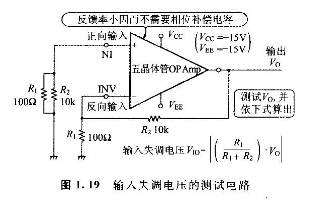

**图 1.19　输入失调电压的测试电路**

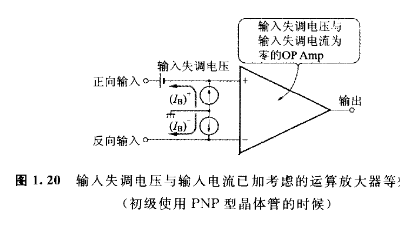

**图 1.20　输入失调电压与输入电流已加考虑的运算放大器等效电路**（初级使用 PNP 型晶体管的时候）

### 1.4.3　最大输出电压相对负载电阻的特性

运算放大器的最大输出电压依存于电源电压，而且又依存于负载电阻 \\(R_L\\)。在制作的五晶体管运算放大器上，最大输出电压对于负载电阻的特性的实测值表示于图 1.21。对于低的负载电阻 \\(R_L\\) 而言，正的最大输出电压（\\(+V_{OM}\\)）之所以显著下降，原因是正的输出电流受限于图 1.9 的定电流源的值（6 mA）。另外，负载电阻若取 200 Ω 以下，则 \\(Q_4\\) 的发热就会增高，\\(Q_4\\) 有被破坏的危险，请一定避免对 OUT 端子的 GND 造成短路。

市面上出售的运算放大器 IC，多数均隐藏有限制输出电流来抑制发热的保护电路。因此短时间（数秒之内）的短路并无问题。可是，长时间的短路会导致输入失调电压永久性的变化和其他的劣化，还是有必要为避免短路而多加考虑。

<!-- 来源：PDF 第 31 页；原书第 17 页 -->

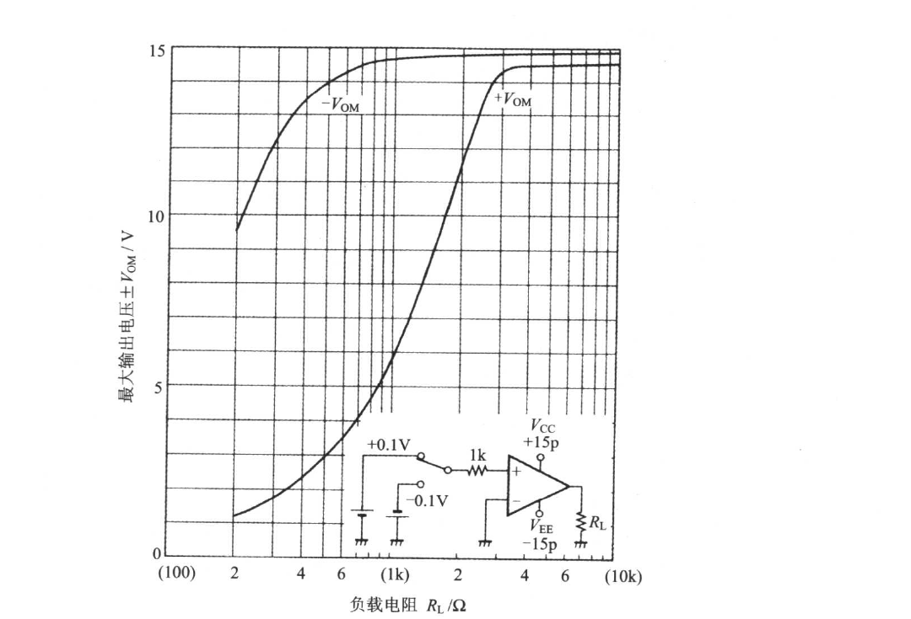

**图 1.21　五晶体管运算放大器的实测最大输出电压振幅对于负载电阻的特性**

### 1.4.4　共模输入电压范围

这是运算放大器正常工作的共模输入电压的最大值。共模输入电压（Common Mode Input Voltage）可根据下式加以定义：

\\[
V_{IC}=\frac{V_{NI}+V_I}{2} \tag{1.20}
\\]

式中，\\(V_{NI}\\) 为正向输入电压；\\(V_I\\) 为反向输入电压。

共模输入电压范围，将成为抑制电压跟随器的最大输出电压的主要因素。原因是

\\[
V_O=V_I\approx V_{NI} \tag{1.21}
\\]

而有大小与输出电压大致相等的共模输入电压发生的缘故。

## 1.5　运算放大器以负反馈使用时的稳定性

### 1.5.1　放大器与振荡器本质相同

多数的运算放大器 IC，因为隐藏有为相位补偿而设的电容器（叫做相位补偿电容器），所以施加较大的负反馈也会稳定工作。

<!-- 来源：PDF 第 32 页；原书第 18 页 -->

不过也有相位补偿电容器外加型的运算放大器 IC。此类型的运算放大器可将频率特性延伸至极限，但稍有差错的话就会导致振荡。对放大器而言振荡是应该避免发生的。当然，反过来说，用运算放大器也能够制作振荡电路。

不过振荡的放大器与稳定的振荡电路本质相同，但是要想掌握这些设计技术，需要懂得“反馈控制理论”。理论体系不同，只要在本书的范畴能够学到根据频率特性判断稳定性的“频率响应法”就足够了。

### 1.5.2　增益用复数表示

在迄今为止的说明中，开环增益（Open Loop Gain）与闭环增益（Closed Loop Gain）均用实数加以处理。其实交流信号的增益乃是复数。频率响应法是把信号视为正弦波的集合，并且以复数表示信号与增益。

现以图 1.22 所示的具有输入、输出电压波形的放大器的增益作为具体例子来加以思考。

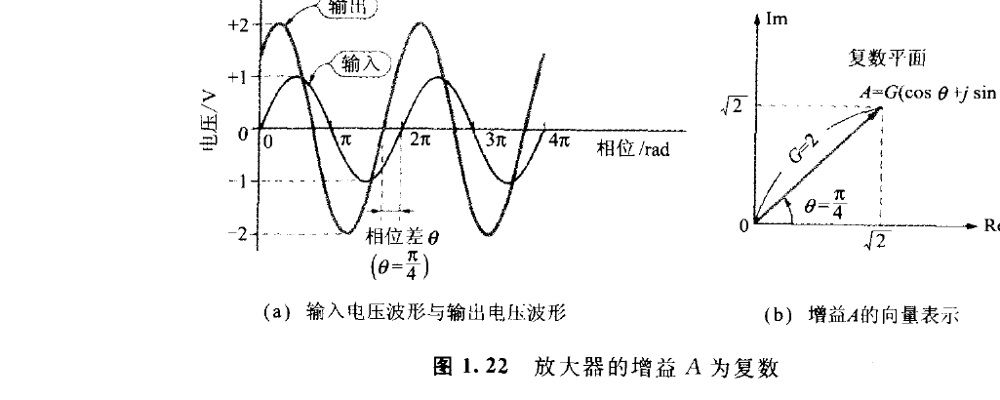

**图 1.22　放大器的增益 \\(A\\) 为复数**

假设用：

- \\(G\\) 表示（输出振幅／输入振幅）；
- \\(\theta\\) 表示输入-输出的相位差（输出相位-输入相位）；

则增益 \\(A\\) 可依下面的复数来定义：

\\[
A=G(\cos\theta+j\sin\theta) \tag{1.22}
\\]

式中，\\(j\\) 为虚数单位，\\(j^2=-1\\)。

输入与输出的相位差称为“相位”。而且相位 \\(\theta\\) 为“+”时叫做“相位超前”，相位为“-”时叫做“相位滞后”。又相位与频率一起变化时，则叫做“相位旋转”。

<!-- 来源：PDF 第 33 页；原书第 19 页 -->

为明确增益为复数的事实，增益以 \\(A(j\omega)\\) 书写。\\(\omega\\) 称为“角频率”，频率 \\(f\\) 与 \\(\omega\\) 之间有如下的关系：

\\[
\omega=2\pi f \tag{1.23}
\\]

\\(\omega\\) 的单位是弧度／秒。

反之，已知复数 \\(A(j\omega)\\) 时，输入输出的振幅比（狭义的增益）\\(G\\) 与输入输出的相位差 \\(\theta\\) 可由下式算出：

\\[
G=\left|A(j\omega)\right| \tag{1.24a}
\\]

\\[
\theta=\arctan\left[
\frac{\operatorname{Im}(A(j\omega))}
{\operatorname{Re}(A(j\omega))}
\right] \tag{1.24b}
\\]

振幅比 \\(G\\) 对频率特性的关系称为“振幅-频率特性”或“增益-频率特性”，或简称“频率特性”。还有输入输出相位差 \\(\theta\\) 相对频率的特性又称为“相位-频率特性”，或简称“相位特性”。

### 1.5.3　表示频率特性的伯德图

把振幅频率特性与相位频率特性合并为一的曲线图，根据建议者 H. Bode 而称之为“伯德图”。运算放大器开环增益的伯德图一般如图 1.23 所示。

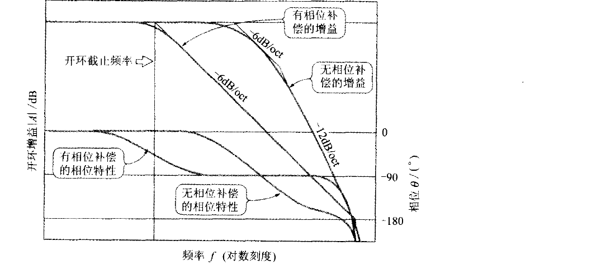

**图 1.23　运算放大器的开环增益的伯德图**

#### 不施加相位补偿的情形

开环增益的高频域 Roll-off（增益下降的斜度），与频率的上升一样呈现 \\(-6\ \mathrm{dB/oct}\\)、\\(-12\ \mathrm{dB/oct}\\)、\\(-18\ \mathrm{dB/oct}\\) 的陡峭。相位特性与 Roll-off（滚降）密切关联，而且增益以 \\(-6\ \mathrm{dB/oct}\\) 衰减的频率在相位滞后上为 \\(-90^\circ\\)，但以 \\(-12\ \mathrm{dB/oct}\\) 衰减的频率在相位滞后上接近于 \\(-180^\circ\\)，并且呈陡峭衰减的频率，则相位滞后将大于 \\(-180^\circ\\)。

<!-- 来源：PDF 第 34 页；原书第 20 页 -->

#### 施加适当相位补偿的情形

开环增益的 3 dB 截止频率虽下降，但增益以 \\(-6\ \mathrm{dB/oct}\\) 衰减的频率范围却扩大。而且在不施加相位补偿时，以 \\(-12\ \mathrm{dB/oct}\\) 衰减的频率领域，相位的滞后不用说是减少的。

产生相位滞后问题的原因，是当反馈电路的相位做 \\(180^\circ\\) 旋转时将成为正反馈，如果正反馈的强度超过限度，则电路就陷入不稳定状态（如振荡等）。

### 1.5.4　开环增益的伯德图

可用各式各样的方法对运算放大器的开环增益进行测试。简而言之，可根据反向放大器的反向输入电压 \\(V_I\\) 与输出电压 \\(V_O\\) 的振幅比与相位差测试获得。

即反向放大器根据式 (1.14a) 与式 (1.14b) 可得：

\\[
V_O=-AV_I \tag{1.25}
\\]

从而开环增益 \\(A\\) 为：

\\[
A=-\frac{V_O}{V_I} \tag{1.26}
\\]

因为“-”符号表示相位反向，故对 \\(V_I\\) 与 \\(V_O\\) 的相位差加以测试，并从该数值减去 \\(180^\circ\\) 的话，即可获得开环增益的相位。以实测资料为基础描绘而成的伯德图表示于图 1.24。

如上所述，开环增益在大范围内以 \\(-6\ \mathrm{dB/oct}\\) 衰减时，\\(-6\ \mathrm{dB/oct}\\) 滚降（Roll-off）领域频率 \\(f\\) 与在 \\(f\\) 上的开环增益的积为一定值。此值叫做“增益带宽积（Gain Bandwidth Product）”或“GB 积”。

图 1.24 的开环增益在 380 kHz 时为 10 倍，所以：

\\[
\mathrm{GBP}=380\times10^3\times10=3.8\ \mathrm{MHz}
\\]

### 1.5.5　伯德的稳定辨别法

负反馈电路的稳定性，能够根据环路增益（即开环增益与反馈率的积）的伯德图简单加以辨别。

> 在环路增益的振幅-频率特性成为 1 倍（即 0 dB）的频率上，要是环路增益的相位滞后小于 \\(-180^\circ\\) 就表示稳定，超过 \\(-180^\circ\\) 则表示不稳定。

<!-- 来源：PDF 第 35 页；原书第 21 页 -->

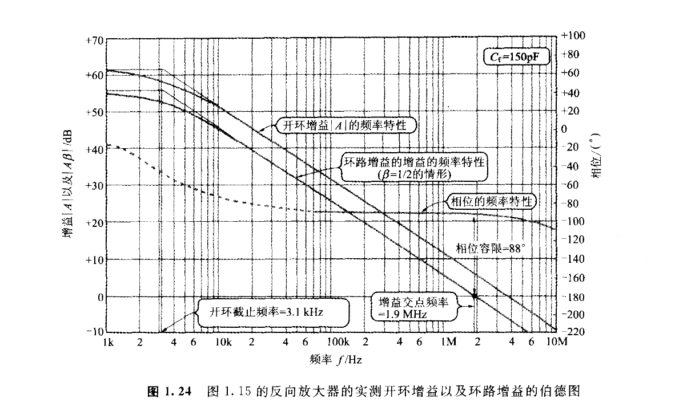

**图 1.24　图 1.15 的反向放大器的实测开环增益以及环路增益的伯德图**

不妨把伯德的稳定辨别法适用于图 1.15 所示的反向放大器。此反向放大器的反馈率为：

\\[
\beta=\frac{R_1}{R_1+R_2}
=\frac{2000}{2000+2000}
=\frac{1}{2}
\\]

从而环路增益 \\(A\beta\\) 的振幅-频率特性正是开环增益 \\(A\\) 的振幅频率特性朝下方平行移动 6 dB 得到的（图 1.24），而且环路增益成为 1 倍（0 dB）增益的频率是 1.9 MHz。

运算放大器的输入阻抗在高频域仍十分高时，由于反馈率 \\(\beta\\) 的相位滞后可看成是零，所以环路增益 \\(A\beta\\) 的相位特性与开环增益 \\(A\\) 的相位特性相同。

> 注：直截了当地说，此稳定辨别法，是用以辨别高频域振荡的可能性。运算放大器因属于直流放大器，所以低频带的相位收敛为零；但内部的信号通路插入变压器或以电容器截止直流的放大器，在低频带增益将减少，而且相位前进。像这样的放大器上加上负反馈的话，则有低频带振荡的可能性。
>
> 伯德的稳定辨别法如果如下改写，则可判断低频域振荡的可能性：
>
> “环路增益在低频带下降时，环路增益成为 1 倍（即 0 dB）的频率上，环路增益的相位超前（进相）小于 \\(+180^\circ\\) 的话即为稳定，逾越 \\(+180^\circ\\) 则会不稳定。”
>
> 想要对伯德的稳定辨别法详细了解的读者，请参照有关 Nyquist“稳定辨别法”的文献和自动控制领域的教科书。
>
> 参考文献：S. Rosenstark，《反馈放大器的理论与解析》，1987，pp. 91-97。

<!-- 来源：PDF 第 36 页；原书第 22 页 -->

而且在 1.9 MHz 的相位不超过 \\(-92^\circ\\)，因而电路可辨别为稳定。

一般都把环路增益成为 1 倍（0 dB）增益的频率叫做“增益交点频率”，而在增益交点频率上环路增益的相位增加 \\(180^\circ\\) 时叫做“相位容限（Phase Margin）”。

相位容限表示与增益交点频率上的相位相差 \\(-180^\circ\\)。一般而言相位容限越大则稳定性越高，所以相位容限至少也要在 \\(45^\circ\\) 以上；如果进一步要求的话，希望能确保在 \\(60^\circ\\) 以上。以此例的相位容限而言：

\\[
\Phi_m=-92^\circ+180^\circ=88^\circ
\\]

已无可挑剔。

稳定性充分时负反馈后的截止频率，即闭环路截止频率，大致等于增益交点频率。图 1.15 的反向放大器的 3 dB 截止频率实测值是 2.2 MHz（参照图 1.14），约与增益交点频率（1.9 MHz）一致。

另一方面，图 1.13 的电压跟随器的反馈率为 1，因此其环路增益等于运算放大器的开环增益。从图 1.24 可以读取到增益交点频率是 3.8 MHz，3 dB 截止频率的实测值如图 1.14 所示为 4 MHz。

当已知运算放大器的开环增益 \\(A(j\omega)\\) 时，使用式 (1.11) 与式 (1.15)，能够正确计算闭环增益的频率特性与相位特性。但是反馈率随频率而变化的时候，反馈率 \\(\beta\\) 也有必要当作复数 \\(\beta(j\omega)\\) 处理。

再者，当以伯德的稳定辨别法做不稳定辨别时，式 (1.11) 与式 (1.15) 并不具有什么意义。

## 专栏　与模拟 IC 设计有关的参考文献介绍

- R. R. Gray、R. G. Meyer 著，永田穰译，《模拟集成电路设计技术》（上）、（下），（株）培风馆，1990 年。

  原著为 *Analysis and Design of Analog Integrated Circuits*（1984 年修订版）。这是电路设计工程师必读的畅销书（Long Seller）。上卷（约 390 页）的第 150 页，是有关晶体管的物理知识与 IC 的制造技术的说明。其余的篇幅是针对单晶体管至双晶体管基本放大电路、恒流电路与有源负载、输出放大电路、运算放大器的内部电路等做严谨且浅易的解说。

<!-- 来源：PDF 第 37 页；原书第 23 页 -->

  下册（约 340 页）则属于运算放大器的频率特性、负反馈理论、噪声分析、非线性模拟电路、MOS 放大器等。

  虽然这是以对线性电路理论已经精熟的读者为对象，但只要稍加用心学习，相信即使自学也能够理解。

- 青木英彦著，《模拟 IC 的功能电路设计入门》，CQ 出版（株），1992 年。

  作者是在半导体厂从事模拟 IC 设计开发的工程师。是利用数字与图面对双极电路（Bipolar IC）特有的见解、发射极面积比、电流镜像、差动放大电路等加以说明，而且以电路模拟器 SPICE 确认工作。还有，也对可形成 IC 的各种类型 PNP 晶体管的特性与构造加以分析。

  本书对于实用上的电流镜像电路、恒流电路、恒压电路，和利用晶体管的集电极电流顺从基极-发射极间电压的指数函数的多数演算电路（乘除、乘方、\\(N\\) 方根、高速绝对值电路等）加以介绍。其中不乏首次见到的电路。数式的推演，比 Gray/Meyer 的《模拟集成电路分析与设计》更加仔细。

  此书目前似已绝版，但迄今仍被认为是具有价值的好书。祈盼复刊有期。

