# 第 2 章　通用运算放大器 IC 4558 的分析

<!-- 来源：PDF 第 39 页；原书第 25 页 -->

单晶体（Monolithic）IC 运算放大器 μA709 于 1965 年出现以来，各式各样的运算放大器 IC 随之诞生。运算放大器的电路构成多种多样，但多数的常用型皆属第 1 章图 1.6 所示的三级电路构成。比无输出级的两级构成，拥有便于掌控高性能的特征。

<!-- 原书误作“1950 年”和“图 1.16”，按史实及本书图号修正。 -->

本章将以三级构成运算放大器 IC 最常使用的 RC4558 加以分析。

## 2.1　4558 的基本电路分析

### 2.1.1　原型号为 RC4558

使用最多的运算放大器应属新日本无线（株）的 NJM4558，但是其原型为 RC4558（US. Raytheon 公司）。此运算放大器是在一个小型 DIL 封装（Package）内装入两个单元的 Dual 运算放大器，噪声小，适于低频（周波）用途。堪称为对运算放大器（OP Amp）在音响界的普及发挥极大作用的 IC。

<!-- 原书误作“Rayceon”和“Dull”。 -->

端子配置和等效电路分别表示于图 2.1、图 2.2。RC4558 与别的运算放大器一样，是由以下的基本电路巧妙组合而成。

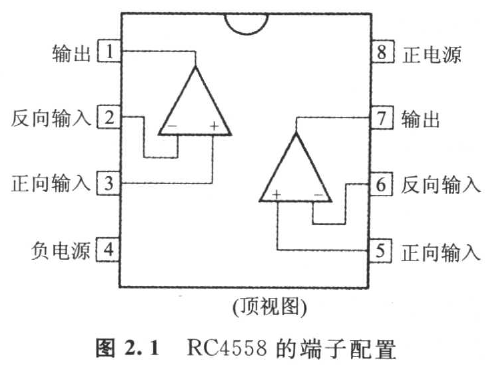

**图 2.1　RC4558 的端子配置**

<!-- 来源：PDF 第 40 页；原书第 26 页 -->

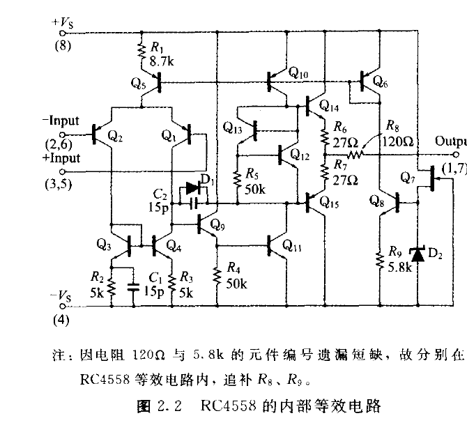

图中因电阻 120 Ω 与 5.8 kΩ 的元件编号遗漏短缺，故分别在 RC4558 等效电路内追补 \\(R_8\\)、\\(R_9\\)。

**图 2.2　RC4558 的内部等效电路**

- 电流镜像（Current Mirror）；
- 差动放大电路；
- 达林顿（Darlington）连接电路；
- 互补发射极跟随器（Complementary Emitter Follower）。

### 2.1.2　电流镜像（Current Mirror）电路的基本原理

现将基本的晶体管电流镜像电路表示于图 2.3(a)。当电流源 \\(I_1\\) 变化时，\\(Q_2\\) 的 \\(I_{C2}\\) 就像照在镜子上一样变化，因而称之为电流镜像（Current Mirror）。一般很少使用分立元件（Discrete）电路，但是在运算放大器等单晶体模拟 IC（Monolithic Analog IC）中是经常使用的一种方法。

并且，理想晶体管的集电极电流 \\(I_C\\) 可用基极-发射极间电压 \\(V_{BE}\\) 的指数函数加以表示。即

\\[
I_C=I_S\exp\left(\frac{V_{BE}}{V_T}\right) \tag{2.1}
\\]

式中 \\(V_T\\) 与绝对温度参数（Parameter）成比例，如下式所示，称之为热电压（Thermal Voltage）。

\\[
V_T=\frac{kT}{q} \tag{2.2}
\\]

其中，\\(k\\) 为玻耳兹曼常数（Boltzmann's Constant）\\(1.3805\times10^{-23}\ \mathrm{J/K}\\)；\\(T\\) 为晶体管的 PN 结（绝对）温度（K）；\\(q\\) 为电子的电荷 \\(1.602\times10^{-19}\ \mathrm{C}\\)。

<!-- 来源：PDF 第 41 页；原书第 27 页 -->

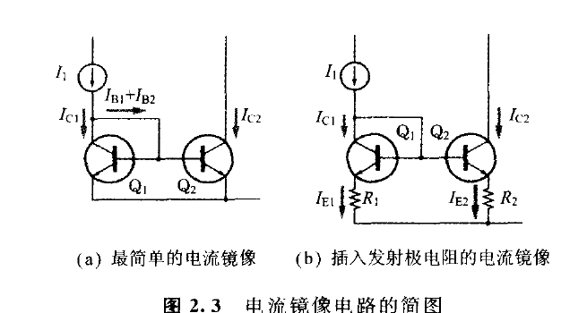

**图 2.3　电流镜像电路的简图**

热电压 \\(V_T\\) 在常温（\\(T=300\ \mathrm{K}\\)）时为 25.85 mV。此数值常出现于晶体管电路的计算中，所以应该牢记在心。

\\(I_S\\) 在式（2.1）上称之为饱和电流的参数。

另外，图 2.3(a) 的镜像电流因为两个晶体管的 \\(V_{BE}\\) 相等，所以

\\[
\begin{aligned}
\frac{I_{C1}}{I_{C2}}
=\frac{I_{S1}\exp(V_{BE}/V_T)}{I_{S2}\exp(V_{BE}/V_T)}
=\frac{I_{S1}}{I_{S2}}
\end{aligned} 
\tag{2.3}
\\]

其中，\\(I_{S1}\\) 为 \\(Q_1\\) 的饱和电流；\\(I_{S2}\\) 为 \\(Q_2\\) 的饱和电流。

另外单晶体 IC 内各晶体管的饱和电流分别与发射极面积成正比。因此，如果 \\(Q_1\\) 与 \\(Q_2\\) 的发射极面积相等的话，则式（2.3）的 \\(I_{S1}\\) 与 \\(I_{S2}\\) 就相等，下式得以成立。即

\\[
I_{C1}=I_{C2} \tag{2.4}
\\]

而且，根据基尔霍夫（Kirchhoff）的电流法则与第 1 章所示方程式（1.4），

\\[
\begin{aligned}
I_1
&=I_{C1}+I_{B1}+I_{B2} \\\\
&=I_{C1}+\frac{I_{C1}}{h_{FE1}}+\frac{I_{C2}}{h_{FE2}}
\end{aligned}
\tag{2.5}
\\]

在此假定 \\(h_{FE1}=h_{FE2}=h_{FE}\\)，则根据式（2.4）、式（2.5），得

\\[
I_{C1}=\left(\frac{h_{FE}}{2+h_{FE}}\right)I_1 \tag{2.6}
\\]

一般晶体管的 \\(h_{FE}\\) 值在数十至数百之间，所以从上列式子可知 \\(I_{C2}\\) 大致等于 \\(I_1\\)。

### 2.1.3　插入发射极电阻的电流镜像电路

对于单晶体 IC 内所形成的电流镜像的配对元件，若发射极面积完全相同的话，则二者的饱和电流相同。可是，实际上各个发射极面积难免有些误差，所以饱和电流也有 \\(\pm1\\%\\)～\\(\pm10\\%\\) 的误差。

<!-- 来源：PDF 第 42 页；原书第 28 页 -->

从而，对于单晶体 IC 而言，图 2.3(a) 的 \\(Q_1\\) 与 \\(Q_2\\) 的集电极电流也存有 \\(\pm1\\%\\)～\\(\pm10\\%\\) 的相对误差。

不过，如图 2.3(b)，在两发射极若插入同（或大致相同）值的电阻，并且发射极电阻的电位降设定得比热电压 \\(V_T\\) 大很多的话，就能够大幅度减少集电极电流的相对误差（参照原书第 30 页的专栏）。

### 2.1.4　RC4558 内部的电流镜像电路

RC4558 的内部电路（图 2.2）有以下三个电流镜像：

- \\(Q_6\\) 与 \\(Q_{10}\\)；
- \\(Q_6\\) 与 \\(Q_5\\)；
- \\(Q_3\\) 与 \\(Q_4\\)。

在此把二极管 \\(D_2\\) 的齐纳（Zener）电压设定为 5.6 V，则 \\(Q_6\\) 的集电极电流 \\(I_{C6}\\) 可如下得出：

\\[
I_{C6}\approx I_{C8}\approx I_{E8}
=\frac{V_{Z2}-V_{BE8}}{R_9}
=\frac{5.6-0.6}{5.8\times10^3}
=0.86\ \mathrm{mA}
\\]

\\(Q_5\\) 与 \\(Q_6\\) 虽然也是电流镜像，但只有 \\(Q_5\\) 装入发射极电阻，所以并非本来的电流镜像，也许该称为恒流电路。不过 \\(I_{C5}\\) 的值却一直随 \\(I_{C6}\\)（以及温度）而定。不妨在具体上加以计算。

根据式（2.1）与方程式 \\(V_{EB6}=V_{EB5}+R_1I_{E5}\\)，故

\\[
R_1I_{E5}
=V_{EB6}-V_{EB5}
=V_T\left[
\ln\left(
\frac{I_{C6}}{I_{C5}}\cdot\frac{I_{S5}}{I_{S6}}
\right)
\right] \tag{2.7}
\\]

其中，\\(I_{S5}\\) 为 \\(Q_5\\) 的饱和电流；\\(I_{S6}\\) 为 \\(Q_6\\) 的饱和电流。

在此，若假定下式成立：

\\[
\frac{I_{C6}}{I_{C5}}=\frac{I_{E6}}{I_{E5}},
\qquad I_{S5}=I_{S6}
\\]

则式（2.7）将等价于下面的方程式。

\\[
R_1I_{E5}=V_T\ln\left(\frac{I_{E6}}{I_{E5}}\right) \tag{2.8}
\\]

把 \\(R_1=8.7\times10^3\ \Omega\\)、\\(I_{E6}=0.86\times10^{-3}\ \mathrm{A}\\) 代入此式就可求解 \\(I_{E5}\\)，则可得

\\[
I_{E5}=13\ \mu\mathrm{A}
\\]

\\(Q_3\\) 与 \\(Q_4\\) 属于图 2.3(b) 型式的电流镜像，所以 \\(I_{C3}\\) 与 \\(I_{C4}\\) 相等，\\(Q_9\\) 的基极电流非常小，因此如果加以忽略的话，则

\\[
I_{C3}+I_{C4}\approx I_{C1}+I_{C2}\approx I_{E5}=13\ \mu\mathrm{A}
\\]

而且从运算放大器的输出端子施加负反馈于反向输入的状态下，输入信号电压为零时，

<!-- 来源：PDF 第 43 页；原书第 29 页 -->

\\[
I_{C1}=I_{C2}=I_{C3}=I_{C4}
=\frac{13\ \mu\mathrm{A}}{2}
=6.5\ \mu\mathrm{A}
\\]

### 2.1.5　把电流镜像当成负载的差动放大电路

请看图 2.4，此电路是典型的运算放大器 IC 的输入电路。晶体管电路集电极负载为电阻，但运算放大器 IC 电流镜像却成为负载。电流镜像也属于恒流电路，所以也与高电阻的集电极负载相似，又称为有源负载（Active Load）。

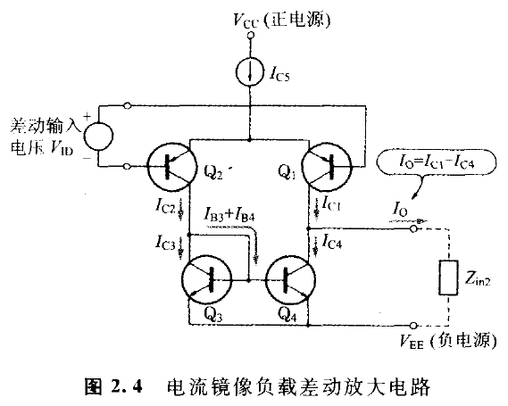

**图 2.4　电流镜像负载差动放大电路**

▶ 差动放大电路的集电极电流

图 2.4 的差动放大电路 \\(Q_1\\) 与 \\(Q_2\\) 的集电极电流可用式（2.9）加以计算。

\\[
I_{C1}=\frac{I}{2}\left[1-\tanh(x)\right] \tag{2.9a}
\\]

\\[
I_{C2}=\frac{I}{2}\left[1+\tanh(x)\right] \tag{2.9b}
\\]

式中，

\\[
I=I_{C5}=13\ \mu\mathrm{A}
\\]

\\[
\tanh(x)=\frac{e^x-e^{-x}}{e^x+e^{-x}},
\qquad
x=\frac{1}{2}\left(\frac{V_{ID}}{V_T}\right)
\\]

其中，\\(V_{ID}\\) 为差动输入电压；\\(V_T\\) 为热电压。

依式（2.9）所计算的 \\(Q_1\\) 与 \\(Q_2\\) 的集电极电流相对差动输入电压的特性表示于图 2.5。

<!-- 来源：PDF 第 44 页；原书第 30 页 -->

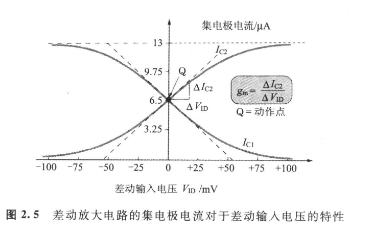

**图 2.5　差动放大电路的集电极电流对于差动输入电压的特性**

> **专栏　插入发射极电阻的电流镜像的分析**
>
> 现将图 2.3(b) 的电流镜像电路，不妨在定量上对饱和电流——不易受元件的误差影响加以推导。在图 2.3(b) 中，
>
> \\[
> V_{BE1}+R_1I_{E1}=V_{BE2}+R_2I_{E2}
> \\]
>
> 从而，
>
> \\[
> V_{BE1}-V_{BE2}=R_2I_{E2}-R_1I_{E1} \tag{1}
> \\]
>
> 若针对 \\(V_{BE}\\) 求解式（2.1），则
>
> \\[
> V_{BE}=V_T\ln(I_C/I_S) \tag{2}
> \\]
>
> 其中，\\(V_T\\) 为热电压；\\(I_S\\) 为饱和电流。
>
> 从式（1）与式（2），得
>
> \\[
> V_T\left[
> \ln\left(
> \frac{I_{C1}}{I_{C2}}\cdot\frac{I_{S2}}{I_{S1}}
> \right)
> \right]
> =R_2I_{E2}-R_1I_{E1} \tag{3}
> \\]
>
> 为计算简单起见，导入以下的补助变量 \\(I_C\\)、\\(\Delta I_C\\)、\\(R\\)、\\(\Delta R\\)、\\(I_E\\)、\\(\Delta I_E\\)。
>
> \\[
> \begin{aligned}
> I_C&=(I_{C1}+I_{C2})/2, &
> \Delta I_C&=I_{C1}-I_{C2}, \\\\
> I_E&=(I_{E1}+I_{E2})/2, &
> \Delta I_E&=I_{E1}-I_{E2}, \\\\
> R&=(R_1+R_2)/2, &
> \Delta R&=R_1-R_2
> \end{aligned}
> \\]
>
> 进而，假设若
>
> \\[
> \left|\frac{\Delta I_C}{I_C}\right|\ll1,\qquad
> \left|\frac{\Delta I_E}{I_E}\right|\ll1,\qquad
> \frac{\Delta R}{R}\ll1
> \\]
>
> 则式（3）的左边与右边可改写如下。
>
> <!-- 来源：PDF 第 45 页；原书第 31 页 -->
>
> \\[
> \begin{aligned}
> \text{左边}
> &=V_T\left[
> \ln\left(\frac{I_{C1}}{I_{C2}}\right)
> -\ln\left(\frac{I_{S1}}{I_{S2}}\right)
> \right] \\\\
> &\approx V_T\left[
> \ln\left(1+\frac{\Delta I_C}{I_C}\right)
> -\ln\left(1+\frac{\Delta I_S}{I_S}\right)
> \right]
> \end{aligned}
> \\]
>
> 在此假设 \\(|x|\ll1\\)，则可近似为 \\(\ln(1+x)\approx x\\)，故得：
>
> \\[
> \ln\left(1+\frac{\Delta I_C}{I_C}\right)
> \approx\frac{\Delta I_C}{I_C},
> \qquad
> \ln\left(1+\frac{\Delta I_S}{I_S}\right)
> \approx\frac{\Delta I_S}{I_S}
> \\]
>
> 式（3）的左边可近似为：
>
> \\[
> \text{左边}
> =V_T\left(
> \frac{\Delta I_C}{I_C}
> -\frac{\Delta I_S}{I_S}
> \right) \tag{4}
> \\]
>
> 另一方面，式（3）的右边则可近似为：
>
> \\[
> \begin{aligned}
> \text{右边}
> &=R_2I_{E2}-R_1I_{E1} \\\\
> &\approx -RI_E\left(
> \frac{\Delta I_E}{I_E}
> +\frac{\Delta R}{R}
> \right) \\\\
> &\approx -RI_E\left(
> \frac{\Delta I_C}{I_C}
> +\frac{\Delta R}{R}
> \right)
> \end{aligned}
> \tag{5}
> \\]
>
> 如果把式（4）、式（5）代入式（3）加以整理的话，则集电极电流的相对误差 \\(\Delta I_C/I_C\\) 为：
>
> \\[
> \frac{\Delta I_C}{I_C}=
> \left(\frac{V_T}{RI_E+V_T}\right)
> \left(\frac{\Delta I_S}{I_S}\right)
> -\left(\frac{RI_E}{RI_E+V_T}\right)
> \left(\frac{\Delta R}{R}\right)
> \tag{6}
> \\]
>
> 在此若设定 \\(R_1\\) 与 \\(R_2\\) 使得电阻电位降 \\(RI_E\\) 远大于热电压 \\(V_T\\)（约 26 mV）的话，则可得下式：
>
> <!-- 原书误作 26 mA，按热电压单位修正为 mV。 -->
>
> \\[
> \frac{\Delta I_C}{I_C}
> \approx
> \left(\frac{V_T}{RI_E}\right)
> \left(\frac{\Delta I_S}{I_S}\right)
> -\frac{\Delta R}{R}
> \tag{7}
> \\]
>
> 此式意味着当 \\(RI_E\\) 远大于 \\(V_T\\) 时，集电极电流的相对误差依赖于发射极电阻的相对误差，并且几乎不受饱和电流误差的影响。
>
> 单晶体 IC 上电阻值的误差在 \\(\pm0.1\\%\\)～\\(\pm2\\%\\) 左右，比饱和电流的误差小，所以可通过插入发射极电阻从而减小电流镜像的集电极电流的相对误差。
>
> 发射极电阻的值如果用激光微调（Laser Trimming）进行微调，集电极电流的相对误差能够更加降低。
>
▶ 差动放大器的互导（Mutual Conductance）

一般而言，无信号时电路各部分的直流电压和直流电流叫做动作点；但遇有施加微小的输入信号时，则各部分的电压和电流就会以动作点为中心而变化。

输出电流按照微小输入电压的变化分量，除以微小输入电压所得的值叫做互导（互电导）\\(g_m\\)（或者转移电导或转移导纳）。\\(g_m\\) 的单位是 S（Siemens）。

差动放大电路的 \\(g_m\\) 等于图 2.5 的动作点上切线的斜率，该数值由 \\(V_{ID}\\) 微分式（2.9b）求得如下。

<!-- 来源：PDF 第 46 页；原书第 32 页 -->

\\[
g_m=\frac{I}{4V_T} \tag{2.10}
\\]

其中 \\(I=I_{C5}=13\ \mu\mathrm{A}\\)，\\(V_T\\) 为热电压，在 \\(T=300\ \mathrm{K}\\) 时为 25.85 mV。

### 2.1.6　达林顿连接电路

两个晶体管如图 2.6 连接的话，电流放大倍数 \\(h_{FE}\\) 就如同非常大的一个晶体管那样工作，此电路以其设计者达林顿（Darlington）的名字命名。达林顿连接时的直流电流放大倍数 \\(h_{FE}\\) 为：

\\[
\begin{aligned}
h_{FE}
&=\frac{I_{C1}+I_{C2}}{I_{B1}} \\\\
&=h_{FE1}+(1+h_{FE1})h_{FE2} \\\\
&\approx h_{FE1}h_{FE2}
\end{aligned}
\tag{2.11}
\\]

大致等于两个晶体管直流电流放大倍数之积。

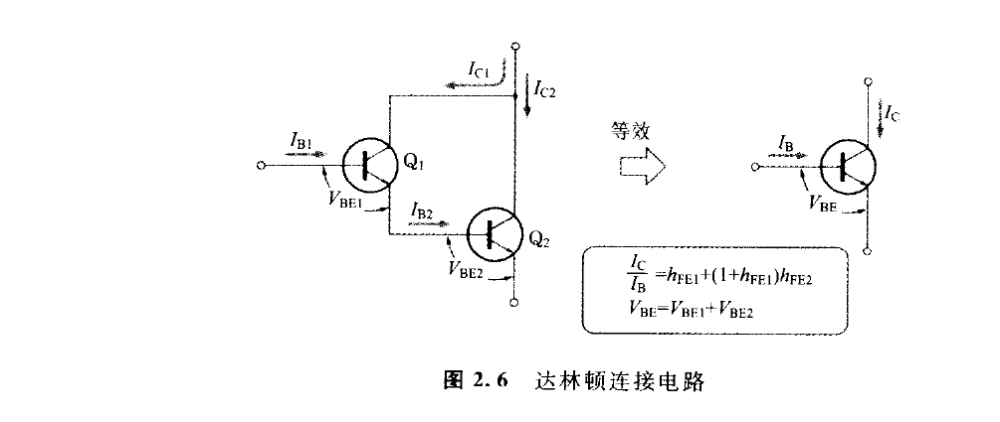

**图 2.6　达林顿连接电路**

▶ 小信号电流放大倍数 \\(h_{fe}\\) 与直流电流放大倍数 \\(h_{FE}\\)

基极电流的变化分量 \\(\Delta I_B\\) 与集电极电流的变化分量 \\(\Delta I_C\\) 之比称为小信号电流放大倍数 \\(h_{fe}\\)，与直流电流放大倍数不同。即

\\[
h_{fe}=\frac{\Delta I_C}{\Delta I_B} \tag{2.12}
\\]

一般情况下，小信号电流放大倍数 \\(h_{fe}\\) 与直流电流放大倍数 \\(h_{FE}\\) 的值，有百分之几至百分之几十的差别。原本晶体管的电流放大倍数由于误差大，故做粗略分析时可把 \\(h_{fe}\\) 与 \\(h_{FE}\\) 作为同值考虑。

再者，RC4558 的内部如图 2.2 所示，因 \\(Q_9\\) 的集电极连接于正电源，所以 \\(Q_9\\) 与 \\(Q_{11}\\) 并非严格的达林顿连接。不过 \\(Q_9\\) 的基极电流变化分量与 \\(Q_{11}\\) 的集电极电流变化分量之比：

\\[
\frac{\Delta I_{C11}}{\Delta I_{B9}}
\approx h_{fe9}h_{fe11} \tag{2.13}
\\]

<!-- 来源：PDF 第 47 页；原书第 33 页 -->

与图 2.6 的达林顿连接电路大致呈相同的电流放大倍数。

### 2.1.7　互补发射极跟随器（Complementary Emitter Follower）

现将三种集电极接地电路（集电极共接电路，又叫发射极跟随器）表示于图 2.7。这些电路具有如下的性质：

- 输入阻抗高；
- 输出阻抗低；
- 电压增益约为 1 倍；
- 直线性好。

多数的运算放大器的输出级都采用图 2.7(c) 所示的互补发射极跟随器。为便于理解，不妨来思考图 2.7(a) 的工作原理。

在图 2.7(a)，输入电压 \\(V_S\\) 与输出电压 \\(V_O\\) 之间成立

\\[
V_O=V_S+V_{\mathrm{bias}}-V_{BE} \tag{2.14}
\\]

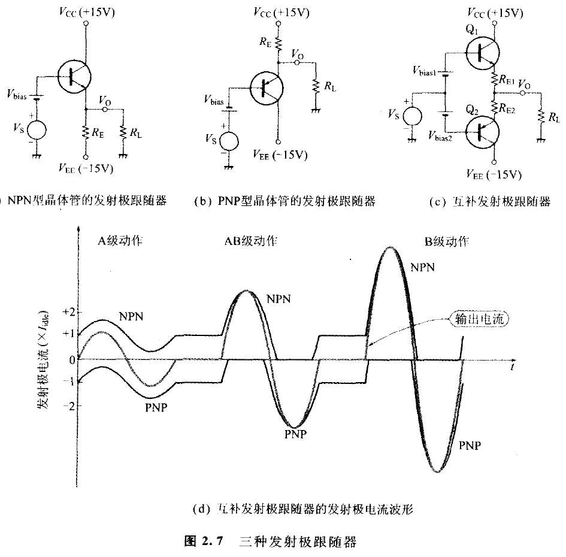

**图 2.7　三种发射极跟随器**

<!-- 来源：PDF 第 48 页；原书第 34 页 -->

集电极电流 \\(I_C\\) 随同 \\(V_S\\) 一起变化，但基极-发射极间电压 \\(V_{BE}\\) 的变化极其微小。原因是 \\(V_{BE}\\) 与 \\(I_C\\) 之间有式（2.1）的关系。

式（2.1）表示，\\(V_{BE}\\) 只增加 \\(V_T\\)（约 26 mV），则 \\(I_C\\) 就增为 \\(e\\) 倍；\\(V_{BE}\\) 只减低 \\(V_T\\) 的话，\\(I_C\\) 就减为 \\(1/e\\)。反过来说，即使 \\(I_C\\) 大幅度变化时，\\(V_{BE}\\) 的变化顶多也不过 \\(V_T\\) 程度。因此偏置电压 \\(V_{\mathrm{bias}}\\) 设定与 \\(V_{BE}\\) 同值的话，譬如说达到电源电压百分之数十的大振幅的 \\(V_S\\) 输入的情形下也会成立

\\[
\left|V_{\mathrm{bias}}-V_{BE}\right|\ll V_T \tag{2.15}
\\]

根据此式与式（2.14）可得“发射极跟随器的输出电压 \\(V_O\\)，约等于输入电压 \\(V_S\\)”，即“发射极跟随器的电压增益，约为 1 倍”的结论。

可是，图 2.7(a) 的电路有不小的缺点。正向最大输出电压几乎等于电源电压，但反向最大输出电压 \\((V_{OM})^-\\) 受限于

\\[
(V_{OM})^-
=V_{EE}\left(\frac{R_L}{R_E+R_L}\right) \tag{2.16}
\\]

譬如说，在下列的情形下，即

\\[
V_{EE}=-15\ \mathrm{V},\qquad R_E=R_L=2\ \mathrm{k}\Omega
\\]

反向最大输出电压是 -7.5 V。

假如供给超过最大输出电压的巨大反向输入电压 \\(V_S\\) 的话，基极-发射极间将成为反向偏压，导致基极-发射极间 PN 结崩溃（Break Down），导致晶体管不可恢复。

为求取反向最大输出电压接近反向电源电压 \\(V_{EE}\\) 起见，\\(R_E\\) 的值有必要远小于负载电阻 \\(R_L\\)。可是，如此一来就会使发射极电流增加，而导致晶体管的耗电增大。

基于 PNP 型晶体管的发射极跟随器如图 2.7(b)，也具有同样的缺点。按此电路的情形最大输出电压 \\((V_{OM})^+\\) 将受到如下限制。

\\[
(V_{OM})^+
=V_{CC}\left(\frac{R_L}{R_E+R_L}\right) \tag{2.17}
\\]

图 2.7(c) 的互补发射极跟随器，可以去除此缺点，即在不增加耗电的情况下得以实现大的输出电压与输出电流。

此电路在大振幅工作时，正向输出电流是由 NPN 晶体管供给，反向输出电流则由 PNP 晶体管供给。无信号时输出电流为零，因而 \\(Q_1\\) 与 \\(Q_2\\) 的发射极电流相等，即

\\[
\begin{aligned}
I_{E1}=I_{E2}
&=\frac{(V_{\mathrm{bias1}}+V_{\mathrm{bias2}})
-(V_{BE1}+V_{EB2})}
{R_{E1}+R_{E2}}
\end{aligned}
\tag{2.18}
\\]

<!-- 来源：PDF 第 49 页；原书第 35 页 -->

无信号时的该发射极电流叫做空载电流（Idling Current）。

多数的运算放大器 IC 的 \\((R_{E1}+R_{E2})\\) 在数十 Ω 程度，空载电流则为数百 μA 至数 mA 程度。

### 2.1.8　输出级的工作等级

基于晶体管的输出电路，有所谓按照晶体管在线性工作领域期间的比率区别工作等级。表 2.1 即为其工作等级。

**表 2.1　晶体管推挽电路的工作等级**

| 等级 | 元件处于线形活性领域期间的比率 | 最大效率 |
|---|---:|---:|
| A 级 | 100% | 50% |
| AB 级 | 50%～100% | 50%～78.5% |
| B 级 | 50% | 78.50% |
| C 级 | 0%～50% |  |

注：效率 = 输出电力 / 电源供给电力。

▶ A 级工作

如图 2.7(d) 所示，输出电流要是在空载电流的两倍以下，则 \\(Q_1\\) 与 \\(Q_2\\) 的发射极电流就不致于截止，而经常有发射极电流流通。像这样发射极电流（而且连集电极电流）也流通的工作就叫做 A 级。

▶ B 级工作

输出电流为空载电流的两倍以上时，\\(Q_1\\) 或 \\(Q_2\\) 的发射极电流其中之一有截止期间，截止期间恰好为一周期的 50% 时的动作就叫做 B 级。

▶ AB 级工作

当截止期间为一周期的 0% 以上，且在 50% 以下时，换言之，各晶体管的线性工作期间为一周期的 50%～100% 时的工作叫做 AB 级。

B 级工作时的发射极电流为半波波形，但 NPN 晶体管与 PNP 晶体管加以合成的输出电流波形几乎与输入波形雷同，还有 B 级具有的功率效率（= 输出功率 / 供电源的功率）高于 A 级工作功率的长处。

B 级工作具有非直线失真的弱点，可借助负反馈减轻失真。

互补发射极跟随器，随信号级别（Level）自动依 A 级 → AB 级 → B 级而移转，即使微小的空载电流也能够供给负载巨大的信号电流。

<!-- 来源：PDF 第 50 页；原书第 36 页 -->

### 2.1.9　输出级偏压的温度补偿

式（2.1）的热电压 \\(V_T\\) 与饱和电流 \\(I_S\\)，将随同温度一起增加。其结果 \\(I_C-V_{BE}\\) 特性曲线，如图 2.8 所示将随同温度约按照 -2 mV/°C 向左偏移。也就是温度上升时，\\(V_{BE}\\) 就减少。

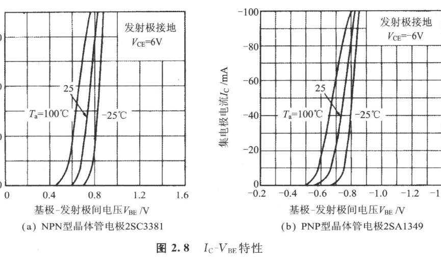

**图 2.8　\\(I_C-V_{BE}\\) 特性**

互补发射极跟随器的空载电流遵从式（2.18），但 \\((V_{BE1}+V_{BE2})\\) 将随温度一起降低。因此若偏压 \\((V_{\mathrm{bias1}}+V_{\mathrm{bias2}})\\) 固定的话，空载电流就会增加。结果是晶体管的耗电增加，进而温度上升而陷入恶性循环。而且最坏的情形是空载电流不停地增大，晶体管引起导致破坏的热耗散（Thermal Runaway）。

欲防止热耗散，可在电路中安装能够在温度上升时输出级偏压得以减少的机构。根据 RC4558 的情形乃是如图 2.2 所示把 \\(Q_{12}\\) 与 \\(Q_{13}\\) 串联，其基极-发射极间电压之和当作输出级偏压。即

\\[
V_{\mathrm{bias1}}+V_{\mathrm{bias2}}
=V_{BE12}+V_{BE13} \tag{2.19}
\\]

\\(V_{BE12}\\) 与 \\(V_{BE13}\\) 也都分别具有约 -2 mV/°C 的温度系数，所以 \\(Q_{14}\\) 与 \\(Q_{15}\\) 的 \\(V_{BE}\\) 温度系数将抵消掉，由空载电流的温度导致的变动得到抑制。再者 \\(Q_{12}\\) 与 \\(Q_{13}\\)，乃与两个二极管串接相同。

## 2.2　4558 的等效电路与电气特性

如果把图 2.2 的偏压电路等以电流源取代，就可得图 2.9 所示的简略等效电路。此等效电路，是将图 2.2 的 \\(Q_9\\) 与 \\(Q_{11}\\) 以 \\(h_{FE}=200\times200\\) 的一个晶体管取代。

<!-- 来源：PDF 第 51 页；原书第 37 页 -->

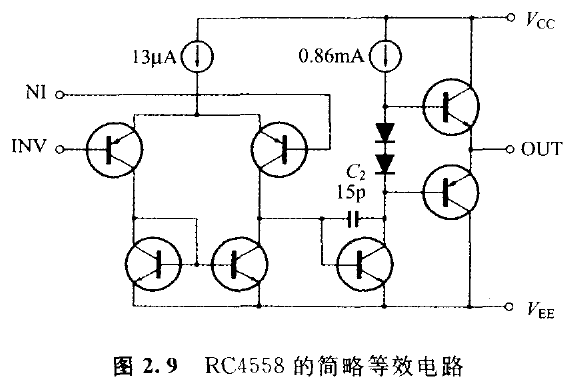

**图 2.9　RC4558 的简略等效电路**

### 2.2.1　晶体管的小信号等效电路

欲正确计算晶体管的电压-电流特性，必须解复杂的线性方程式。以人工计算求解几乎不可能，所以一般使用电路模拟器（Simulator）SPICE（后述）。但是通过线性近似的等效电路，掌握电路工作的原理也至关重要。

等效电路虽有不少种类，但频率特性的计算使用“小信号等效电路”。这是考虑由于动作点的微小变化分量，以线性方程式将电路做近似的模式。

著名的晶体管的小信号等效电路，可列举如下：

- \\(h\\) 参数；
- \\(y\\) 参数；
- 混合（Hybrid）\\(\pi\\) 型模式；
- Gummel-Poon 模式。

### 2.2.2　局部的 h 参数从略的小信号等效电路

本章拟使用 \\(h\\) 参数局部从略的如图 2.10 所示的小信号等效电路。这是最简单的小信号等效电路。在此等效电路上参数 \\(h_{ie}\\) 为基极-发射极间电阻，即 \\(\Delta V_{BE}/\Delta I_B\\)；\\(h_{fe}\\) 为小信号电流放大倍数，即 \\(\Delta I_C/\Delta I_B\\)。其中 \\(h_{ie}\\) 可用式（2.1）计算。首先根据式（2.1），基极电流 \\(I_B\\) 为：

\\[
\begin{aligned}
I_B
&=
\left(\frac{1}{h_{FE}}\right)
\left[
I_S\exp\left(\frac{V_{BE}}{V_T}\right)
\right]
\end{aligned}
\tag{2.20}
\\]

若对 \\(V_{BE}\\) 微分，则

\\[
\begin{aligned}
\frac{\Delta I_B}{\Delta V_{BE}}
&=
\left(\frac{1}{h_{FE}}\right)
\left[
\frac{I_S}{V_T}\exp\left(\frac{V_{BE}}{V_T}\right)
\right]
=\frac{I_B}{V_T}
=\frac{I_C}{h_{FE}V_T}
\end{aligned}
\\]

<!-- 来源：PDF 第 52 页；原书第 38 页 -->

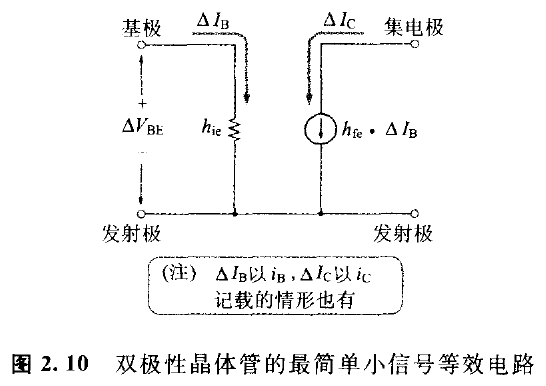

**图 2.10　双极性晶体管的最简单小信号等效电路**

从而，

\\[
h_{ie}
=\frac{\Delta V_{BE}}{\Delta I_B}
=\frac{h_{FE}V_T}{I_C}
\approx\frac{h_{FE}}{I_C}\times0.026 \tag{2.21}
\\]

例如，\\(I_C=1\ \mathrm{mA}\\)、\\(h_{FE}=100\\) 的话，则

\\[
h_{ie}
=\frac{100}{0.001}\times0.026
=2600\ \Omega
\\]

图 2.10 所示电流源的电流值，与基极电流的变化分量成比例。其比例常数为 \\(h_{fe}\\)。像这样的从属电流源，一般都叫做电流控制电流源（CCCS：Current Controlled Current Source）。

NPN 晶体管的集电极电流，通常均按集电极 → 发射极的方向流动，但集电极电流的变化分量在任一个方向都流动。即 \\(\Delta I_B\\) 为正的话，\\(\Delta I_C\\) 就依电流源箭头所指的方向（集电极 → 发射极）流动；\\(\Delta I_B\\) 若为负，则 \\(\Delta I_C\\) 便反向（发射极 → 集电极）流动。

### 2.2.3　电流镜像负载差动放大电路的小信号等效电路

第 1 章的图 1.4，\\(Q_2\\) 的集电极电流变化分量并不转移到第二级。另一方面，图 2.2 的电路，\\(Q_2\\) 的集电极电流变化分量借助 \\(Q_3\\) 与 \\(Q_4\\) 的电流镜像而反向，加于 \\(Q_1\\) 的集电极电流变化分量。因此“电流镜像负载差动放大电路”的互导（Mutual Conductance）将为式（2.10）中 \\(g_m\\) 的两倍。

RC4558 的电流镜像负载差动放大电路部分，以图 2.11 所示电压控制电流源（VCCS：Voltage Controlled Current Source）表示。VCCS 的转移电导（Transfer Conductance）\\(g_{m1}\\) 为式（2.10）中 \\(g_m\\) 的两倍。即

\\[
g_{m1}
=\frac{2I}{4V_T}
=\frac{2\times13\times10^{-6}}{4\times0.026}
=0.25\ \mathrm{mS} \tag{2.22}
\\]

<!-- 来源：PDF 第 53 页；原书第 39 页 -->

图 2.11 的输入阻抗 \\(Z_{in}\\)，恰为图 2.10 等效电路的 \\(h_{ie}\\) 的两倍。即

\\[
Z_{in}
=2\left(\frac{h_{FE}V_T}{I_C}\right)
=\frac{4h_{FE}V_T}{I} \tag{2.23}
\\]

但是，\\(I\\) 为差动放大电路的共发射极电流。

若将 \\(I=13\ \mu\mathrm{A}\\)、\\(h_{FE}=100\\) 代入式（2.23），则

\\[
Z_{in}
=\frac{4\times100\times0.026}{13\times10^{-6}}
=800\ \mathrm{k}\Omega
\\]

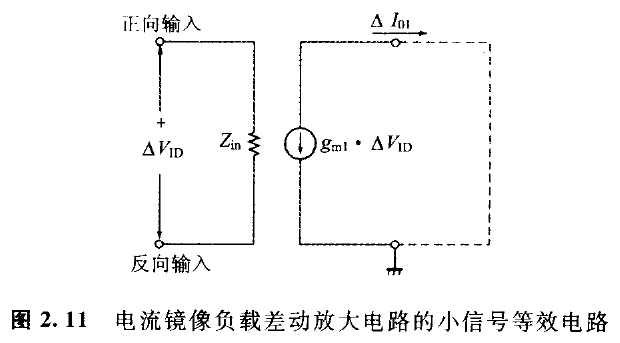

**图 2.11　电流镜像负载差动放大电路的小信号等效电路**

### 2.2.4　发射极跟随器的小信号等效电路

请看图 2.12，互补发射极跟随器的电压增益约为 1 倍。此时的输入阻抗 \\(Z_{in}\\) 可根据下式求解：

\\[
Z_{in}\approx h_{fe3}R_L \tag{2.24}
\\]

其中，\\(R_L\\) 为负载电阻；\\(h_{fe3}\\) 为输出级晶体管的 \\(h_{fe}\\)。

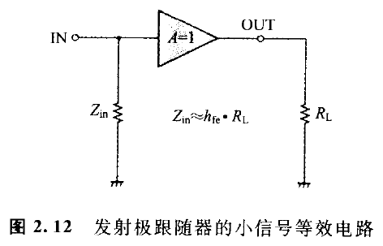

**图 2.12　发射极跟随器的小信号等效电路**

### 2.2.5　RC4558 的开环增益相对于频率的特性

使用上面的小信号等效电路把图 2.9 的简略等效电路进行改写，可得图 2.13 所示电路。但 \\(h_{fe2}\\) 为 \\(Q_9\\) 与 \\(Q_{11}\\) 各自的 \\(h_{fe}\\) 之积。

那么在此不妨来计算一下负载电阻 \\(R_L=2\ \mathrm{k}\Omega\\) 时的开环增益 \\(A\\)。开环增益若把低频域（带）增益与高频域（带）增益分开的话，计算就简单些。

<!-- 来源：PDF 第 54 页；原书第 40 页 -->

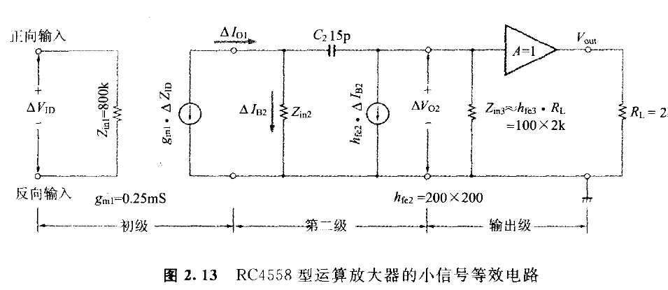

**图 2.13　RC4558 型运算放大器的小信号等效电路**

▶ 低频域的开环增益

在低频域相位补偿电容 \\(C_2\\) 的阻抗显得非常大。这时 \\(C_2\\) 可予以忽略（也就是把 \\(C_2\\) 撤除），初级输出电流 \\(\Delta I_{O1}\\) 全都成为第二级晶体管的基极电流 \\(\Delta I_{B2}\\)。

从而低频域开环增益 \\(A\\) 为：

\\[
\begin{aligned}
A
&=\left(\frac{\Delta I_{O1}}{\Delta V_{ID}}\right)
\left(\frac{\Delta V_{O2}}{\Delta I_{O1}}\right)\times1 \\\\
&=\left(\frac{\Delta I_{O1}}{\Delta V_{ID}}\right)
\left(\frac{\Delta V_{O2}}{\Delta I_{B2}}\right)\times1 \\\\
&=(-g_{m1})(-h_{fe2}Z_{in3})\times1 \\\\
&=(-0.25\times10^{-3})(-4\times10^4\times2\times10^5) \\\\
&=2\times10^6=126\ \mathrm{dB}
\end{aligned}
\tag{2.25}
\\]

▶ 高频域的开环增益

高的频率初级输出电流，几乎全都流到相位补偿电容 \\(C_2\\)。因此，第二级可替换为图 2.14 所示的反向放大器，高频域的开环增益 \\(A\\) 大致等于初级的互导 \\(g_{m1}\\) 与 \\(C_2\\) 的阻抗之积。即

\\[
A\approx(-g_{m1})\left(\frac{1}{j\omega C_2}\right)
=\frac{g_{m1}}{j2\pi fC_2} \tag{2.26}
\\]

从而振幅频率特性 \\(|A(f)|\\) 为：

\\[
|A(f)|\approx\frac{g_{m1}}{2\pi fC_2} \tag{2.27}
\\]

电压增益随频率一起按 -6 dB/oct 降低。

▶ 单位增益（Unity Gain）频率 fT

一般都把运算放大器的开环增益为 1 倍（0 dB）的频率称为单位增益频率 \\(f_T\\)，从式（2.27）可求得 \\(f_T\\)。

<!-- 来源：PDF 第 55 页；原书第 41 页 -->

\\[
f_T
=\frac{g_{m1}}{2\pi C_2}
=\frac{0.25\times10^{-3}}{6.28\times15\times10^{-12}}
=2.65\ \mathrm{MHz} \tag{2.28}
\\]

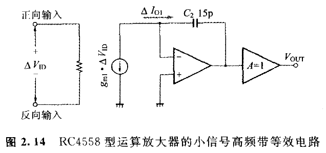

**图 2.14　RC4558 型运算放大器的小信号高频带等效电路**

根据以上的计算结果描绘而成的频率特性如图 2.15 所示。低频域增益之所以比资料手册（Data Sheet）的值（110 dB）高出 16 dB 的原因，是图 2.13 的等效电路完全没有考虑晶体管的输出电导（详见后述）的缘故。

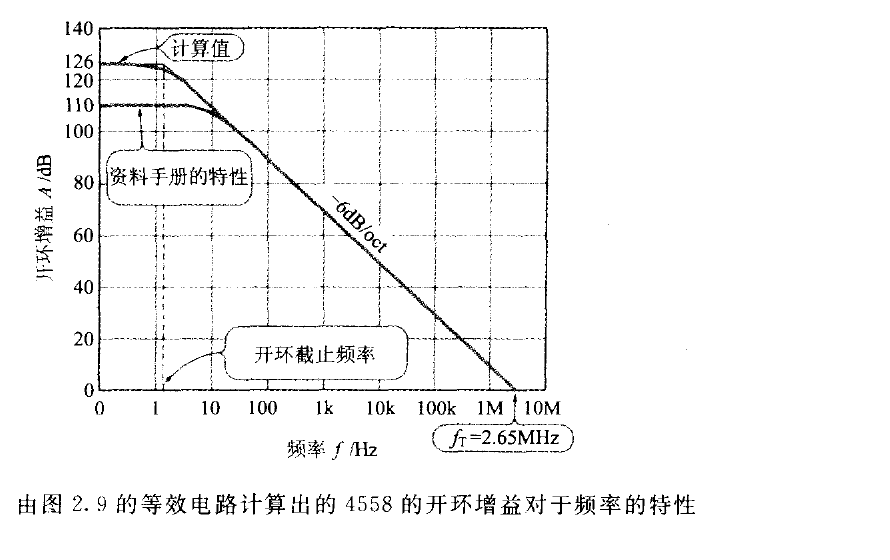

**图 2.15　由图 2.9 的等效电路计算出的 4558 的开环增益对于频率的特性**

▶ 图 2.2 中 \\(C_1\\) 对频率特性造成的影响

图 2.9 所示的等效电路稍有不妥之处。理由是它把图 2.2 的 \\(C_1\\) 忽略掉，其实 \\(C_1\\) 是导致 \\(f_T\\) 稍微下降的主要原因。

初级的输出电流 \\(\Delta I_{O1}\\)，是图 2.2 所示 \\(Q_1\\) 集电极电流的变化分量与 \\(Q_4\\) 集电极电流的变化分量之和。也就是说，\\(Q_2\\) 集电极电流的变化分量被电流镜像 \\(Q_3\\) 与 \\(Q_4\\) 相位反向，而与 \\(Q_1\\) 集电极电流的变化分量合成，实质上 \\(g_m\\) 就成为式（2.10）中 \\(g_m\\) 的两倍。

<!-- 来源：PDF 第 56 页；原书第 42 页 -->

电流镜像 \\(Q_3\\)、\\(Q_4\\) 的电流放大倍数 \\((I_{C4}/I_{C2})\\) 约为 1 倍。但是在 \\(C_1\\) 的阻抗远小于 \\(R_3\\)（=5 kΩ）的高频域频率（数 MHz 以上），电流镜像的电流放大倍数 \\(\mu\\) 将降低为：

\\[
\mu\approx
\frac{1}{1+g_{m4}R_3}
=\frac{1}{1+0.25\times10^{-3}\times5000}
=0.444
\\]

而且，高频域上初级的实际互导 \\(g_{m1}\\)，将是式（2.10）所示的 \\((1+0.444)\\) 倍。

\\[
\begin{aligned}
g_{m1}
&=\frac{I}{4V_T}\times(1+0.444) \\\\
&=\frac{13\times10^{-6}\times1.444}{4\times25.85\times10^{-3}} \\\\
&=0.18\ \mathrm{mS}
\end{aligned}
\\]

0.18 mS 比低频域的 \\(g_{m1}=0.25\ \mathrm{mS}\\) 约小 3 dB。

现将开环增益的实测伯德图表示于图 2.16，可以看出 \\(f_T\\) 受 \\(C_1\\) 的影响而降到 1.9 MHz。再者，在 \\(f_T\\) 时的相位是 -113°，因此总反馈时的相位容限就有 67°。

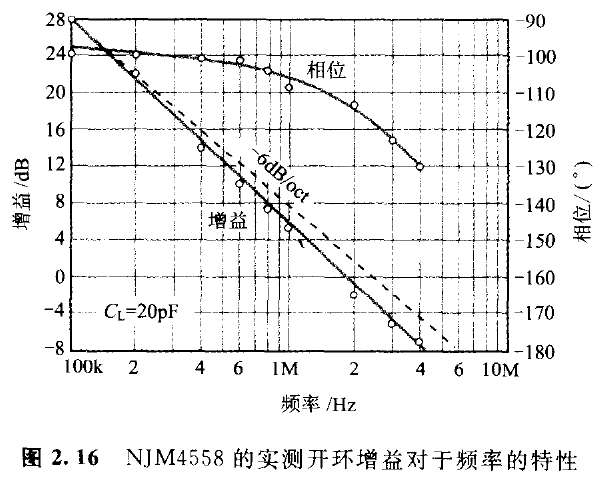

**图 2.16　NJM4558 的实测开环增益对于频率的特性**

### 2.2.6　转换速率与相位补偿电容的关系

像 4558 那样初级差动放大电路以双极性晶体管（Bipolar Transistor）所构成的运算放大器，若施加 ±200 mV 以上的差动输入电压的话，初级的输出电流就完全饱和而成为方波（图 2.17）。

差动放大电路的共发射极电流若为 \\(I\\)，则方波输出电流的振幅大致为 ±\\(I\\)。此输出电流将成为第二级的输入电流，但第二级的输入阻抗十分高，而且因第二级的电压增益十分大，故第二级

<!-- 来源：PDF 第 57 页；原书第 43 页 -->

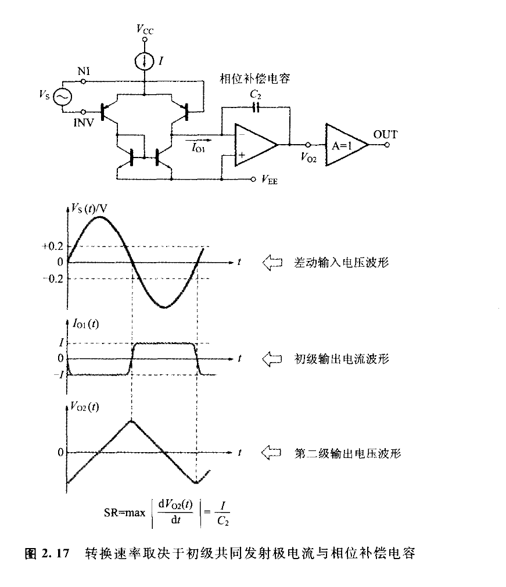

**图 2.17　转换速率取决于初级共同发射极电流与相位补偿电容**

的输入电流实质上全都流入相位补偿电容 \\(C_2\\)。而 \\(C_2\\) 的两端电压倘以 \\(V\\) 表示，则下式将近似成立：

\\[
\left|\frac{dV}{dt}\right|=\frac{I}{C_2} \tag{2.29}
\\]

其中，\\(I\\) 为初级差动放大电路的共发射极电流；\\(C_2\\) 为第二级基极-集电极间相位补偿电容。

\\(dV/dt\\) 表示第二级输出电压的斜度（图 2.17）。而且输出级的电压增益事实上为 1 倍，所以式（2.29）的 \\(|dV/dt|\\) 就是运算放大器的转换速率。RC4558 的转换速率 SR 为：

\\[
\mathrm{SR}
=\frac{I}{C_2}
=\frac{13\times10^{-6}}{15\times10^{-12}}
=0.87\times10^6\ \mathrm{V/s} \tag{2.30}
\\]

即由上式算得 0.87 V/μs。

<!-- 来源：PDF 第 58 页；原书第 44 页 -->

### 2.2.7　转换速率与增益带宽的关系

若把式（2.22）代入式（2.28）的话，则

\\[
f_T
=\frac{2g_{m1}}{2\pi C_2}
=\frac{I}{4\pi V_TC_2} \tag{2.31}
\\]

从式（2.30）与式（2.31）可以导出下式：

\\[
\begin{aligned}
f_T
&=\left(\frac{1}{4\pi V_T}\right)\cdot\mathrm{SR} \\\\
&=\left(\frac{1}{4\times3.14\times0.026}\right)\cdot\mathrm{SR}
\approx3\cdot\mathrm{SR}
\end{aligned}
\tag{2.32}
\\]

而且高频域的开环增益以 -6 dB/oct 降低的运算放大器，因增益带宽积 GBP 与单位增益 \\(f_T\\) 相等，所以近似可得下式。

\\[
\mathrm{GBP}=f_T=3\cdot\mathrm{SR} \tag{2.33}
\\]

实际上如前所述，确有由 \\(C_1\\) 而导致高频域增益的降低，所以式（2.33）算是大致的标准。再者，式（2.33）只适用于初级使用双极性晶体管的图 2.9 的电路构成的运算放大器。现将此电路构成具代表性的运算放大器的 GBP 与转换速率的关系如表 2.2 所示。

**表 2.2　增益带宽 GBP 与转换速率 SR**

| 运算放大器型号 | 增益带宽积 | 转换速率 |
|---|---:|---:|
| NJM4560 | 10 MHz | 4 V/μs |
| NJM4580 | 15 MHz | 5 V/μs |
| LM833 | 15 MHz | 7 V/μs |

### 2.2.8　4558 的噪声-失真率特性

现将使用 4558 所制作的闭环增益 = 21 dB 的正向放大器上的实测失真率特性表示于图 2.18。

在此失真率特性上低电平时的数值是由噪声所导致的。与第 1 章制作和测试的五晶体管运算放大器正向放大器（图 1.12）相比，噪声电平（Noise Level）约上升 7 dB。

另一方面，1 kHz 的高谐波失真率比五晶体管运算放大器骤减，并且 \\(4\ \mathrm{V_{rms}}\\) 以上的输出电压大约为 0.001% 左右。低频率的环路增益比五晶体管运算放大器大很多，这是有大量的负反馈施加的缘故。

在 20 kHz 的谐波失真率比五晶体管运算放大器大。理由是 4558 的转换速率小于五晶体管运算放大器的缘故。

### 2.2.9　4558 的 DC 特性

现将 NJM4558 的电气特性表示于表 2.3。可知与第 1 章所

<!-- 来源：PDF 第 59 页；原书第 45 页 -->

制作的五晶体管运算放大器相比之下，输入失调电压、输入失调电流、输入偏置电流都小。

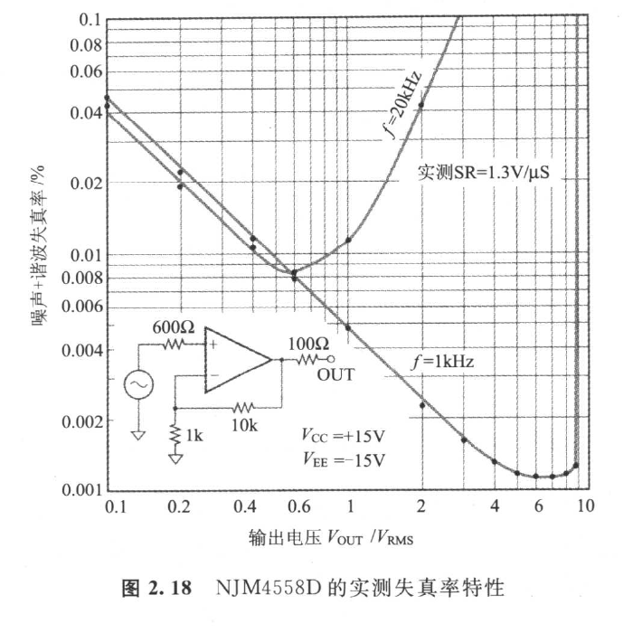

**图 2.18　NJM4558D 的实测失真率特性**

**表 2.3　NJM4558 的电气特性（\\(V^+/V^-=\pm15\ \mathrm{V}\\)，\\(T_a=25^\circ\mathrm{C}\\)）**

| 项目 | 记号 | 最小 | 标准 | 最大 | 单位 |
|---|---:|---:|---:|---:|---:|
| 输入失调电压 | \\(V_{IO}^{1)}\\) | - | 0.5 | 6 | mV |
| 输入失调电流 | \\(I_{IO}\\) | - | 5 | 200 | nA |
| 输入偏置电流 | \\(I_B\\) | - | 25 | 500 | nA |
| 输入电阻 | \\(R_{IN}\\) | 0.3 | 5 | - | MΩ |
| 电压增益 | \\(A_V^{2)}\\) | 86 | 100 | - | dB |
| 最大输出电压 1 | \\(V_{OM1}^{3)}\\) | ±12 | ±14 | - | V |
| 最大输出电压 2 | \\(V_{OM2}^{4)}\\) | ±10 | ±13 | - | V |
| 共模输入电压范围 | \\(V_{ICM}\\) | ±12 | ±14 | - | V |
| 共模抑制比 | \\(\mathrm{CMR}^{5)}\\) | 70 | 90 | - | dB |
| 电源电压抑制比 | \\(\mathrm{SVR}^{5)}\\) | 76.5 | 90 | - | dB |
| 消耗电流 | \\(I_{CC}\\) | - | 3.5 | 5.7 | mA |
| 转换速率 | SR | - | 1 | - | V/μs |
| 输入换算噪声电压 | \\(V_{IN}^{6)}\\) | - | 1.4 | - | μV rms |
| 增益带宽积 | GB | - | 3 | - | MHz |

注：

1. \\(R_S\leq10\ \mathrm{k}\Omega\\)；
2. \\(R_L\geq2\ \mathrm{k}\Omega\\)，\\(V_O=\pm10\ \mathrm{V}\\)；
3. \\(R_L\geq10\ \mathrm{k}\Omega\\)；
4. \\(R_L\geq2\ \mathrm{k}\Omega\\)；
5. \\(R_S\leq10\ \mathrm{k}\Omega\\)；
6. RIAA，\\(R_S=2.2\ \mathrm{k}\Omega\\)，30 kHz LPF。

<!-- 来源：PDF 第 60 页；原书第 46 页 -->

4558 的初级晶体管集电极电流，与所制作的五晶体管运算放大器相比，还不及 1/30。因此 4558 的输入偏置电流也是微小值。

图 2.19 表示资料手册上的输入偏置电流对于温度的特性。

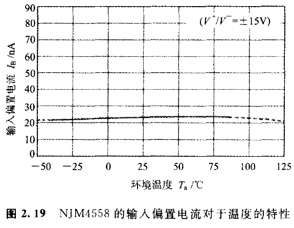

**图 2.19　NJM4558 的输入偏置电流对于温度的特性**

图 2.20 是资料手册上最大输出电压对于负载的特性。最大输出电流是 ±25 mA。图 2.21 表示资料手册记载的最大输出电压对于电源电压的特性。最大输出电压为（电源电压 - 2 V）左右。

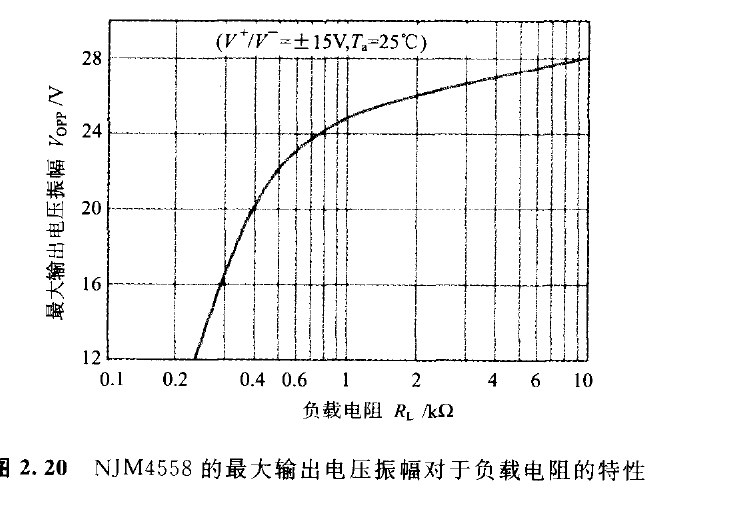

**图 2.20　NJM4558 的最大输出电压振幅对于负载电阻的特性**

<!-- 来源：PDF 第 61 页；原书第 47 页 -->

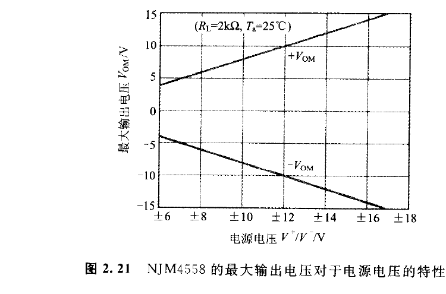

**图 2.21　NJM4558 的最大输出电压对于电源电压的特性**
