# 附录 A　供理解 SPICE 模型的晶体管的等效电路

<!-- 来源：PDF 第 95–107 页；原书第 81–93 页 -->

晶体管的模型参数（Model Parameter），与晶体管的工作原理和等效电路有密切关联。对于表 3.3 中所列的全部参数的意义虽无钻研的必要，但对出现在晶体管网表（Net List）上模型 Q2SC1815 的七个参数（IS、BF、VAF、RB、TF、CJE、CJC）及其相关的等效电路应多少需要有所了解。

## A.1　对 \\\(I\\\)-\\\(V\\\) 特性的计算有帮助的 Ebers-Moll 模型

双极性晶体管（BJT）最简单的等效电路就是图 A.1 所示称为 Ebers-Moll 模型（Ebers-Moll Model）的电路。此等效电路是由两个二极管与两个电流控制电流源 CCCS 表示 BJT。流通于各二极管的电流为：

\\[ I_F = I_{ES}\left[\exp\left(\frac{V_{BE}}{V_T}\right)-1\right] \tag{A.1a} \\]

\\[ I_R = I_{CS}\left[\exp\left(\frac{V_{BC}}{V_T}\right)-1\right] \tag{A.1b} \\]

其中，\\(V_T\\) 为热电压（参照已出示的式（2.2））；\\(I_{ES}\\) 为基极-发射极接合短路饱和电流；\\(I_{CS}\\) 为基极-集电极结短路饱和电流。

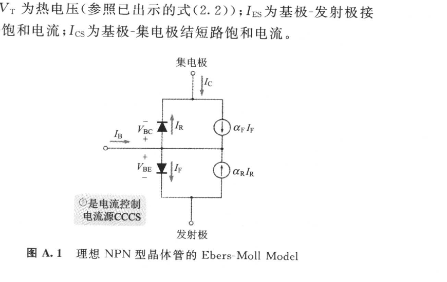

电流控制电流源 CCCS 的系数代表下面的电流转换速率。

- \\(\alpha_F\\)：基极接地正向电流放大倍数（\\(0<\alpha_F<1\\)）；
- \\(\alpha_R\\)：基极接地反向电流放大倍数（\\(0<\alpha_R<1\\)）。

再者 \\(I_{ES}\\) 与 \\(I_{CS}\\) 分别为 \\(10^{-16}\\)～\\(10^{-10}\\) A 程度的微小值。Ebers-Moll 模型和列于表 3.3 的 BJT 的模型参数，有正向参数与反向参数。这与列于表 A.1 的以下四种工作领域有关。

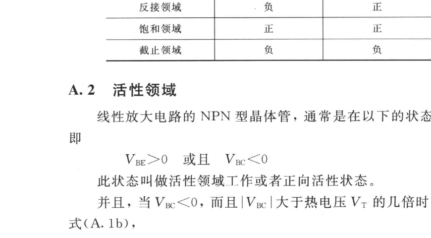

## A.2　活性领域

线性放大电路的 NPN 型晶体管，通常是在以下的状态使用，即

\\[ V_{BE}>0 \quad\text{或且}\quad V_{BC}<0 \\]

此状态叫做活性领域工作或者正向活性状态。

并且，当 \\(V_{BC}<0\\)，而且 \\(|V_{BC}|\\) 大于热电压 \\(V_T\\) 的几倍时，根据式（A.1b），

\\[ I_R \approx -I_{CS} \\]

将获成立，\\(I_R\\) 的值极微小。还有 \\(\alpha_R\\) 小于 1，所以 CCCS 的（\\(\alpha_R \cdot I_R\\)）也很微小。活性领域的晶体管工作可近似于图 A.2（b）所示的等效电路。事实上，

\\[ I_C = \alpha_F I_F \tag{A.2a} \\]

\\[ I_B + \alpha_F I_F = I_F \tag{A.2b} \\]

将成立。因此从上面的联立方程式把 \\(I_F\\) 消去的话，则可导出

\\[ \frac{I_C}{I_B} = \frac{\alpha_F}{1-\alpha_F} \tag{A.3} \\]

在此，若以

\\[ \beta_F = \frac{\alpha_F}{1-\alpha_F} \tag{A.4} \\]

表示式（A.3）的右边，则为：

\\[ I_C = \beta_F I_B \tag{A.5} \\]

此 \\(\beta_F\\) 称为发射极接地正向电流放大倍数。

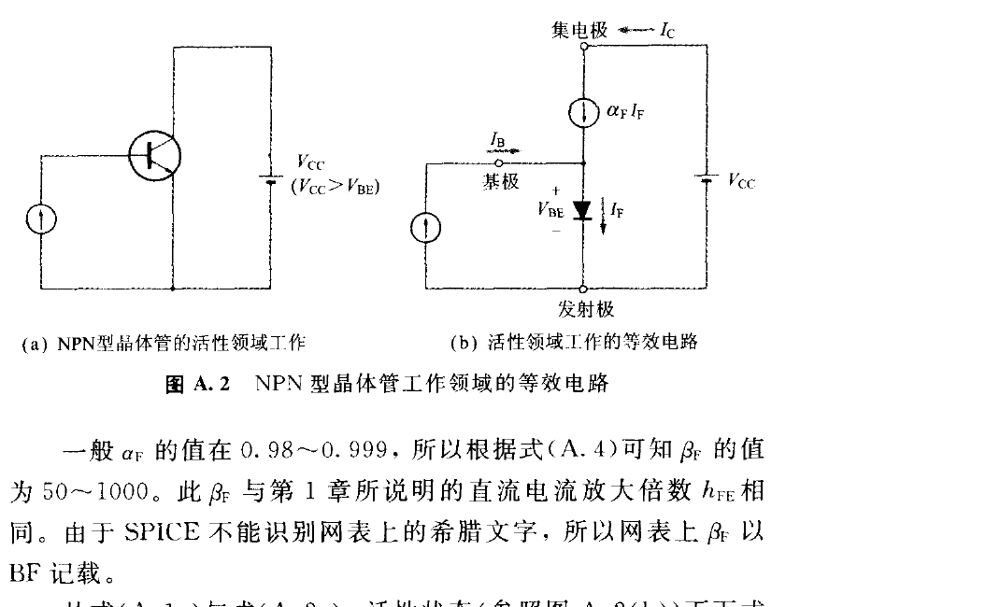

一般 \\(\alpha_F\\) 的值在 0.98～0.999，所以根据式（A.4）可知 \\(\beta_F\\) 的值为 50～1000。此 \\(\beta_F\\) 与第 1 章所说明的直流电流放大倍数 \\(h_{FE}\\) 相同。由于 SPICE 不能识别网表上的希腊文字，所以网表上 \\(\beta_F\\) 以 BF 记载。

从式（A.1a）与式（A.2a），活性状态（参照图 A.2（b））下下式近似成立。

\\[ I_C = \alpha_F I_F = \alpha_F I_{ES}\left[\exp\left(\frac{V_{BE}}{V_T}\right)-1\right] \tag{A.6} \\]

在此，按下式所定义的 \\(I_S\\) 叫做 BJT 的饱和电流。

\\[ I_S = \alpha_F I_{ES} = \alpha_R I_{CS} \tag{A.7} \\]

使用此饱和电流 \\(I_S\\)，还有在通常的动作下若考虑 \\(\exp(V_{BE}/V_T)\\) 非常大的话，式（A.6）可近似如下：

\\[ I_C = I_S\exp\left(\frac{V_{BE}}{V_T}\right) \\]

在第 2 章中所示的式（2.1），就是这样由 Ebers-Moll 模型导出的。

## A.3　反接领域（又叫逆向活性状态）

如果把 NPN 型 BJT 的集电极与发射极颠倒过来，按以下的偏压状态使之工作的话，

\\[ V_{BE}<0 \quad\text{或且}\quad V_{BC}>0 \\]

发射极电流就会如图 A.3（a）所示方向流动。这样的反接也有放大能力，但基极-发射极接合为反向偏压，故正向电流 \\(I_F\\) 变得非常小。因此把 \\(I_F\\) 忽视的话，则可得图 A.3（b）的等效电路，便可导出下式：

\\[ \frac{I_E}{I_B} = \frac{\alpha_R}{1-\alpha_R} = \beta_R \tag{A.8} \\]

此 \\(\beta_R\\) 称为发射极接地反向电流放大倍数。

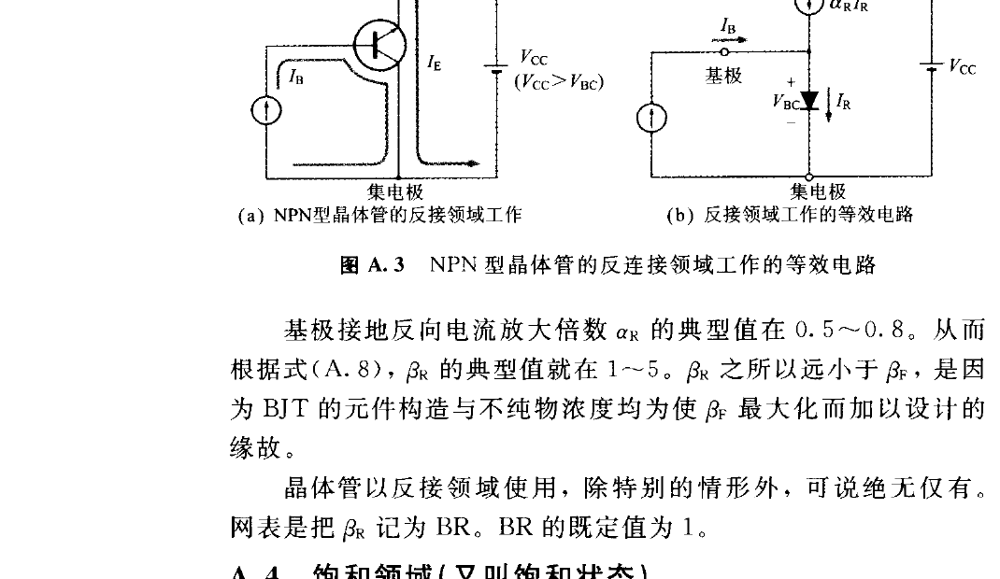

基极接地反向电流放大倍数 \\(\alpha_R\\) 的典型值在 0.5～0.8。从而根据式（A.8），\\(\beta_R\\) 的典型值就在 1～5。\\(\beta_R\\) 之所以远小于 \\(\beta_F\\)，是因为 BJT 的元件构造与不纯物浓度均为使 \\(\beta_F\\) 最大化而加以设计的缘故。

晶体管以反接领域使用，除特别的情形外，可说绝无仅有。网表是把 \\(\beta_R\\) 记为 BR。BR 的既定值为 1。

## A.4　饱和领域（又叫饱和状态）

虽在活性领域可忽视 \\(\alpha_R\\) 和 \\(\beta_R\\) 等的反向参数，但饱和领域反向电流 \\(I_R\\) 却与正向电流 \\(I_F\\) 大小大约相同。所以反向参数不能忽略，尤其"反向转移时间 \\(\tau_R\\)"是左右转换（Switching）工作饱和时间的重要参数。

## A.5　有助于频率特性计算的 Hybrid π 型模式

晶体管的等效电路可分类为大信号等效电路与小信号等效电路。Ebers-Moll 型式属于前者，并且利用于 \\(I_C\\)-\\(V_{BE}\\) 和 \\(I_C\\)-\\(V_{CE}\\) 等特性的计算中。

小信号等效电路表示自动作点的电压-电流微小变化量的关系，主要使用于频率特性的计算。第 2 章是使用图 2.10 所示的模型作为晶体管的小信号等效电路。但是，此模型把晶体管工作予以单纯化，所以依此计算的增益与频率特性并不很正确。

可供更正确地计算频率特性的小信号等效电路，则有足以应对晶体管的物理动作而称之为混合（Hybrid）π 型模式（图 A.4）。

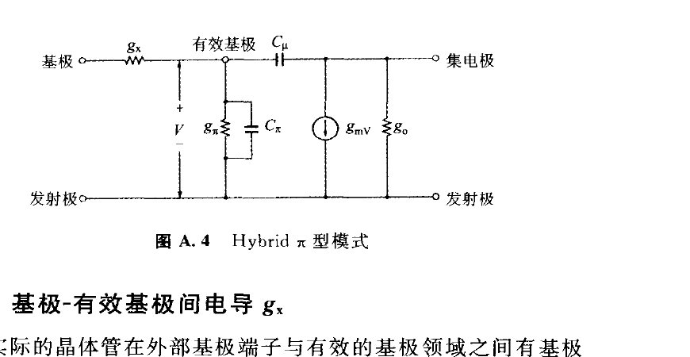

## A.6　基极-有效基极间电导 \\(g_x\\)

实际的晶体管在外部基极端子与有效的基极领域之间有基极电阻 \\(R_B\\)（又叫做基极扩展电阻 \\(r_{bb'}\\)）。SPICE 的网表上基极电阻记为 RB。

混合 π 型模式的电导 \\(g_x\\) 是基极电阻的倒数，即

\\[ g_x = \frac{1}{R_B} \tag{A.9} \\]

## A.7　互导 \\(g_m\\)

混合 π 型模式，集电极电流可认为被有效基极-发射极间电压控制，所以在集电极-发射极间有从属电源 VCCS。VCCS 的电导，即相互电导（互导）\\(g_m\\)，由第 2 章说明过的式（2.1）对 \\(V_{BE}\\) 求微分，并依次决定：

\\[ 
g_m = \frac{dI_C}{dV_{BE}} = \frac{I_C}{V_T} \\\\
（V_T：热电压）
\tag{A.10} 
\\]

此式表示 \\(g_m\\) 与集电极电流成比例。比例常数（\\(1/V_T\\)）在 \\(T\\) = 300 K 时约为 38.7。

## A.8　有效基极-发射极间电导 \\(g_\pi\\)

此 \\(g_\pi\\) 可用下式表达：

\\[ 
g_\pi = \frac{dI_B}{dV_{BE}} = \frac{g_m}{\beta_F} \\\\
（V_{BE}：有效基极-发射极间电压）
\tag{A.11} 
\\]

\\(g_\pi\\) 的倒数等于图 2.10 所示的 \\(h_{ie}\\)。

## A.9　Early 电压

活性状态下如图 A.5 所示，从发射极注入中性基极领域的少数载波（Carrier）一面做 Z 字形运动，整体上（即从全域性观察），则朝浓度低的方向（也就是集电极端）移动。而且到达中性领域的边缘（\\(x\\) = \\(W\\)）时，就被牵进基极-集电极结的强劲电场，瞬间通过接合而成为集电极电流。中性基极领域内的少数载波移动是由于扩散，即浓度斜率，所以集电极电流的大小比例于少数载波的浓度斜率（\\(nb(0)/W\\)）。

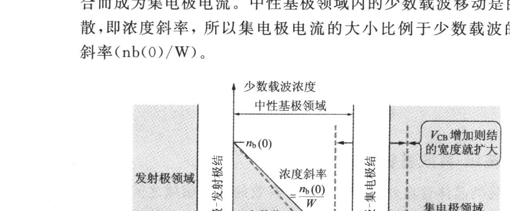

集电极-基极间 \\(V_{CB}\\) 即使变化，但基极宽 \\(W\\) 仍不致变化的理想晶体管，\\(V_{CB}\\) 纵然起变化但浓度斜率仍不变。因此集电极电流并不依存于 \\(V_{CB}\\)，也就是说，\\(I_C\\)-\\(V_{CE}\\) 特性曲线如图 A.6（a）的虚线在活性领域系呈水平。

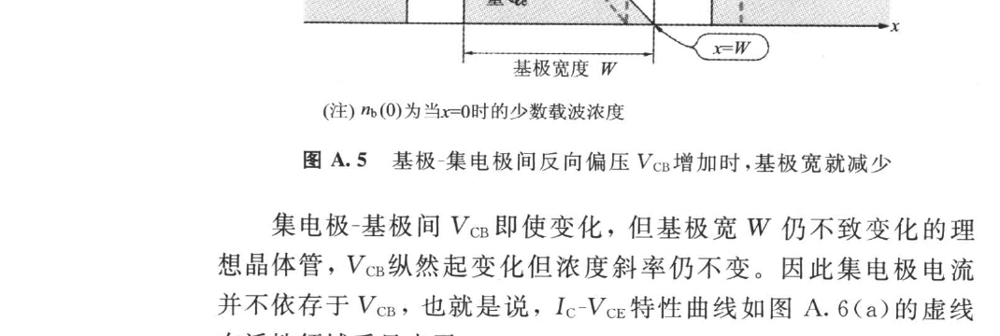

但是，实际的晶体管的基极宽 \\(W\\) 随 \\(V_{CB}\\) 而变化。其原因是由于当 \\(V_{CB}\\) 增加时，基极-集电极结的宽度扩大，基极宽 \\(W\\) 必然缩小的缘故。

而 \\(V_{CB}\\) 增加时，少数载波的浓度斜率就如图 A.5 的虚线那样增加，而集电极电流呈比例性增加。\\(I_C\\)-\\(V_{CE}\\) 特性曲线并且如图 A.6（a）那样带正的倾斜。

根据此现象的发现者的姓名而称之为"Early 效应[5]"。

当实际的晶体管活性领域上的 \\(I_C\\)-\\(V_{CE}\\) 特性曲线延长（外穿）至左时，则如图 A.6（b），就有在 \\(X\\) 轴上的一点集结焦点的倾向。此焦点的电压绝对值叫做 Early 电压 \\(V_A\\)（严格而言应称正向 Early 电压 \\(V_{AF}\\)）。

Early 效应，在混合 π 型模式（图 A.4）的集电极-发射极间造成输出电导 \\(g_O\\)，\\(g_O\\) 的值等于动作点上 \\(I_C\\)-\\(V_{CE}\\) 曲线的斜率。从图 A.6（b）得

\\[ g_O = \frac{I_C}{V_A+V_{CE}} \tag{A.12} \\]

其中，\\(I_C\\) 为动作点的直流集电极电流；\\(V_{CE}\\) 为动作点的集电极-发射极间电压。

输出电导 \\(g_O\\) 的倒数称为"输出电阻 \\(r_O\\)"。\\(r_O\\) 与负载电阻并联，因此将促使电压增益降低，Early 电压的典型值为 50～300 V。

SPICE 是把 Early 电压记为 VAF 或 VA。图 A.3（a）的反接领域工作的 \\(I_E\\)-\\(V_{CE}\\) 特性曲线也同图 A.6（b）一样，焦点在 \\(X\\) 轴上有集结的倾向。此焦点的电压绝对值叫做反向 Early 电压 \\(V_{AR}\\)。

## A.10　结电容

基极-发射极结上有结电容 \\(C_{JE}\\)，基极-集电极结上则有结电容 \\(C_{JC}\\)。各结电容与 Ebers-Moll 模式的各二极管并联。

此结电容又如图 A.7 所示随结电压而变化。SPICE 的 BJT 的模型参数 CJE 系属 \\(V_{BE}\\) = 0 的值，CJC 则属 \\(V_{BC}\\) = 0 的值。SPICE 在模拟实行时计算动作点，并且使用该数值与表 3.3 所示的模型参数 VJE、MJE、VJC、MJC、CJE、CJC，算出 CJE 与 CJC 在动作点上的数值。

活性工作领域时的图 A.4 之有效基极-集电极间电容 \\(C_\mu\\) 等于动作点的结电容 \\(C_{JC}\\)。

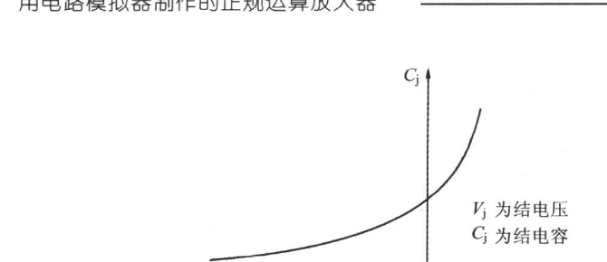

## A.11　转移时间与扩散电容[6]

集电极电流 \\(I_C\\)，比例于基极领域的少数载波的浓度斜率。活性领域工作时，因少数载波浓度如图 A.5 所示呈三角形状分布，所以若假定基极宽 \\(W\\) 为一定的话，则浓度斜率就比例于基极领域的少数载波蓄积量 \\(Q_e\\)。因此 \\(I_C\\) 将比例于 \\(Q_e\\)，即

\\[ Q_e = \tau_F I_C \tag{A.13} \\]

比例常数 \\(\tau_F\\) 可称为"正向转移时间"。此 \\(\tau_F\\) 就是表示从发射极被注入的少数载波，自中性集电极领域的发射极端边缘（\\(x\\) = 0）到达集电极端边缘（\\(x\\) = \\(W\\)）时运行时间的平均值，SPICE 的网表记为 TF。

基极-发射极间电压仅变化 \\(\Delta V_{BE}\\) 时，则如图 A.8 所示，基极领域的少数载波蓄积电荷量就只增加 \\(\Delta Q_e\\)。依据基极领域的电气中性条件，基极领域的多数载波蓄积电荷量也仅增加 \\(\Delta Q_h\\)。\\(\Delta Q_e\\) 与 \\(\Delta Q_h\\) 大小相同但极性相反，相当于理想晶体管的基极-发射极间，添加下式所定义的电容 \\(C_b\\)。

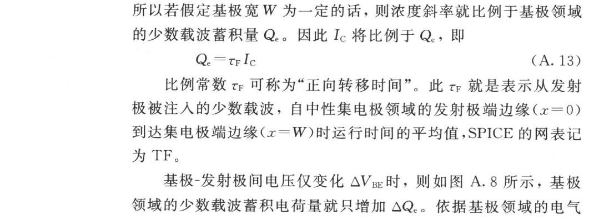

\\[ C_b = \frac{\Delta Q_e}{\Delta V_{BE}} \tag{A.14} \\]

\\(C_b\\) 称为[6]"扩散电容"。倘若使用式（A.10）与（A.13）的话，则

\\[ C_b = \frac{\Delta Q_e}{\Delta V_{BE}} = \frac{\Delta(\tau_F I_C)}{\Delta V_{BE}} = \tau_F\frac{\Delta I_C}{\Delta V_{BE}} = \tau_F \cdot g_m \tag{A.15} \\]

混合 π 型模式的 \\(C_\pi\\)，是由此扩散电容 \\(C_b\\) 与结电容 \\(C_{JE}\\) 所形成的，即

\\[ C_\pi = C_b + C_{JE} \tag{A.16} \\]

## A.12　\\(f_T\\) 与 \\(\tau_F\\) 的关系

理想晶体管的发射极接地电流放大倍数 \\(\beta\\) 虽属常数，但实际的晶体管由于有 \\(C_\pi\\) 与 \\(C_\mu\\)，所以 \\(\beta\\) 在高的频率时，将如图 A.9 那样降低。

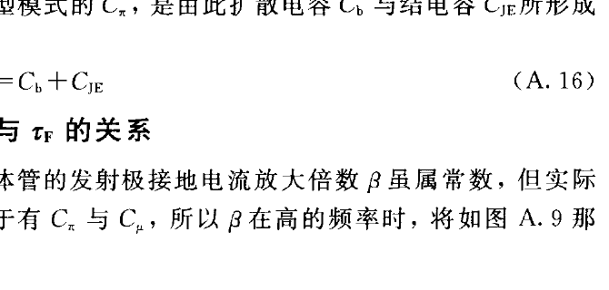

\\(\beta\\) 成为 1 的频率叫做"暂态频率 \\(f_T\\)"。运算放大器的单位增益频率的记号也是 \\(f_T\\)，但二者属不同的概念。暂态（Transition）频率是电流增益为 1 倍的频率，运算放大器的单位增益频率则是电压增益为 1 倍的频率。

\\(f_T\\) 的值可根据图 A.10 的混合 π 型模式加以计算。

首先不妨来计算集电极-发射极间呈现交流性短路时的发射极接地电流放大倍数 \\(\beta\\)。若把基尔霍夫的电流法则应用于有效基极端子的话，则

\\[ i_b = g_\pi V + sC_\pi V + sC_\mu V \tag{A.17a} \\]

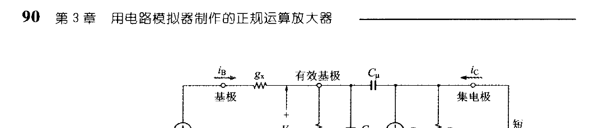

若将基尔霍夫的电流法则应用于集电极端子的话，则

\\[ i_c = g_m V - sC_\mu V \tag{A.17b} \\]

用式 A.17（a）除以式 A.17（b），则电流放大倍数 \\(\beta\\) 如下决定：

\\[ 
\begin{aligned} 
\beta &= \frac{i_c}{i_b} = \frac{g_m - sC_\mu}{g_\pi + s(C_\pi + C_\mu)} \\\\
&= \left(\frac{g_m}{g_\pi}\right)\left[\frac{1 - s\left(\dfrac{C_\mu}{g_m}\right)}{1 + s\left(\dfrac{C_\pi + C_\mu}{g_\pi}\right)}\right] 
\end{aligned} 
\tag{A.18} 
\\]

根据式（A.11）得知（\\(g_m/g_\pi\\)）等于 \\(\beta_F\\)。因常数（\\(C_\mu/g_m\\)）非常小，所以把式（A.18）分子的 \\(s(C_\mu/g_m)\\) 予以忽视的话，则可近似为：

\\[ \beta \approx \frac{\beta_F}{1 + s\left(\dfrac{C_\pi + C_\mu}{g_\pi}\right)} \tag{A.19} \\]

这是一次滞后参数的函数，具有如图 A.9 所示的频率特性。\\(\beta\\) 下降 3 dB 的截止频率 \\(f_c\\)，根据式（A.19）为：

\\[ f_c = \frac{1}{2\pi}\left(\frac{g_\pi}{C_\pi + C_\mu}\right) \tag{A.20} \\]

暂态频率 \\(f_T\\) 则为：

\\[ f_T = \beta_F f_c = \frac{1}{2\pi}\left(\frac{g_m}{C_\pi + C_\mu}\right) \tag{A.21} \\]

如上所述，\\(C_\pi\\) 是扩散电容 \\(C_b\\) 与基极-发射极结电容 \\(C_{JE}\\) 的和。活性工作领域的 \\(C_\mu\\) 等于基极-集电极结电容 \\(C_{JC}\\)，所以式（A.21）分母的电容为：

\\[ C_\pi + C_\mu = C_b + C_{JE} + C_{JC} \tag{A.22} \\]

扩散电容 \\(C_b\\) 如式（A.15）所示比例于 \\(g_m\\)，而且 \\(g_m\\) 又比例于集电极电流 \\(I_C\\)，所以 \\(C_b\\) 比例于 \\(I_C\\)。

另一方面，结电容 \\(C_{JE}\\) 几乎不依随 \\(I_C\\)，还有 \\(C_{JC}\\) 与 \\(I_C\\) 无关（参照图 A.11）。从而可得以下结果。

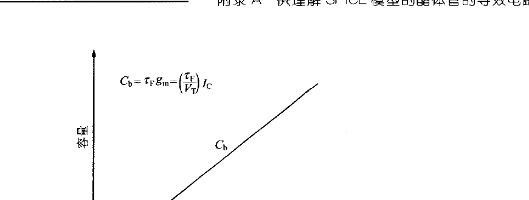

▶ 在 \\(I_C\\) 大的情形下，可近似为：

\\[ C_\pi + C_\mu \approx C_b = \tau_F \cdot g_m \tag{A.23} \\]

若把式（A.23）代入式（A.21）的话，\\(g_m\\) 被替换，而得到以下的重要式子：

\\[ f_T = \frac{1}{2\pi \cdot \tau_F} \tag{A.24} \\]

（\\(\tau_F\\)：正向转移时间）

▶ 在 \\(I_C\\) 小的情形下，可近似为：

\\[ C_\pi + C_\mu \approx C_{JE} + C_{JC} \tag{A.25} \\]

将此代入式（A.21）的话，则

\\[ f_T = \frac{1}{2\pi}\left(\frac{g_m}{C_{JE} + C_{JC}}\right) = \frac{I_C}{2\pi V_T(C_{JE} + C_{JC})} \tag{A.26} \\]

\\(f_T\\) 比例于集电极电流 \\(I_C\\)。

▶ 在 \\(I_C\\) 非常大的情形下

当 \\(I_C\\) 非常大时，前述模式的物理条件改变，以致 \\(\tau_F\\) 增加，而 \\(f_T\\) 则减少。

现将以上的结果表示于图 A.12。SPICE 的正向转移时间用 TF 表示，其可使用图 A.12 的 \\((f_T)_{max}\\) 来如下决定：

\\[ \tau_F = \frac{1}{2\pi \cdot (f_T)_{max}} \tag{A.27} \\]

▶ 实例

从 2SC1815 的资料手册（图 A.13）可知 \\((f_T)_{max}\\) = 530 MHz。从而，此器件的 \\(\tau_F\\) 当为：

\\[ \tau_F = \frac{1}{6.28 \times 530 \times 10^6} = 0.3\,(\mathrm{ns}) \tag{A.28} \\]

\\(\tau_F\\) 也有可能由实测求得（参照专栏）。List 3.1 所示网表的自制模型 2SC1815，以实测为根据取 \\(\tau_F\\) = 0.5 ns。

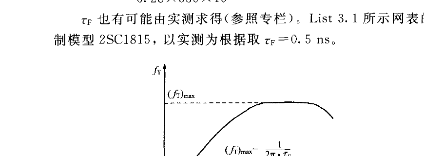

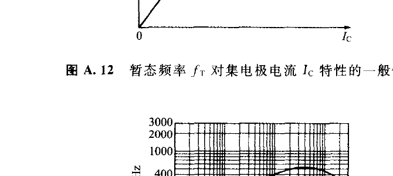

---

> **专栏　测试正向转移时间 \\(\tau_F\\)**
>
> 现将 \\(\tau_F\\) 的测试电路表示于图 A（a）。此测试把提供升起尖锐的方波（200 kHz～1 MHz）当作输入信号。
>
> 测试的顺序列如下：
>
> ① 调整 \\(VR_1\\)，并设定直流集电极电流 \\(I_C\\)；
>
> ② 调整 \\(VR_2\\) 以使输出电压成为图 A（b）的实线波形；
>
> ③ 用示波器读取输入振幅 \\(V_S\\) 与输出振幅 \\(V_O\\)；
>
> ④ \\(\tau_F\\) 可由下式算出：
>
> \\[ \tau_F = C_1 R_L\left(\frac{V_S}{V_O}\right) \tag{1} \\]
>
> 下面不妨来证明式（1）。
>
> \\(I_C\\) 若被设定的十分大时，就如本文所述基极-发射极间电容将等于扩散电容 \\(C_b\\)。假定 \\(C_1\\) 远小于 \\(C_b\\)，则基极-发射极间电压的变化量 \\(\Delta V_{BE}\\) 就成为：
>
> \\[ \Delta V_{BE} = \frac{C_1}{C_b} \cdot V_S \tag{2} \\]
>
> 输出振幅 \\(V_O\\) 则为：
>
> \\[ V_O = g_m R_L \Delta V_{BE} = \left(\frac{g_m R_L C_1}{C_b}\right)V_S \tag{3} \\]
>
> 在此，把
>
> \\[ C_b = \tau_F \cdot g_m \qquad\text{本文（A.15）} \\]
>
> 代入式（3）时，下式便可获得：
>
> \\[ V_O = \left(\frac{R_L C_1}{\tau_F}\right)V_S \tag{4} \\]
>
> 此方程式若就 \\(\tau_F\\) 求解时，式（1）便可获得。
>
> 再者，为抑制 \\(VR_2\\) 的端子间杂散（Stray）电容起见，\\(VR_2\\) 使用小型的半固定电阻。电源阻抗在高频领域内有尽力降低的必要。
>
> 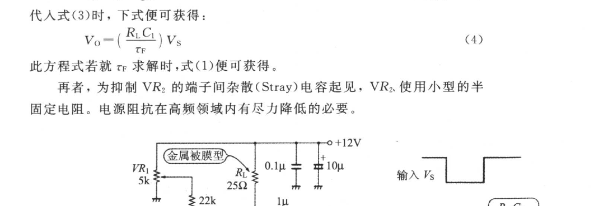