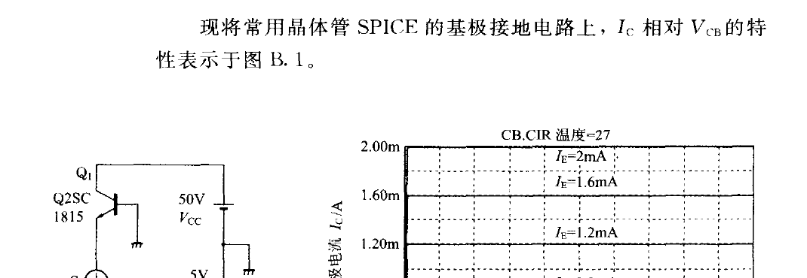
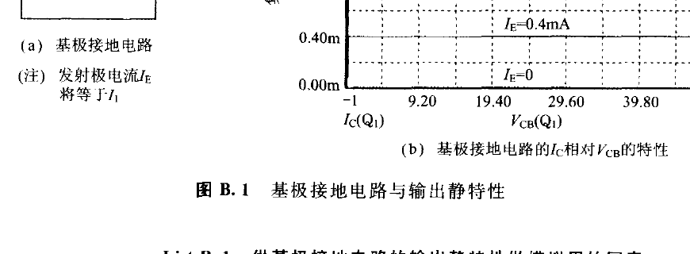
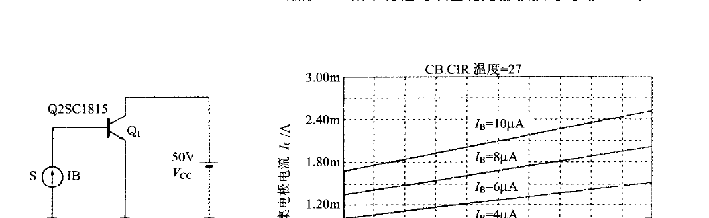
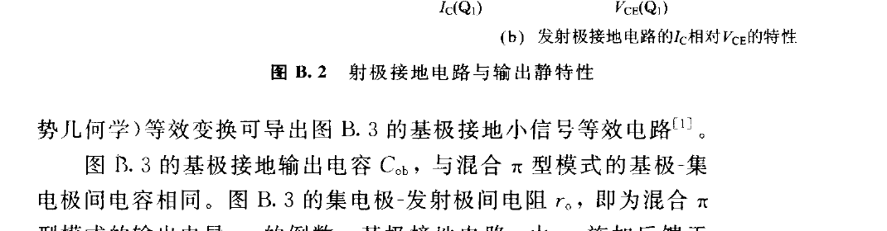
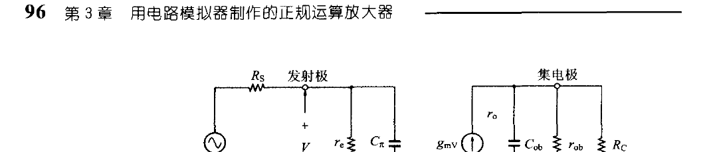
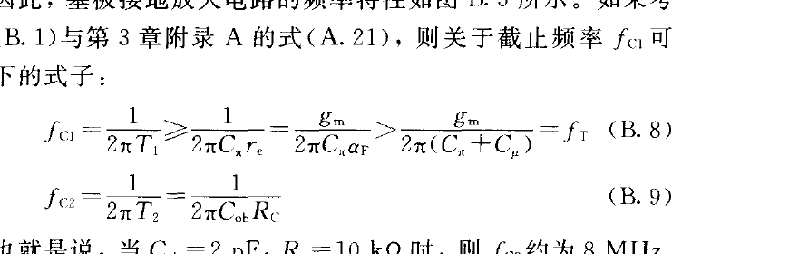
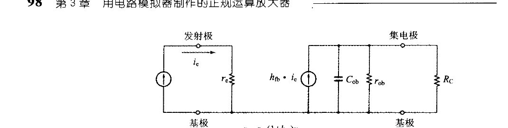

# 附录 B　频率特性的改善和对基极接地电路的复习

<!-- 来源：PDF 第 107–112 页；原书第 93–98 页 -->

## B.1　基极接地电路的特征

下面首先对基极接地电路进行复习。

基极接地电路与发射极接地电路相比之下，具有以下特征：

- 输入阻抗小；
- 输出阻抗大；
- 无米勒效应（Miller Effect），频率特性好。

## B.2　基极接地电路的输出静特性

现将常用晶体管 SPICE 的基极接地电路上，\\(I_C\\) 相对 \\(V_{CB}\\) 的特性表示于图 B.1。

2SC1815 的发射极接地输出静特性如图 B.2 所示。如果把图 B.1（b）与图 B.2（b）加以比较的话，则基极接地电路输出几乎为静特性水平，这意味着输出电导几乎为零，即输出电阻非常大。

## B.3　基极接地电路的小信号等效电路

附录 A 介绍的混合 π 型模式（图 A.4）虽属发射极接地，但基极扩展电阻（= \\(1/g_x\\)）若假定为零，则由 Topology（相位数学，形势几何学）等效变换可导出图 B.3 的基极接地小信号等效电路[1]。

图 B.3 的基极接地输出电容 \\(C_{ob}\\)，与混合 π 型模式的基极-集电极间电容相同。图 B.3 的集电极-发射极间电阻 \\(r_o\\)，即为混合 π 型模式的输出电导 \\(g_o\\) 的倒数。基极接地电路，由 \\(r_o\\) 施加反馈于集电极至发射极。以反馈电阻的话则因增益的计算变得复杂，所以变形为图 B.4 所示的等效电路，并且反馈电阻 \\(r_o\\) 变换成基极接地输出电阻 \\(r_{ob}\\)。

## B.4　基极接地电路的输入电阻

图 B.4 上的 \\(r_e\\) 即为基极接地电路上的输入电阻，因此

\\[ r_e = \frac{1}{g_\pi + g_m} = \frac{\alpha_F}{g_m} \tag{B.1} \\]

其中，\\(\alpha_F\\) 为基极接地正向电流放大倍数（≈1）；\\(g_\pi\\) 为混合 π 型模式的基极-发射极间电导。

\\(g_m\\) 为互导，即

\\[ g_m = \frac{dI_C}{dV_{BE}} = \frac{I_C}{V_T} \\]

（\\(V_T\\)：热电压 ≈ 26 mV（当 \\(T\\) = 300 K 时））

把式（B.1）代入式（3.10），则有

\\[ r_e = \frac{V_T\alpha_F}{I_C} = \frac{26}{1000 \times I_C} \tag{B.2} \\]

即 \\(r_e\\) 反比于集电极电流。而且，譬如说当 \\(I_C\\) = 1 mA 时，\\(r_e\\) 约为 26 Ω。

基极接地电路的输入电阻 \\(r_e\\) 与发射极接地电路的输入电阻（= 基极-发射极间电阻）之间有如下的关系：

\\[ r_e = \frac{r_\pi}{1+h_{fe}} \tag{B.3} \\]

## B.5　基极接地电路的输出电阻 \\(r_{ob}\\)

在图 B.4 中，假如信号电阻 \\(R_S\\) 为 ∞ 时，也就是说，以定电流源驱动基极接地电路时，

\\[ r_{ob} \approx (1+h_{fe})r_o \tag{B.4} \\]

一般的情形，\\(r_{ob}\\) 的值也依赖于信号源电阻，并以下式表达。

\\[ r_{ob} = \left(\frac{G_S + g_\pi + g_m + g_o}{G_S + g_\pi}\right)r_o \tag{B.5} \\]

其中，\\(G_S\\) 为信号源电导 = \\(1/R_S\\)；\\(g_m\\) 为图 A.4 的互导；\\(g_\pi\\) 为图 A.4 的基极-发射极间电导；\\(g_o\\) 为图 A.4 的集电极-发射极间电导；\\(r_o\\) 为发射极接地输出电阻 = \\(1/g_o\\)。

## B.6　基极接地放大电路的电压增益

基极接地电路以电压源驱动的实例并不多见，但不妨大致计算一下。在图 B.4 的等效电路中，基极接地的输出电阻 \\(r_{ob}\\) 假定远大于集电极负载电阻，则电压增益 \\(A_V\\) 应当为：

\\[ A_V \approx \left(\frac{r_e}{R_S + r_e}\right)g_m R_C = \frac{\alpha_F R_C}{R_S + r_e} \approx \frac{R_C}{R_S + r_e} \tag{B.6} \\]

## B.7　基极接地放大电路的高频带频率特性

图 B.4 的等效电路有以下两个时间常数 \\(T_1\\)、\\(T_2\\)。

\\[ T_1 = C_\pi(R_S \,//\, r_e) \tag{B.7a} \\]

\\[ T_2 = C_{ob}R_C \tag{B.7b} \\]

因此，基极接地放大电路的频率特性如图 B.5 所示。如果考虑式（B.1）与第 3 章附录 A 的式（A.21），则关于截止频率 \\(f_{C1}\\) 可得以下的式子：

\\[ f_{C1} = \frac{1}{2\pi T_1} \geq \frac{1}{2\pi C_\pi r_e} = \frac{g_m}{2\pi C_\pi\alpha_F} > \frac{g_m}{2\pi(C_\pi + C_\mu)} = f_T \tag{B.8} \\]

\\[ f_{C2} = \frac{1}{2\pi T_2} = \frac{1}{2\pi C_{ob}R_C} \tag{B.9} \\]

也就是说，当 \\(C_{ob}\\) = 2 pF，\\(R_C\\) = 10 kΩ 时，则 \\(f_{C2}\\) 约为 8 MHz。

## B.8　被电流源驱动的基极接地电路

因为式（B.7a）的时间常数非常小，所以大多数情形下，\\(T_1\\) 可予以忽略，也就是可忽视图 B.4 的 \\(C_\pi\\)。而若把图 B.4 的电压控制电流源 VCCS 调换为电流控制电流源 CCCS 时，图 B.6 的小信号等效电路便可获得。再者，图 B.6 所示的 \\(r_{ob}\\) 可用式（B.4）表达。

基极接地小信号电流放大倍数 \\(h_{fb}\\) 与发射极接地小信号电流放大倍数 \\(h_{fe}\\) 之间有以下的关系：

\\[ h_{fb} = \frac{h_{fe}}{1+h_{fe}} \approx 1 \tag{B.10} \\]

电流放大倍数不依赖于集电极电流的理想晶体管的 \\(h_{fb}\\)，与 Ebers-Moll 模型的基极接地正向电流放大倍数一致。