# 第 3 章　用电路模拟器制作的正规运算放大器

<!-- 来源：PDF 第 63 页；原书第 49 页 -->

运用电路模拟器（Simulator），不妨把第 1 章所制作的五晶体管运算放大器改进成正规的运算放大器。再引述第 2 章所学到的电流镜像电路、达林顿连接电路、互补发射极跟随器等，用以大幅提升运算放大器的性能。

## 3.1　使用 SPICE 模拟分析模拟电路

### 3.1.1　为何要使用电路模拟器

模拟电路以设计自由度极高为其特征。然而其自动设计趋于困难，从电路的构想开始直至设计为止都要依赖人工。由于靠人工的设计难免有所疏漏与错误，因此一次设计一般都无法达成目标的规格要求。

从前的电路设计工程师，为了“设计—试作—测试—再设计……”的循环作业忙得团团转。如今电子电路的工作能够轻而易举地利用可在电脑上模拟的电路模拟器 SPICE 进行模拟。

当输入电路资料时，SPICE 开始对电路动作进行分析：各部分的信号波形宛如在示波器上看到的一样，频率特性则如同用电路分析仪观测，并在图表上显示分析结果。总之，灵活运用 SPICE 可大幅缩减耗费在试作与测试上的时间。

### 3.1.2　什么是 SPICE

电子电路模拟器正式称呼为 SPICE。SPICE 是由加利福尼亚大学伯克利分校（U. C. Berkeley）所研发的 **Simulation Program with Integrated Circuit Emphasis** 的首字母缩写。从名称即可明白，它是为模拟以晶体管为基础的集成电路而设计的软件，而且个别半导体电路和被动电路（LC 滤波器和传送线路等）也均可模拟。

<!-- 来源：PDF 第 64 页；原书第 50 页 -->

最初的 SPICE 于 1972 年公开。1975 年出现 SPICE2，1981 年正式命名为 SPICE2G6。1980 年代以后，各厂商把伯克利版 SPICE 改良、扩充后作为产品发售，SPICE 遂成为电路设计工程师不可缺少的工具。

表 3.1 展示了在 Windows 环境下工作的代表性商业 SPICE 产品（原书调查时间为 2002 年 7 月）。价格大致随元件库的充实程度与使用便利性而增加。很多厂商也提供限制电路规模的评价版或有时限的试用版；对于小电路，评价版也足够使用。

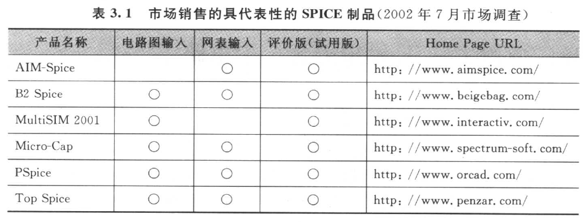

上世纪 80 年代，伯克利版 SPICE 也持续发展，增强了图形功能、增加了元件模型并改善收敛性，由此诞生 SPICE3。它原是在 UNIX 环境中运行的公共领域软件，后来也出现许多在 Windows 环境中运行的移植版。伯克利版及其移植版在易用性方面不及商业产品，但免费且不限制电路规模，仍有其吸引力。

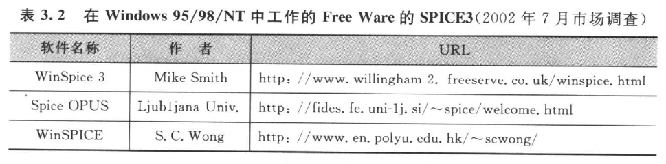

<!-- 来源：PDF 第 65 页；原书第 51 页 -->

### 3.1.3　SPICE 的电路文件（File）

在伯克利版 SPICE 中，电路资料以称为网表（Netlist）的文本文件形式输入模拟器。

另一方面，不少商业版 SPICE 可直接从电路图编辑器制作电路图文件，再由软件自动生成网表并分析；也有许多产品和伯克利版一样，可以直接输入网表。各公司产品的电路文件形式虽有不同，网表的记述形式仍大多以伯克利版 SPICE2 或 SPICE3 为准。

### 3.1.4　仍须模型参数（Model Parameter）

若想用 SPICE 正确模拟电路动作，就必须采用正确的模型参数。模型参数是规定元件特性的基本常数。以双极性晶体管（Bipolar Transistor）为例，包括饱和电流、电流放大倍数、结电容等数十个参数。

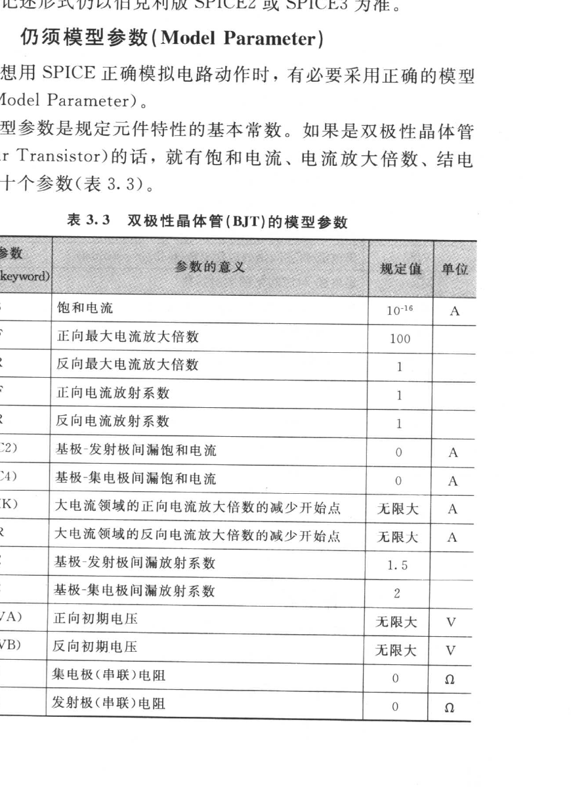

<!-- 来源：PDF 第 66 页；原书第 52 页 -->

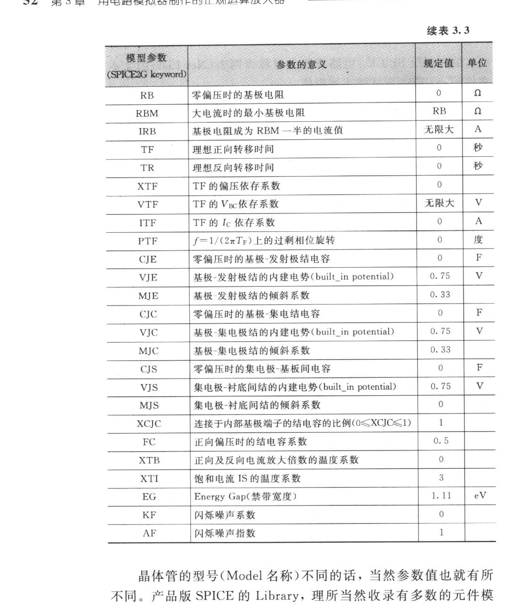

晶体管的型号（模型名称）不同，参数值当然也不同。商业版 SPICE 的元件库通常收录许多元件模型；评价版与免费版的模型库往往较少，使用时可能必须自行决定参数值，或以适当方法取得元件模型。

### 3.1.5　借助 SPICE 的模拟种类

SPICE 的基本模拟分析方法有以下三种：

- **DC 分析**：令输入电压（或电流）变化，模拟随之变化的输出电压（或电流），相当于用 X-Y 示波器观测输入—输出特性。
- **AC 分析**：模拟电路的振幅—频率特性和相位—频率特性。
- **暂态分析（Transient Analysis）**：向电路输入正弦波、脉冲波等信号，并像使用示波器一样观测各部分的电压或电流波形。

除此之外，还可执行 FFT 分析、噪声分析、蒙特卡洛（Monte Carlo）分析、温度分析等多种模拟。

<!-- 来源：PDF 第 67 页；原书第 53 页 -->

### 3.1.6　五晶体管运算放大器的模拟

下面用电路模拟器 Micro-Cap V/CQ 版分析第 1 章由分立晶体管构成的五晶体管运算放大器（图 1.4）。图 3.1 是在 Micro-Cap V/CQ 中建立的电路图。

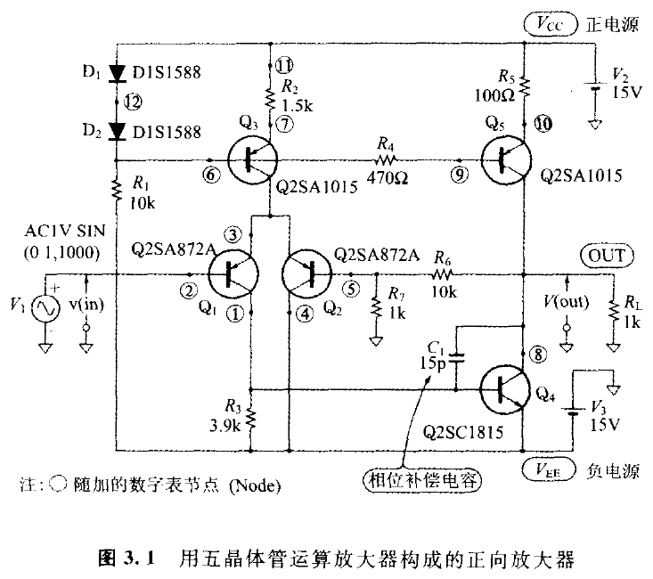

五晶体管运算放大器的正向最大输出电流仅约 6 mA。因此可以预料，负载电阻较小时，输出波形会在正端发生削波。这一点可以借助模拟来验证。

如图 3.1 所示，在输出端（OUT）连接 \\(1\ \mathrm{k\Omega}\\) 的负载电阻，并输入峰值为 \\(-1\ \mathrm{V}\\)、频率为 \\(1\ \mathrm{kHz}\\) 的正弦波，对输出波形进行模拟。首先用电路图编辑器描绘电路，图中的带圈数字是 Micro-Cap V 自动附加的节点（Node）编号。

<!-- 来源：PDF 第 68 页；原书第 54 页 -->

其次编辑模型参数（Model Parameter）。Micro-Cap V/CQ 的模型库已有 2SC1815 与 2SA1015，但这里使用只写入必要参数的简化自制模型。List 3.1 是图 3.1 电路的网表。

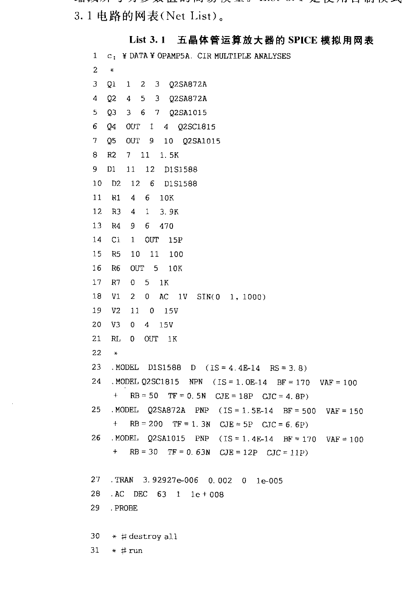

<!-- 来源：PDF 第 69 页；原书第 55 页 -->

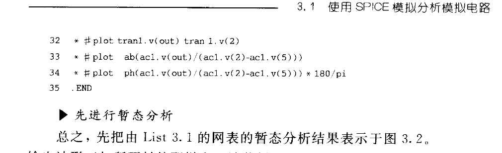

▶ 先进行暂态分析

List 3.1 的暂态分析结果示于图 3.2，输出波形如预料的那样在正端被截割。

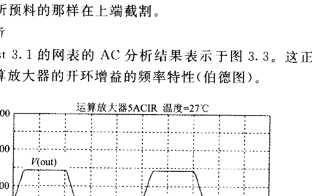

▶ AC 分析

List 3.1 的 AC 分析结果示于图 3.3。这就是五晶体管运算放大器开环增益的频率特性（波特图）。

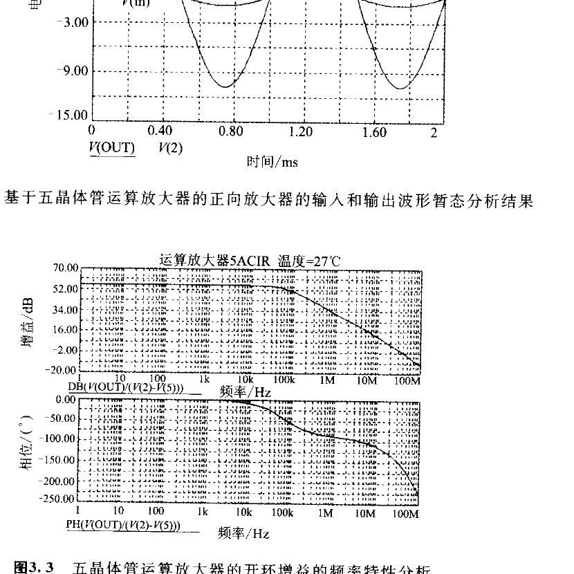

<!-- 来源：PDF 第 70 页；原书第 56 页 -->

▶ 网表

简要说明 List 3.1 的内容。第 3～21 行列出各元件的连接节点、元件值和模型名。例如一行晶体管记录依次给出集电极、基极、发射极所连接的节点以及晶体管模型名。

第 6、7、14、16、21 行中的 `OUT` 是图 3.1 节点 8 的别名（Alias）。为输入端、输出端和电源端适当设置别名，可提高网表的可读性。GND 的节点编号固定为 0；例如负载电阻一行表示把 \\(R_L=1\ \mathrm{k\Omega}\\) 连接于 OUT（节点 8）与 GND 之间。

第 23～26 行指定二极管和双极结晶体管（BJT）的模型。一般写法为：

```text
.MODEL <模型名> <元件类型> (<参数名>=<值> ...)
```

其中元件类型如表 3.4 所列。

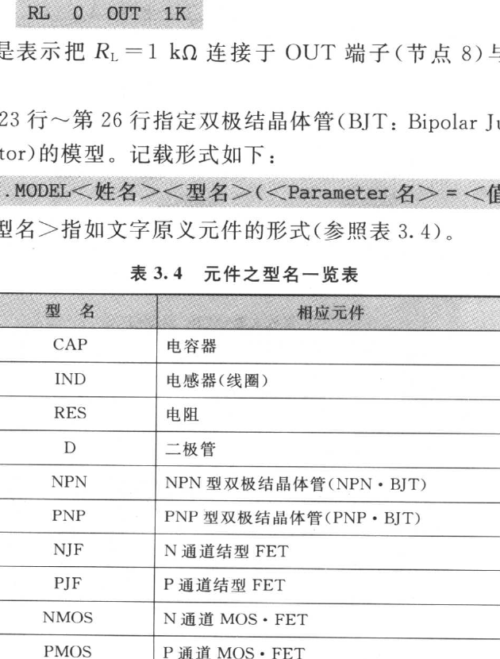

<!-- 来源：PDF 第 71 页；原书第 57 页 -->

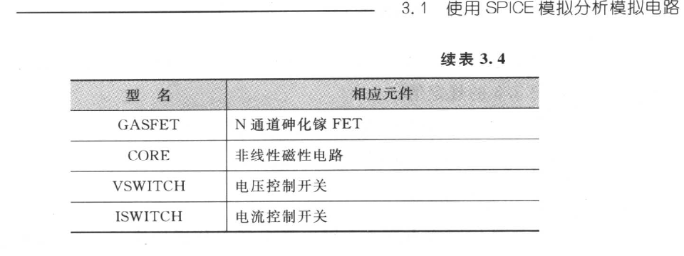

例如：

```text
.MODEL D1S1588 D (IS=4.4E-14 RS=3.8)
```

表示：

- `D1S1588` 是 1S1588 的自制模型名；
- `D` 表示二极管模型；
- \\(I_S=4.4\times10^{-14}\ \mathrm{A}\\) 是饱和电流；
- \\(R_S=3.8\ \Omega\\) 是寄生串联电阻。

这个模型等效于理想二极管串联寄生电阻 \\(R_S\\)，如图 3.4 所示。

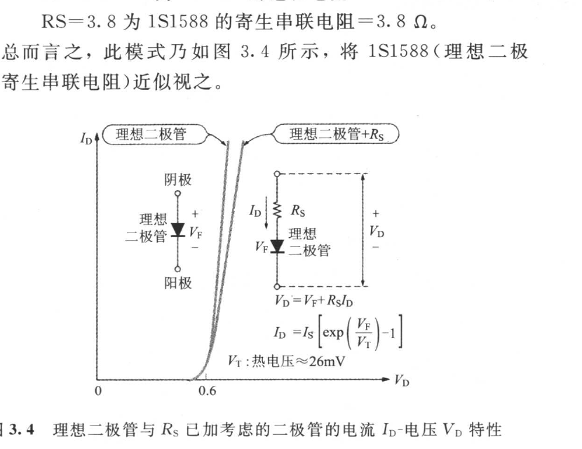

二极管还有许多其他模型参数。这里只指定 \\(I_S\\) 与 \\(R_S\\)，其余参数由 SPICE 采用默认值。2SC1815 的自制模型同样只给出七个关键参数，省略的项目采用表 3.3 的默认值。网表末尾的 `.TRAN`、`.AC` 和绘图命令依次指定暂态分析、AC 分析和结果显示；以 `#` 开头的命令供 WinSpice3 使用，在其他 SPICE 中可作为注释忽略。


<!-- 来源：PDF 第 72 页；原书第 58 页 -->

## 3.2　改进五晶体管运算放大器

第 1 章制作的五晶体管运算放大器，与一般的运算放大器 IC 相比，有以下明显缺点：

- 正向最大输出电流小（参照图 3.2）；
- 开环增益小（参照图 3.3）；
- 输入失调（Offset）电压大。

以下运用 SPICE 模拟器探索改善方法。

### 3.2.1　为增加最大输出电流的改进

在五晶体管运算放大器中追加互补发射极跟随器（Complementary Emitter Follower）输出级，便能大幅增加最大输出电流。

图 3.5 是在图 3.1 电路中增加 \\(Q_6\\)、\\(Q_7\\)、\\(R_8\\)、\\(R_9\\)、\\(D_3\\)、\\(D_4\\)、\\(D_5\\) 后的七晶体管正向放大器。它的 SPICE 网表见 List 3.2。

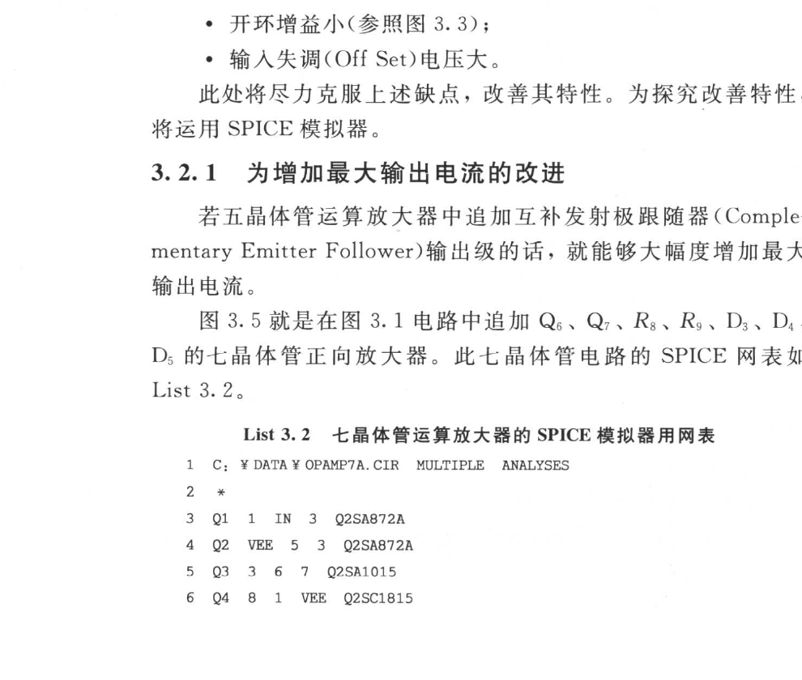

<!-- 来源：PDF 第 73 页；原书第 59 页 -->

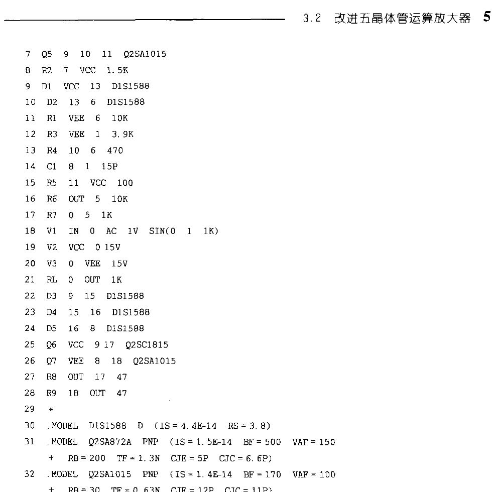

图 3.6 是向图 3.5 电路输入峰值为 \\(-1\ \mathrm{V}\\)、频率为 \\(1\ \mathrm{kHz}\\) 的正弦波时，输出电压的暂态分析结果。图 3.2 中的削波已经完全消失。

\\(D_3\\)、\\(D_4\\) 在图 3.5 中相当于 1S1588 二极管。输出级 \\(Q_6\\)、\\(Q_7\\) 的静态电流（Idling Current）在 \\(27^\circ\mathrm{C}\\) 时约为 \\(7\ \mathrm{mA}\\)，因此输出电流在约 \\(14\ \mathrm{mA}\\) 以内属于 A 类工作。

<!-- 来源：PDF 第 74 页；原书第 60 页 -->

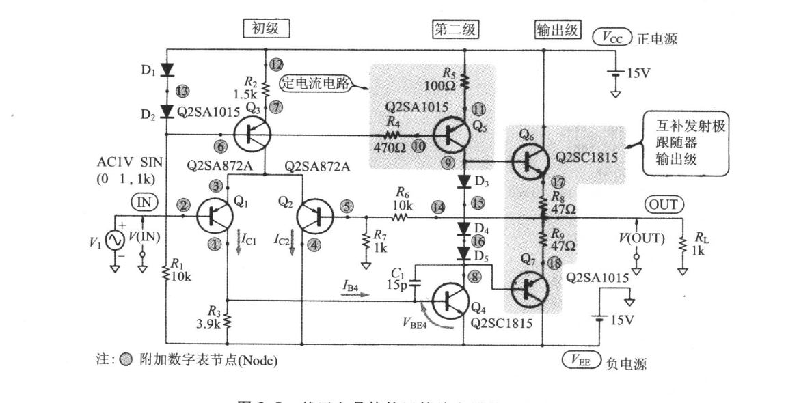

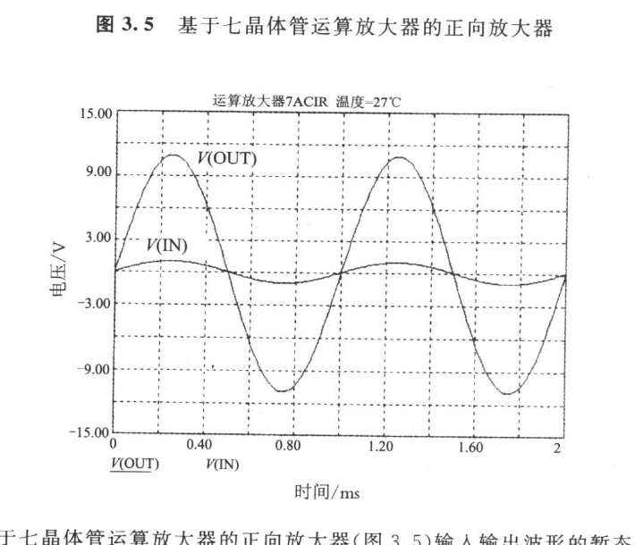

### 3.2.2　为增加开环增益的改进

图 3.1 所示五晶体管正向放大器的开环增益为

\\[
\frac{V(\mathrm{OUT})}{V(\mathrm{IN})-V(5)}
\\]

如图 3.3 所示，在 \\(10\ \mathrm{Hz}\\) 时约为 \\(56\ \mathrm{dB}\\)。

<!-- 来源：PDF 第 75 页；原书第 61 页 -->

另一方面，图 3.5 所示七晶体管正向放大器的开环增益模拟结果见图 3.7，在 \\(10\ \mathrm{Hz}\\) 时为 \\(80.7\ \mathrm{dB}\\)。追加发射极跟随器输出级后，第二级的负载电阻与电压增益均增加，因而开环增益上升。不过增益只增加二十几 dB，原因是 \\(Q_4\\) 的输出电导 \\(g_o\\) 抑制了进一步的增益增加。

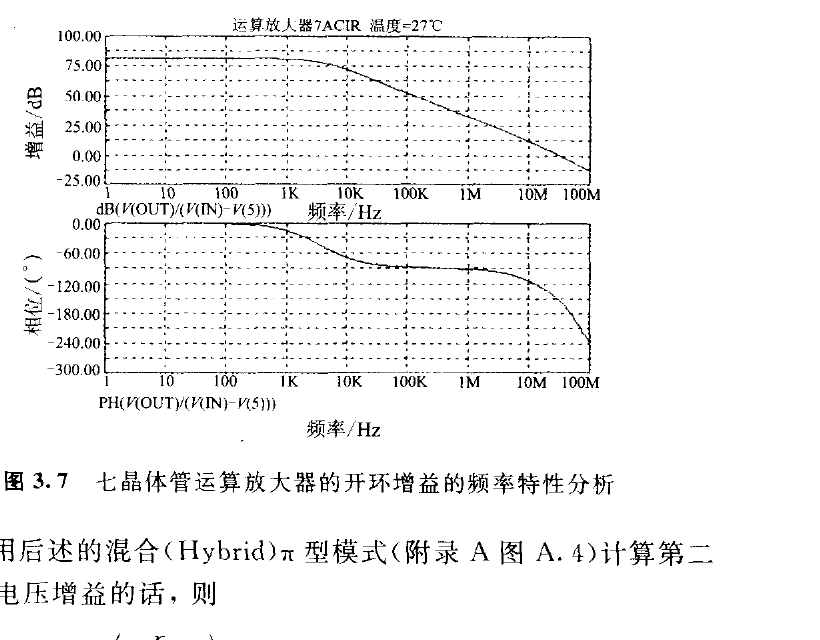

利用附录 A 图 A.4 的混合 \\(\pi\\) 型模型计算第二级 \\(Q_4\\) 的电压增益：

\\[
\begin{aligned}
A_{v2}
&=-
\left(\frac{r_\pi}{r_x+r_\pi}\right)
g_m\left(r_o\parallel R_{\mathrm{IN}}\right)
\end{aligned}
\tag{3.1}
\\]

式中，\\(r_\pi\\) 为 \\(Q_4\\) 的基极—发射极间电阻（\\(=1/g_\pi\\)），\\(r_x\\) 为基极扩展电阻（\\(=1/g_x\\)），\\(g_m\\) 为互导，\\(r_o\\) 为输出电阻（\\(=1/g_o\\)），\\(R_{\mathrm{IN}}\\) 为输出级发射极跟随器的输入电阻。

\\(R_{\mathrm{IN}}\\) 约等于 \\(Q_6\\)、\\(Q_7\\) 的 \\(h_{fe}\\) 与输出级负载电阻的乘积。对于图 3.5：

\\[
\begin{aligned}
R_{\mathrm{IN}}
&\approx h_{fe}\left[R_L\parallel(R_6+R_7)\right]\\
&\approx150\ \mathrm{k\Omega}
\end{aligned}
\tag{3.2}
\\]

\\[
\begin{aligned}
r_o
&=\frac{1}{g_o}\\
&=\frac{V_{AF}+V_{CE}}{I_C}\\
&=\frac{100+13.9}{6\times10^{-3}}\\
&=19\ \mathrm{k\Omega}
\end{aligned}
\tag{3.3}
\\]

由于 \\(r_o\\) 远小于 \\(R_{\mathrm{IN}}\\)，第二级的负载电阻可认为约等于 \\(r_o\\)。

<!-- 来源：PDF 第 76 页；原书第 62 页 -->

式（3.3）表明，\\(r_o\\) 与 \\(Q_4\\) 的集电极电流成反比。减小该电流会增大 \\(r_o\\)，但也会减小式（3.1）中的 \\(g_m\\)，从而降低第二级增益；另一方面，\\(Q_4\\) 的基极—发射极间电阻会增大，使初级负载变轻并提高初级增益。因此开环增益不会随第二级集电极电流单调变化：电流过小或过大都会降低总增益。

借助模拟器改变决定 \\(Q_4\\) 工作电流的 \\(R_5\\)。图 3.8 给出 \\(R_5=100\ \Omega\\)、\\(300\ \Omega\\)、\\(500\ \Omega\\) 时的开环增益；\\(500\ \Omega\\) 时最高，在 \\(10\ \mathrm{Hz}\\) 约为 \\(87.0\ \mathrm{dB}\\)。

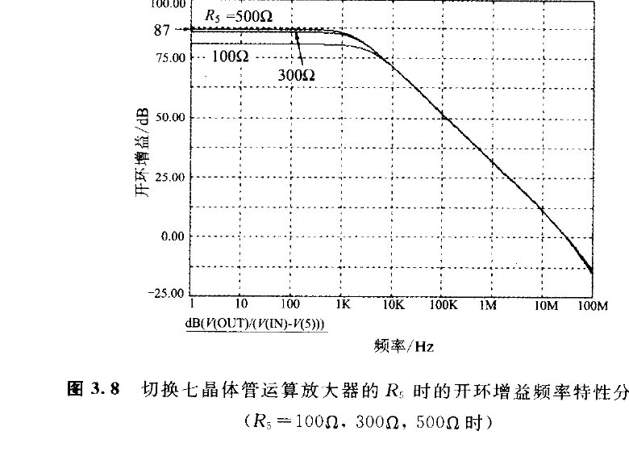

图 3.9 给出 \\(R_5=500\ \Omega\\)、\\(1\ \mathrm{k\Omega}\\)、\\(2\ \mathrm{k\Omega}\\)、\\(4\ \mathrm{k\Omega}\\) 的结果。\\(500\ \Omega\\) 与 \\(1\ \mathrm{k\Omega}\\) 在 \\(10\ \mathrm{Hz}\\) 时均约为 \\(87.0\ \mathrm{dB}\\)；继续增大 \\(R_5\\)，增益下降且高频特性恶化。

综合图 3.8 与图 3.9，\\(R_5\\) 的适宜范围约为 \\(500\ \Omega\\)～\\(1\ \mathrm{k\Omega}\\)。因此把图 3.5 的 \\(R_5\\) 改为 \\(620\ \Omega\\)，此时 \\(Q_4\\) 的集电极电流约为 \\(1\ \mathrm{mA}\\)。

<!-- 来源：PDF 第 77 页；原书第 63 页 -->

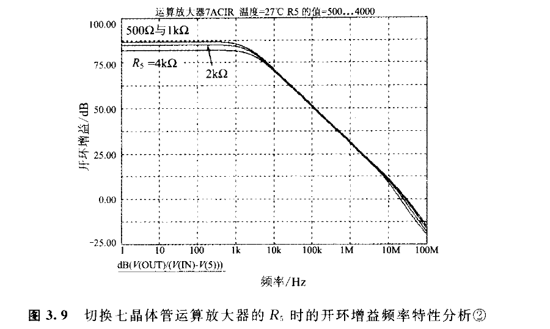

### 3.2.3　输入失调电压最小化

\\(R_5\\) 从 \\(100\ \Omega\\) 改为 \\(620\ \Omega\\) 后，开环增益约增加 \\(6\ \mathrm{dB}\\)，但输入失调电压可能增大。图 3.10 是两种 \\(R_5\\) 值下输入失调电压相对温度的 SPICE 分析结果。

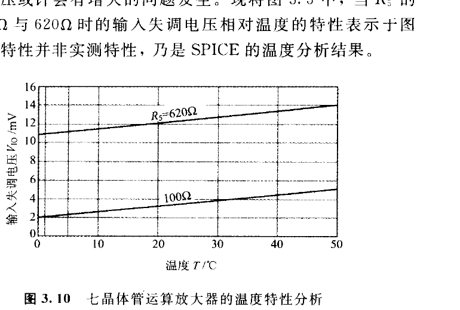

一般而言，晶体管温度上升时，基极—发射极间电压 \\(V_{BE}\\) 约以 \\(2\ \mathrm{mV}/^\circ\mathrm{C}\\) 的比例下降，正向电流放大倍数则约以 \\(0.5\%/^\circ\mathrm{C}\\) 的比例增加。SPICE 会自动计算 \\(V_{BE}\\) 的温度变化，但若没有写明模型参数 XTB，就不会反映电流放大倍数的温度变化。


<!-- 来源：PDF 第 78 页；原书第 64 页 -->

SPICE 按下式计算绝对温度 \\(T\\) 下的正向电流放大倍数：

\\[
\beta_F(T)=\beta_F(300)\left(\frac{T}{300}\right)^{\mathrm{XTB}}
\tag{3.4}
\\]

其中，\\(\beta_F(300)\\) 是 \\(T=300\ \mathrm{K}\\) 时的 \\(\beta_F\\)。表 3.3 给出的 XTB 默认值为零，因此若不显式指定 XTB，无论温度如何变化，\\(\beta_F(T)\\) 都保持不变。进行正常的温度分析时，必须指定各晶体管的 XTB。本例采用：

\\[
\begin{aligned}
\text{2SA872A:}\quad \mathrm{XTB}&=1.4\\
\text{2SA1015:}\quad \mathrm{XTB}&=1.3\\
\text{2SC1815:}\quad \mathrm{XTB}&=1.7
\end{aligned}
\\]

执行温度分析时追加的模型参数见 List 3.3。图 3.5 电路的 DC 输入电压为零，因此输入失调电压 \\(V_{IO}\\) 等于反向输入电压 \\(V(5)\\) 的绝对值：

\\[
V_{IO}=|V(5)|
\tag{3.5}
\\]

图 3.10 表明，在 \\(25^\circ\mathrm{C}\\) 时，\\(R_5=100\ \Omega\\) 的输入失调电压为 \\(3.5\ \mathrm{mV}\\)，而 \\(R_5=620\ \Omega\\) 时增大到 \\(12.3\ \mathrm{mV}\\)。

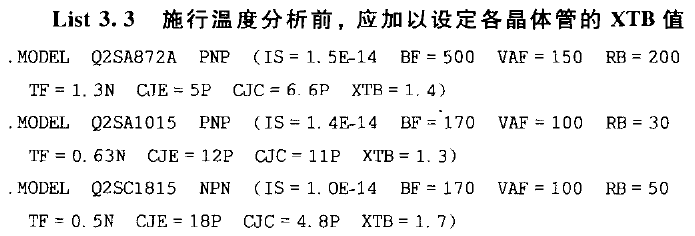

### 3.2.4　输入失调电压增加的原因

图 3.5 电路的输入失调电压可由下式求得：

\\[
V_{IO}=|V_{EB1}-V_{EB2}|
\tag{3.6}
\\]

其中，\\(V_{EB1}\\)、\\(V_{EB2}\\) 分别为 \\(Q_1\\)、\\(Q_2\\) 的发射极—基极间直流电压。由于 \\(Q_1\\)、\\(Q_2\\) 为 PNP 型，把式（2.1）中的 \\(V_{BE}\\) 换为 \\(V_{EB}\\)，则

\\[
I_C=I_S\exp\left(\frac{V_{EB}}{V_T}\right)
\tag{3.7}
\\]

\\[
V_{EB}=V_T\ln\left(\frac{I_C}{I_S}\right)
\tag{3.8}
\\]

<!-- 来源：PDF 第 79 页；原书第 65 页 -->

因此：

\\[
\begin{aligned}
V_{IO}
&=\left|
V_T\left[
\ln\left(\frac{I_{C1}}{I_{S1}}\right)
-\ln\left(\frac{I_{C2}}{I_{S2}}\right)
\right]\right|\\
&=\left|
V_T\ln\left(
\frac{I_{S2}}{I_{S1}}\cdot\frac{I_{C1}}{I_{C2}}
\right)\right|
\end{aligned}
\tag{3.9}
\\]

式中，\\(V_T\\) 为热电压（\\(T=300\ \mathrm{K}\\) 时为 \\(25.85\ \mathrm{mV}\\)），\\(I_{S1}\\)、\\(I_{S2}\\) 分别为 \\(Q_1\\)、\\(Q_2\\) 的饱和电流。输入失调电压为零的充要条件为：

\\[
\frac{I_{S2}}{I_{S1}}\cdot\frac{I_{C1}}{I_{C2}}=1
\tag{3.10}
\\]

也就是说，在 \\(I_{S1}=I_{S2}\\) 的前提下，只要 \\(I_{C1}=I_{C2}\\)，输入失调电压便为零。

SPICE 在执行 AC 或暂态分析前会计算直流工作点。图 3.5 电路在 \\(R_5=100\ \Omega\\) 时的工作点见 List 3.4，其中：

\\[
\begin{aligned}
I_{C1}&=231\ \mu\mathrm{A},\\
I_{C2}&=253\ \mu\mathrm{A}
\end{aligned}
\\]

两者相差约 \\(10\%\\)。

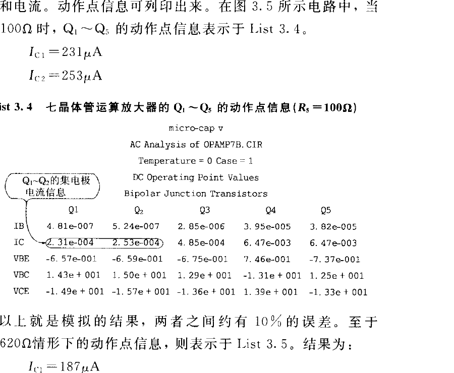

在 \\(R_5=620\ \Omega\\) 时，工作点见 List 3.5：

\\[
\begin{aligned}
I_{C1}&=187\ \mu\mathrm{A},\\
I_{C2}&=297\ \mu\mathrm{A}
\end{aligned}
\\]

<!-- 来源：PDF 第 80 页；原书第 66 页 -->

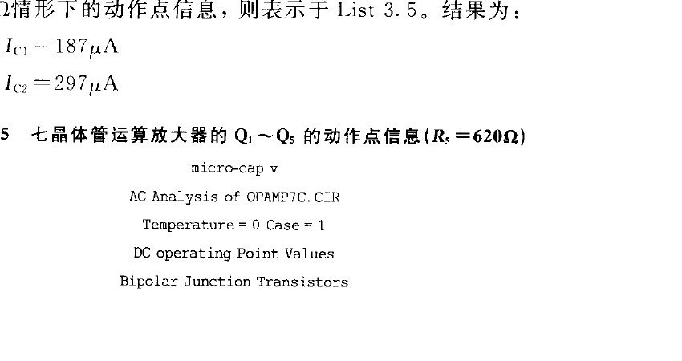

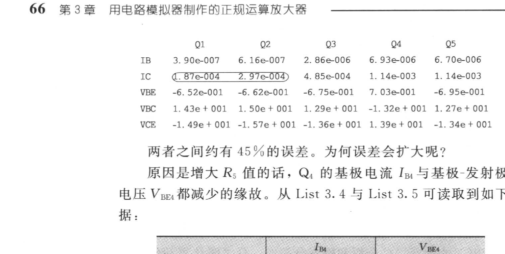

此时两者相差约 \\(45\%\\)。从 List 3.4、List 3.5 可读取：

| 条件 | \\(I_{B4}\\) | \\(V_{BE4}\\) |
|---|---:|---:|
| \\(R_5=100\ \Omega\\) | \\(39.5\ \mu\mathrm{A}\\) | \\(0.746\ \mathrm{V}\\) |
| \\(R_5=620\ \Omega\\) | \\(6.93\ \mu\mathrm{A}\\) | \\(0.703\ \mathrm{V}\\) |

增大 \\(R_5\\) 后，恒流电路 \\(Q_5\\) 的集电极电流下降，\\(Q_4\\) 的集电极电流及其基极电流 \\(I_{B4}\\) 也随之下降。根据式（2.1），\\(V_{BE4}\\) 也会下降。

把基尔霍夫电流定律应用于图 3.5 的节点 6：

\\[
I_{C1}=I_{B4}+\frac{V_{BE4}}{R_3}
\tag{3.11}
\\]

因此，当 \\(I_{B4}\\) 和 \\(V_{BE4}\\) 都减小时，初级差动放大电路的 \\(I_{C1}\\) 减小，而 \\(I_{C2}\\) 增大，平衡被破坏。

后级工作点变动会影响前级工作点，并非因果倒置；这是因为从输出到反向输入的整个电路受到直流负反馈。全面的直流负反馈会借助前级工作点的变化（即等效输入偏移）来抵消后级工作点的扰动。

### 3.2.5　削减输入失调电压的简单方法

了解原因后，方法也很直接：减小 \\(R_3\\)，适当增大 \\(V_{BE4}/R_3\\)。在 \\(R_5=620\ \Omega\\) 时，若令 \\(R_3=3\ \mathrm{k\Omega}\\)，便得到图 3.11 的温度特性；模拟所得 \\(25^\circ\mathrm{C}\\) 时 \\(V_{IO}\\) 约为 \\(0.7\ \mathrm{mV}\\)。

<!-- 来源：PDF 第 81 页；原书第 67 页 -->

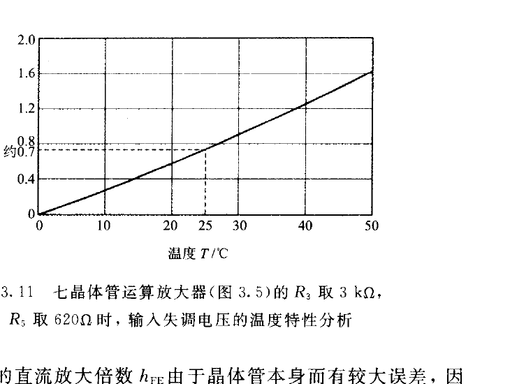

不过这种方法还有两个问题：

1. \\(Q_4\\) 的直流放大倍数 \\(h_{FE}\\) 本身误差较大，因而 \\(I_{B4}\\) 的误差也大。实际电路必须微调 \\(R_3\\) 以吸收误差。
2. SPICE 模拟不考虑晶体管自身发热。实际电路中，\\(Q_4\\) 的 \\(h_{FE}\\) 与 \\(V_{BE}\\) 会随其自身发热而改变；开机后直至偏置稳定期间会产生暂态偏置电压。

### 3.2.6　利用电流镜像电路与达林顿电路削减输入失调电压

在图 3.5 的七晶体管运算放大器中增加 \\(Q_8\\)、\\(Q_9\\) 作为电流镜，再增加 \\(Q_{10}\\)，使 \\(Q_4\\) 与 \\(Q_{10}\\) 实质上构成达林顿连接，得到图 3.12 的十晶体管运算放大器。新增的六只二极管均为 1S1588，\\(D_6\\) 在正常工作时不导通。

模拟得到的输入失调电压温度特性见图 3.13。在 \\(0\\)～\\(50^\circ\mathrm{C}\\) 范围内，输入失调电压约在 \\(38\\)～\\(49\ \mu\mathrm{V}\\) 间变化。即使 \\(R_5=100\ \Omega\\)，也约小于 \\(100\ \mu\mathrm{V}\\)；输入失调电压温度系数约为 \\(0.2\ \mu\mathrm{V}/^\circ\mathrm{C}\\)。

输入失调电压变小的原因如下。图 3.12 中 \\(Q_1\\)、\\(Q_2\\) 的集电极电流为：

\\[
I_{C1}=I_{C8}+I_{B10}
\tag{3.12a}
\\]

\\[
I_{C2}=I_{C9}+(I_{B8}+I_{B9})
\tag{3.12b}
\\]

若 \\(Q_8\\)、\\(Q_9\\) 的饱和电流相等，则 \\(I_{C8}=I_{C9}\\)，所以：

\\[
\begin{aligned}
|I_{C1}-I_{C2}|
&=|I_{B10}-(I_{B8}+I_{B9})|
\end{aligned}
\tag{3.13}
\\]

<!-- 来源：PDF 第 82 页；原书第 68 页 -->

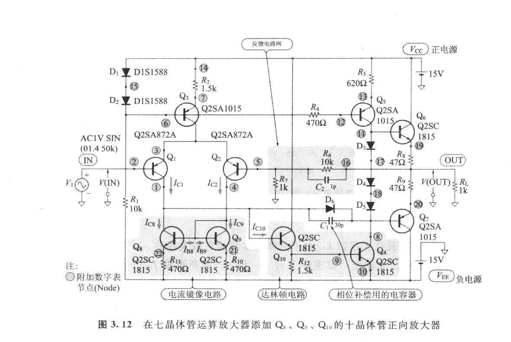

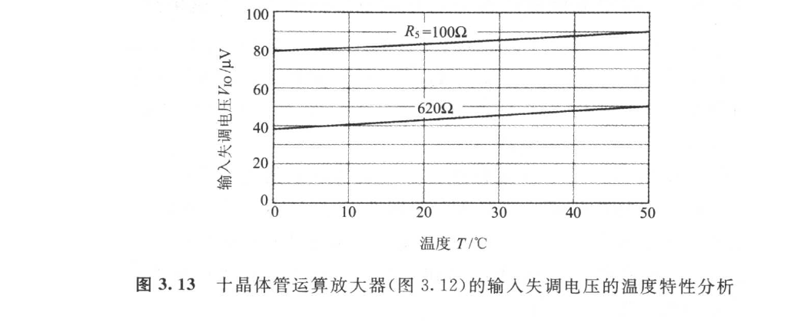

因此若按下式设计：

\\[
I_{B10}=I_{B8}+I_{B9}
\tag{3.14}
\\]

就可使 \\(I_{C1}=I_{C2}\\)，式（3.10）成立，输入失调电压成为零。

假定 \\(Q_8\\)、\\(Q_9\\)、\\(Q_{10}\\) 的 \\(h_{FE}\\) 相等，则：

\\[
I_{B10}=\frac{V_{BE4}}{h_{FE}R_{12}}
\tag{3.15}
\\]

<!-- 来源：PDF 第 83 页；原书第 69 页 -->

\\[
\begin{aligned}
I_{B8}+I_{B9}
&\approx\frac{I_{C1}+I_{C2}}{h_{FE}}
\\
&\approx\frac{(V_{D1}+V_{D2}-V_{EB3})/R_2}{h_{FE}}
\end{aligned}
\tag{3.16}
\\]

若假定

\\[
V_{D1}=V_{D2}=V_{EB3}=V_{BE4}=0.6\ \mathrm{V},
\\]

则

\\[
\begin{aligned}
I_{B10}&\approx\frac{0.6}{h_{FE}R_{12}},\\
I_{B8}+I_{B9}&\approx\frac{0.6}{h_{FE}R_2}.
\end{aligned}
\\]

只要 \\(R_{12}=R_2\\)，式（3.14）便成立。因此图 3.12 中取 \\(R_{12}=R_2=1.5\ \mathrm{k\Omega}\\)。由于 \\(I_{B8}\\)、\\(I_{B9}\\)、\\(I_{B10}\\) 约小于 \\(I_{C1}+I_{C2}\\) 的 \\(1/100\\)，这些基极电流的小幅变化对输入失调电压的影响较轻微。

### 3.2.7　挑选初级差动晶体管的重要性

上述讨论以 \\(Q_1\\)、\\(Q_2\\) 的饱和电流和结温度相等为前提。对单片 IC 中的晶体管，这是较合理的假设；但对于分立晶体管，即使型号相同，饱和电流也未必一致。若饱和电流不同，即使 \\(I_{C1}=I_{C2}\\)，输入失调电压仍不会为零（参照式（3.10））。

因此必须挑选初级差动放大电路的配对晶体管（Pair Transistor）。直接测量饱和电流较困难，实际可按图 3.14 测量 \\(V_{EB}\\)，挑选数值尽量接近的晶体管。测试时焊接引脚或用手触摸都会改变结温和 \\(V_{EB}\\)，因此应避免焊接，并使用鳄鱼夹夹住引脚。

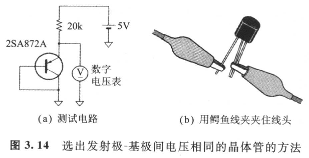

▶ 热耦合

初级差动放大电路中，\\(Q_1\\)、\\(Q_2\\) 的结温若相差 \\(1^\circ\mathrm{C}\\)，约会产生 \\(2\ \mathrm{mV}\\) 的输入失调电压。保持两者同温非常重要，可如图 3.15 用环氧树脂胶将两只晶体管粘合后安装到印制板上。

<!-- 来源：PDF 第 84 页；原书第 70 页 -->

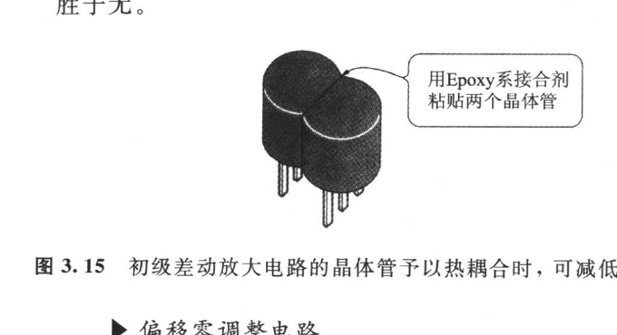

▶ 失调电压调零电路

即使采取上述措施，要在实际电路中把输入失调电压稳定抑制到 \\(1\ \mathrm{mV}\\) 以下仍不容易。因此通常在初级电流镜的两个发射极之间加入图 3.16 所示半固定电阻，将失调电压调至零。

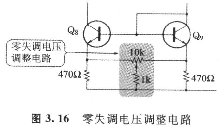


### 3.2.8　饱和防止电路

图 3.12 中 \\(Q_{10}\\) 的基极与 \\(Q_4\\) 的集电极之间插入的二极管 \\(D_6\\)，用于防止主放大器晶体管 \\(Q_4\\) 饱和。如果没有 \\(D_6\\)，过大的输入可能使 \\(Q_{10}\\)、\\(Q_4\\) 损坏。

去除 \\(D_6\\) 后，输入频率 \\(50\ \mathrm{kHz}\\)、峰值 \\(1.4\ \mathrm{V}\\) 的正弦波，所得输出波形、初级差动输入电压和 \\(Q_{10}\\) 集电极电流见图 3.17。

当电路在线性区工作时，开环增益很大（\\(50\ \mathrm{kHz}\\) 时约 \\(59\ \mathrm{dB}\\)，参照图 3.20），所以差动输入电压很小。当输出电压波峰发生削波时，差动输入电压会急剧增加。

<!-- 来源：PDF 第 85 页；原书第 71 页 -->

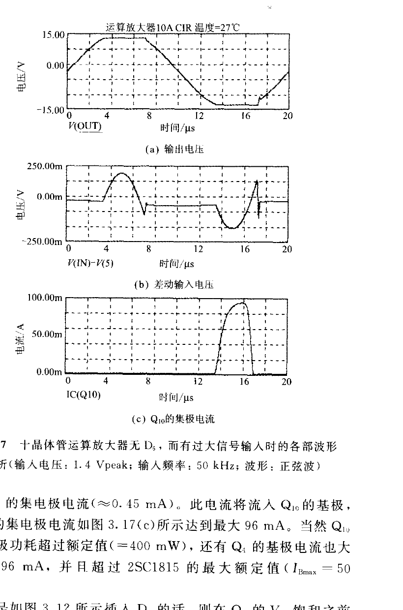

在输出负峰被削波期间，初级差动放大电路的 \\(Q_2\\) 截止，\\(Q_1\\) 的集电极电流几乎全部流入 \\(Q_{10}\\) 的基极，使 \\(Q_{10}\\) 的集电极电流达到约 \\(96\ \mathrm{mA}\\)。这会使晶体管的功耗或基极电流超过额定值。

如图 3.12 所示插入 \\(D_6\\) 后，\\(D_6\\) 会在 \\(Q_4\\) 饱和前导通。此时的电压、电流关系见图 3.18；对应波形见图 3.19。即使输出负峰被削波，电流大部分也流经 \\(D_6\\)，\\(Q_{10}\\) 的基极电流及集电极电流几乎不再增加。

<!-- 来源：PDF 第 86 页；原书第 72 页 -->

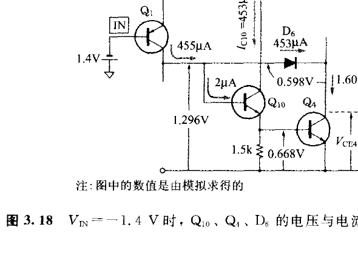

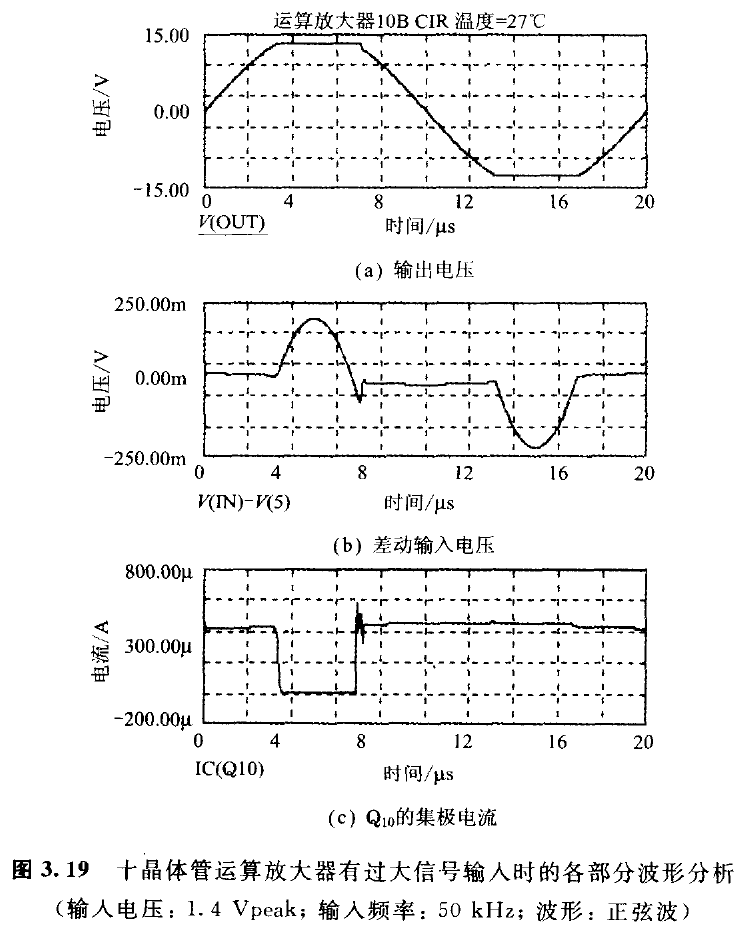

用于模拟的完整网表见 List 3.6。为提高模拟准确性，晶体管模型中还追加了反向传输时间 \\(T_R\\)。

<!-- 来源：PDF 第 87 页；原书第 73 页 -->

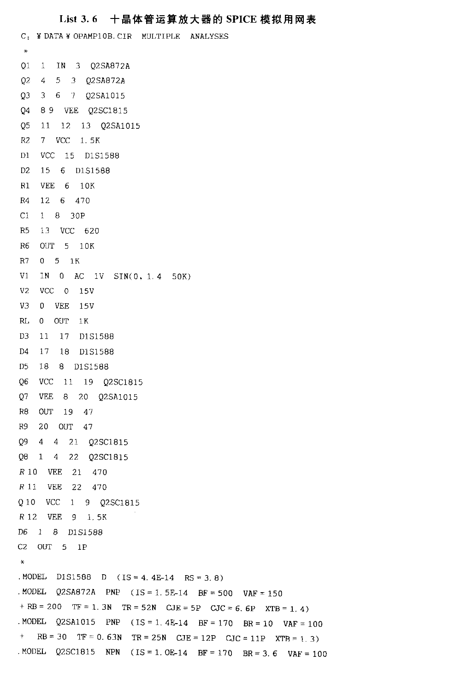

<!-- 来源：PDF 第 88 页；原书第 74 页 -->

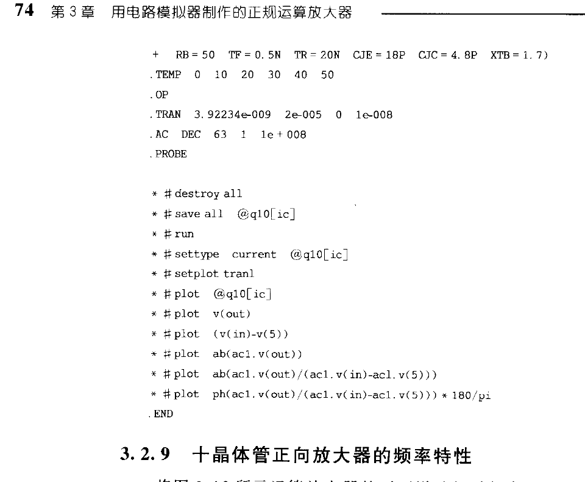

### 3.2.9　十晶体管正向放大器的频率特性

将图 3.12 所示运算放大器的开环增益相对频率的特性模拟，结果如图 3.20 所示。由于追加 \\(Q_7\\)、\\(Q_8\\)、\\(Q_9\\)，初级的电压增益大幅提升，在 \\(1\ \mathrm{Hz}\\) 时的开环增益

\\[
\frac{V(\mathrm{OUT})}{V(\mathrm{IN})-V(5)}
\\]

约为 \\(130\ \mathrm{dB}\\)。

相位补偿电容 \\(C_1\\)，在图 3.1 所示的五晶体管运算放大器中为 \\(15\ \mathrm{pF}\\)，图 3.12 的十晶体管运算放大器中则为 \\(30\ \mathrm{pF}\\)。十晶体管运算放大器的初级负载为电流镜像，所以初级实质上的 \\(g_m\\) 如第 2 章所说明的那样倍增。只是把相位补偿电容取为 \\(15\ \mathrm{pF}\\) 的话，增益交点频率就会上升，而相位裕量减少。

再者，图 3.12 所示的电路，反馈电阻 \\(R_6=10\ \mathrm{k\Omega}\\) 与 \\(1\ \mathrm{pF}\\) 的电容器并联，这是为抵消由输入端子的输入电容所生成的极点（Pole）而设的。初级使用 BJT 的一般运算放大器 IC，输入电容在数 pF 程度，而此十晶体管运算放大器的输入电容（因晶体管之故）则有数十 pF，不容忽视。

输入电容比一般运算放大器 IC 大的理由如下。

① 由于 \\(Q_1\\)、\\(Q_2\\) 的集电极电流设定得比一般的运算放大器大，所以 \\(Q_1\\)、\\(Q_2\\) 的基极—发射极间电容就大。

<!-- 来源：PDF 第 89 页；原书第 75 页 -->

如果在 SPICE 的网表中记载 `.OP` Command，就可以得到有关 List 3.7 所示那样的动作点详细信息。在此项中 CPI 就是动作点上的基极—发射极间电容（相当于混合 \\(\pi\\) 型模式的 \\(C_\pi\\)）。\\(Q_1\\) 与 \\(Q_2\\) 的基极—发射极间电容 CPI 均为 \\(19\ \mathrm{pF}\\)。因此正向输入至反向输入端子间的电容为其一半，即 \\(9.5\ \mathrm{pF}\\)。

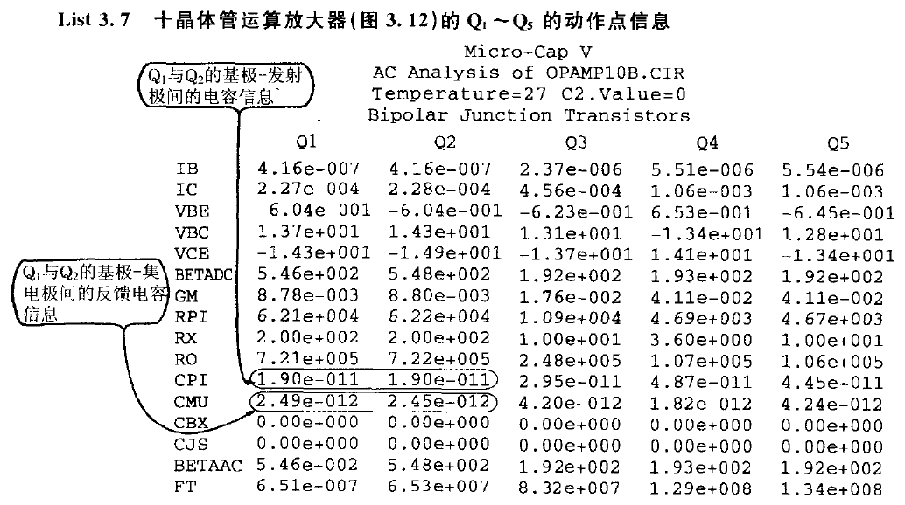

② 有起源于 \\(Q_2\\) 的基极—集电极间电容的米勒效应（Miller Effect）电容。

米勒效应，是 J. M. Miller 发现的、有关三极真空管屏极—栅极间电容的理论<sup>4</sup>。米勒效应不只限于真空管，晶体管、FET 以及图 3.21 所示的一般反向放大器也都具有这一效应。在图 3.21 中，若以 \\(A\\) 表示开环增益，则：

\\[
\begin{aligned}
i_{\mathrm{in}}
=j\omega C(V_{\mathrm{in}}-V_{\mathrm{out}})
=j\omega C(v_{\mathrm{in}}+Av_{\mathrm{in}})
\end{aligned}
\\]

即

\\[
i_{\mathrm{in}}=j\omega C(1+A)v_{\mathrm{in}}
\tag{3.17}
\\]

反向输入端的输入阻抗为：

\\[
\begin{aligned}
Z_{\mathrm{in}}
=\frac{v_{\mathrm{in}}}{i_{\mathrm{in}}}\\
=\frac{1}{j\omega C(1+A)}
\end{aligned}
\tag{3.18}
\\]

此式的意义就是表示：从左边看反向输入端子时，反向输入至 GND 间看起来宛如有反馈电容 C 的 (1+A) 倍的输入电容存在。像这样，反向放大器看上去其输入电容为反馈电容 C 的 (1+A) 倍的现象，叫做米勒效应（Miller Effect）。

<!-- 来源：PDF 第 90 页；原书第 76 页 -->

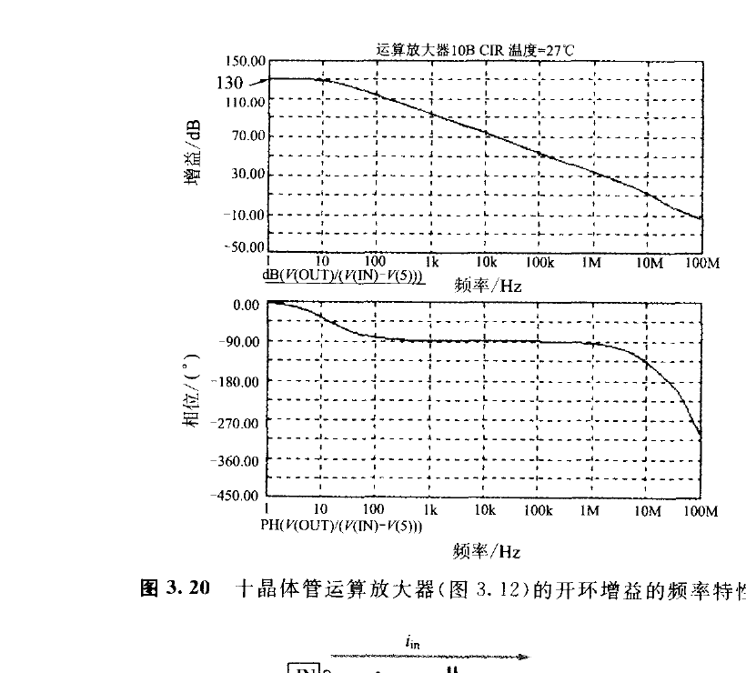

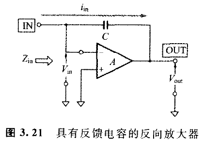

并且，\\(Q_2\\) 的基极输入电压与集电极输出电压是反相，基极至集电极间有 \\(C_{\mu2}\\) 的反馈电容。因此根据米勒效应，\\(Q_2\\) 的基极至 GND 间看上去有以下的等效输入电容 \\(C_{\mathrm{IN}}\\) 生成：

\\[
C_{\mathrm{IN}}=C_{\mu2}(1+A)
\tag{3.19}
\\]

其中

\\[
\begin{aligned}
A
=\frac{(1/g_{m9})+R_{10}}
{(1/g_{m1})+(1/g_{m2})}
\end{aligned}
\tag{3.20}
\\]

SPICE 是以 CMU 记载 \\(C_\mu\\)。从 List 3.7 得：

\\[
\begin{aligned}
C_{\mu2}=2.45\ \mathrm{pF},\\
g_{m1}=8.78\ \mathrm{mS},\\
g_{m2}=8.80\ \mathrm{mS},\\
g_{m9}=8.69\ \mathrm{mS},\\
R_{10}=470\ \Omega.
\end{aligned}
\\]

把这些代入式（3.20）时，\\(A=2.57\\)。再将此式代入式（3.19），则可算出：

<!-- 来源：PDF 第 91 页；原书第 77 页 -->

\\[
\begin{aligned}
C_{\mathrm{IN}}
=2.45\times(1+2.57)\\
=8.75\ \mathrm{pF}
\end{aligned}
\tag{3.21}
\\]

因为图 3.12 上运算放大器电路的正向输入端子（节点 2）的信号源阻抗为零，所以由反馈电路网 \\(R_6\\)、\\(R_7\\) 看反向输入端子（节点 5）时，输入电容为（参照图 3.22）：

\\[
\begin{aligned}
\frac{19\ \mathrm{pF}}{2}+8.75\ \mathrm{pF}
=18.25\ \mathrm{pF}
\end{aligned}
\tag{3.22}
\\]

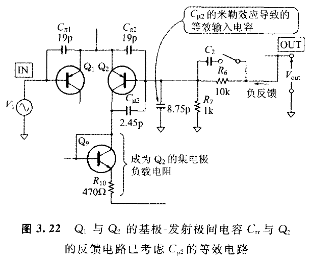

若省略 \\(C_2\\) 的话，则输入电容在较高的频率时，将使反馈电路网的反馈率降低，而导致相位旋转。反馈率降低 \\(3\ \mathrm{dB}\\) 时的频率 \\(f_C\\) 是：

\\[
\begin{aligned}
f_C
&=\frac{1}
{2\pi\times18.25\times10^{-12}\times(R_6\parallel R_7)}
\\
=9.58\ \mathrm{MHz}
\end{aligned}
\tag{3.23}
\\]

而且在 \\(f_C\\) 相位滞后 \\(45^\circ\\)。

有两种方法可减少此相位滞后。其一是把 \\(R_6\\) 与 \\(R_7\\) 的值充分降低。例如取 \\(R_6=1\ \mathrm{k\Omega}\\)、\\(R_7=100\ \Omega\\) 的话，\\(f_C\\) 就上升十倍，并且在 \\(10\ \mathrm{MHz}\\) 时的反馈电路网相位滞后约为 \\(-6^\circ\\)。

另一种减少相位滞后的方法，就是插入与 \\(R_6\\) 并联、而满足下式的 \\(C_2\\)，用以抵消极点：

\\[
R_6C_2=R_7\times18.25\ \mathrm{pF}
\tag{3.24}
\\]

图 3.12 的运算放大器电路因 \\(R_6=10\ \mathrm{k\Omega}\\)、\\(R_7=1\ \mathrm{k\Omega}\\)，故取 \\(C_2=1.825\ \mathrm{pF}\\) 就可以了。但是，最后的关键是 \\(C_2\\) 为 \\(1\ \mathrm{pF}\\)。实际上，与 \\(R_6\\) 并联 \\(C_2\\) 的方法可以说是一把“双刃剑”。\\(C_2\\) 确实会使相位超前，但同时会促使高频域的环路增益增加，造成增益交点频率的上升。\\(C_2\\) 照理应该抑制在必要的最小限度内。

<!-- 来源：PDF 第 92 页；原书第 78 页 -->

十晶体管运算放大器电路的闭环增益频率特性的模拟结果表示于图 3.23。按 \\(C_2=0\\) 的情形约有 \\(2\ \mathrm{dB}\\) 的尖峰（Peak）出现，但是当 \\(C_2=1\ \mathrm{pF}\\) 时就呈现平坦（Flat），所以增加 \\(C_2\\) 值时，无需大于此数。

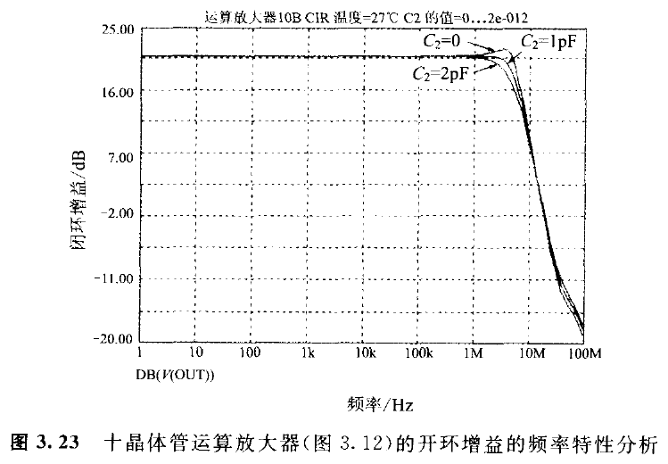

### 3.2.10　电源电压抑制比（Supply Voltage Rejection Ratio）的分析

相对于电源电压单位变化的输入失调电压变动量，称为电源电压抑制比（SVRR）。

如图 3.24，把十晶体管运算放大器的正向输入端接地，在负电源电压上叠加振幅 \\(1\ \mathrm{V}\\) 的正弦波，输出端 OUT 就会出现正弦波。其振幅会随叠加信号频率变化。由于放大器施加了负反馈，反向输入电压 \\(V(4)\\) 为：

\\[
V(4)=\left(\frac{R_7}{R_6+R_7}\right)V(\mathrm{OUT})
\tag{3.25}
\\]

电源电压抑制比可由此求得：

\\[
\mathrm{SVRR}=-20\log_{10}V(4)
\tag{3.26}
\\]

使用 SPICE 的分贝函数 `DB`，则：

\\[
\mathrm{SVRR}=-\mathrm{DB}(V(4))
\tag{3.27}
\\]

<!-- 来源：PDF 第 93 页；原书第 79 页 -->

对图 3.24 电路进行 AC 分析，可得到图 3.25 的 SVRR 频率特性。\\(100\ \mathrm{Hz}\\) 时约为 \\(108\ \mathrm{dB}\\)。这表示在负电源上叠加 \\(100\ \mathrm{Hz}\\)、\\(1\ \mathrm{V_{RMS}}\\) 正弦波时，反向输入端约出现 \\(4\ \mu\mathrm{V_{RMS}}\\) 的同频分量，输出端分量为：

\\[
\begin{aligned}
V(\mathrm{OUT})
&=4\ \mu\mathrm{V_{RMS}}
\left(\frac{R_6+R_7}{R_7}\right)
\end{aligned}
\tag{3.28}
\\]

正电源的电源电压抑制比也可用同样方法计算。

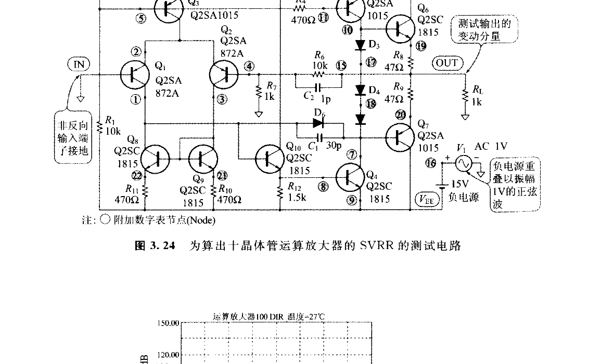

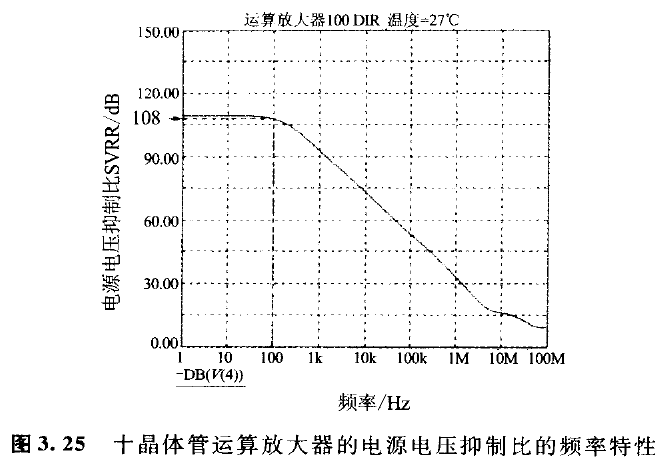

<!-- 来源：PDF 第 94 页；原书第 80 页 -->

第二级采用 NPN 晶体管且基极—发射极间接有相位补偿电容时，负电源 SVRR 通常小于正电源 SVRR；负电源 SVRR 的频率特性也会描绘出类似开环增益频率特性的曲线。

五晶体管运算放大器的负电源 SVRR 见图 3.26。\\(100\ \mathrm{Hz}\\) 时约为 \\(73\ \mathrm{dB}\\)，比十晶体管运算放大器低约 \\(35\ \mathrm{dB}\\)。

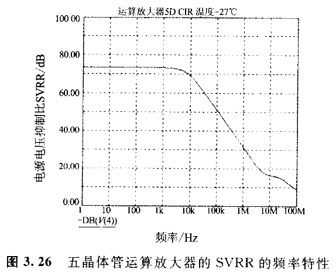

### 3.2.11　十晶体管运算放大器的转换速率

向图 3.12 电路输入振幅 \\(\pm1\ \mathrm{V}\\)、频率 \\(100\ \mathrm{kHz}\\) 的方波，输出电压的模拟结果见图 3.27。

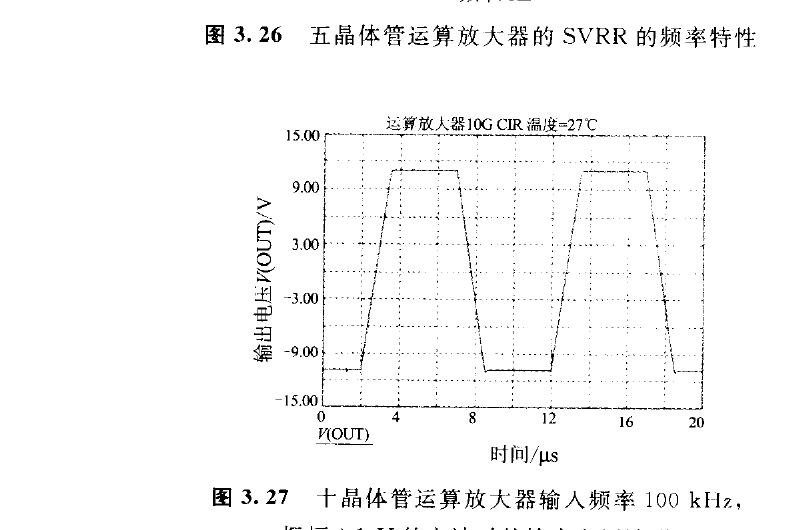

<!-- 来源：PDF 第 95 页；原书第 81 页 -->

由波形读得转换速率（Slew Rate）\\(SR\\) 约为 \\(14\ \mathrm{V/\mu s}\\)。把第 2 章式（2.29）的思路用于图 3.12：

\\[
\begin{aligned}
SR
&=\frac{I_{C3}}{C_1}\\
&=\frac{456\times10^{-6}}{30\times10^{-12}}\\
&=15.2\ \mathrm{V/\mu s}
\end{aligned}
\tag{3.29}
\\]

可见模拟结果与理论计算值较为一致。
