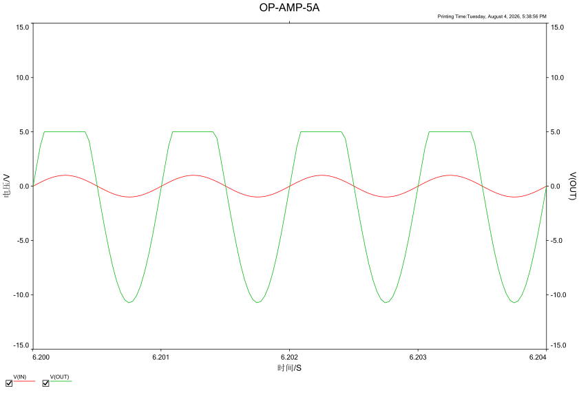
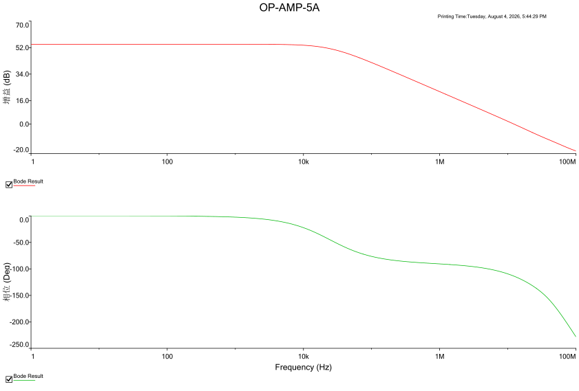
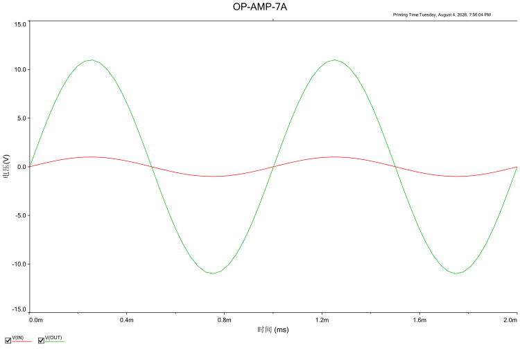
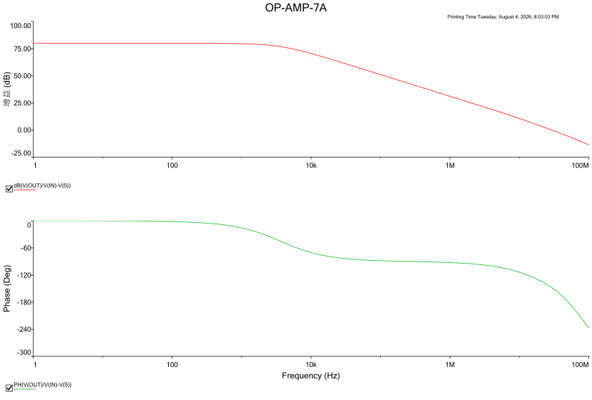

# 第 3 章　用电路模拟器制作的正规运算放大器

<!-- 来源：PDF 第 63 页；原书第 49 页 -->

运用电路模拟器（Simulator），不妨把第 1 章所制作的五晶体管运算放大器改进成正规的运算放大器。再引述第 2 章所学到的电流镜像电路、达林顿连接电路、互补发射极跟随器等，用以大幅提升运算放大器的性能。

## 3.1　使用 SPICE 模拟分析模拟电路

### 3.1.1　为何要使用电路模拟器

模拟电路以设计自由度极高为其特征。然而其自动设计趋于困难，从电路的构想开始直至设计为止都要依赖人工。由于靠人工的设计难免有所疏漏与错误，因此一次设计一般都无法达成目标的规格要求。

因此，从前的电路设计工程师，为了设计→试作→测试→再设计→……，如此循环不已的作业忙得团团转。如今电子电路的工作能够轻而易举地利用可在电脑上模拟的“电路模拟器 SPICE”进行模拟。

当输入电路资料时，SPICE 开始对电路动作进行分析：各部分的信号波形宛如在示波器上看到的一样，频率特性则如同用电路分析仪观测，并在图表上显示分析结果。总之，灵活运用 SPICE 可大幅缩减耗费在试作与测试上的时间。

### 3.1.2　什么是 SPICE

电子电路模拟器正式称呼为 SPICE。SPICE 是由加利福尼亚大学伯克利分校（U. C. Berkeley）所研发的 **Simulation Program with Integrated Circuit Emphasis** 的首字母缩写。从名称即可明白，它是为模拟以晶体管为基础的集成电路而设计的软件，而且个别半导体电路和被动电路（LC 滤波器和传送线路等）也均可模拟。

<!-- 来源：PDF 第 64 页；原书第 50 页 -->

最初的 SPICE 在 1972 年准予发表展览。然后在 1975 年出现了 SPICE2，应该说是 1981 年才正式命名为 SPICE2G6。自 1980 年代以后，这些伯克利版的 SPICE 经改良扩充后的电路模拟器才由各厂商公司当作产品发售，SPICE 是电路设计工程师不可缺少的利器。

表 3.1 展示了 Windows 环境下工作，且具代表性的产品版 SPICE。价格根据储存库（Library）的充实程度与运用方便，大致成比例。还有，分析电路规模受限的评价版与有时间限制时免费试用版，由各公司的 WEB 场所供应提供。如果是小的电路，评价版也足够使用。

<!--  -->

| 产品名称 | 电路图输入 | 网表输入 | 评价版（试用版） | Home Page URL |
|---|:---:|:---:|:---:|---|
| AIM-Spice |  | ○ | ○ | http://www.aimspice.com/ |
| B2 Spice | ○ | ○ | ○ | http://www.beigebag.com/ |
| MultiSIM 2001 | ○ |  | ○ | http://www.interactiv.com/ |
| Micro-Cap | ○ | ○ | ○ | http://www.spectrum-soft.com/ |
| PSpice | ○ | ○ | ○ | http://www.orcad.com/ |
| Top Spice | ○ | ○ | ○ | http://www.penzar.com/ |

**表 3.1　市场销售的具代表性的 SPICE 制品（2002 年 7 月市场调查）**

上世纪 80 年代，伯克利版的 SPICE 也有所发展，诸如图表（Graphic）功能的加强、元件模式的增加、收集性的改善等等，而诞生了 SPICE3。此乃在 UNIX 环境中运行的公共软件（Public domain Soft），但现在已有许多在 Windows 环境中运行 SPICE3 的 Croon 版（表 3.2）。伯克利版和 Croon 版的 SPICE 运用方便，但与产品版相比，算是初出茅庐。但是，免费又无电路规模限制的优点为其魅力所在。

<!--  -->

| 软件名称 | 作者 | URL |
|---|---|---|
| WinSpice 3 | Mike Smith | http://www.willingham2.freeserve.co.uk/winspice.html |
| Spice OPUS | Ljubljana Univ. | http://fides.fe.uni-lj.si/~spice/welcome.html |
| WinSPICE | S. C. Wong | http://www.en.polyu.edu.hk/~scwong/ |

**表 3.2　在 Windows 95/98/NT 中工作的 Free Ware 的 SPICE3（2002 年 7 月市场调查）**

<!-- 来源：PDF 第 65 页；原书第 51 页 -->

### 3.1.3　SPICE 的电路文件（File）

伯克利版 SPICE，电路资料是以称为网表（Net List）的文本文件（Text File）形式输入模拟器。

另一方面，不少产品版的 SPICE，直接从电路图编辑器（Editor）编制而形成电路图文件，或者 SPICE 从电路图经由自动生成的网表就能够加以分析。还有不少产品版 SPICE 如伯克利版一样，也可能由网表输入做分析。

虽各公司生产的产品版 SPICE 的电路文件形式各有不同，但网表的记述形式仍以伯克利版 SPICE2 或 SPICE3 为准。

### 3.1.4　仍须模型参数（Model Parameter）

若想用 SPICE 正确模拟电路动作，就必须采用正确的模型参数。模型参数是规定元件特性的基本常数。以双极性晶体管（Bipolar Transistor）为例，包括饱和电流、电流放大倍数、结电容等数十个参数。

<!--  -->

<!-- 来源：PDF 第 66 页；原书第 52 页 -->

<!--  -->

**表 3.3　双极性晶体管（BJT）的模型参数**

| 模型参数（SPICE2G keyword） | 参数的意义 | 规定值 | 单位 |
|---|---|---:|---|
| IS | 饱和电流 | \\(10^{-16}\\) | A |
| BF | 正向最大电流放大倍数 | 100 |  |
| BR | 反向最大电流放大倍数 | 1 |  |
| NF | 正向电流放射系数 | 1 |  |
| NR | 反向电流放射系数 | 1 |  |
| ISE (C2) | 基极—发射极间漏饱和电流 | 0 | A |
| ISC (C4) | 基极—集电极间漏饱和电流 | 0 | A |
| IKF (IK) | 大电流领域的正向电流放大倍数的减少开始点 | 无限大 | A |
| IKR | 大电流领域的反向电流放大倍数的减少开始点 | 无限大 | A |
| NE | 基极—发射极间漏放射系数 | 1.5 |  |
| NC | 基极—集电极间漏放射系数 | 2 |  |
| VAF (VA) | 正向初期电压 | 无限大 | V |
| VAR (VB) | 反向初期电压 | 无限大 | V |
| RC | 集电极（串联）电阻 | 0 | Ω |
| RE | 发射极（串联）电阻 | 0 | Ω |
| RB | 零偏压时的基极电阻 | 0 | Ω |
| RBM | 大电流时的最小基极电阻 | RB | Ω |
| IRB | 基极电阻成为 RBM 一半的电流值 | 无限大 | A |
| TF | 理想正向转移时间 | 0 | 秒 |
| TR | 理想反向转移时间 | 0 | 秒 |
| XTF | TF 的偏压依存系数 | 0 |  |
| VTF | TF 的 \(V_{BC}\) 依存系数 | 无限大 | V |
| ITF | TF 的 \(I_C\) 依存系数 | 0 | A |
| PTF | \(f=1/(2\pi T_F)\) 上的过剩相位旋转 | 0 | 度 |
| CJE | 零偏压时的基极—发射极结电容 | 0 | F |
| VJE | 基极—发射极结的内建电势（built-in potential） | 0.75 | V |
| MJE | 基极—发射极结的倾斜系数 | 0.33 |  |
| CJC | 零偏压时的基极—集电结电容 | 0 | F |
| VJC | 基极—集电极结的内建电势（built-in potential） | 0.75 | V |
| MJC | 基极—集电极结的倾斜系数 | 0.33 |  |
| CJS | 零偏压时的集电极—基板间电容 | 0 | F |
| VJS | 集电极—衬底间结的内建电势（built-in potential） | 0.75 | V |
| MJS | 集电极—衬底间结的倾斜系数 | 0 |  |
| XCJC | 连接于内部基极端子的结电容比例（\(0\le XCJC\le1\)） | 1 |  |
| FC | 正向偏压时的结电容系数 | 0.5 |  |
| XTB | 正向及反向电流放大倍数的温度系数 | 0 |  |
| XTI | 饱和电流 IS 的温度系数 | 3 |  |
| EG | Energy Gap（禁带宽度） | 1.11 | eV |
| KF | 闪烁噪声系数 | 0 |  |
| AF | 闪烁噪声指数 | 1 |  |

晶体管的型号（Model 名称）不同的话，当然参数值也就有所不同。产品版 SPICE 的 Library，理所当然收录有多数的元件模型（Device Model）。

另一方面，评价版 SPICE 与 Free Ware 的 SPICE，概而言之，其模型为（Model Library）显得贫乏。从而在使用它们的时候，有必要自行决定参数的值，或以适当的方法取得元件模型。

### 3.1.5　借助 SPICE 的模拟种类

SPICE 的基本模拟分析方法有以下三种：

- **DC 分析**：令输入电压（或电流）变化，模拟随之变化的输出电压（或电流），相当于用 X-Y 示波器观测输入—输出特性。
- **AC 分析**：模拟电路的振幅—频率特性和相位—频率特性。
- **暂态分析（Transient Analysis）**：向电路输入正弦波、脉冲波等信号，并像使用示波器一样观测各部分的电压或电流波形。

除此之外，还可执行 FFT 分析、噪声分析、蒙特卡洛（Monte Carlo）分析、温度分析等多种模拟。

<!-- 来源：PDF 第 67 页；原书第 53 页 -->

### 3.1.6　五晶体管运算放大器的模拟

不妨以电路模拟器之一的 Micro-Cap V/CQ 版，对第 1 章由实验晶体管构成的五晶体管运算放大器（刊载于图 1.4）的工作加以分析。图 3.1 即为借助于 Micro-Cap V/CQ 版的电路图。


**图 3.1　用五晶体管运算放大器构成的正向放大器**

五晶体管运算放大器的正向最大输出电流仅约 6 mA。因此可以预料，负载电阻较小时，输出波形会在正端发生削波。这一点可以借助模拟来验证。

如图 3.1 所示，在输出端子（OUT）连接 \\(1\ \mathrm{k\Omega}\\) 的负载电阻，对输入单波峰振幅为 \\(1\ \mathrm{V}\\)、频率为 \\(1\ \mathrm{kHz}\\) 的正弦波时的输出波形加以模拟。

首先用电路图编辑器描绘电路图。①、②、……、⑫是节点（Node）号码，Micro-Cap V 将节点号码自动附加上去。

<!-- 来源：PDF 第 68 页；原书第 54 页 -->

其次就是编辑模型参数（Model Parameter）。Micro-Cap V/CQ 版的模型库已经有 2SC1815 与 2SA1015。但是，此处将使用缩减所写明参数值的简易模型。List 3.1 是使用自制模式的图 3.1 电路的网表（Net List）。

<!--  -->

<!-- 来源：PDF 第 69 页；原书第 55 页 -->

<!--  -->

**List 3.1　五晶体管运算放大器的 SPICE 模拟用网表**

```text
C:\DATA\OPAMP5A.CIR MULTIPLE ANALYSES
*
Q1  1    2    3   Q2SA872A
Q2  4    5    3   Q2SA872A
Q3  3    6    7   Q2SA1015
Q4  OUT  1    4   Q2SC1815
Q5  OUT  9   10   Q2SA1015
R2  7   11   1.5K
D1  11  12   D1S1588
D2  12   6   D1S1588
R1  4    6   10K
R3  4    1   3.9K
R4  9    6   470
C1  1   OUT  15P
R5  10  11   100
R6  OUT  5   10K
R7  0    5   1K
V1  2    0   AC 1V SIN(0 1 1000)
V2  11   0   15V
V3  0    4   15V
RL  0   OUT  1K
*
.MODEL D1S1588 D (IS=4.4E-14 RS=3.8)
.MODEL Q2SC1815 NPN (IS=1.0E-14 BF=170 VAF=100
+ RB=50 TF=0.5N CJE=18P CJC=4.8P)
.MODEL Q2SA872A PNP (IS=1.5E-14 BF=500 VAF=150
+ RB=200 TF=1.3N CJE=5P CJC=6.6P)
.MODEL Q2SA1015 PNP (IS=1.4E-14 BF=170 VAF=100
+ RB=30 TF=0.63N CJE=12P CJC=11P)
.TRAN 3.92927e-006 0.002 0 1e-005
.AC DEC 63 1 1e+008
.PROBE
* #destroy all
* #run
* #plot tran1.v(out) tran1.v(2)
* #plot ab(ac1.v(out)/(ac1.v(2)-ac1.v(5)))
* #plot ph(ac1.v(out)/(ac1.v(2)-ac1.v(5))) * 180/pi
.END
```

▶ 先进行暂态分析

List 3.1 的暂态分析结果示于图 3.2，输出波形如预料的那样在正端被截割。



**图 3.2　基于五晶体管运算放大器的正向放大器的输入和输出波形暂态分析结果**

▶ AC 分析

List 3.1 的 AC 分析结果示于图 3.3。这就是五晶体管运算放大器开环增益的频率特性（波特图）。



**图 3.3　五晶体管运算放大器的开环增益的频率特性分析**

<!-- 来源：PDF 第 70 页；原书第 56 页 -->

▶ 网表

简要说明 List 3.1 的内容。第 3～21 行首先把各零件的连接节点与元件值和模型名列出。例如第 3 行：

```text
Q1  1  2  3  Q2SA872A
```

就是表示以下的连接状态：

- Q2SA872A：\\(Q_1\\) 的模型名；
- 把 \\(Q_1\\) 的集电极连接于节点 1；
- 把 \\(Q_1\\) 的基极连接于节点 2；
- 把 \\(Q_1\\) 的发射极连接于节点 3。

第 6、7、14、16、21 行的 `OUT`，是图 3.1 节点 8 的别名（Alias）。适当地把别名加到输入、输出端子与电源端子，有其方便之处。

GND 的节点号码经常是零。例如第 24 行：

```text
RL  0  OUT  1K
```

就是表示把 \\(R_L=1\ \mathrm{k\Omega}\\) 连接于 OUT 端子（节点 8）与 GND 间。

第 23 行～第 26 行指定双极结晶体管（BJT：Bipolar Junction Transistor）的模型。记载形式如下：

```text
.MODEL <模型名> <元件类型> (<参数名>=<值> ...)
```

`<元件类型>` 指如文字原义元件的形式（参照表 3.4）。

<!--  -->

**表 3.4　元件之型号一览表**

| 型名 | 相应元件 |
|------|----------|
| CAP | 电容器 |
| IND | 电感器（线圈） |
| RES | 电阻 |
| D | 二极管 |
| NPN | NPN 型双极结晶体管（NPN・BJT） |
| PNP | PNP 型双极结晶体管（PNP・BJT） |
| NJF | N 通道结型 FET |
| PJF | P 通道结型 FET |
| NMOS | N 通道 MOS・FET |
| PMOS | P 通道 MOS・FET |
| GASFET | N 通道砷化镓 FET |
| CORE | 非线性磁性电路 |
| VSWITCH | 电压控制开关 |
| ISWITCH | 电流控制开关 |

<!-- 来源：PDF 第 71 页；原书第 57 页 -->

<!--  -->


例如：

```text
.MODEL D1S1588 D (IS=4.4E-14 RS=3.8)
```

具有如下的意义：

- D1S1588 为 1S1588 的（自制）型名；
- D 为型名；
- I<sub>S</sub> = 4.4×10<sup>−14</sup> A 为 1S1588 的饱和电流；
- R<sub>S</sub> = 3.8 Ω 为 1S1588 的寄生串联电阻。

总而言之，此模式乃如图 3.4 所示，将 1S1588（理想二极管＋寄生串联电阻）近似视之。


**图 3.4　理想二极管与 \\(R_S\\) 已加考虑的二极管的电流 \\(I_D\\)—电压 \\(V_D\\) 特性**

二极管也有许多模型参数。仅只指定 IS 与 RS 的话，残留的参数将由 SPICE 的既定值代入。

第 14 行的

```text
.MODEL Q2SC1815 NPN
(IS=1.0E-14 BF=170 VAF=100 RB=50 TF=0.5N CJE=18P
CJC=4.8P)
```

这是 2SC1815 的自制模型。参数只不过 7 个，省略的参数则代入表 3.3 的规定值。

第 27 行：

```text
.TRAN 3.92927e-006 0.002 0 1e-005
```

第 28 行：

```text
.AC DEC 63 1 1e+008
```

第 29 行：

```text
.PROBE
```

这些是依序由上而下，用以指定暂态分析的执行、AC 分析的执行、图表显示的命令（Command）。

排头以 `* #` 为首的第 30 行～第 34 行，就是表 3.2 表示的 Free Ware 之一的“Win Spice 3”命令。行的排头有 `*`，所以别的 SPICE 模拟器被译作注释（Comment），这些命令可忽略。

> 五晶体管放大器简单的设计可能会让人觉得这只是个玩具电路，并不具有实际的用途。但事实并非如此，五晶体管放大器的电路完全可以在实际中用作运算放大器。
> 
> 下图是德州仪器（TI）公司生产的商品化运算放大器TL972的缩略原理图
> 

<!-- 来源：PDF 第 72 页；原书第 58 页 -->

## 3.2　改进五晶体管运算放大器

第 1 章制作的五晶体管运算放大器，与一般的运算放大器 IC 相比，有以下明显缺点：

- 正向最大输出电流小（参照图 3.2）；
- 开环增益小（参照图 3.3）；
- 输入失调（Offset）电压大。

此处将尽力克服上述缺点，改善其特性。为探究改善特性，将运用 SPICE 模拟器。

### 3.2.1　为增加最大输出电流的改进

在五晶体管运算放大器中追加互补发射极跟随器（Complementary Emitter Follower）输出级，便能大幅增加最大输出电流。

图 3.5 是在图 3.1 电路中增加 \\(Q_6\\)、\\(Q_7\\)、\\(R_8\\)、\\(R_9\\)、\\(D_3\\)、\\(D_4\\)、\\(D_5\\) 后的七晶体管正向放大器。它的 SPICE 网表见 List 3.2。

<!--  -->

<!-- 来源：PDF 第 73 页；原书第 59 页 -->

<!--  -->

**List 3.2　七晶体管运算放大器的 SPICE 模拟器用网表**

```text
C:\DATA\OPAMP7A.CIR MULTIPLE ANALYSES
*
Q1  1    IN   3   Q2SA872A
Q2  VEE   5   3   Q2SA872A
Q3  3     6   7   Q2SA1015
Q4  8     1  VEE  Q2SC1815
Q5  9    10  11   Q2SA1015
R2  7    VCC  1.5K
D1  VCC  13   D1S1588
D2  13    6   D1S1588
R1  VEE   6   10K
R3  VEE   1   3.9K
R4  10    6   470
C1  8     1   15P
R5  11   VCC  100
R6  OUT   5   10K
R7  0     5   1K
V1  IN    0   AC 1V SIN(0 1 1K)
V2  VCC   0   15V
V3  0    VEE  15V
RL  0    OUT  1K
D3  9    15   D1S1588
D4  15   16   D1S1588
D5  16    8   D1S1588
Q6  VCC   9  17   Q2SC1815
Q7  VEE   8  18   Q2SA1015
R8  OUT  17   47
R9  18   OUT  47
*
.MODEL D1S1588 D (IS=4.4E-14 RS=3.8)
.MODEL Q2SA872A PNP (IS=1.5E-14 BF=500 VAF=150
+ RB=200 TF=1.3N CJE=5P CJC=6.6P)
.MODEL Q2SA1015 PNP (IS=1.4E-14 BF=170 VAF=100
+ RB=30 TF=0.63N CJE=12P CJC=11P)
.MODEL Q2SC1815 NPN (IS=1.0E-14 BF=170 VAF=100
+ RB=50 TF=0.5N CJE=18P CJC=4.8P)
*
.TRAN 3.92927e-006 0.002 0 1e-005
.AC DEC 63 1 1e+008
.PROBE
* #destroy all
* #run
* #plot tran1.v(in) tran1.v(out)
* #plot ab(ac1.v(out)/(ac1.v(in)-ac1.v(5)))
* #plot ph(ac1.v(out)/(ac1.v(in)-ac1.v(5))) * 180/pi
.END
```

现将当在图 3.5 电路上输入单波峰振幅 \\(=1\ \mathrm{V}\\)、\\(f=1\ \mathrm{kHz}\\) 的正弦波时，输出电压波形模拟（暂态分析）结果表示于图 3.6。由此可以明白地看出图 3.2 的波形失真完全消失。

再者，\\(D_1\\)～\\(D_5\\) 在图 3.5 中相当于 1S1588 二极管。输出级 \\(Q_6\\) 与 \\(Q_7\\) 的空载电流（Idling Current）在 \\(27^\circ\mathrm{C}\\) 时约为 \\(7\ \mathrm{mA}\\)，输出电流在大约 \\(14\ \mathrm{mA}\\) 以内乃为 A 级（甲类）动作。

<!-- 来源：PDF 第 74 页；原书第 60 页 -->


**图 3.5　基于七晶体管运算放大器的正向放大器**



**图 3.6　基于七晶体管运算放大器的正向放大器（图 3.5）输入、输出波形的暂态分析结果**

### 3.2.2　为增加开环增益的改进

图 3.1 所示五晶体管正向放大器的开环增益为

\\[
\frac{V(\mathrm{OUT})}{V(\mathrm{IN})-V(5)}
\\]

如图 3.3 所示，在 \\(10\ \mathrm{Hz}\\) 时约为 \\(56\ \mathrm{dB}\\)。

<!-- 来源：PDF 第 75 页；原书第 61 页 -->

另一方面，图 3.5 所示七晶体管正向放大器的开环增益模拟结果见图 3.7，在 \\(10\ \mathrm{Hz}\\) 时为 \\(80.7\ \mathrm{dB}\\)。追加发射极跟随器输出级后，第二级的负载电阻与电压增益均增加，因而开环增益上升。不过增益只增加二十几 dB，原因是 \\(Q_4\\) 的输出电导 \\(g_o\\) 抑制了进一步的增益增加。



**图 3.7　七晶体管运算放大器的开环增益的频率特性分析**

利用附录 A 图 A.4 的混合 \\(\pi\\) 型模型计算第二级 \\(Q_4\\) 的电压增益：

\\[
\begin{aligned}
A_2
=-
\left(\frac{r_\pi}{r_x+r_\pi}\right)
g_m\left(r_o\parallel R_{\mathrm{IN}}\right)
\end{aligned}
\tag{3.1}
\\]

式中，\\(r_\pi\\) 为 \\(Q_4\\) 的基极—发射极间小信号电阻（\\(=1/g_\pi\\)），\\(r_x\\) 为 \\(Q_4\\) 的基极扩展电阻（\\(=1/g_x\\)），\\(g_m\\) 为\\(Q_4\\) 的跨导，\\(r_o\\) 为\\(Q_4\\) 的输出电阻（\\(=1/g_o\\)），\\(R_{\mathrm{IN}}\\) 为输出级发射极跟随器的输入电阻。

\\(R_{\mathrm{IN}}\\) 约等于 \\(Q_6\\)、\\(Q_7\\) 的 \\(h_{fe}\\) 与输出级负载电阻的乘积。以图 3.5所示电路而言，应为：

\\[
\begin{aligned}
R_{\mathrm{IN}}
\approx h_{fe}\left[R_L\parallel(R_6+R_7)\right]\\
\approx150\ \mathrm{k\Omega}
\end{aligned}
\tag{3.2}
\\]

\\[
\begin{aligned}
r_o
=\frac{1}{g_o}\\
=\frac{V_{AF}+V_{CE}}{I_C}\\
=\frac{100+13.9}{6\times10^{-3}}\\
=19\ \mathrm{k\Omega}
\end{aligned}
\tag{3.3}
\\]

由于 \\(r_o\\) 远小于 \\(R_{\mathrm{IN}}\\)，第二级的负载电阻可认为约等于 \\(r_o\\)。

<!-- 来源：PDF 第 76 页；原书第 62 页 -->

另外，由式（3.3）可看出输出电阻与 \\(Q_4\\) 的集电极电流 \\(I_C\\) 成反比。因此只要减低 \\(I_C\\)，就会想到输出电阻增加，而且电压增益得以增加，可是减低 \\(I_C\\) 时，式（3.1）的 \\(g_m\\) 减少，所以索性说第二级的电压增益会减少。

但是，若减少 \\(Q_4\\) 的 \\(I_C\\)，则 \\(Q_4\\) 的基极—发射极间电阻（\\(=1/g_\pi\\)）将增加，而且因初级的负载电阻增加，故初级的电压增益增加。也就是说，开环增益并非按照第二级的集电极电流单调变化，无论是 \\(I_C\\) 过少或过大，增益都将降低。

有鉴于此，采用什么样的方法，才可以使开环增益为最大，不妨借助模拟器探索 \\(I_C\\) 的值。

图 3.5 的 \\(Q_4\\) 的 \\(I_C\\) 取决于 \\(R_5\\) 的值，\\(R_5\\) 的值做 \\(100\ \Omega\\)、\\(300\ \Omega\\)、\\(500\ \Omega\\) 三阶段切换时的开环增益如图 3.8 所示。\\(500\ \Omega\\) 的时候增益最高，在 \\(10\ \mathrm{Hz}\\) 则为 \\(87.0\ \mathrm{dB}\\)。

其次，把\\(R_5\\)的值做\\(500\Omega\\)、\\(1\ \mathrm{k\Omega}\\)、\\(2\ \mathrm{k\Omega}\\)、\\(4\ \mathrm{k\Omega}\\)切换时的开环增益表示于图 3.9。当\\(R_5\\)与\\(1\ \mathrm{k\Omega}\\)时，在 \\(10\ \mathrm{Hz}\\) 的增益均为 \\(87.0\ \mathrm{dB}\\)，但再往上提升 \\(R_5\\)的值时，增益就会减少，而且高频领域的频率特性也会恶化。


**图 3.8　切换七晶体管运算放大器的 \\(R_5\\) 时的开环增益频率特性分析①（\\(R_5=100\ \Omega\\)、\\(300\ \Omega\\)、\\(500\ \Omega\\) 时）**

从图 3.8 与图 3.9的模拟结果，可以判断 \\(R_5\\) 的最合适值在 \\(500\ \Omega\\)～\\(1\ \mathrm{k\Omega}\\)。因此把图 3.5 的 \\(R_5\\) 改为 \\(620\ \Omega\\)，其结果是 \\(Q_4\\) 的集电极电流\\(I_C\\)约为 \\(1\ \mathrm{mA}\\)。

<!-- 来源：PDF 第 77 页；原书第 63 页 -->


**图 3.9　切换七晶体管运算放大器的 \\(R_5\\) 时的开环增益频率特性分析②（\\(R_5=500\ \Omega\\)、\\(1\ \mathrm{k\Omega}\\)、\\(2\ \mathrm{k\Omega}\\)、\\(4\ \mathrm{k\Omega}\\) 时）**

### 3.2.3　输入失调电压最小化

\\(R_5\\) 的值若从 \\(100\ \Omega\\) 变为 \\(620\ \Omega\\) 时，开环增益约增 \\(6\ \mathrm{dB}\\)，但输入失调电压或许会有增大的问题发生。现将图 3.5 中，当 \\(R_5\\) 的值为 \\(100\ \Omega\\) 与 \\(620\ \Omega\\) 时的输入失调电压相对温度的特性表示于图 3.10。此特性并非实测特性，乃是 SPICE 的温度分析结果。


**图 3.10　七晶体管运算放大器的温度特性分析**

一般而言，晶体管温度上升时，基极—发射极间电压 \\(V_{BE}\\) 约以 \\(2\ \mathrm{mV}/^\circ\mathrm{C}\\) 的比例减少，而且正向电流放大倍数以 \\(0.5\\%/^\circ\mathrm{C}\\)～\\(1\\%/^\circ\mathrm{C}\\) 的比例增加。SPICE 虽然会自动计算 \\(V_{BE}\\) 随温度所产生的变化，但是如果不写明模型参数 XTB 的值，则 \\(\beta_F\\) 随温度而起的变化不会在计算上反映出来。详细地说，SPICE 按下式计算绝对温度 \\(T\\) 下的正向电流放大倍数，即：

\\[
\beta_F(T)=\beta_F(300)\left(\frac{T}{300}\right)^{\mathrm{XTB}}
\tag{3.4}
\\]

其中，\\(\beta_F(300)\\) 是 \\(T=300\ \mathrm{K}\\) 时的 \\(\beta_F\\)。

但是，由于 XTB的值如表 3.3 所示为零，因此若不写明 XTB的值，无论温度如何变化，\\(\beta_F(T)\\) 都保持不变。进行正常的温度分析时，必须指定各晶体管的 XTB。本例采用：

\\[
\begin{aligned}
\text{2SA872A的}\mathrm{XTB}=1.4\\\\
\text{2SA1015的}\mathrm{XTB}=1.3\\\\
\text{2SC1815的}\mathrm{XTB}=1.7
\end{aligned}
\\]

执行温度分析时追加于各元件的模型参数（参照 List 3.3）。另外，图 3.5 所示电路的 DC 输入电压为零，因此输入失调电压 \\(V_{IO}\\) 等于反向输入电压 \\(V(5)\\) 的绝对值，即：

\\[
V_{IO}=|V(5)|
\tag{3.5}
\\]

并且，如图 3.10 所示，在 \\(25^\circ\mathrm{C}\\) 时的输入失调电压，当 \\(R_5=100\ \Omega\\) 时虽为 \\(3.5\ \mathrm{mV}\\)，但 \\(R_5=620\ \Omega\\) 时则增大为 \\(12.3\ \mathrm{mV}\\)。

<!--  -->

**List 3.3　温度分析时追加于晶体管模型的 XTB 值**

```text
.MODEL Q2SA872A PNP (IS=1.5E-14 BF=500 VAF=150 RB=200
+ TF=1.3N CJE=5P CJC=6.6P XTB=1.4)
.MODEL Q2SA1015 PNP (IS=1.4E-14 BF=170 VAF=100 RB=30
+ TF=0.63N CJE=12P CJC=11P XTB=1.3)
.MODEL Q2SC1815 NPN (IS=1.0E-14 BF=170 VAF=100 RB=50
+ TF=0.5N CJE=18P CJC=4.8P XTB=1.7)
```

### 3.2.4　输入失调电压增加的原因

图 3.5 电路的输入失调电压可由下式求得：

\\[
V_{IO}=|V_{EB1}-V_{EB2}|
\tag{3.6}
\\]

其中，\\(V_{EB1}\\)、\\(V_{EB2}\\) 分别为 \\(Q_1\\)、\\(Q_2\\) 的发射极—基极间直流电压。由于 \\(Q_1\\)、\\(Q_2\\) 为 PNP 型，把式（2.1）中的 \\(V_{BE}\\) 换为 \\(V_{EB}\\)，则

\\[
I_C=I_S\exp\left(\frac{V_{EB}}{V_T}\right)
\tag{3.7}
\\]

依此式求解\\(V_{EB}\\)，得

\\[
V_{EB}=V_T\ln\left(\frac{I_C}{I_S}\right)
\tag{3.8}
\\]

<!-- 来源：PDF 第 79 页；原书第 65 页 -->

从而：

\\[
\begin{aligned}
V_{IO}
&=\left|
V_T\left[
\ln\left(\frac{I_{C1}}{I_{S1}}\right)
-\ln\left(\frac{I_{C2}}{I_{S2}}\right)
\right]\right|\\\\
&=\left|
V_T\ln\left(
\frac{I_{S2}}{I_{S1}}\cdot\frac{I_{C1}}{I_{C2}}
\right)\right|
\end{aligned}
\tag{3.9}
\\]

其中，\\(V_T\\) 为热电压（\\(25.85\ \mathrm{mV}\\)（当 \\(T=300\ \mathrm{K}\\) 时））；\\(I_{S1}\\) 为 \\(Q_1\\) 的饱和电流；\\(I_{S2}\\) 为 \\(Q_2\\) 的饱和电流。

根据式（3.9），为使输入失调电压成为零的必要充分条件为：

\\[
\frac{I_{S2}}{I_{S1}}\cdot\frac{I_{C1}}{I_{C2}}=1
\tag{3.10}
\\]

从而，要是 \\(I_{S1}=I_{S2}\\)，而 \\(I_{C1}=I_{C2}\\) 成立时输入失调电压就成为零。

SPICE 在执行 AC 分析和暂态分析时，总之要计算动作点的电压和电流。动作点信息可以列印出来。在图 3.5 所示电路中，当 \\(R_5=100\ \Omega\\) 时，\\(Q_1\\)～\\(Q_5\\) 的动作点信息表示于 List 3.4。

\\[
\begin{aligned}
I_{C1}&=231\ \mu\mathrm{A} \\\\
I_{C2}&=253\ \mu\mathrm{A}
\end{aligned}
\\]

<!--  -->

**List 3.4　七晶体管运算放大器的 \\(Q_1\\)～\\(Q_5\\) 的动作点信息（\\(R_5=100\ \Omega\\)）**

```text
micro-cap v
AC Analysis of OPAMP7B.CIR
Temperature=0 Case=1
DC Operating Point Values
Bipolar Junction Transistors

       Q1         Q2         Q3         Q4         Q5
IB  4.81e-007  5.24e-007  2.85e-006  3.95e-005  3.82e-005
IC  2.31e-004  2.53e-004  4.85e-004  6.47e-003  6.47e-003
VBE -6.57e-001 -6.59e-001 -6.75e-001  7.46e-001 -7.37e-001
VBC  1.43e+001  1.50e+001  1.29e+001 -1.31e+001  1.25e+001
VCE -1.49e+001 -1.57e+001 -1.36e+001  1.39e+001 -1.33e+001
```

以上就是模拟的结果，两者之间约有 \\(10\\%\\) 的误差。至于 \\(R_5=620\ \Omega\\) 情形下的动作点信息，则表示于 List 3.5。结果为：

\\[
\begin{aligned}
I_{C1}&=187\ \mu\mathrm{A} \\\\
I_{C2}&=297\ \mu\mathrm{A}
\end{aligned}
\\]

<!-- 来源：PDF 第 80 页；原书第 66 页 -->

<!--  -->

<!--  -->

**List 3.5　七晶体管运算放大器的 \\(Q_1\\)～\\(Q_5\\) 的动作点信息（\\(R_5=620\ \Omega\\)）**

```text
micro-cap v
AC Analysis of OPAMP7C.CIR
Temperature=0 Case=1
DC Operating Point Values
Bipolar Junction Transistors

       Q1         Q2         Q3         Q4         Q5
IB  3.90e-007  6.16e-007  2.86e-006  6.93e-006  6.70e-006
IC  1.87e-004  2.97e-004  4.85e-004  1.14e-003  1.14e-003
VBE -6.52e-001 -6.62e-001 -6.75e-001  7.03e-001 -6.95e-001
VBC  1.43e+001  1.50e+001  1.29e+001 -1.32e+001  1.27e+001
VCE -1.49e+001 -1.57e+001 -1.36e+001  1.39e+001 -1.34e+001
```

两者之间约有 \\(45\\%\\) 的误差。为何误差会扩大呢？

原因是增大 \\(R_5\\) 值的话，\\(Q_4\\) 的基极电流 \\(I_{B4}\\) 与基极—发射极间电压 \\(V_{BE4}\\) 都减少的缘故。从 List 3.4 与 List 3.5 可读取到如下数据：

| | \\(I_{B4}\\) | \\(V_{BE4}\\) |
|---|---:|---:|
| List 3.4 | \\(39.5\ \mu\mathrm{A}\\) | \\(0.746\ \mathrm{V}\\) |
| List 3.5 | \\(6.93\ \mu\mathrm{A}\\) | \\(0.703\ \mathrm{V}\\) |

这可以说是理所当然的事。若增加 \\(R_5\\) 的值，则恒流电路 \\(Q_5\\) 的集电极电流就减少，而且 \\(Q_4\\) 的集电极电流必然会减少，所以 \\(Q_4\\) 的基极电流将减少。又 \\(I_C\\) 与 \\(V_{BE}\\) 之间具有式（2.1）的关系，因此 \\(I_{C4}\\) 减少时，\\(V_{BE4}\\) 也随之减少。

在此若把基尔霍夫电流法则应用于图 3.5 所示电路的节点（Node）①，则

\\[
I_{C1}=I_{B4}+\frac{V_{BE4}}{R_3}
\tag{3.11}
\\]

从而，若 \\(I_{B4}\\) 与 \\(V_{BE4}\\) 减少，则初级差动放大电路的 \\(I_{C1}\\) 就会减少，并且 \\(I_{C2}\\) 必然增加而导致两者的平衡崩溃。

像这样后级动作点的变动，会影响前级动作点，令人有说反话的感觉，其实并非本末倒置。后级动作点的变动之所以会造成前级动作点的变动，原因是从输出至反向输入、包含回路在内的全体电路都受 DC 负反馈的缘故。全面的 DC 负反馈，本质上就像借助于前级动作点的变动（即前级输入信号的变化—偏移）来抵消某动作点的变动（即外加干扰源）一样在作用。

### 3.2.5　削减输入失调电压的简单方法

只要明白原因，就容易找到方法。欲削减输入失调电压，应先减小 \\(R_3\\) 的值，并适度增大（\\(V_{BE4}/R_3\\)）就可以了。在 \\(R_5=620\ \Omega\\) 的情况下，若取 \\(R_3=3\ \mathrm{k\Omega}\\)，便可获得如图 3.11 所示的输入失调电压相对温度的特性，经模拟在 \\(25^\circ\mathrm{C}\\) 的 \\(V_{IO}\\) 约为 \\(0.7\ \mathrm{mV}\\)。

<!-- 来源：PDF 第 81 页；原书第 67 页 -->


**图 3.11　七晶体管运算放大器（图 3.5）的 \\(R_3\\) 取 \\(3\ \mathrm{k\Omega}\\)、\\(R_5\\) 取 \\(620\ \Omega\\) 时，输入失调电压的温度特性分析**

可是，此方法尚有以下两个问题：

① \\(Q_4\\) 的直流放大倍数 \\(h_{FE}\\) 由于晶体管本身而有较大误差，因此 \\(I_{B4}\\) 的值也有较大误差。故实际上对 \\(R_3\\) 予以微调和吸收 \\(I_{B4}\\) 误差是必要的。

② SPICE 模拟并不考虑晶体管的本身发热，而实际的电路上 \\(Q_4\\) 的 \\(h_{FE}\\) 和 \\(V_{BE}\\) 将根据 \\(Q_4\\) 的本身发热而变动。在打开电源后，到偏置电压落定在常态值的期间，将有暂态性的偏置电压发生。

### 3.2.6　利用电流镜像电路与达林顿电路削减输入失调电压

对于图 3.5 所示的七晶体管运算放大器，添加 \\(Q_8\\) 与 \\(Q_9\\) 作为电流镜像，进而再添加 \\(Q_{10}\\)，把 \\(Q_4\\) 与 \\(Q_{10}\\) 在实质上构成的达林顿连接电路表示于图 3.12。所追加的 6 个二极管一律为 1S1588，\\(D_6\\) 在正常工作时为非导通。

现将图 3.12 所示十晶体管运算放大器电路的输入失调电压相对温度的特性的模拟情况表示于图 3.13。在 \\(0\\)～\\(50^\circ\mathrm{C}\\) 的范围，输入失调电压在 \\(38\\)～\\(49\ \mu\mathrm{V}\\) 范围内变化。假定 \\(R_5\\) 取为 \\(100\ \Omega\\)，偏移电压仍将在约小于 \\(40\ \mu\mathrm{V}\\) 的范围内变化。而输入偏置电压的温度系数则非常好，约为 \\(0.2\ \mu\mathrm{V}/^\circ\mathrm{C}\\)。

▶ 输入失调电压变小的原因

图 3.12 的 \\(Q_1\\) 与 \\(Q_2\\) 的集电极电流为：

\\[
I_{C1}=I_{C8}+I_{B10}
\tag{3.12a}
\\]

\\[
I_{C2}=I_{C9}+(I_{B8}+I_{B9})
\tag{3.12b}
\\]

如第 2 章所说明，只要 \\(Q_8\\) 与 \\(Q_9\\) 的饱和电流相等，\\(I_{C8}\\) 与 \\(I_{C9}\\) 就相等，所以此时 \\(I_{C1}\\) 与 \\(I_{C2}\\) 之差为：

\\[
\begin{aligned}
|I_{C1}-I_{C2}|
&=|I_{B10}-(I_{B8}+I_{B9})|
\end{aligned}
\tag{3.13}
\\]

<!-- 来源：PDF 第 82 页；原书第 68 页 -->


**图 3.12　在七晶体管运算放大器添加 \\(Q_8\\)、\\(Q_9\\)、\\(Q_{10}\\) 的十晶体管正向放大器 (图中\\(I_{C10}\\)应为\\(I_{B10}\\)**


**图 3.13　十晶体管运算放大器（图 3.12）的输入失调电压的温度特性分析**

因此，若按

\\[
I_{B10}=I_{B8}+I_{B9}
\tag{3.14}
\\]

成立来设计时，则 \\(I_{C1}\\) 与 \\(I_{C2}\\) 相等，而式（3.10）将成立。也就是说，输入偏置电压成为零。

不妨具体设计一次。假定 \\(Q_8\\)、\\(Q_9\\)、\\(Q_{10}\\) 的 \\(h_{FE}\\) 相等，则：

\\[
I_{B10}=\frac{V_{BE4}}{h_{FE}R_{12}}
\tag{3.15}
\\]

<!-- 来源：PDF 第 83 页；原书第 69 页 -->

\\[
\begin{aligned}
I_{B8}+I_{B9}
\approx\frac{I_{C1}+I_{C2}}{h_{FE}}
\approx\frac{(V_{D1}+V_{D2}-V_{EB3})/R_2}{h_{FE}}
\end{aligned}
\tag{3.16}
\\]

在此，若假定

\\[
V_{D1}=V_{D2}=V_{EB3}=V_{BE4}=0.6\ \mathrm{V},
\\]

则得

\\[
\begin{aligned}
I_{B10}\approx\frac{0.6}{h_{FE}R_{12}},
I_{B8}+I_{B9}\approx\frac{0.6}{h_{FE}R_2}.
\end{aligned}
\\]

所以 \\(R_{12}=R_2\\)，于是式（3.14）成立，输入失调电压成为零。因此，在图 3.12 电路中，就取 \\(R_{12}=R_2=1.5\ \mathrm{k\Omega}\\)。

由于 \\(I_{B8}\\)、\\(I_{B9}\\)、\\(I_{B10}\\) 的大小在（\\(I_{C1}+I_{C2}\\)）的 \\(1/100\\) 程度以下，所以这些基极电流即使多少有所变动，对输入失调电压的影响也比较轻微。

### 3.2.7　挑选初级差动晶体管的重要性

可是，前述讨论是以 \\(Q_1\\) 与 \\(Q_2\\) 的饱和电流以及结温度相等为前提而成立的。对于形成单晶片 IC 的晶体管，是比较妥当的前提。不过对于个别的一般晶体管，即使是相同型号（不加选择的话），它们的饱和电流也不一定一致。饱和电流有所差别的话，即使 \\(I_{C1}\\) 与 \\(I_{C2}\\) 相等，输入失调电压仍然不会成为零（参照式（3.10））。

因此，有必要对初级差动放大电路的配对晶体管（Pair Transistor）进行挑选。理论上配对的饱和电流只要一致即可，但对饱和电流进行测试却比较困难。因此实际上以图 3.14 所示电路测试 \\(V_{EB}\\)，挑选出数值尽量相近的晶体管组配成对。测试时晶体管的线头（Lead）予以焊接或用手触摸时，结温度会起变化，而 \\(V_{EB}\\) 将改变，所以应该避免焊接。如图 3.14（b）用鳄鱼夹夹住线头。


**图 3.14　选出发射极—基极间电压相同的晶体管的方法**

▶ 热耦合

初级差动放大电路的 \\(Q_1\\) 与 \\(Q_2\\) 的结温度若差别 \\(1^\circ\mathrm{C}\\) 的话，约产生 \\(2\ \mathrm{mV}\\) 的输入偏置电压。保持 \\(Q_1\\) 与 \\(Q_2\\) 温度相同是非常重要的。因此如图 3.15 所示 \\(Q_1\\) 与 \\(Q_2\\) 用环氧树脂（Epoxy）接合剂做热耦合，实装于印制基板上。热耦合的效果虽属安抚程度，但聊胜于无。

<!-- 来源：PDF 第 84 页；原书第 70 页 -->


**图 3.15　初级差动放大电路的晶体管予以热耦合时，可减低输入失调电压**

▶ 偏移零调整电路

纵然施加以上的对策，但是想要把实际的输入失调电压抑制在 \\(1\ \mathrm{mV}\\) 以下颇为不易。因此一般的情形是，在初级的电流镜像电路两发射极间插入如图 3.16 所示的半固定电阻，用以调整失调电压为零。


**图 3.16　零失调电压调整电路**


### 3.2.8　饱和防止电路

图 3.12 所示十晶体管运算放大器上 \\(Q_{10}\\) 的基极至 \\(Q_4\\) 的集电极间所插入的二极管 \\(D_6\\)，是用以防止主放大器所属 \\(Q_4\\) 饱和的电路。如果没有 \\(D_6\\)，则遇到大输入时，\\(Q_{10}\\) 与 \\(Q_4\\) 可能被破坏。

去除 \\(D_6\\) 时，输入 \\(f=50\ \mathrm{kHz}\\)/单波峰振幅 \\(=1.4\ \mathrm{V}\\) 的正弦波时的输出波形，初级差动输入电压波形与 \\(Q_{10}\\) 的集电极电流波形的模拟结果如图 3.17 所示。

当电路处于线性活动状态时，由于开环增益非常大（在 \\(f=50\ \mathrm{kHz}\\) 时约 \\(59\ \mathrm{dB}\\)，参照图 3.20）因而差动输入电压微小。但是，输出电压波形的波峰部分如果像图 3.17（a）那样被截割的话，差动输入电压就会剧增（参照图 3.17（b））。

<!-- 来源：PDF 第 85 页；原书第 71 页 -->


**图 3.17　十晶体管运算放大器无 \\(D_6\\)，而有过大信号输入时的各部波形分析（输入电压：\\(1.4\ \mathrm{V_{peak}}\\)；输入频率：\\(50\ \mathrm{kHz}\\)；波形：正弦波）**

其结果是在输出电压的负波峰部分被截割期间，初级差动放大电路的 \\(Q_2\\) 集电极电流将截止（成为零），\\(Q_1\\) 的集电极电流大致等于 \\(Q_3\\) 的集电极电流（\\(\approx0.45\ \mathrm{mA}\\)）。此电流将流入 \\(Q_{10}\\) 的基极，而 \\(Q_{10}\\) 的集电极电流如图 3.17（c）所示达到最大 \\(96\ \mathrm{mA}\\)。当然 \\(Q_{10}\\) 的集电极功耗超过额定值（\\(=400\ \mathrm{mW}\\)），还有 \\(Q_4\\) 的基极电流也大致达到 \\(96\ \mathrm{mA}\\)，并且超过 2SC1815 的最大额定值（\\(I_{B\max}=50\ \mathrm{mA}\\)）。

但是如图 3.12 所示插入 \\(D_6\\) 的话，则在 \\(Q_4\\) 的 \\(V_{CE}\\) 饱和之前 \\(D_6\\) 会导通。此时的电压—电流关系如图 3.18 所示。插入 \\(D_6\\) 时的输出电压、差动输入电压、\\(Q_{10}\\) 的集电极电流波形的模拟结果则表示于图 3.19。输出电压的负波峰部分即使被截割，但 \\(Q_1\\) 的集电极电流大部分都将流到 \\(D_6\\)，\\(Q_{10}\\) 的基极电流几乎不增加，而 \\(Q_{10}\\) 的集电极电流也几乎都不增加的事实在模拟上清楚地显示出来。

<!-- 来源：PDF 第 86 页；原书第 72 页 -->


**图 3.18　\\(V_{\mathrm{IN}}=-1.4\ \mathrm{V}\\) 时 \\(Q_{10}\\)、\\(Q_4\\)、\\(D_6\\) 的电压与电流分析（\\(T_A=27^\circ\mathrm{C}\\)）**


**图 3.19　十晶体管运算放大器有过大信号输入时的各部分波形分析（输入电压：\\(1.4\ \mathrm{V_{peak}}\\)；输入频率：\\(50\ \mathrm{kHz}\\)；波形：正弦波）**

List 3.6 是用于模拟的网表（Net List），为正确起见，而在晶体管的模型参数追加逆向转移时间 \\(T_R\\)。

<!-- 来源：PDF 第 87 页；原书第 73 页 -->

<!--  -->

<!-- 来源：PDF 第 88 页；原书第 74 页 -->

<!--  -->

**List 3.6　十晶体管运算放大器的 SPICE 模拟用网表**

```text
C:\DATA\OPAMP10B.CIR MULTIPLE ANALYSES
*
Q1   1    IN   3   Q2SA872A
Q2   4     5   3   Q2SA872A
Q3   3     6   7   Q2SA1015
Q4   8     9  VEE  Q2SC1815
Q5  11    12  13   Q2SA1015
R2   7    VCC  1.5K
D1  VCC   15   D1S1588
D2  15     6   D1S1588
R1  VEE    6   10K
R4  12     6   470
C1   1     8   30P
R5  13    VCC  620
R6  OUT    5   10K
R7   0     5   1K
V1  IN     0   AC 1V SIN(0,1.4 50K)
V2  VCC    0   15V
V3   0    VEE  15V
RL   0    OUT  1K
D3  11    17   D1S1588
D4  17    18   D1S1588
D5  18     8   D1S1588
Q6  VCC   11  19   Q2SC1815
Q7  VEE    8  20   Q2SA1015
R8  OUT   19   47
R9  20    OUT  47
Q9   4     4  21   Q2SC1815
Q8   1     4  22   Q2SC1815
R10 VEE   21   470
R11 VEE   22   470
Q10 VCC    1   9   Q2SC1815
R12 VEE    9   1.5K
D6   1     8   D1S1588
C2  OUT    5   1P
*
.MODEL D1S1588 D (IS=4.4E-14 RS=3.8)
.MODEL Q2SA872A PNP (IS=1.5E-14 BF=500 VAF=150
+ RB=200 TF=1.3N TR=52N CJE=5P CJC=6.6P XTB=1.4)
.MODEL Q2SA1015 PNP (IS=1.4E-14 BF=170 BR=10 VAF=100
+ RB=30 TF=0.63N TR=25N CJE=12P CJC=11P XTB=1.3)
.MODEL Q2SC1815 NPN (IS=1.0E-14 BF=170 BR=3.6 VAF=100
+ RB=50 TF=0.5N TR=20N CJE=18P CJC=4.8P XTB=1.7)
.TEMP 0 10 20 30 40 50
.OP
.TRAN 3.92234e-009 2e-005 0 1e-008
.AC DEC 63 1 1e+008
.PROBE
* #destroy all
* #save all @q10[ic]
* #run
* #settype current @q10[ic]
* #setplot tran1
* #plot @q10[ic]
* #plot v(out)
* #plot (v(in)-v(5))
* #plot ab(ac1.v(out))
* #plot ab(ac1.v(out)/(ac1.v(in)-ac1.v(5)))
* #plot ph(ac1.v(out)/(ac1.v(in)-ac1.v(5))) * 180/pi
.END
```

### 3.2.9　十晶体管正向放大器的频率特性

将图 3.12 所示运算放大器的开环增益相对频率的特性模拟结果如图 3.20 所示。由于追加 \\(Q_7\\)、\\(Q_8\\)、\\(Q_9\\)，使得初级的电压增益大幅度提升，在 \\(1\ \mathrm{Hz}\\) 的开环增益

\\[
\frac{V(\mathrm{OUT})}{V(\mathrm{IN})-V(5)}
\\]

约为 \\(130\ \mathrm{dB}\\)。

相位补偿电容 \\(C_1\\)，在图 3.1 所示的五晶体管运算放大器中为 \\(15\ \mathrm{pF}\\)，图 3.12 的十晶体管运算放大器中则为 \\(30\ \mathrm{pF}\\)。十晶体管运算放大器因初级的负载为电流镜像，所以初级实质上的 \\(g_m\\) 如第 2 章所说明的那样倍增。只是把相位补偿电容安放在 \\(15\ \mathrm{pF}\\) 的话，增益交点频率就上升，而相位余裕减少。

再者，图 3.12 所示的电路，反馈电阻 \\(R_6=10\ \mathrm{k\Omega}\\) 与 \\(1\ \mathrm{pF}\\) 的电容器并联，这是为抵消由输入端子的输入电容所生成的极点（Pole）而设的。初级使用 BJT 的一般运算放大器 IC，输入电容在数 pF 程度，而此十晶体管运算放大器的输入电容（因晶体管之故）则有数十 pF，不容忽视。

输入电容比一般运算放大器 IC 大的理由如下。

① 由于 \\(Q_1\\)、\\(Q_2\\) 的集电极电流设定的比一般的运算放大器大，所以 \\(Q_1\\)、\\(Q_2\\) 的基极—发射极间电容就大。

<!-- 来源：PDF 第 89 页；原书第 75 页 -->

如果在 SPICE 的网表记载 OP Command，就可以得到有关 List 3.7 所示那样的动作点详细信息。在此项目中 CPI 就是动作点上的基极—发射极间电容（相当于混合 \\(\pi\\) 型模式的 \\(C_\pi\\)）。\\(Q_1\\) 与 \\(Q_2\\) 的基极—发射极间电容 CPI 均为 \\(19\ \mathrm{pF}\\)。因此正向输入至反向输入端子间电容为其一半，即 \\(9.5\ \mathrm{pF}\\)。

<!--  -->

**List 3.7　十晶体管运算放大器（图 3.12）的 \\(Q_1\\)～\\(Q_5\\) 的动作点信息**

```text
Micro-Cap V
AC Analysis of OPAMP10B.CIR
Temperature=27 C2.Value=0
Bipolar Junction Transistors

          Q1         Q2         Q3         Q4         Q5
IB     4.16e-007  4.16e-007  2.37e-006  5.51e-006  5.54e-006
IC     2.27e-004  2.28e-004  4.56e-004  1.06e-003  1.06e-003
VBE   -6.04e-001 -6.04e-001 -6.23e-001  6.53e-001 -6.45e-001
VBC    1.37e+001  1.43e+001  1.31e+001 -1.34e+001  1.28e+001
VCE   -1.43e+001 -1.49e+001 -1.37e+001  1.41e+001 -1.34e+001
BETADC 5.46e+002  5.48e+002  1.92e+002  1.93e+002  1.92e+002
GM     8.78e-003  8.80e-003  1.76e-002  4.11e-002  4.11e-002
RPI    6.21e+004  6.22e+004  1.09e+004  4.69e+003  4.67e+003
RX     2.00e+002  2.00e+002  1.00e+001  3.60e+000  1.00e+001
RO     7.21e+005  7.22e+005  2.48e+005  1.07e+005  1.06e+005
CPI    1.90e-011  1.90e-011  2.95e-011  4.87e-011  4.45e-011
CMU    2.49e-012  2.45e-012  4.20e-012  1.82e-012  4.24e-012
CBX    0.00e+000  0.00e+000  0.00e+000  0.00e+000  0.00e+000
CJS    0.00e+000  0.00e+000  0.00e+000  0.00e+000  0.00e+000
BETAAC 5.46e+002  5.48e+002  1.92e+002  1.93e+002  1.92e+002
FT     6.51e+007  6.53e+007  8.32e+007  1.29e+008  1.34e+008
```

> Q1、Q2的基极-发射极间的电容信息即：CPI=1.90e-011
>
> Q1、Q2的基极-集电极间的反馈电容信息即：CMU=2.49e-012

② 有起源于 \\(Q_2\\) 的基极—集电极间电容的米勒效应（Miller Effect）的电容。

> 原书为：有起源于 \\(Q_2\\) 的基极—发射极间电容的米勒效应，应为翻译错误

米勒效应，是 J. M. Miller 发现有关三极真空管屏极—栅极间电容的理论<sup>[4]</sup>。米勒效应不只限于真空管，凡是晶体管与 FET，还有图 3.21 所示一般的反向放大器均其作用。在图 3.21 中，若以 \\(A\\) 表示开环增益，则

\\[
\begin{aligned}
i_{\mathrm{in}}
=j\omega C(V_{\mathrm{in}}-V_{\mathrm{out}})
=j\omega C(v_{\mathrm{in}}+Av_{\mathrm{in}})
\end{aligned}
\\]

即

\\[
i_{\mathrm{in}}=j\omega C(1+A)v_{\mathrm{in}}
\tag{3.17}
\\]

从而，反向输入端子的输入阻抗 \\(Z_{\mathrm{in}}\\) 为：

\\[
\begin{aligned}
Z_{\mathrm{in}}
=\frac{v_{\mathrm{in}}}{i_{\mathrm{in}}}\\
=\frac{1}{j\omega C(1+A)}
\end{aligned}
\tag{3.18}
\\]

此式的意义就是表示，从左方看反向输入端子时，反向输入至 GND 间看起来宛如有反馈电容 \\(C\\) 的（\\(1+A\\)）倍的输入电容存在。像这样，反向放大器看上去输入电容为反馈电容（\\(1+A\\)）倍的现象叫做米勒效应（Miller Effect）。

<!-- 来源：PDF 第 90 页；原书第 76 页 -->


**图 3.20　十晶体管运算放大器（图 3.12）的开环增益的频率特性**


**图 3.21　具有反馈电容的反向放大器**

并且，\\(Q_2\\) 的基极输入电压与集电极输出电压是反相，基极至集电极间有 \\(C_{\mu2}\\) 的反馈电容。因此根据米勒效应，\\(Q_2\\) 的基极至 GND 间看上去有以下的等效输入电容 \\(C_{\mathrm{IN}}\\) 生成：

\\[
C_{\mathrm{IN}}=C_{\mu2}(1+A)
\tag{3.19}
\\]

式中

\\[
\begin{aligned}
A
=\frac{(1/g_{m9})+R_{10}}
{(1/g_{m1})+(1/g_{m2})}
\end{aligned}
\tag{3.20}
\\]

SPICE 是以 CMU 记载 \\(C_\mu\\)。从 List 3.7 得：

\\[
\begin{aligned}
C_{\mu2}=2.45\ \mathrm{pF},\\
g_{m1}=8.78\ \mathrm{mS},\\
g_{m2}=8.80\ \mathrm{mS},\\
g_{m9}=8.69\ \mathrm{mS},\\
R_{10}=470\ \Omega.
\end{aligned}
\\]

把这些代入式（3.20）时，\\(A=2.57\\)。再将此式代入式（3.19），则可算出：

<!-- 来源：PDF 第 91 页；原书第 77 页 -->

\\[
\begin{aligned}
C_{\mathrm{IN}}
=2.45\times(1+2.57)\\
=8.75\ \mathrm{pF}
\end{aligned}
\tag{3.21}
\\]

因为图 3.12 上运算放大器电路的正向输入端子（节点 2）的信号源阻抗为零，所以由反馈电路网 \\(R_6\\)、\\(R_7\\) 看反向输入端子（节点 5）时，输入电容为（参照图 3.22）：

\\[
\begin{aligned}
\frac{19\ \mathrm{pF}}{2}+8.75\ \mathrm{pF}
=18.25\ \mathrm{pF}
\end{aligned}
\tag{3.22}
\\]


**图 3.22　\\(Q_1\\) 与 \\(Q_2\\) 的基极—发射极间电容 \\(C_\pi\\) 与 \\(Q_2\\) 的反馈电路已考虑 \\(C_{\mu2}\\) 的等效电路**

若是省略 \\(C_2\\) 的话，则输入电容再高的频率时，将使反馈电路网的反馈率降低，而导致相位旋转。反馈率降低 \\(3\ \mathrm{dB}\\) 时的频率 \\(f_C\\) 是：

\\[
\begin{aligned}
f_C
&=\frac{1}
{2\pi\times18.25\times10^{-12}\times(R_6\parallel R_7)}
\\
=9.58\ \mathrm{MHz}
\end{aligned}
\tag{3.23}
\\]

而且在 \\(f_C\\) 相位落后 \\(45^\circ\\)。

有两种方法可减少此相位落后，其一是把 \\(R_6\\) 与 \\(R_7\\) 的值充分降低。例如取 \\(R_6=1\ \mathrm{k\Omega}\\)、\\(R_7=100\ \Omega\\) 的话，\\(f_C\\) 就上升十倍，并且在 \\(10\ \mathrm{MHz}\\) 时的反馈电路网的相位落后约止于 \\(-6^\circ\\)。

另一种减少相位落后的方法，就是插入与 \\(R_6\\) 并联，而满足下式的 \\(C_2\\)，用以抵消 Pole。

\\[
R_6C_2=R_7\times18.25\ \mathrm{pF}
\tag{3.24}
\\]

图 3.12 的运算放大器电路因 \\(R_5=10\ \mathrm{k\Omega}\\)、\\(R_7=1\ \mathrm{k\Omega}\\)，故取 \\(C_2=1.825\ \mathrm{pF}\\) 就可以了。但是，最后的关键是 \\(C_2\\) 为 \\(1\ \mathrm{pF}\\)。实际上与 \\(R_6\\) 并联 \\(C_2\\) 的方法可说是一把“双刃剑”。\\(C_2\\) 确实会使相位超前，但同时会促使高频频域的环路增益增加，造成增益交点频率的上升。\\(C_2\\) 照理应该抑制在必要的最小限度内。

<!-- 来源：PDF 第 92 页；原书第 78 页 -->

十晶体管运算放大器电路的闭环增益频率特性的模拟结果表示于图 3.23。按 \\(C_2=0\\) 的情形约有 \\(2\ \mathrm{dB}\\) 的尖峰（Peak）出现，但是当 \\(C_2=1\ \mathrm{pF}\\) 时就呈现平坦（Flat），所以增加 \\(C_2\\) 值时，无需大于此数。


**图 3.23　十晶体管运算放大器（图 3.12）的闭环增益的频率特性分析**

### 3.2.10　电源电压抑制比（Supply Voltage Rejection Ratio）的分析

相对于电源电压的单位变化的输入失调电压的变动量称为“电源电压抑制比（SVRR）”。

不妨做具体的说明。如图 3.24 在十晶体管运算放大器的正向输入端子接地的状态下，在负电源电压中重叠以振幅 \\(1\ \mathrm{V}\\) 的正弦波，则输出端子（节点 OUT）就会有正弦波出现。并且，\\(V(\mathrm{OUT})\\) 的振幅将随附加于电源的正弦波频率而变化。因有负反馈施加于放大器，所以反向输入电压 \\(V(4)\\) 为：

\\[
V(4)=\left(\frac{R_7}{R_6+R_7}\right)V(\mathrm{OUT})
\tag{3.25}
\\]

电源电压抑制比 SVRR，可用此 \\(V(4)\\) 如下求得：

\\[
\mathrm{SVRR}=-20\log_{10}V(4)
\tag{3.26}
\\]

如果用 SPICE 的分贝函数 DB，则为：

\\[
\mathrm{SVRR}=-\mathrm{DB}(V(4))
\tag{3.27}
\\]

<!-- 来源：PDF 第 93 页；原书第 79 页 -->

倘若对图 3.24 的十晶体管运算放大器电路做 AC 分析的话，就可以获得如图 3.25 所示的 SVRR 相对频率的特性。在 \\(100\ \mathrm{Hz}\\) 的 SVRR 约为 \\(100\ \mathrm{dB}\\)。这表示，在负电源电压重叠以 \\(100\ \mathrm{Hz}\\)/\\(1\ \mathrm{V_{RMS}}\\) 正弦波的话，则反向输入上就会有 \\(1/(2.5\times10^5)\ \mathrm{V_{RMS}}\\)，即 \\(4\ \mu\mathrm{V_{RMS}}\\) 的 \\(100\ \mathrm{Hz}\\) 正弦波出现，表示输出端子有大小如下的 \\(100\ \mathrm{Hz}\\) 正弦波出现：

\\[
\begin{aligned}
V(\mathrm{OUT})
&=4\ \mu\mathrm{V_{RMS}}
\left(\frac{R_6+R_7}{R_7}\right)
\end{aligned}
\tag{3.28}
\\]

对正电源的电源电压抑制比也可以同样计算。


**图 3.24　为算出十晶体管运算放大器的 SVRR 的测试电路**


**图 3.25　十晶体管运算放大器的电源电压抑制比的频率特性**

<!-- 来源：PDF 第 94 页；原书第 80 页 -->

一般第二级（图 3.12 的运算放大器电路的 \\(Q_{10}\\)、\\(Q_4\\)）属 NPN 型晶体管，其基极—发射极间接有相位补偿电容的运算放大器，（dB 表示的）负电源 SVRR 有比（dB 表示的）正电源 SVRR 小的倾向。而且负电源 SVRR 的频率特性，描绘出与开环增益的频率特性相似的曲线（Curve）。

顺便把五晶体管运算放大器的负电源 SVRR 表示于图 3.26。\\(100\ \mathrm{Hz}\\) 的 SVRR 约为 \\(73\ \mathrm{dB}\\)，比十晶体管运算放大器约小 \\(35\ \mathrm{dB}\\)。


**图 3.26　五晶体管运算放大器的 SVRR 的频率特性**

### 3.2.11　十晶体管运算放大器的转换速率

在图 3.12 的运算放大器电路输入振幅 \\(=\pm1\ \mathrm{V}\\)、\\(f=100\ \mathrm{kHz}\\) 的方波时的输出电压模拟结果表示于图 3.27。


**图 3.27　十晶体管运算放大器输入频率 \\(100\ \mathrm{kHz}\\)、振幅 \\(\pm1\ \mathrm{V}\\) 的方波时的输出电压波形**

<!-- 来源：PDF 第 95 页；原书第 81 页 -->

转换速率（Slew Rate）\\(SR\\) 约为 \\(14\ \mathrm{V/\mu s}\\)。按第 2 章的式（2.29）的想法适用于图 3.12 的电路，并加以计算的 \\(SR\\) 为：

\\[
\begin{aligned}
SR
=\frac{I_{C3}}{C_1}\\
=\frac{456\times10^{-6}}{30\times10^{-12}}\\
=15.2\ \mathrm{V/\mu s}
\end{aligned}
\tag{3.29}
\\]

因此，可知模拟结果与理论值比较符合。
