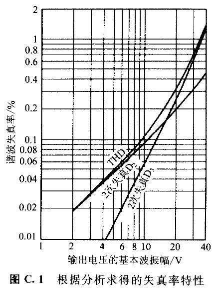
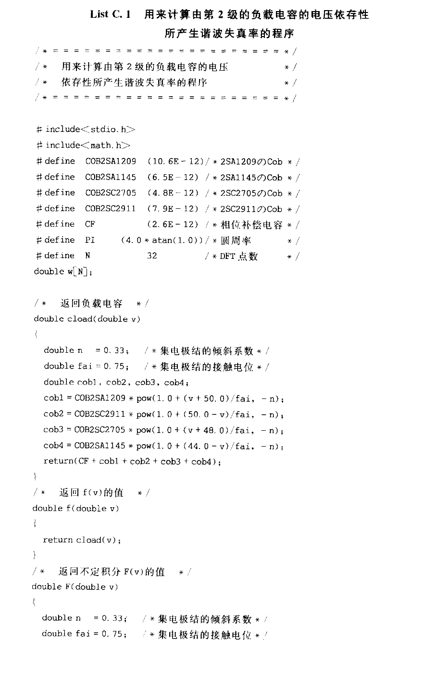
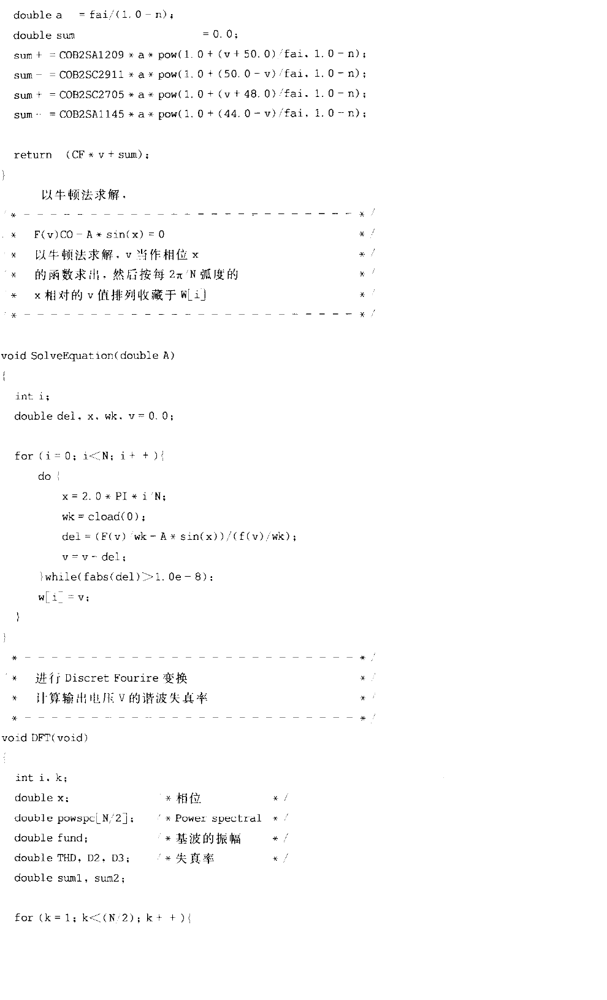
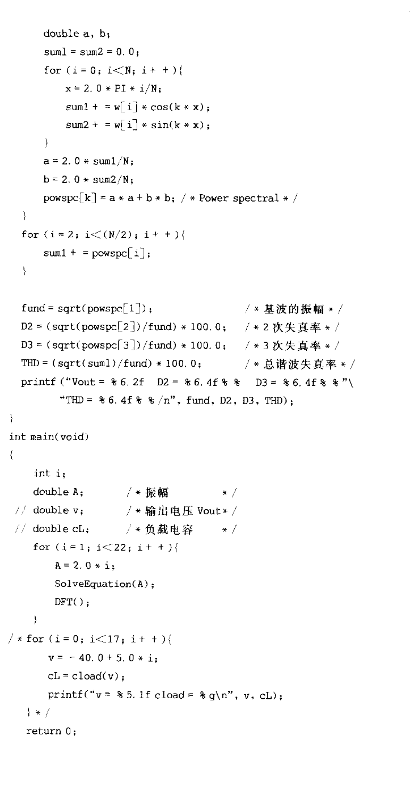

# 附录 C　对由 \\(C_{ob}\\) 的电压依存性导致的失真进行分析计算

<!-- 来源：PDF 第 146 页；原书第 132 页 -->

图 4.2 中第二级的负载电容 \\(C\\) 可由式（4.16）写成：

\\[
\begin{aligned}
C
&=C_f+\sum_{k=1}^{4}
\frac{C_{obk}(0)}
{\left(1+\dfrac{|V_{CBk}|}{0.75}\right)^{0.33}}
\end{aligned}
\tag{C.1}
\\]

其中相位补偿电容及四只晶体管的参数为：

\\[
\begin{aligned}
C_f&=2.6\ \mathrm{pF},\\\\
\text{2SA1145:}\quad C_{ob1}(0)&=6.5\ \mathrm{pF},
& |V_{CB1}|&=44-V_{\mathrm{OUT}},\\\\
\text{2SC2705:}\quad C_{ob2}(0)&=4.8\ \mathrm{pF},
& |V_{CB2}|&=48+V_{\mathrm{OUT}},\\\\
\text{2SC2911:}\quad C_{ob3}(0)&=7.9\ \mathrm{pF},
& |V_{CB3}|&=50-V_{\mathrm{OUT}},\\\\
\text{2SA1209:}\quad C_{ob4}(0)&=10.6\ \mathrm{pF},
& |V_{CB4}|&=50+V_{\mathrm{OUT}}.
\end{aligned}
\\]

因此，负载电容 \\(C\\) 是输出电压 \\(V_{\mathrm{OUT}}\\) 的函数：

\\[
C=f(V_{\mathrm{OUT}})
\tag{C.2}
\\]

非线性电容 \\(C\\) 的蓄积电荷 \\(Q\\) 与外加电压 \\(V_{\mathrm{OUT}}\\) 之间满足：

\\[
\begin{aligned}
C
&=\frac{dQ}{dV_{\mathrm{OUT}}}
=\frac{i(t)\,dt}{dV_{\mathrm{OUT}}}
\end{aligned}
\tag{C.3}
\\]

设流过 \\(C\\) 的电流为：

\\[
i(t)=I_P\cos\omega t
\tag{C.4}
\\]

由式（C.2）～（C.4）可得：

\\[
\begin{aligned}
f(V_{\mathrm{OUT}})
&=\frac{I_P\cos\omega t\,dt}{dV_{\mathrm{OUT}}}
\end{aligned}
\tag{C.5}
\\]

<!-- 来源：PDF 第 147 页；原书第 133 页 -->

式（C.5）两边乘以 \\(dV_{\mathrm{OUT}}\\) 并积分：

\\[
\begin{aligned}
\int f(V_{\mathrm{OUT}})\,dV_{\mathrm{OUT}}
&=\int I_P\cos\omega t\,dt\\
&=\frac{I_P}{\omega}\sin\omega t
\end{aligned}
\tag{C.6}
\\]

式（C.6）左边可利用式（C.1）直接求不定积分。以 \\(F(V_{\mathrm{OUT}})\\) 表示该积分：

\\[
\begin{aligned}
F(V_{\mathrm{OUT}})
&=\frac{I_P}{\omega}\sin\omega t
\end{aligned}
\tag{C.7}
\\]

若式（C.7）两边除以 \\(V_{\mathrm{OUT}}=0\\) 时的负载电容 \\(C_0\\)，则：

\\[
\begin{aligned}
\frac{F(V_{\mathrm{OUT}})}{C_0}
&=A\sin\omega t
\end{aligned}
\tag{C.8}
\\]

其中：

\\[
A=\frac{I_P}{\omega C_0}
\\]

\\(A\\) 是输出电流的单波峰振幅 \\(I_P\\) 与负载电容阻抗 \\(1/(\omega C_0)\\) 的乘积，即第二级输出电压的单波峰振幅。式（C.8）右边的相位 \\(\omega t\\)若用 \\(x\\) 替换，则可得以下的方程式：

\\[
\begin{aligned}
\frac{F(V_{\mathrm{OUT}})}{C_0}
&=A\sin x
\end{aligned}
\tag{C.9}
\\]

若已知 \\(A\\) 与 \\(x\\) 的话，式（C.9）便可求解，输出电压可当作相位 \\(x\\) 的函数 \\(V_{\mathrm{OUT}}(x)\\) 求解。该 \\(V_{\mathrm{OUT}}(x)\\) 是周期为 \\(2\pi\\) 的周期函数，所以把 \\(x_n=({2\pi n}/{N})\\) 的点列\\(x_n\\)（但 \\(n=0,1,2,\ldots,N-1\\) ）代入 \\(V_{\mathrm{OUT}}(x_n)\\) 进行计算，并进行离散傅里叶变换（Discrete Fourier Transform, DFT），则便可求得基波与谐波，从而能够计算谐波失真。



**图 C.1　根据分析求得的失真率特性**

<!-- 来源：PDF 第 148 页；原书第 134 页 -->

计算程序见 List C.1。程序中把 \\(V_{\mathrm{OUT}}\\) 记作 `v`。 \\(N\\) 是 DFT 点数。计算结果如图 C.1 所示。基波的单波峰振幅 \\(40\ \mathrm{V}\\) 的三次谐波失真率 \\(D_3\\) 为 \\(1.3\\%\\)，稍小于由式（4.17）计算所得的值 \\(1.8\\%\\)；但是，有二次谐波失真。

## List C.1　计算第二级负载电容电压依存性所产生谐波失真率的程序

```c
/*===============================*/
/* 用来计算由第2级的负载电容的电压  */
/* 依存性所产生的谐波失真率的程序   */
/*===============================*/

#include <stdio.h>
#include <math.h>

#define COB2SA1209 (10.6E-12) /* 2SA1209のCob */
#define COB2SA1145 ( 6.5E-12) /* 2SA1145のCob */
#define COB2SC2705 ( 4.8E-12) /* 2SC2705のCob */
#define COB2SC2911 ( 7.9E-12) /* 2SC2911のCob */
#define CF         ( 2.6E-12) /* 相位补偿电容 */
#define PI         (4.0*atan(1.0)) /* 圆周率 */
#define N          32              /* DFT点数 */

double w[N];

/* 返回负载电容 */
double cload(double v)
{
    double n   = 0.33; /* 集电极结的倾斜系数 */
    double fai = 0.75; /* 集电极结的接触电位 */
    double cob1, cob2, cob3, cob4;

    cob1 = COB2SA1209 * pow(1.0 + (v + 50.0) / fai, -n);
    cob2 = COB2SC2911 * pow(1.0 + (50.0 - v) / fai, -n);
    cob3 = COB2SC2705 * pow(1.0 + (v + 48.0) / fai, -n);
    cob4 = COB2SA1145 * pow(1.0 + (44.0 - v) / fai, -n);

    return CF + cob1 + cob2 + cob3 + cob4;
}

/* 返回 f(v) 的值 */
double f(double v)
{
    return cload(v);
}

/* 返回不定积分 F(v) 的值 */
double F(double v)
{
    double n   = 0.33; /* 集电极结的倾斜系数 */
    double fai = 0.75; /* 集电极结的接触电位 */
    double a   = fai / (1.0 - n);
    double sum = 0.0;

    sum += COB2SA1209 * a * pow(1.0 + (v + 50.0) / fai, 1.0 - n);
    sum -= COB2SC2911 * a * pow(1.0 + (50.0 - v) / fai, 1.0 - n);
    sum += COB2SC2705 * a * pow(1.0 + (v + 48.0) / fai, 1.0 - n);
    sum -= COB2SA1145 * a * pow(1.0 + (44.0 - v) / fai, 1.0 - n);

    return CF * v + sum;
}

/* =========================================*/
/* F(v)/C0 - A*sin(x) = 0                   */
/* 以牛顿法求解, v当作相位x的函数求出，        */
/* 然后按照2pi/N弧度的x相对的v值排列收藏于W[i] */
/* =========================================*/

void SolveEquation(double A)
{
    int i;
    double del, x, wk, v = 0.0;

    for (i = 0; i < N; i++) {
        do {
            x = 2.0 * PI * i / N;
            wk = cload(0);
            del = (F(v) / wk - A * sin(x)) / (f(v) / wk);
            v = v - del;
        } while (fabs(del) >= 1.0e-8);
        w[i] = v;
    }
}

/* 进行 DFT，计算输出电压 v 的谐波失真率 */
void DFT(void)
{
    int i, k;
    double x;             /* 相位            */
    double powspc[N / 2]; /* Power Spectral */
    double fund;          /* 基波的振幅      */
    double THD, D2, D3;   /* 失真率          */
    double sum1, sum2;

    for (k = 1; k < (N / 2); k++) {
        double a, b;
        sum1 = sum2 = 0.0;
        for (i = 0; i < N; i++) {
            x = 2.0 * PI * i / N;
            sum1 += w[i] * cos(k * x);
            sum2 += w[i] * sin(k * x);
        }
        a = 2.0 * sum1 / N;
        b = 2.0 * sum2 / N;
        powspc[k] = a * a + b * b;
    }

    sum1 = 0.0;
    for (i = 2; i < (N / 2); i++) {
        sum1 += powspc[i];
    }

    fund = sqrt(powspc[1]);
    D2 = (sqrt(powspc[2]) / fund) * 100.0;
    D3 = (sqrt(powspc[3]) / fund) * 100.0;
    THD = (sqrt(sum1) / fund) * 100.0;

    printf("Vout = %6.2f  D2 = %6.4f%%  D3 = %6.4f%% "
           "THD = %6.4f%%\n", fund, D2, D3, THD);
}

int main(void)
{
    int i;
    double A;  /* 振幅 */
    // double v;  /* 输出电压 Vout */
    // double cL; /* 负载电容 */

    for (i = 1; i < 22; i++) {
        A = 2.0 * i;
        SolveEquation(A);
        DFT();
    }

    /*
    for (i = 0; i < 17; i++) {
        v = -40.0 + 5.0 * i;
        cL = cload(v);
        printf("v = %5.1f cload = %g\n", v, cL);
    }
    */
    return 0;
}
```

<!---->

<!--**List C.1（第 1/3 页）**-->

<!-- 来源：PDF 第 149 页；原书第 135 页 -->

<!---->

<!--**List C.1（第 2/3 页）**-->

<!-- 来源：PDF 第 150 页；原书第 136 页 -->

<!---->

<!--**List C.1（第 3/3 页）**-->
