# 第 4 章　基于晶体管优于 IC 的运算放大器设计

<!-- 来源：PDF 第 113 页；原书第 99 页 -->

现今仍有人不赞同用分立半导体设计运算放大器。但是，完全依赖运算放大器 IC 的电路设计在性能上存在界限，仍是不争的事实。

## 4.1　为何必须用单个半导体放大器

### 4.1.1　运算放大器集成电路固有的弱点

运算放大器 IC 种类很多，通常不会发生“没有可用运算放大器”的问题。即便如此，运算放大器 IC 仍有下列弱点。

▶ 高频特性与耐压难以兼顾

最大额定电源电压为 \\(\pm18\ \mathrm{V}\\) 的一般运算放大器 IC，其内部 NPN 晶体管的特征频率 \\(f_T\\) 约为 \\(500\ \mathrm{MHz}\\)。若要进一步改善高频特性，就必须像第 3 章所述那样缩短渡越时间（Transit Time）\\(\tau_F\\)。

\\(\tau_F\\) 与第 3 章附录 A 图 A.5 中基区宽度 \\(W\\) 的平方成正比：

\\[
\tau_F=\frac{W^2}{2D}
\tag{4.1}
\\]

其中 \\(D\\) 是基区少数载流子的扩散常数。

为了缩短 \\(\tau_F\\)，必须减小基区宽度 \\(W\\)。但是，当 \\(W\\) 较小时，较高的 \\(V_{CE}\\) 会扩大基极—集电极结的耗尽层，使有效基区宽度趋近于零，可能产生集电极与发射极导通的穿通（Punch-through）现象。因此高频运算放大器通常必须降低电源电压。

▶ PNP 晶体管的性能较低

在同一 IC 芯片上制作与 NPN 晶体管性能相当的纵向 PNP 晶体管，虽然已经可以实现，但制造步骤较多、成本较高。

<!-- 来源：PDF 第 114 页；原书第 100 页 -->

因此，普通双极工艺制造的运算放大器通常采用横向 PNP（Lateral PNP）或衬底 PNP（Substrate PNP）。这类 PNP 晶体管存在下列缺点：

- 电流放大倍数小；
- Early 电压低；
- 特征频率 \\(f_T\\) 低。

▶ 难以分别优化所有晶体管

晶体管特性依赖杂质浓度，但单片电路中各晶体管的杂质浓度难以分别控制。因此，很难把 IC 内部所有晶体管都优化到各自最适合的状态。

### 4.1.2　基于分立半导体晶体管的运算放大器电路

受制造条件限制，运算放大器 IC 很难在不增加成本的前提下，同时改善噪声、精度、转换速率、增益带宽积、输出电压和输出电流。

高速与低功耗通常难以兼顾，直流特性与高频特性也不容易同时优化。需要超高性能时，至今仍常采用分立半导体电路。当电源电压超过 \\(\pm25\ \mathrm{V}\\)，或输出电流超过数百 mA 时，分立电路在成本上也可能更有优势。

本章制作一台同时追求高速、宽频带、高输出电压和低失真的分立放大器。目标规格见表 4.1。设计按以下顺序进行：

1. 决定电路架构；
2. 充实电路细节；
3. 进行电路模拟。

## 4.2　基于晶体管的运算放大器电路概述

<!-- 来源：PDF 第 115 页；原书第 101 页 -->

<!-- 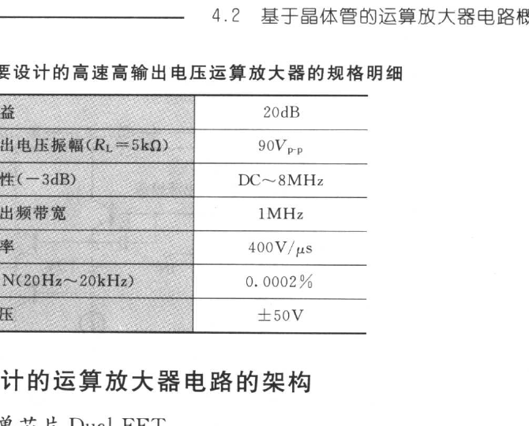 -->

| 项目 | 规格 |
|---|---|
| 闭环增益 | 20 dB |
| 最大输出电压振幅（RL = 5 kΩ） | 90 Vp-p |
| 频率特性（−3 dB） | DC～8 MHz |
| 最大输出频带宽度 | 1 MHz |
| 转换速率 | 400 V/μs |
| THD+N（20 Hz～20 kHz） | 0.0002% |
| 电源电压 | ±50 V |

**表 4.1　所设计高速高输出电压运算放大器的规格**

主要目标包括：闭环增益 \\(20\ \mathrm{dB}\\)、负载 \\(5\ \mathrm{k\Omega}\\) 时最大输出电压 \\(90\ \mathrm{V_{P-P}}\\)、\\(-3\ \mathrm{dB}\\) 带宽 DC～\\(8\ \mathrm{MHz}\\)、最大输出带宽 \\(1\ \mathrm{MHz}\\)、转换速率 \\(400\ \mathrm{V/\mu s}\\)、\\(20\ \mathrm{Hz}\\)～\\(20\ \mathrm{kHz}\\) 的 THD+N 为 \\(0.0002\%\\)，以及 \\(\pm50\ \mathrm{V}\\) 电源。

### 4.2.1　所要设计的运算放大器电路架构

▶ 初级采用单芯片双 FET

首先要在双极性晶体管和 FET 之间选择初级器件。为了得到 \\(400\ \mathrm{V/\mu s}\\) 的转换速率，初级差动电路必须流过数 mA 的共源电流。若使用双极性晶体管，会产生数十 \\(\mu\mathrm{A}\\) 的基极电流，使输入偏置电流增大；FET 输入则没有这个问题。

FET 的转移特性误差及芯片温差会造成输入失调电压，因此采用在同一半导体基板上形成的一对 FET，即单芯片双 FET（One-chip Dual FET）。可选器件见表 4.2。本设计使用 \\(\mu\mathrm{PA63H}\\)，也可用 2SK150(BL) 代替；后者的 \\(g_m\\) 较大，实际使用时宜适当增大相位补偿电容。

<!-- 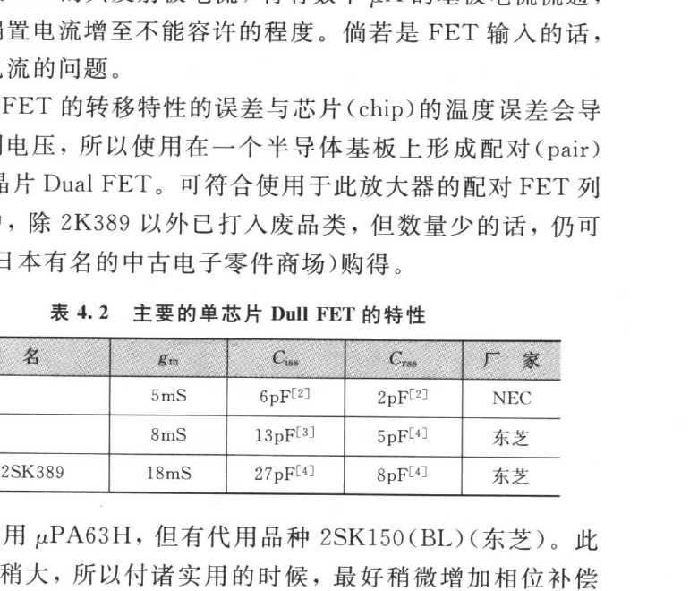 -->

| 型号 | gm | Ciss | Crss | 厂家 |
|---|---:|---:|---:|---|
| μPA63H | 5 mS | 6 pF[2] | 2 pF[2] | NEC |
| 2SK150 | 8 mS | 13 pF[3] | 5 pF[4] | 东芝 |
| 2SK270/2SK389 | 18 mS | 27 pF[4] | 8 pF[4] | 东芝 |

**表 4.2　主要单芯片双 FET 的特性**

### 4.2.2　采用 Folded Cascode 电路

多数运算放大器的第二级采用图 4.1 所示发射极接地电路，本设计则采用图 4.2 所示基极接地的 Folded Cascode 电路，以减小相位旋转。

<!-- 来源：PDF 第 116 页；原书第 102 页 -->

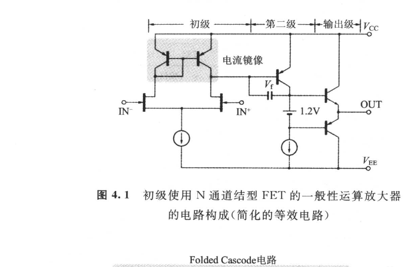

**图 4.1　初级采用 N 通道结型 FET 的一般运算放大器架构**

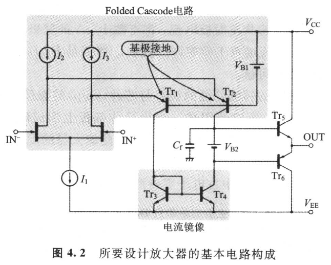

**图 4.2　所设计放大器的基本电路架构**

发射极接地电路与基极接地电路纵向连接，形成图 4.3(a) 的 Cascode 电路。Cascode 一词由 Cascade（纵向连接）与 Triode（三极真空管）组合而来。

Cascode 电路不仅米勒效应小，而且保留三极器件低噪声的特点。真空管被 BJT 或 FET 取代后，半导体 Cascode 电路同样具有频率特性好、相位旋转少的优点。

图 4.3(a) 使用同极性晶体管纵向连接；图 4.3(b) 使用异极性的 NPN、PNP 晶体管，或 N 沟道 FET 与 PNP 晶体管。由于信号流向折返，异极性连接称为 Folded Cascode。

<!-- 来源：PDF 第 117 页；原书第 103 页 -->

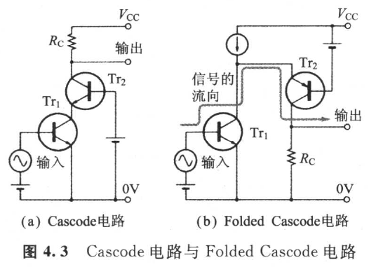

**图 4.3　Cascode 电路与 Folded Cascode 电路**

Folded Cascode 的基础是基极接地电路，其工作原理已在第 3 章附录 B 中说明。

## 4.3　设计初级 FET 差动电路须知

### 4.3.1　结型 FET 的基本特性

FET 是漏极电流 \\(I_D\\) 受栅极—源极间电压 \\(V_{GS}\\) 控制的器件。理想 N 沟道结型 FET 的转移静特性与输出静特性见图 4.4。

FET 输出特性曲线通过原点。在原点附近，\\(I_D\\) 大致与漏极—源极间电压 \\(V_{DS}\\) 成正比，沟道可视作电阻。随着 \\(V_{DS}\\) 上升，\\(I_D\\) 的增加趋缓；当

\\[
V_{DS}\ge V_{GS}-V_P
\\]

时，理想 FET 的 \\(I_D-V_{DS}\\) 曲线趋于水平。这一范围称为饱和区。FET 的“饱和区”与 BJT 的饱和状态含义不同，反而相当于 BJT 的有源区。

满足

\\[
0<V_{DS}<V_{GS}-V_P
\\]

的范围称为线性区或三极管区。

<!-- 来源：PDF 第 118 页；原书第 104 页 -->

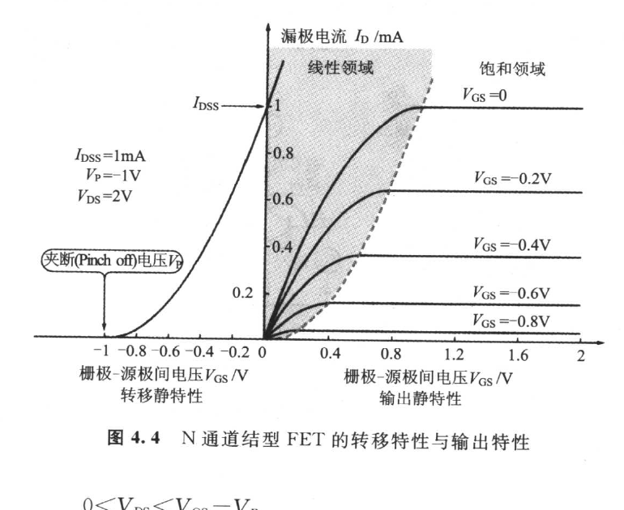

**图 4.4　N 沟道结型 FET 的转移特性与输出特性**

▶ 饱和区的工作

饱和区的漏极电流近似为：

\\[
I_D=I_{DSS}\left(1-\frac{V_{GS}}{V_P}\right)^2
\tag{4.2}
\\]

其中，\\(I_{DSS}\\) 是 \\(V_{GS}=0\\) 时的漏极电流，\\(V_P\\) 是夹断（Pinch-off）电压，即 \\(I_D=0\\) 时的栅极—源极间电压。

▶ 线性区的工作

线性区的漏极电流近似为：

\\[
\begin{aligned}
I_D
&=\frac{I_{DSS}}{V_P^2}
\left[2(V_{GS}-V_P)-V_{DS}\right]V_{DS}
\end{aligned}
\tag{4.3}
\\]

▶ \\(\pi\\) 型模型

FET 在饱和区的小信号等效电路可用图 4.5 的 \\(\pi\\) 型模型表示。对式（4.2）关于 \\(V_{GS}\\) 微分：

\\[
\begin{aligned}
g_m
&=\frac{dI_D}{dV_{GS}}\\
&=2\left(\frac{I_{DSS}}{-V_P}\right)
\left(1-\frac{V_{GS}}{V_P}\right)
\end{aligned}
\tag{4.4}
\\]

结合式（4.2）可得：

\\[
\begin{aligned}
g_m
&=\left(\frac{2\sqrt{I_{DSS}}}{-V_P}\right)\sqrt{I_D}
\end{aligned}
\tag{4.5}
\\]

可见 FET 的 \\(g_m\\) 与漏极电流的平方根成正比。

<!-- 来源：PDF 第 119 页；原书第 105 页 -->

### 4.3.2　Cascode 电路的电压增益与频率特性

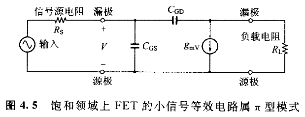

**图 4.5　饱和区 FET 的小信号 \\(\pi\\) 型等效电路**

FET 与双极性晶体管组成的 Cascode 电路，可由图 4.5 与第 3 章附录 B 的基极接地等效电路组合成图 4.6。

图 4.6(a) 中，\\(C_{GD}\\) 的米勒效应产生的等效输入电容为：

\\[
\begin{aligned}
C_{\mathrm{in}}
&=C_{GD}(1+A)\\
&=C_{GD}(1+g_mr_e)
\end{aligned}
\tag{4.6}
\\]

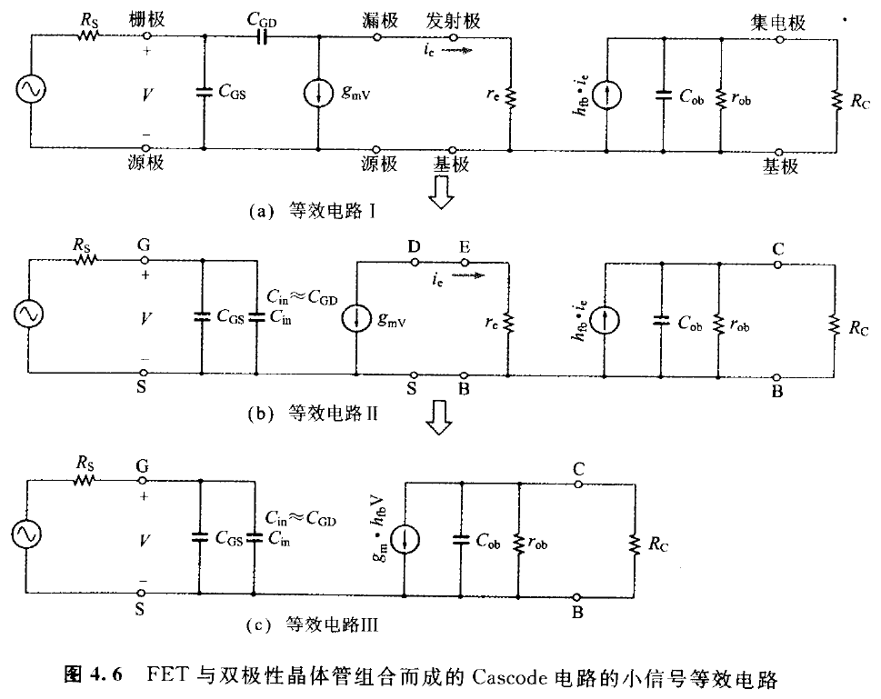

**图 4.6　FET 与双极性晶体管组成的 Cascode 小信号等效电路**

从表 4.2 中选用 \\(\mu\mathrm{PA63H}\\)，并令漏极电流为 \\(2\ \mathrm{mA}\\)。由图 4.7 可读得 \\(I_{DSS}=6\ \mathrm{mA}\\)、\\(V_P=-1.2\ \mathrm{V}\\)。

<!-- 来源：PDF 第 120 页；原书第 106 页 -->

代入式（4.5）：

\\[
\begin{aligned}
g_m
&=\left(\frac{2\sqrt{6\times10^{-3}}}{1.2}\right)
\sqrt{2\times10^{-3}}\\
&=5.77\ \mathrm{mS}
\end{aligned}
\tag{4.7}
\\]

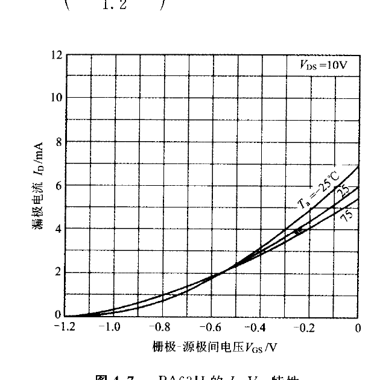

**图 4.7　\\(\mu\mathrm{PA63H}\\) 的 \\(I_D-V_{GS}\\) 特性**

由第 3 章附录 B 式（B.2），基极接地输入电阻 \\(r_e\\) 为：

\\[
\begin{aligned}
r_e
&=\frac{26}{1000\times2\times10^{-3}}\\
&=13\ \Omega
\end{aligned}
\tag{4.8}
\\]

将 \\(g_m=5.77\ \mathrm{mS}\\)、\\(r_e=13\ \Omega\\) 代入式（4.6）：

\\[
\begin{aligned}
C_{\mathrm{in}}
&=C_{GD}(1+g_mr_e)\\
&=1.075C_{GD}\\
&\approx C_{GD}
\end{aligned}
\tag{4.9}
\\]

可见米勒效应小到可以忽略。因此图 4.6(a) 可简化为图 4.6(b)，再把从属电流源合并为图 4.6(c) 的等效电路。Folded Cascode 也可使用同一小信号等效电路分析。

### 4.3.3　初级 FET 的选择

转换速率由共源电流 \\(I_1\\) 与相位补偿电容 \\(C_f\\) 决定：

\\[
\mathrm{SR}=\frac{I_1}{C_f}
\tag{4.10}
\\]

为了满足 \\(\mathrm{SR}=400\ \mathrm{V/\mu s}\\)，规定

\\[
I_1=4\ \mathrm{mA},\qquad C_f=10\ \mathrm{pF}.
\\]

由于使用差动结构，每只 FET 的漏极电流自动成为 \\(2\ \mathrm{mA}\\)。

<!-- 来源：PDF 第 121 页；原书第 107 页 -->

当信号源电阻 \\(R_S=0\\)，且晶体管输出电容远小于相位补偿电容 \\(C_f\\) 时，高频开环增益的绝对值为：

\\[
|A|=g_m\left(\frac{1}{2\pi fC_f}\right)
\tag{4.11}
\\]

根据目标规格，在 \\(8\ \mathrm{MHz}\\) 处开环增益必须约为 10。代入 \\(A=10\\)、\\(f=8\times10^6\ \mathrm{Hz}\\)、\\(C_f=10\times10^{-12}\ \mathrm{F}\\)，得 \\(g_m=5.02\ \mathrm{mS}\\)，因此选择 \\(\mu\mathrm{PA63H}\\)。其他候选 FET 的 \\(g_m\\) 较大；若把 \\(g_m\\) 降到约 \\(5\ \mathrm{mS}\\)，必须降低 \\(I_D\\)，同时也会降低转换速率。

### 4.3.4　第二级晶体管 \\(Tr_1\\)、\\(Tr_2\\) 与输出级 \\(Tr_5\\)、\\(Tr_6\\)

图 4.2 第二级晶体管的集电极电流 \\(I_C\\) 宜为初级 FET 漏极电流的 2～3 倍，因此取 \\(5\ \mathrm{mA}\\)。恒流电路电流为：

\\[
I_2=I_3=I_D+I_C=2+5=7\ \mathrm{mA}.
\\]

取正电源 \\(V_{CC}=50\ \mathrm{V}\\)、第二级偏置 \\(V_{B1}=6\ \mathrm{V}\\)，则 \\(Tr_1\\)、\\(Tr_2\\) 的平均功耗为：

\\[
P_C=V_{CE}I_C=(50-6)\times5\ \mathrm{mA}=220\ \mathrm{mW}.
\\]

瞬时最大功耗可能达到约 \\(440\ \mathrm{mW}\\)，因此应使用 \\(P_C=800\ \mathrm{mW}\\) 级、\\(V_{CEO}\ge120\ \mathrm{V}\\) 的晶体管。第二级选用低 \\(C_{ob}\\)、高耐压的 2SA1145，电流镜采用其互补器件 2SC2705。输出级采用低 \\(C_{ob}\\) 的 2SA1209/2SC2911，并按 A 类工作要求选用 \\(P_C\ge5\ \mathrm{W}\\) 的器件。

<!-- 来源：PDF 第 122 页；原书第 108 页 -->

<!-- 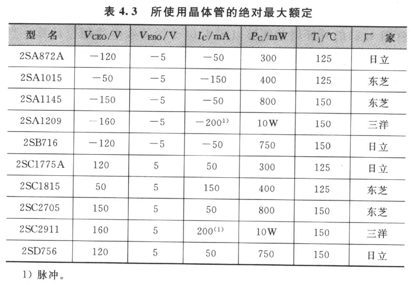 -->

| 型号 | VCEO/V | VEBO/V | IC/mA | PC/mW | Tj/℃ | 厂家 |
|---|---:|---:|---:|---:|---:|---|
| 2SA872A | −120 | −5 | −50 | 300 | 125 | 日立 |
| 2SA1015 | −50 | −5 | −150 | 400 | 125 | 东芝 |
| 2SA1145 | −150 | −5 | −50 | 800 | 150 | 东芝 |
| 2SA1209 | −160 | −5 | −200[1] | 10 W | 150 | 三洋 |
| 2SB716 | −120 | −5 | −50 | 750 | 150 | 日立 |
| 2SC1775A | 120 | 5 | 50 | 300 | 125 | 日立 |
| 2SC1815 | 50 | 5 | 150 | 400 | 125 | 东芝 |
| 2SC2705 | 150 | 5 | 50 | 800 | 150 | 东芝 |
| 2SC2911 | 160 | 5 | 200[1] | 10 W | 150 | 三洋 |
| 2SD756 | 120 | 5 | 50 | 750 | 150 | 日立 |

[1] 脉冲。

**表 4.3　所使用晶体管的绝对最大额定值**

## 4.4　应对基本电路充实内容

图 4.2 只是基本架构。为了得到可实际工作的放大器，还需要加入输入级保护与自举、失真抵消、相位补偿和输出级设计等内容。

### 4.4.1　初级应做成 Cascode Bootstrap

N 沟道结型 FET 的栅极—沟道间是 PN 结，存在流向栅极的漏电流。漏极—源极间电压升高时，栅极漏电流会急剧增加。

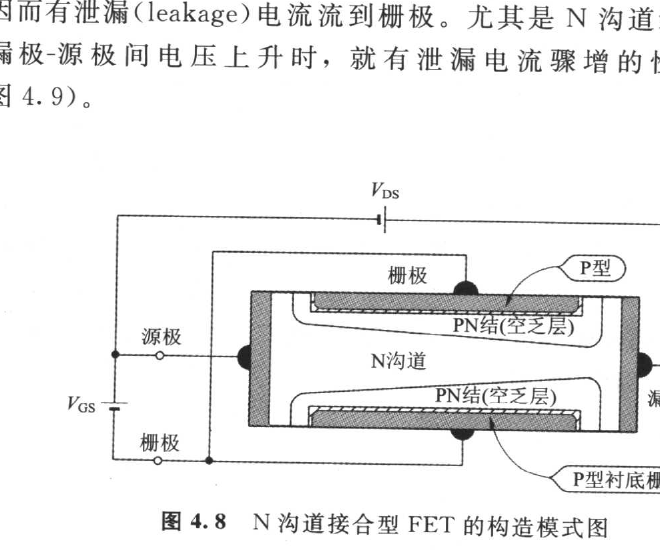

**图 4.8　N 沟道结型 FET 的构造示意图**

<!-- 来源：PDF 第 123 页；原书第 109 页 -->

图 4.9 给出 2SK389 栅极漏电流随 \\(V_{DS}\\) 的变化。为了抑制漏电流，可采用图 4.10 的 Cascode 电路，使输入 FET 的 \\(V_{DS}\\) 保持较低；偏置 \\(V_B\\) 只需取约 \\(5\\)～\\(10\ \mathrm{V}\\)。

**图 4.9　2SK389 栅极漏电流相对漏极—源极间电压的特性**

**图 4.10　差动放大器与基极接地晶体管组成的 Cascode 电路**

但是，正向放大器的初级若直接采用这种 Cascode，失真会恶化。原因是正向放大器的输入端承受较大的同相信号。本放大器最大输出为 \\(30\ \mathrm{V_{RMS}}\\)，闭环增益为 10，因此最大输出时两只 FET 栅极上约有 \\(3\ \mathrm{V_{RMS}}\\) 的同相信号。

<!-- 来源：PDF 第 124 页；原书第 110 页 -->

例如取 \\(V_B=10\ \mathrm{V}\\)、\\(V_{GS}=-0.5\ \mathrm{V}\\)，最大输出时 FET 的 \\(V_{DS}\\) 会在约 \\(4.66\\)～\\(13.14\ \mathrm{V}\\) 之间大幅变化。

**图 4.11　最大输出时 FET 的 \\(V_{DS}\\) 变化**

理想 FET 在饱和区的输出曲线应完全水平，\\(V_{DS}\\) 变化不会引起 \\(I_D\\) 变化；实际 FET 即使处于饱和区，漏极电流仍会随 \\(V_{DS}\\) 改变，如图 4.12。

**图 4.12　\\(\mu\mathrm{PA63H}\\) 的输出静特性**

若配对 FET 的特性完全相同，两个漏极电流的变化可互相抵消。共同源极节点满足：

<!-- 来源：PDF 第 125 页；原书第 111 页 -->

\\[
I_{D1}+I_{D2}=I_1=\text{常数}
\tag{4.12}
\\]

由电路对称性还应有：

\\[
I_{D1}=I_{D2}
\tag{4.13}
\\]

于是：

\\[
I_{D1}=I_{D2}=\frac{I_1}{2}=\text{常数}
\tag{4.14}
\\]

然而即使是单芯片配对器件，两只 FET 的特性也不会完全相同。式（4.12）仍成立，但式（4.13）不再严格成立。\\(V_{DS}\\) 变化时，可能出现一边 \\(I_D\\) 增加 \\(1\ \mu\mathrm{A}\\)、另一边减少 \\(1\ \mu\mathrm{A}\\) 的差动成分。

这种不平衡等效为约 \\(2\ \mu\mathrm{A}/g_m\\) 的输入失调电压，并会随信号非线性变化，形成失真。负反馈无法消除这种输入级失真。

解决方法是图 4.13 的 Cascode Bootstrap：把偏置 \\(V_B\\) 的一端连接到差动电路的共同源极，使 Cascode 晶体管基极电位随同相信号移动，从而抑制 \\(V_{DS}\\) 的变化。

**图 4.13　利用 Cascode Bootstrap 抑制 \\(V_{DS}\\) 变化**

FET 的 \\(V_{DS}\\) 为：

\\[
V_{DS}=V_B-V_{BE}
\tag{4.15}
\\]

即使 \\(I_D\\) 变化，\\(V_{BE}\\) 的变化也只在热电压 \\(V_T\approx26\ \mathrm{mV}\\) 的量级，因此 \\(V_{DS}\\) 的变化被限制到可忽略的范围，相关失真可降到约 \\(0.0001\%\\) 以下。

实际 Cascode Bootstrap 有多种形式，本设计采用图 4.14。\\(Q_3\\) 是发射极跟随器；红色 LED 代替稳压二极管，提供约 \\(1.6\ \mathrm{V}\\) 的正向压降；\\(Q_4\\)、\\(Q_5\\)、\\(Q_6\\) 构成图 4.2 所需的恒流源。

<!-- 来源：PDF 第 126 页；原书第 112 页 -->

**图 4.14　初级的实际电路**

### 4.4.2　计算第二级输出电压的失真率

实际电路中，第二级晶体管与输出晶体管的输出电容 \\(C_{ob}\\) 会并联在相位补偿电容 \\(C_f\\) 上。只要从总目标电容中扣除这些 \\(C_{ob}\\)，频率特性和转换速率仍可满足先前计算；问题在于 \\(C_{ob}\\) 会随集电极—基极反向电压 \\(V_{CB}\\) 变化。

图 4.15 给出 2SA1145、2SC2705、2SC2911、2SA1209 的 \\(C_{ob}-V_{CB}\\) 特性。输出电压变化时，第二级负载电容也变化，从而产生非线性失真。

无信号、输出直流电压为零时，从图 4.15 读取四只晶体管的 \\(C_{ob}\\)，总和约为 \\(7.4\ \mathrm{pF}\\)。目标负载电容为 \\(10\ \mathrm{pF}\\)，因此相位补偿电容修正为：

\\[
C_f=10-7.4=2.6\ \mathrm{pF}.
\\]

<!-- 来源：PDF 第 127 页；原书第 113 页 -->

**图 4.15　所用晶体管的输出电容相对集电极—基极电压的特性**

令 \\(V_{\mathrm{OUT}}\\) 为瞬时输出电压，则四只晶体管的 \\(|V_{CB}|\\) 分别约为：

\\[
\begin{aligned}
\text{2SA1145:}\quad |V_{CB}|&=44-V_{\mathrm{OUT}},\\
\text{2SC2705:}\quad |V_{CB}|&=48+V_{\mathrm{OUT}},\\
\text{2SC2911:}\quad |V_{CB}|&=50-V_{\mathrm{OUT}},\\
\text{2SA1209:}\quad |V_{CB}|&=50+V_{\mathrm{OUT}}.
\end{aligned}
\\]

由图 4.15 逐点读取并加上 \\(C_f=2.6\ \mathrm{pF}\\)，得到图 4.16 曲线 (a)。曲线 (b) 则使用以下结电容近似式计算。

<!-- 来源：PDF 第 128 页；原书第 114 页 -->

**图 4.16　第二级负载电容相对输出电压的特性**

\\[
\begin{aligned}
C_{ob}
&=\frac{C_{ob}(0)}
{\left(1+\dfrac{|V_{CB}|}{\phi}\right)^n}
\end{aligned}
\tag{4.16}
\\]

其中 \\(C_{ob}(0)\\) 是 \\(V_{CB}=0\\) 时的输出电容，\\(\phi=0.75\ \mathrm{V}\\) 为基极—集电极结接触电位，\\(n=0.33\\) 为结的渐变系数。绝对值使同一公式可同时用于 NPN 与 PNP 晶体管。

从特性曲线外推：

\\[
\begin{aligned}
\text{2SA1145:}\quad C_{ob}(0)&=6.5\ \mathrm{pF},\\
\text{2SC2705:}\quad C_{ob}(0)&=4.8\ \mathrm{pF},\\
\text{2SC2911:}\quad C_{ob}(0)&=7.9\ \mathrm{pF},\\
\text{2SA1209:}\quad C_{ob}(0)&=10.6\ \mathrm{pF}.
\end{aligned}
\\]

图 4.16 的曲线近似左右对称，因此主要产生奇次谐波，尤其是第三次谐波。其失真率近似为：

\\[
D_3\approx\frac{1}{12}\frac{\Delta C}{C}\times100\%
\tag{4.17}
\\]

其中，\\(C\\) 是 \\(V_{\mathrm{OUT}}=0\\) 时的负载电容（\\(10\ \mathrm{pF}\\)），\\(\Delta C\\) 是输出峰值处的负载电容变化量。若 \\(V_{\mathrm{OUT}}=\pm40\ \mathrm{V}\\)，图 4.16 给出 \\(\Delta C=2.2\ \mathrm{pF}\\)，因此 \\(D_3\approx1.8\%\\)。

<!-- 来源：PDF 第 129 页；原书第 115 页 -->

实际电路施加负反馈，失真会按反馈量降低。假设输入为 \\(20\ \mathrm{kHz}\\) 正弦波，第三次谐波为 \\(60\ \mathrm{kHz}\\)，闭环截止频率为 \\(8\ \mathrm{MHz}\\)，则在 \\(60\ \mathrm{kHz}\\) 的反馈量约为：

\\[
\frac{8\ \mathrm{MHz}}{60\ \mathrm{kHz}}\approx133.
\\]

反馈后的失真率约为：

\\[
\frac{1.8\%}{133}\approx0.0135\%.
\\]

这一数值仍比 \\(0.0002\%\\) 的目标高约 70 倍。

**图 4.17　反馈量的求法**

### 4.4.3　利用 \\(C_{ob}\\) 消除电路使失真骤减

为进一步降低失真，首先抵消第二级 2SA1145 的 \\(C_{ob}\\)。图 4.18(a) 表示工作原理：检测流经 \\(C_{ob}\\) 的电流，再用并联的受控电流源把同样的电流送回，使电流只在闭合环路内循环，不流向输出级。

<!-- 来源：PDF 第 130 页；原书第 116 页 -->

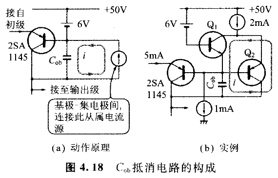

**图 4.18　\\(C_{ob}\\) 抵消电路的构成**

图 4.18(b) 用 \\(Q_1\\) 检出交流电流，并由 PNP 晶体管 \\(Q_2\\) 作为受控电流源，使电流在 \\(Q_1\\)、\\(Q_2\\) 与 \\(C_{ob}\\) 内循环。不过这种实现需要额外增加两只晶体管。

图 4.19 只增加一只晶体管即可抵消 \\(C_{ob}\\)。把检测晶体管的集电极改接到 2SA1145 的发射极后，2SA1145 同时承担基极接地放大和抵消自身 \\(C_{ob}\\) 的受控电流源两项功能。

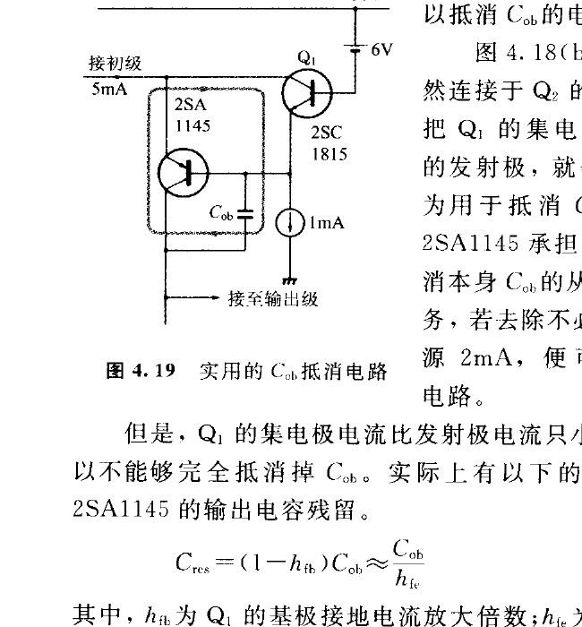

**图 4.19　实用的 \\(C_{ob}\\) 抵消电路**

由于检测晶体管的集电极电流比发射极电流少一个基极电流，抵消并非完全。残留输出电容为：

\\[
\begin{aligned}
C_{\mathrm{res}}
&=(1-h_{fb})C_{ob}\\
&\approx\frac{C_{ob}}{h_{fe}}
\end{aligned}
\tag{4.18}
\\]

其中 \\(h_{fb}\\) 是基极接地电流放大倍数，\\(h_{fe}\\) 是发射极接地电流放大倍数。一般 \\(h_{fe}\\) 为 100～1000，所以残留电容仅为原 \\(C_{ob}\\) 的约 \\(0.1\%\\)～\\(1\%\\)。

### 4.4.4　第二级的实际电路设计

本放大器第二级采用图 4.19 的抵消方法，实际电路见图 4.20。\\(Q_{11}\\)、\\(Q_{12}\\) 构成电流镜，\\(Q_{12}\\)、\\(Q_{14}\\) 构成 Cascode，\\(Q_{13}\\) 抵消 \\(Q_{14}\\) 的 \\(C_{ob}\\)。

<!-- 来源：PDF 第 131 页；原书第 117 页 -->

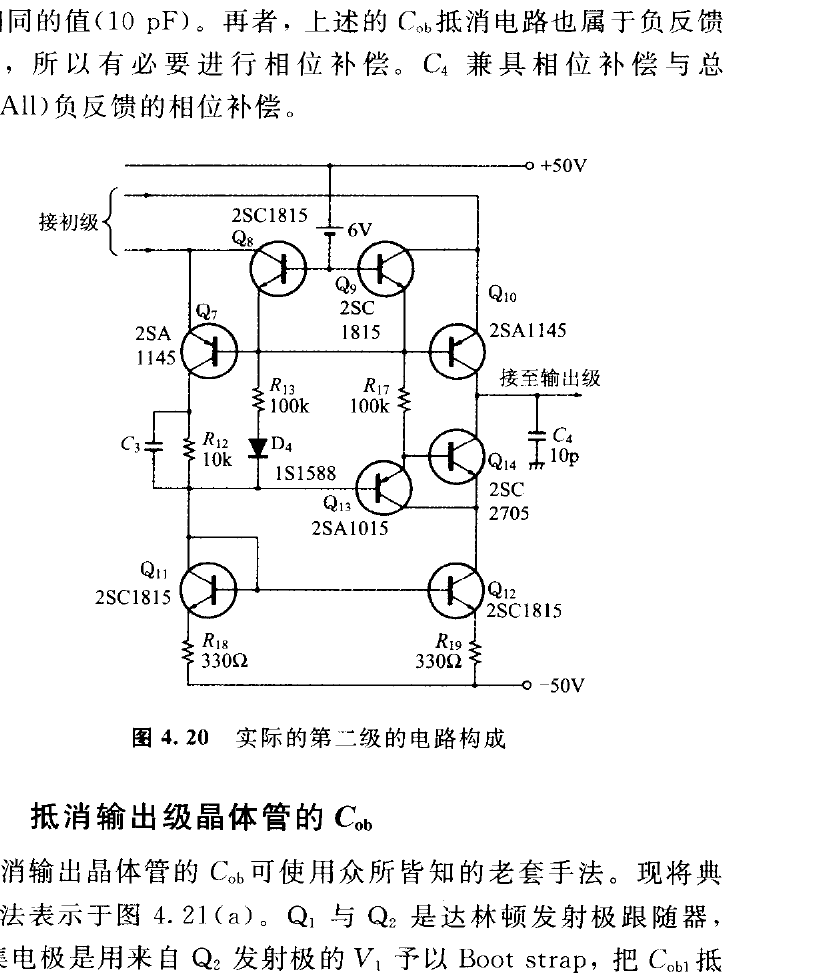

**图 4.20　实际第二级的电路构成**

\\(D_4\\) 用来使有关晶体管的直流发射极电流接近，但实际误差主要受电阻影响，因此也可省略。电阻 \\(R_{12}\\) 用来使两个关键晶体管的直流 \\(V_{CB}\\) 接近，避免其中一只功耗过大。由于 \\(R_{12}\\) 会影响高频特性，加入 \\(C_3\\) 使高频信号旁路该电阻；\\(C_3\\) 的值由后续模拟确定。

\\(C_f\\) 是相位补偿电容。第二级和输出晶体管的 \\(C_{ob}\\) 均已抵消，因此仍取基本电路计算所得的 \\(10\ \mathrm{pF}\\)。抵消电路本身也属于局部负反馈，必须进行相位补偿；\\(C_4\\) 同时承担局部抵消环路和总负反馈的相位补偿。

### 4.4.5　抵消输出级晶体管的 \\(C_{ob}\\)

图 4.21(a) 是典型的 \\(C_{ob}\\) 抵消发射极跟随器。\\(Q_1\\)、\\(Q_2\\) 构成达林顿连接，\\(Q_1\\) 的集电极由 \\(Q_2\\) 发射极信号自举，使 \\(C_{ob1}\\) 两端交流电压显著减小。

<!-- 来源：PDF 第 132 页；原书第 118 页 -->

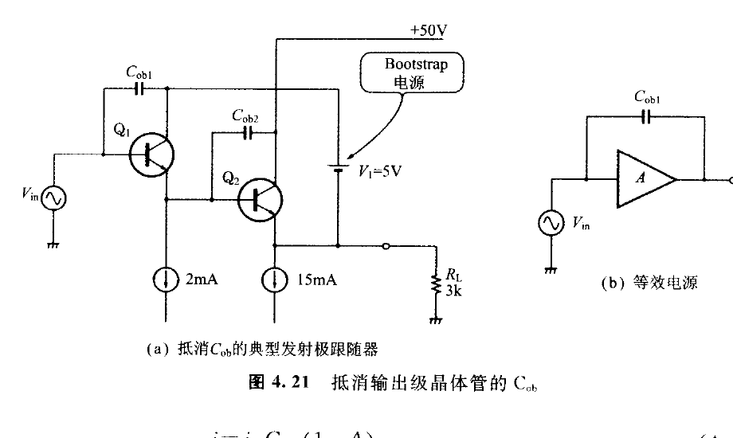

**图 4.21　抵消输出级晶体管 \\(C_{ob}\\) 的典型方法**

由图 4.21(b) 的等效电路，流经 \\(C_{ob1}\\) 的电流为：

\\[
i=j\omega C_{ob1}(1-A)v_{\mathrm{in}}
\tag{4.19}
\\]

因此从信号源看到的等效输入电容为 \\((1-A)C_{ob1}\\)。若 \\(R_L\\) 表示负载，输出级电压增益近似为：

\\[
\begin{aligned}
A
&\approx\frac{g_{m2}R_L}{1+g_{m2}R_L}\\
&\approx1-\frac{1}{g_{m2}R_L}
\end{aligned}
\tag{4.20}
\\]

于是：

\\[
\begin{aligned}
C_{\mathrm{ineq}}
&=(1-A)C_{ob1}\\
&=\frac{C_{ob1}}{g_{m2}R_L}
\end{aligned}
\tag{4.21}
\\]

当 \\(R_L=3\ \mathrm{k\Omega}\\)、\\(Q_2\\) 集电极电流为 \\(20\ \mathrm{mA}\\) 时，

\\[
\begin{aligned}
g_{m2}R_L
&\approx40I_CR_L\\
&=40\times20\times10^{-3}\times3\times10^3\\
&=2400
\end{aligned}
\\]

因此 \\(C_{ob1}\\) 的影响约减小到 \\(1/2400\\)。考虑 \\(C_{ob2}\\) 后，更准确的等效输入电容为：

\\[
\begin{aligned}
C_{\mathrm{ineq}}
&=\frac{C_{ob1}}{g_{m2}R_L}
+\frac{C_{ob2}}{h_{fe1}}
\end{aligned}
\tag{4.22}
\\]

通常 \\(h_{fe1}>100\\)，所以 \\(C_{ob2}\\) 也降低到原值的 \\(1/100\\) 以下。

把图 4.21 的同极性达林顿连接改成互补异极性连接，可得到图 4.22 的互补达林顿发射极跟随器。

<!-- 来源：PDF 第 133 页；原书第 119 页 -->

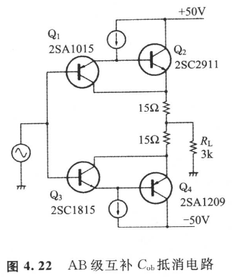

**图 4.22　AB 类互补 \\(C_{ob}\\) 抵消电路**

该电路中驱动晶体管的集电极分别连接到输出晶体管的发射极，形成自举，理论上可大幅减小 \\(C_{ob}\\)。但电路以接近 B 类的 AB 类方式工作，式（4.20）的电压增益 \\(A\\) 会随信号变化。等效输入电容也随信号变化，反而会产生失真。

### 4.4.6　A 类互补的 \\(C_{ob}\\) 抵消电路

图 4.23 是本放大器的输出级。在图 4.22 基础上增加两只二极管，使约 \\(20\ \mathrm{mA}\\) 静态电流流过，并令输出晶体管以 A 类方式工作。由于增益变化很小，式（4.21）仍然有效。

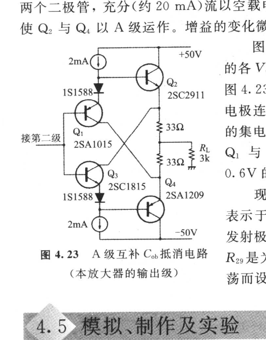

**图 4.23　A 类互补 \\(C_{ob}\\) 抵消电路**

驱动晶体管集电极分别连接到相对侧输出晶体管的发射极，使其 \\(V_{CB}\\) 维持约 \\(0.6\ \mathrm{V}\\) 的反向偏置。

图 4.24 是本放大器最终电路。\\(Q_{11}\\)、\\(Q_{12}\\) 两发射极之间的可变电阻用于失调调零，\\(R_{29}\\) 用于防止电容性负载引起振荡。

## 4.5　模拟、制作及实验

### 4.5.1　求相位补偿电容的最合适值

制作之前先用模拟确认。由于图 4.24 元件数超过 Micro-Cap V/CQ 版的电路规模限制，模拟时用图 4.25 的简化恒流源代替图 4.24 中若干恒流晶体管。

<!-- 来源：PDF 第 134 页；原书第 120 页 -->

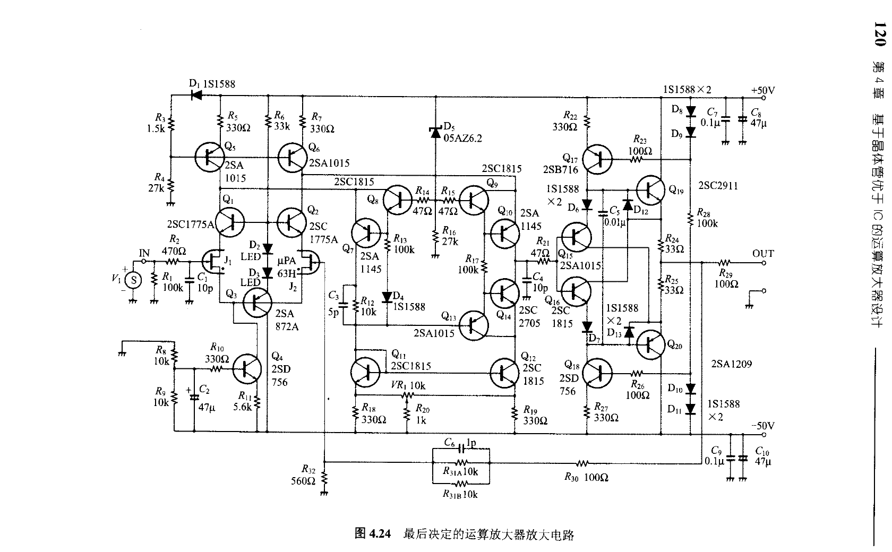

**图 4.24　高速高输出电压放大器的最终电路**

<!-- 来源：PDF 第 135 页；原书第 121 页 -->

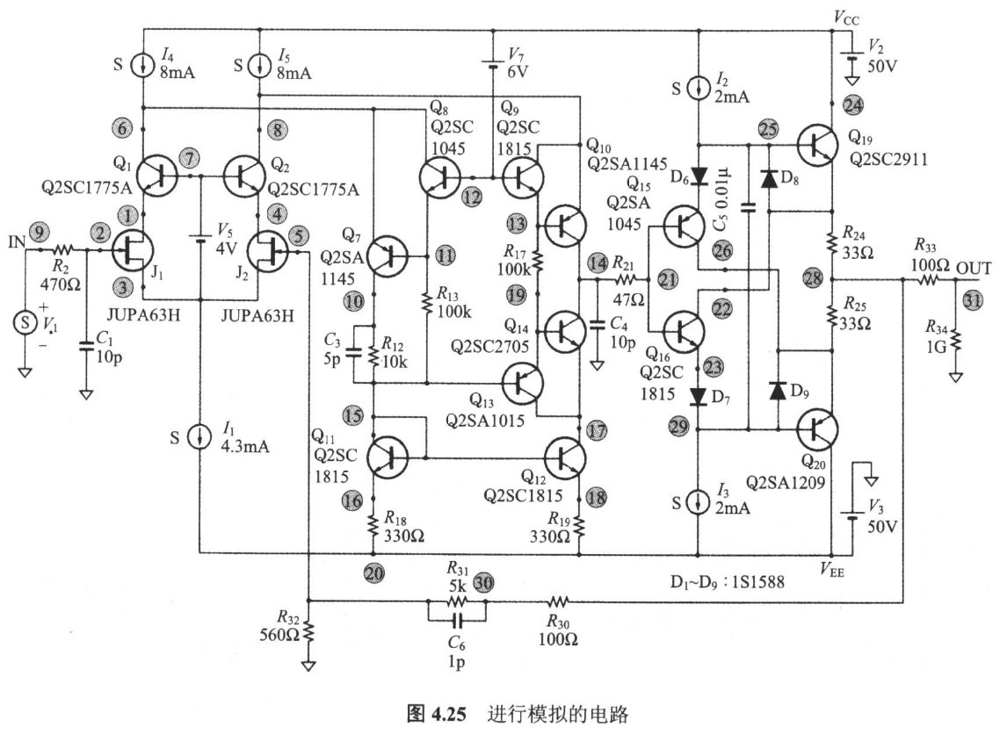

**图 4.25　用于模拟的简化电路**

<!-- 来源：PDF 第 136 页；原书第 122 页 -->

图 4.25 的 SPICE 网表见 List 4.1。网表内容对元件连接、模型参数和模拟条件均很敏感，因此保留为高分辨率扫描，避免未经逐字符校验的 OCR 结果被误作可执行代码。

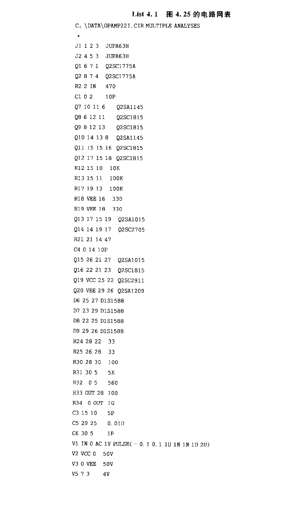

**List 4.1（上）　图 4.25 的电路网表**

<!-- 来源：PDF 第 137 页；原书第 123 页 -->

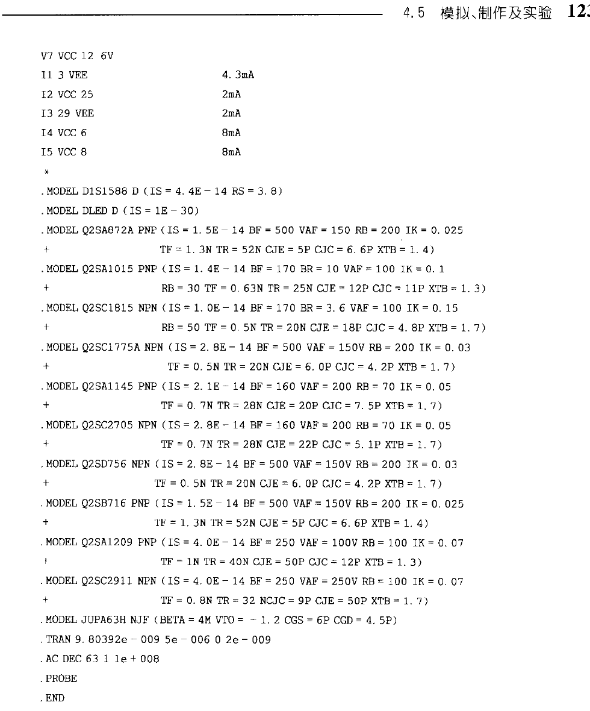

**List 4.1（续）　图 4.25 的电路网表**

首先寻找相位补偿电容 \\(C_6\\) 的最佳值。令 \\(C_6\\) 在 \\(0\\)～\\(5\ \mathrm{pF}\\) 之间变化，闭环增益频率特性与小信号脉冲响应分别见图 4.26、图 4.27。

当 \\(C_6\ge3\ \mathrm{pF}\\) 时，脉冲响应出现振铃，频率特性在约 \\(40\ \mathrm{MHz}\\) 也出现峰值；\\(C_6=0\\) 时频率特性虽然无峰值，脉冲响应却出现过冲。因此 \\(C_6=1\\)～\\(2\ \mathrm{pF}\\) 较合适，最终取 \\(1\ \mathrm{pF}\\)。

<!-- 来源：PDF 第 138 页；原书第 124 页 -->

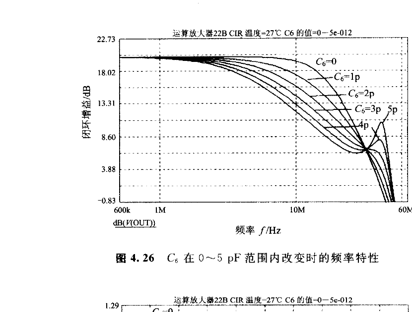

**图 4.26　\\(C_6=0\\)～\\(5\ \mathrm{pF}\\) 时的闭环增益频率特性**

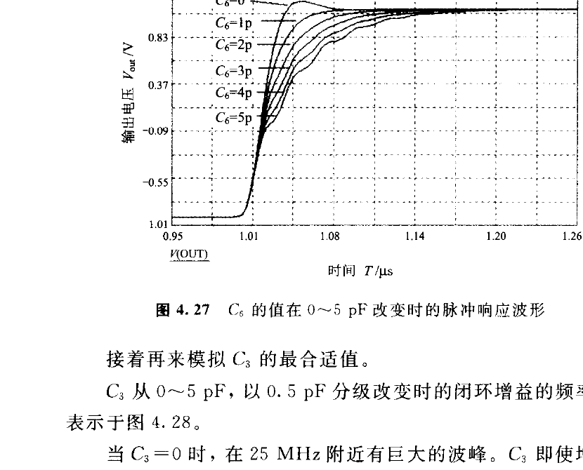

**图 4.27　\\(C_6=0\\)～\\(5\ \mathrm{pF}\\) 时的脉冲响应**

接着模拟 \\(C_3\\) 的最佳值。图 4.28 给出 \\(C_3\\) 从 \\(0\\) 到 \\(5\ \mathrm{pF}\\)、每次增加 \\(0.5\ \mathrm{pF}\\) 时的闭环频率特性。\\(C_3=0\\) 时在约 \\(25\ \mathrm{MHz}\\) 附近有很大的峰值；增加到 \\(5\ \mathrm{pF}\\) 后，频率特性已基本稳定，因此取 \\(C_3=5\ \mathrm{pF}\\)。

### 4.5.2　确认转换速率

输入 \\(\pm40\ \mathrm{V}\\)、\\(500\ \mathrm{kHz}\\) 方波时的模拟响应见图 4.29。上升转换速率约为 \\(400\ \mathrm{V/\mu s}\\)，下降转换速率约为 \\(380\ \mathrm{V/\mu s}\\)，与设计值大致相同。

<!-- 来源：PDF 第 139 页；原书第 125 页 -->

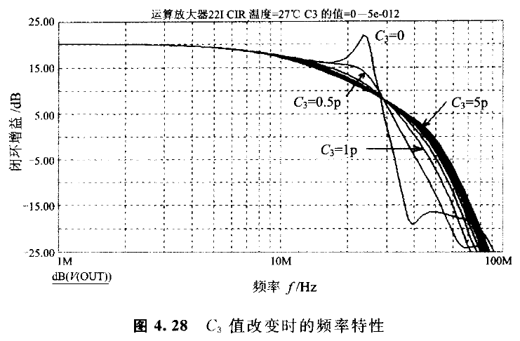

**图 4.28　改变 \\(C_3\\) 时的频率特性**

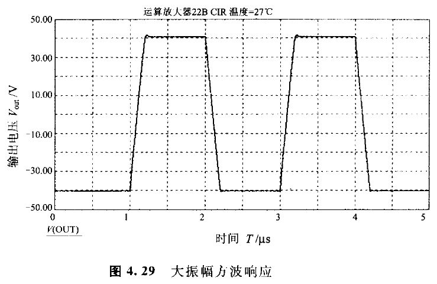

**图 4.29　大振幅方波响应**

图 4.24 中 \\(Q_{19}\\)、\\(Q_{20}\\) 基极之间的 \\(C_5\\) 是加速电容（Speed-up Condenser）。放大器内部的转换速率由初级共源电流和相位补偿电容按式（4.10）决定；端子接有电容性负载时，还要考虑最大输出电流 \\(I_{O\max}\\) 与负载电容 \\(C_L\\) 决定的限制：

\\[
\mathrm{SR}=\frac{I_{O\max}}{C_L}
\tag{4.23}
\\]

实际转换速率由式（4.10）与式（4.23）所得数值中较小者决定。

<!-- 来源：PDF 第 140 页；原书第 126 页 -->

以 \\(C_L=500\ \mathrm{pF}\\) 为例。若没有 \\(C_5\\)，驱动晶体管的最大基极电流约为 \\(2\ \mathrm{mA}\\)。按最差 \\(h_{FE}=100\\) 估算，输出晶体管最大电流似乎可达 \\(200\ \mathrm{mA}\\)，从式（4.23）得到约 \\(400\ \mathrm{V/\mu s}\\)。实际值更小，因为大电流时 \\(h_{FE}\\) 会下降。

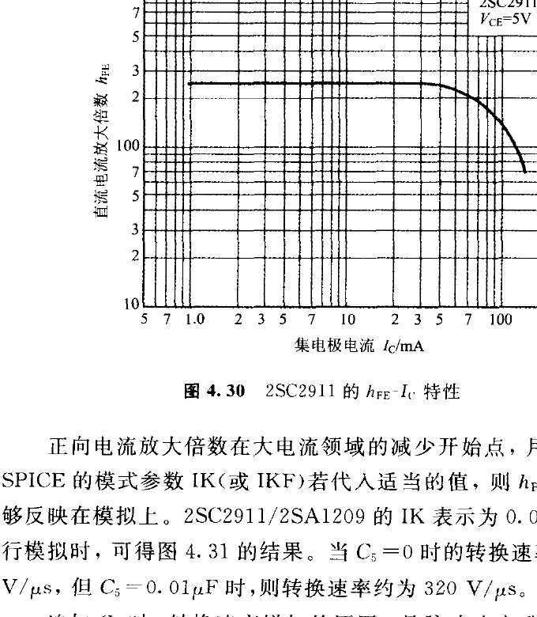

**图 4.30　2SC2911 的 \\(h_{FE}-I_C\\) 特性**

SPICE 模型参数 IK（或 IKF）规定大电流区 \\(h_{FE}\\) 开始下降的位置。为 2SC2911/2SA1209 设置 \\(\mathrm{IK}=0.07\ \mathrm{A}\\) 后重新模拟，得到图 4.31。\\(C_5=0\\) 时转换速率约为 \\(160\ \mathrm{V/\mu s}\\)，\\(C_5=0.01\ \mu\mathrm{F}\\) 时约为 \\(320\ \mathrm{V/\mu s}\\)。

加入 \\(C_5\\) 后，输出上升时驱动级电流经二极管和 \\(C_5\\) 直接驱动一侧输出晶体管，下降时则驱动另一侧，使输出晶体管发射极电流在过渡期间暂时增大。为防止 \\(C_5\\) 使基极—发射极结承受过大的反向电压，还加入保护二极管。

<!-- 来源：PDF 第 141 页；原书第 127 页 -->

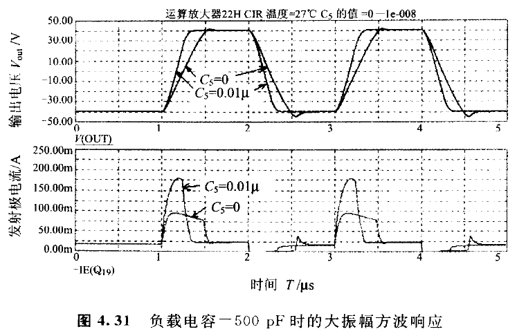

**图 4.31　\\(C_L=500\ \mathrm{pF}\\) 时的大振幅方波响应**

### 4.5.3　制作所使用的零件

▶ 电阻

反馈网络中的关键电阻采用 \\(0.2\ \mathrm{W}\\) 金属膜 F 级器件；部分电阻采用 \\(1/4\ \mathrm{W}\\) 金属膜 F 级或 \\(1/2\ \mathrm{W}\\) 碳膜/金属膜 J 级，其余采用 \\(1/4\ \mathrm{W}\\) 碳膜或金属膜 J 级。

▶ 电容

电源退耦使用铝电解电容，耐压按所在电源轨选择。失真敏感的相位补偿电容采用浸渍云母（Dipped Mica）或聚苯乙烯电容。高压位置采用耐压 \\(500\ \mathrm{V}\\) 的低介电系数陶瓷电容；高介电系数陶瓷电容因失真较大不宜使用。其余位置按要求使用薄膜、聚酯或适当耐压的陶瓷电容。

▶ 晶体管与二极管

输出晶体管采用 2SC2911/2SA1209，也可用电气特性接近的替代型号。1S1588 可由 1N4148 代替。

### 4.5.4　印制电路基板

元件原则上应按电路图的信号路径排列，走线要短而粗，GND 面积应尽可能大。

<!-- 来源：PDF 第 142 页；原书第 128 页 -->

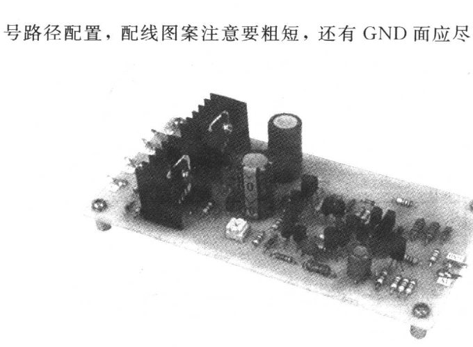

**照片 4.1　制作完成的基板**

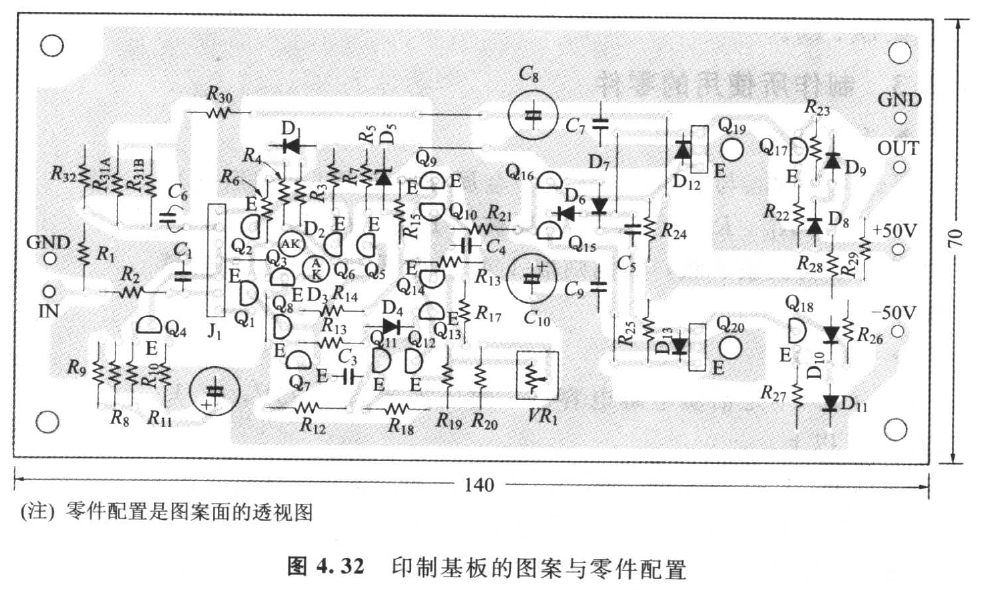

**图 4.32　印制基板图案与元件配置**

图 4.32 的元件配置是从图案面观察的透视图。2SC2911/2SA1209 在没有散热器时允许功耗约 \\(1\ \mathrm{W}\\)，应安装热阻约 \\(16\\)～\\(20^\circ\mathrm{C/W}\\) 的散热器，安装后允许功耗约 \\(4\ \mathrm{W}\\)。

电路省略输出短路保护。虽然串联输出电阻能限制晶体管电流，但该电阻本身可能烧毁；为提高可靠性，可采用 \\(5\ \mathrm{W}\\) 金属氧化膜电阻。

<!-- 来源：PDF 第 143 页；原书第 129 页 -->

### 4.5.5　电气特性的测试

▶ 频率特性

制作完成后测得的频率特性见图 4.33。\\(-3\ \mathrm{dB}\\) 截止频率约为 \\(7\ \mathrm{MHz}\\)，低于 \\(8\ \mathrm{MHz}\\) 设计值和模拟值。可能原因包括：

- 初级 FET 的 \\(g_m\\) 低于计算值；
- 补偿电容存在误差；
- 关键集电极到 GND 之间存在杂散电容。

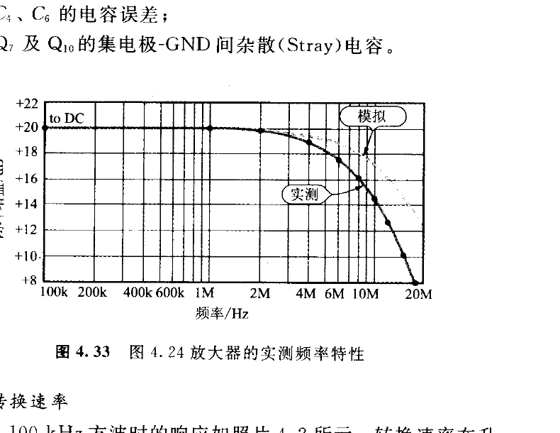

**图 4.33　图 4.24 放大器的实测频率特性**

▶ 转换速率

输入 \\(100\ \mathrm{kHz}\\) 方波时的响应见照片 4.2。上升、下降转换速率均约为 \\(340\ \mathrm{V/\mu s}\\)，为设计值的 \\(85\%\\)。

最大输出电压振幅相对频率的实测结果见图 4.34。在 \\(1\ \mathrm{MHz}\\) 以内可得到约 \\(91\ \mathrm{V_{P-P}}\\) 的输出振幅。

▶ 失真率特性

实测失真率见图 4.35。\\(20\ \mathrm{kHz}\\)、\\(30\ \mathrm{V_{RMS}}\\) 时 THD+N 约为 \\(0.00022\%\\)，比目标差约 \\(1\ \mathrm{dB}\\)；\\(20\ \mathrm{Hz}\\) 与 \\(1\ \mathrm{kHz}\\) 则满足目标。

<!-- 来源：PDF 第 144 页；原书第 130 页 -->

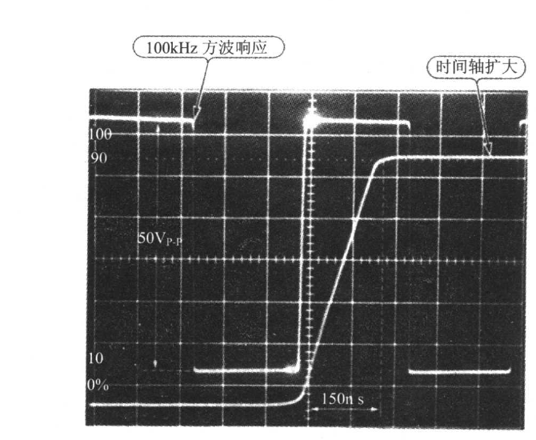

**照片 4.2　100 kHz 方波响应与转换速率**

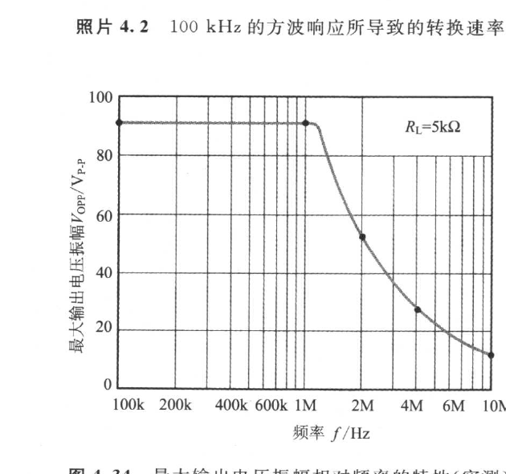

**图 4.34　最大输出电压振幅相对频率的实测特性**

若反馈电阻使用碳膜器件，\\(20\ \mathrm{Hz}\\) 失真会明显恶化，主要表现为第三次谐波。原因是电阻值随自身温度变化。

电阻上施加角频率 \\(\omega\\) 的正弦电压后，瞬时功耗含有直流分量和 \\(2\omega\\) 分量，电阻温度也产生 \\(2\omega\\) 纹波。只要温度系数不为零，阻值可写为：

\\[
R(t)=R\left[1+k\cos(2\omega t-\phi)\right]
\tag{4.24}
\\]

其中 \\(\omega=2\pi f\\)，\\(k\\) 取决于功耗、温度系数、热容量和频率，\\(\phi\\) 是 \\(0^\circ\\)～\\(90^\circ\\) 范围的相位。

<!-- 来源：PDF 第 145 页；原书第 131 页 -->

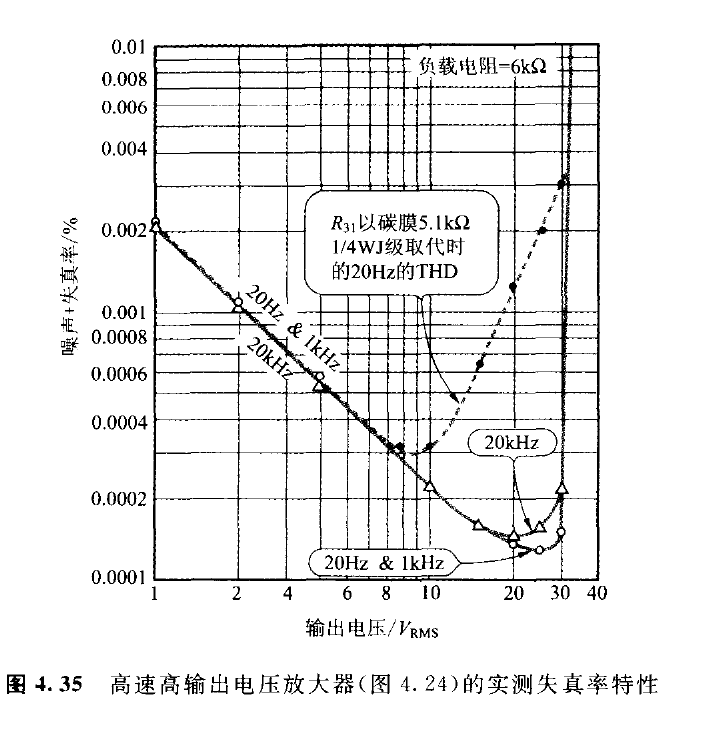

**图 4.35　高速高输出电压放大器的实测失真率特性**

流经电阻的电流为：

\\[
\begin{aligned}
i(t)
&=\frac{V(t)}{R(t)}
=\frac{V\sin\omega t}
{R\left[1+k\cos(2\omega t-\phi)\right]}\\
&\approx\frac{V\sin\omega t}{R}
\left[1-k\cos(2\omega t-\phi)\right]\\
&=\frac{V}{R}
\left[
\sin\omega t
+\frac{k}{2}\sin(\omega t-\phi)
-\frac{k}{2}\sin(3\omega t-\phi)
\right]
\end{aligned}
\tag{4.25}
\\]

因此电流含第三次谐波，失真率近似为 \\(k/2\\)。\\(k\\) 与外加电压平方成正比，并与频率平方根成反比，所以低频失真更严重。

减小 \\(k\\) 应选用温度系数低的电阻，并抑制温升。本设计把两只金属膜电阻并联。与单只 \\(1/4\ \mathrm{W}\\) 碳膜电阻相比，\\(20\ \mathrm{Hz}\\) 的 THD+N 可降低约 \\(30\ \mathrm{dB}\\)，降到接近 \\(1\ \mathrm{kHz}\\) 的水平。

▶ 温度特性

输入失调电压相对环境温度的实测结果见图 4.36，漂移约为 \\(30\ \mu\mathrm{V}/^\circ\mathrm{C}\\)。若将关键配对晶体管换成单芯片双晶体管，例如 2SA1349 与 2SC3381，漂移还可进一步降低。

<!-- 来源：PDF 第 146 页；原书第 132 页（仅本章结尾） -->

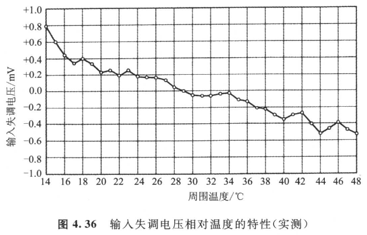

**图 4.36　输入失调电压相对环境温度的实测特性**

PDF 第 146 页在图 4.36 之后开始附录 C；附录内容不属于本章。
