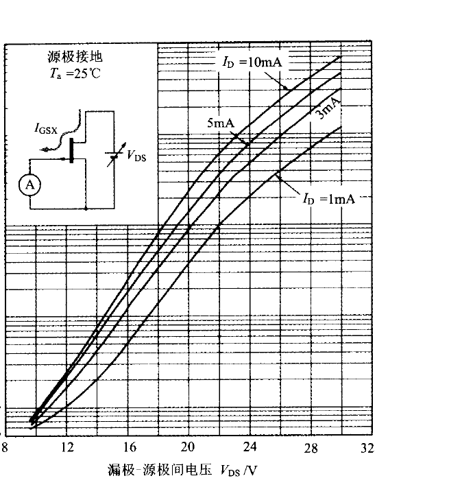
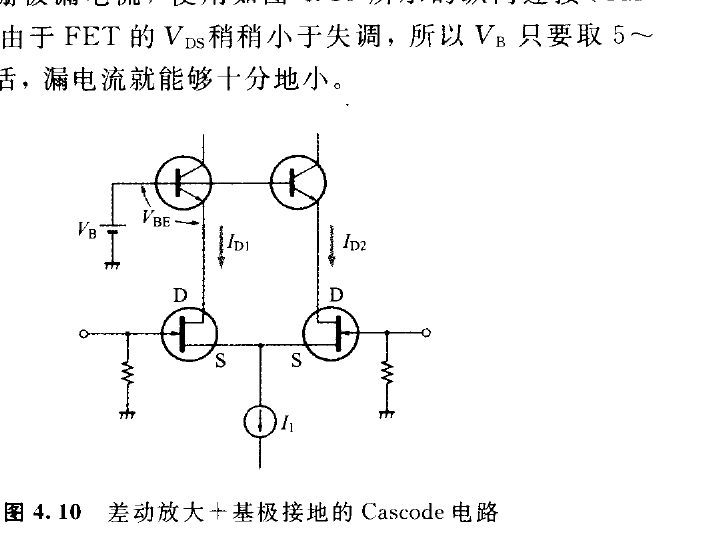
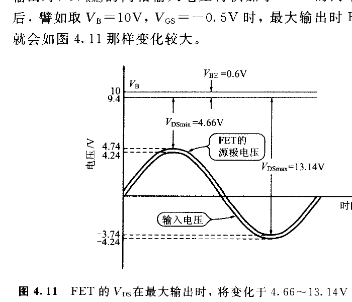
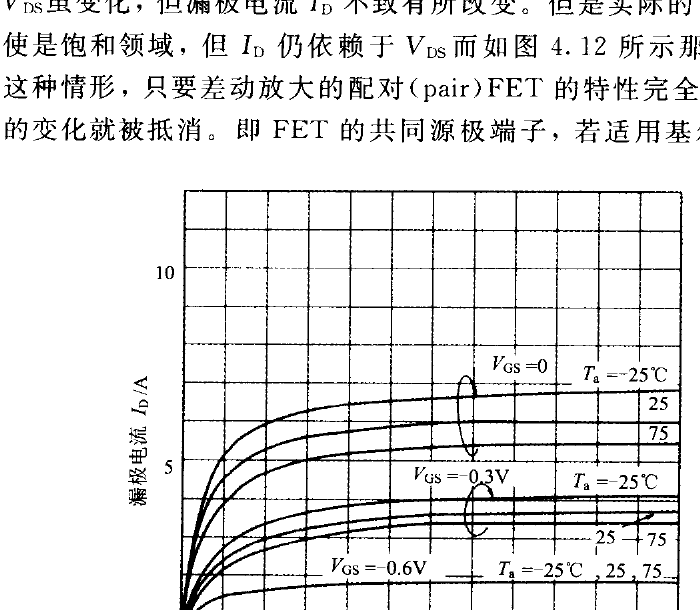
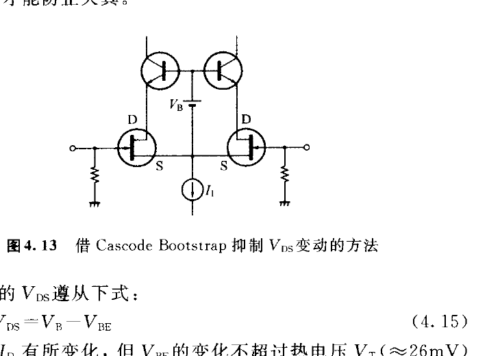
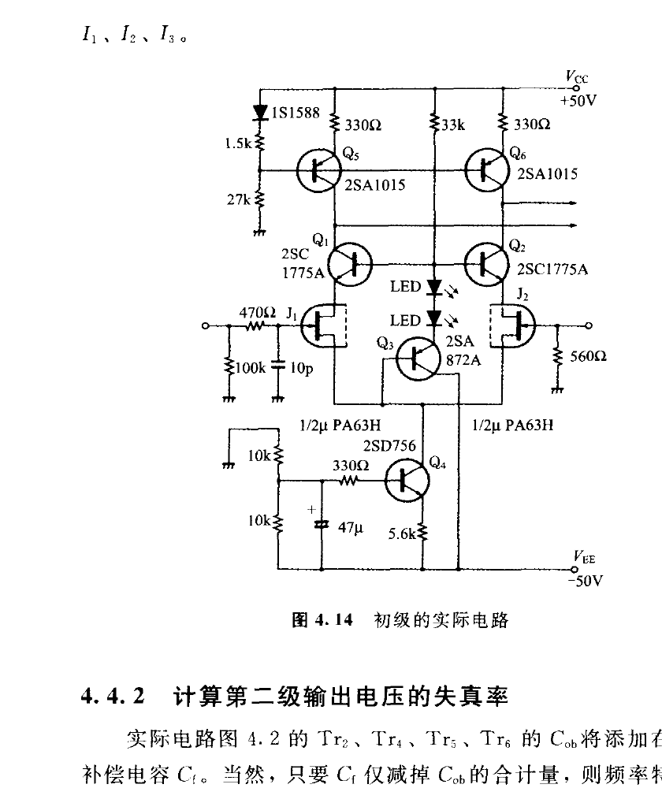
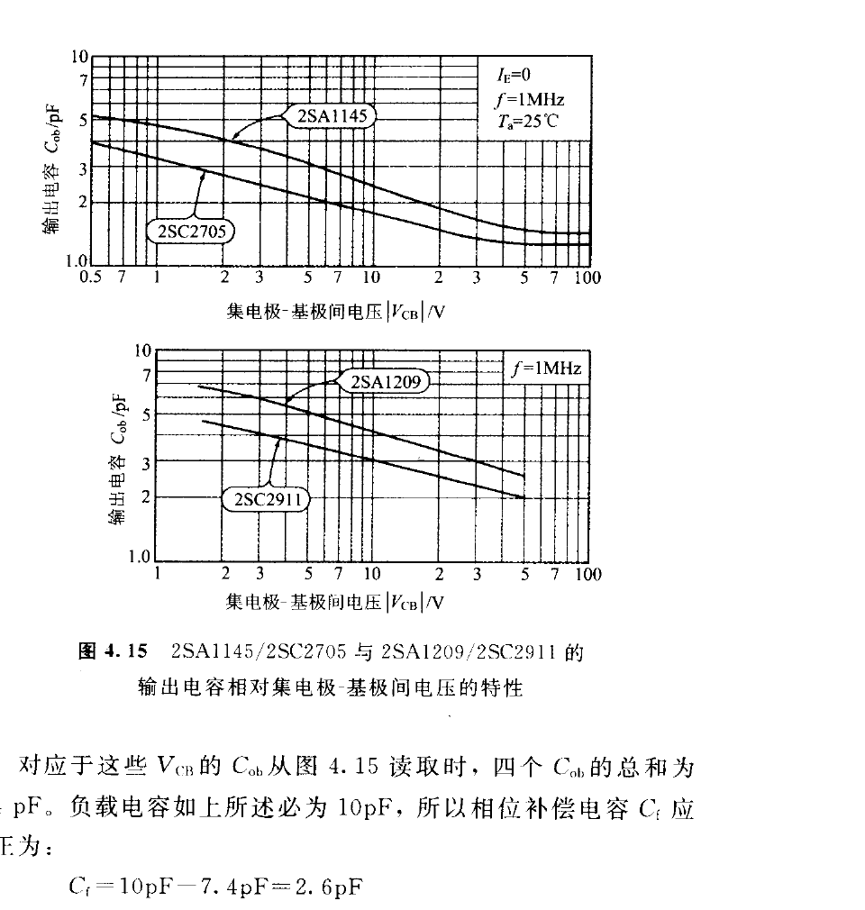
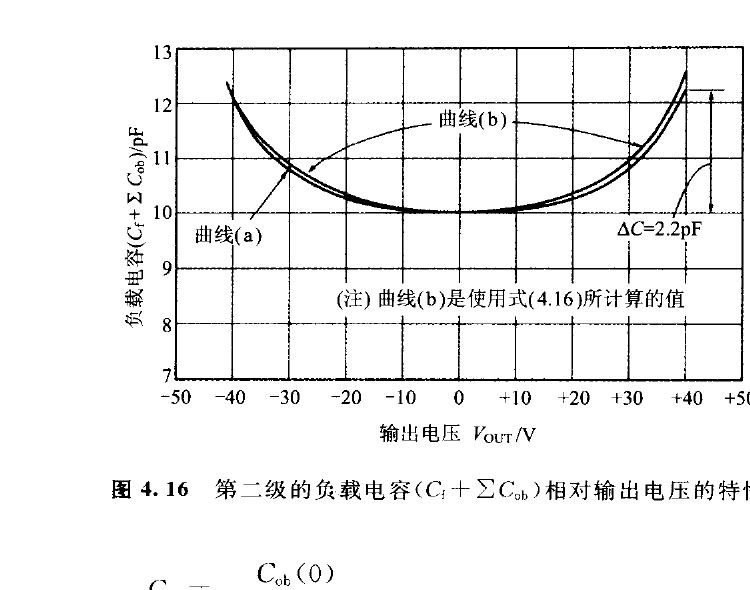
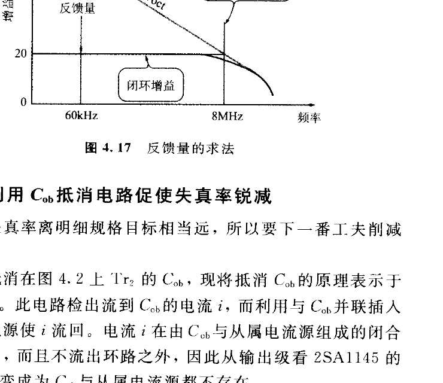

<!-- 来源：PDF 第 123 页；原书第 109 页 -->

图 4.9 给出 2SK389 栅极漏电流随 \\(V_{DS}\\) 的变化。为了抑制漏电流，可采用图 4.10 的 Cascode 电路，使输入 FET 的 \\(V_{DS}\\) 保持较低；偏置 \\(V_B\\) 只需取约 \\(5\\)～\\(10\ \mathrm{V}\\)。

但是，正向放大器的初级若直接采用这种 Cascode，失真会恶化。原因是正向放大器的输入端承受较大的同相信号。本放大器最大输出为 \\(30\ \mathrm{V_{RMS}}\\)，闭环增益为 10，因此最大输出时两只 FET 栅极上约有 \\(3\ \mathrm{V_{RMS}}\\) 的同相信号。

<!-- 来源：PDF 第 124 页；原书第 110 页 -->

例如取 \\(V_B=10\ \mathrm{V}\\)、\\(V_{GS}=-0.5\ \mathrm{V}\\)，最大输出时 FET 的 \\(V_{DS}\\) 会在约 \\(4.66\\)～\\(13.14\ \mathrm{V}\\) 之间大幅变化。

理想 FET 在饱和区的输出曲线应完全水平，\\(V_{DS}\\) 变化不会引起 \\(I_D\\) 变化；实际 FET 即使处于饱和区，漏极电流仍会随 \\(V_{DS}\\) 改变，如图 4.12。

若配对 FET 的特性完全相同，两个漏极电流的变化可互相抵消。共同源极节点满足：

<!-- 来源：PDF 第 125 页；原书第 111 页 -->

\\[
I_{D1}+I_{D2}=I_1=\text{常数}
\tag{4.12}
\\]

由电路对称性还应有：

\\[
I_{D1}=I_{D2}
\tag{4.13}
\\]

于是：

\\[
I_{D1}=I_{D2}=\frac{I_1}{2}=\text{常数}
\tag{4.14}
\\]

然而即使是单芯片配对器件，两只 FET 的特性也不会完全相同。式（4.12）仍成立，但式（4.13）不再严格成立。\\(V_{DS}\\) 变化时，可能出现一边 \\(I_D\\) 增加 \\(1\ \mu\mathrm{A}\\)、另一边减少 \\(1\ \mu\mathrm{A}\\) 的差动成分。

这种不平衡等效为约 \\(2\ \mu\mathrm{A}/g_m\\) 的输入失调电压，并会随信号非线性变化，形成失真。负反馈无法消除这种输入级失真。

解决方法是图 4.13 的 Cascode Bootstrap：把偏置 \\(V_B\\) 的一端连接到差动电路的共同源极，使 Cascode 晶体管基极电位随同相信号移动，从而抑制 \\(V_{DS}\\) 的变化。

FET 的 \\(V_{DS}\\) 为：

\\[
V_{DS}=V_B-V_{BE}
\tag{4.15}
\\]

即使 \\(I_D\\) 变化，\\(V_{BE}\\) 的变化也只在热电压 \\(V_T\approx26\ \mathrm{mV}\\) 的量级，因此 \\(V_{DS}\\) 的变化被限制到可忽略的范围，相关失真可降到约 \\(0.0001\%\\) 以下。

实际 Cascode Bootstrap 有多种形式，本设计采用图 4.14。\\(Q_3\\) 是发射极跟随器；红色 LED 代替稳压二极管，提供约 \\(1.6\ \mathrm{V}\\) 的正向压降；\\(Q_4\\)、\\(Q_5\\)、\\(Q_6\\) 构成图 4.2 所需的恒流源。

<!-- 来源：PDF 第 126 页；原书第 112 页 -->

### 4.4.2　计算第二级输出电压的失真率

实际电路中，第二级晶体管与输出晶体管的输出电容 \\(C_{ob}\\) 会并联在相位补偿电容 \\(C_f\\) 上。只要从总目标电容中扣除这些 \\(C_{ob}\\)，频率特性和转换速率仍可满足先前计算；问题在于 \\(C_{ob}\\) 会随集电极—基极反向电压 \\(V_{CB}\\) 变化。

图 4.15 给出 2SA1145、2SC2705、2SC2911、2SA1209 的 \\(C_{ob}-V_{CB}\\) 特性。输出电压变化时，第二级负载电容也变化，从而产生非线性失真。

无信号、输出直流电压为零时，从图 4.15 读取四只晶体管的 \\(C_{ob}\\)，总和约为 \\(7.4\ \mathrm{pF}\\)。目标负载电容为 \\(10\ \mathrm{pF}\\)，因此相位补偿电容修正为：

\\[
C_f=10-7.4=2.6\ \mathrm{pF}.
\\]

<!-- 来源：PDF 第 127 页；原书第 113 页 -->

令 \\(V_{\mathrm{OUT}}\\) 为瞬时输出电压，则四只晶体管的 \\(|V_{CB}|\\) 分别约为：

\\[
\begin{aligned}
\text{2SA1145:}\quad |V_{CB}|&=44-V_{\mathrm{OUT}},\\
\text{2SC2705:}\quad |V_{CB}|&=48+V_{\mathrm{OUT}},\\
\text{2SC2911:}\quad |V_{CB}|&=50-V_{\mathrm{OUT}},\\
\text{2SA1209:}\quad |V_{CB}|&=50+V_{\mathrm{OUT}}.
\end{aligned}
\\]

由图 4.15 逐点读取并加上 \\(C_f=2.6\ \mathrm{pF}\\)，得到图 4.16 曲线 (a)。曲线 (b) 则使用以下结电容近似式计算。

<!-- 来源：PDF 第 128 页；原书第 114 页 -->

\\[
\begin{aligned}
C_{ob}
&=\frac{C_{ob}(0)}
{\left(1+\dfrac{|V_{CB}|}{\phi}\right)^n}
\end{aligned}
\tag{4.16}
\\]

其中 \\(C_{ob}(0)\\) 是 \\(V_{CB}=0\\) 时的输出电容，\\(\phi=0.75\ \mathrm{V}\\) 为基极—集电极结接触电位，\\(n=0.33\\) 为结的渐变系数。绝对值使同一公式可同时用于 NPN 与 PNP 晶体管。

从特性曲线外推：

\\[
\begin{aligned}
\text{2SA1145:}\quad C_{ob}(0)&=6.5\ \mathrm{pF},\\
\text{2SC2705:}\quad C_{ob}(0)&=4.8\ \mathrm{pF},\\
\text{2SC2911:}\quad C_{ob}(0)&=7.9\ \mathrm{pF},\\
\text{2SA1209:}\quad C_{ob}(0)&=10.6\ \mathrm{pF}.
\end{aligned}
\\]

图 4.16 的曲线近似左右对称，因此主要产生奇次谐波，尤其是第三次谐波。其失真率近似为：

\\[
D_3\approx\frac{1}{12}\frac{\Delta C}{C}\times100\%
\tag{4.17}
\\]

其中，\\(C\\) 是 \\(V_{\mathrm{OUT}}=0\\) 时的负载电容（\\(10\ \mathrm{pF}\\)），\\(\Delta C\\) 是输出峰值处的负载电容变化量。若 \\(V_{\mathrm{OUT}}=\pm40\ \mathrm{V}\\)，图 4.16 给出 \\(\Delta C=2.2\ \mathrm{pF}\\)，因此 \\(D_3\approx1.8\%\\)。

<!-- 来源：PDF 第 129 页；原书第 115 页 -->

实际电路施加负反馈，失真会按反馈量降低。假设输入为 \\(20\ \mathrm{kHz}\\) 正弦波，第三次谐波为 \\(60\ \mathrm{kHz}\\)，闭环截止频率为 \\(8\ \mathrm{MHz}\\)，则在 \\(60\ \mathrm{kHz}\\) 的反馈量约为：

\\[
\frac{8\ \mathrm{MHz}}{60\ \mathrm{kHz}}\approx133.
\\]

反馈后的失真率约为：

\\[
\frac{1.8\%}{133}\approx0.0135\%.
\\]

这一数值仍比 \\(0.0002\%\\) 的目标高约 70 倍。

### 4.4.3　利用 \\(C_{ob}\\) 消除电路使失真骤减

为进一步降低失真，首先抵消第二级 2SA1145 的 \\(C_{ob}\\)。图 4.18(a) 表示工作原理：检测流经 \\(C_{ob}\\) 的电流，再用并联的受控电流源把同样的电流送回，使电流只在闭合环路内循环，不流向输出级。
