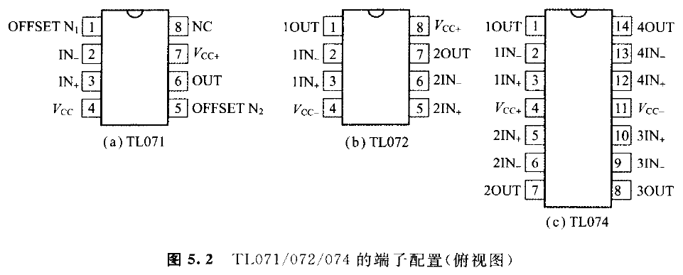
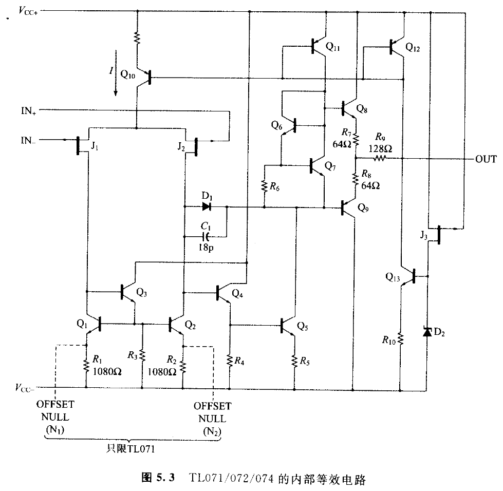
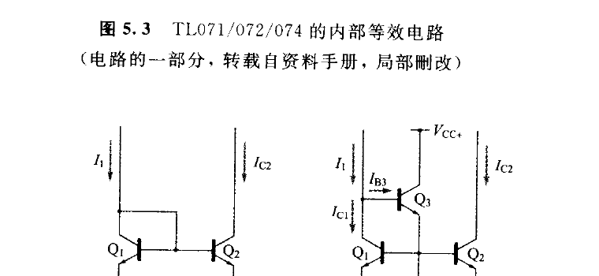
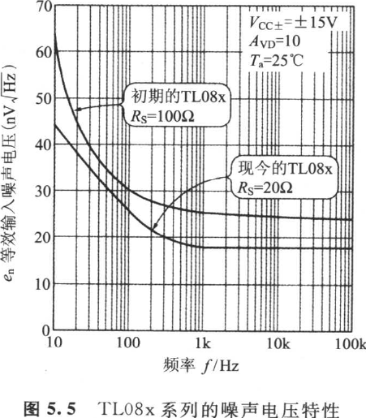
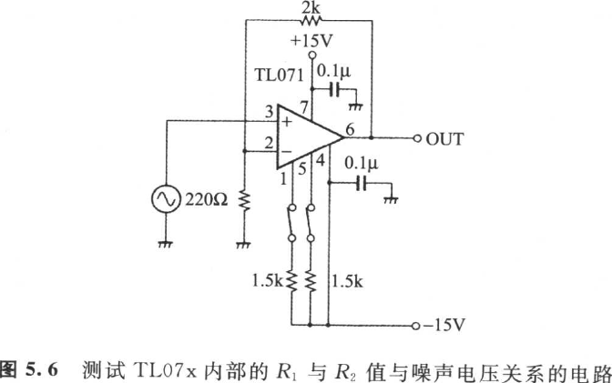
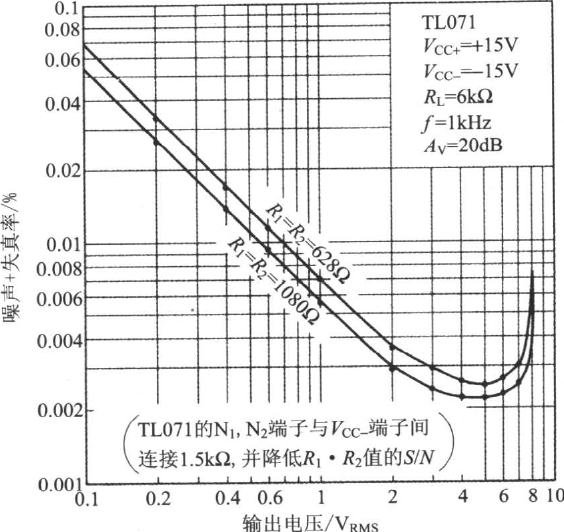

# 第 5 章　通用运算放大器 IC 的分析

<!-- 来源：PDF 第 151 页；原书第 137 页 -->

并无特别的优缺点，却用途广泛（All-round）的运算放大器称为通用（General purpose）型。由于应用广泛，所以具有价格最公道、容易取得的特性，本章首先分析具有代表性通用运算放大器的内部电路。

## ◆ 通用运算放大器

半导体厂家把自家公司的运算放大器以用途不同进行分类，又按照制造过程的不同表示于图 5.1。有以下的类型（Type）：

- 双极（Bipolar）型；
- BiFET 型；
- CMOS 型；
- Bi-CMOS 型。

<!-- 来源：PDF 第 152 页；原书第 138 页 -->

根据厂家擅长的领域有所不同。因此，选择运算放大器时必须考虑用途与制造过程，选择最适当的种类。在此，只要能理解运算放大器的内部电路就可进行相当准确的判断。

具代表性的通用运算放大器如表 5.1 所示。

运算放大器的初级使用双极性晶体管（Bipolar transistor）的称为 Bipolar 输入型，使用 FET 的则称为 FET 输入型。

## 5.1　Bi-FET 型运算放大器 TL07x 系列的分析

<!-- 来源：PDF 第 153 页；原书第 139 页 -->

### 5.1.1　Bi-FET 制造过程（Process）

从 1960 年开始，就已经存在在一个半导体基板上，由双极性晶体管（以下简写作 BJT）与结型 FET（以下简写作 JFET）一起所构成的运算放大器。但初期的 JFET 在 FET 工作开始的夹断（Pinch-off）电压有误差大的缺点。为消除此缺点，NS 公司于 1972 年利用离子掺入确立形成 JFET 的栅极与通道的制造过程（制造方法）。以后就命名为 Bi-FET 技术。

Bi-FET 是 NS 公司的商标（Trademark），但是现在用类似制造过程所制造的其他公司的运算放大器也称为 Bi-FET 型。在表 5.1 中，TL071C/LF353/LF356/μPC814/NJM2082/AD712J/OPA6404/MC34082 属于 Bi-FET 型运算放大器，属于名位，有以下的几种：

- TL070：Single（一电路装），外部相位补偿
- TL071：Single（一电路装），内部相位补偿
- TL072：Dual（两电路装），内部相位补偿
- TL073：QUAD（四电路装），内部相位补偿

TL071、TL072、TL074 利用完全反馈从而保证稳定工作。端子配置如图 5.2 所示，等效电路则如图 5.3 所示。

<!-- 来源：PDF 第 154 页；原书第 140 页 -->

### 5.1.2　两种电流镜像（Current Mirror）

TL07x 的电路，是第 2 章（图 2.2）所介绍 RC4558 的初级差动配对由 JFET 替代的构架，但是初级有源负载电流镜像的电路构成不同。图 5.4 表示两种电流镜像的构成。

#### 5.1.3　RC4558 的初级电流镜像（图(a)）

这是由两个 BJT 所构成。电流镜像的电流放大倍数 M 根据式(2.6)

\\\[
M=\frac{I_{\mathrm{C}2}}{I_{1}}=\frac{h_{\mathrm{FE}}}{2+h_{\mathrm{FE}}}
\tag{5.1}
\\\]

如果 \\(h_{FE}\\) 为 200，则 M 为 0.99。

<!-- 来源：PDF 第 155 页；原书第 141 页 -->

#### 5.1.4　TL07x 的初级电流镜像（图(5.4(b)）

这是由三个 BJT 所构成。电流镜像的电流放大倍数 M 为：

\\\[
M=\frac{I_{\mathrm{C}2}}{I_{\mathrm{C}1}}=\frac{I_{\mathrm{C}2}}{I_{\mathrm{C}1}+I_{\mathrm{B}3}}
\tag{5.2}
\\\]

从转换速率（13 μs）与相位补偿电容（18pF）的关系（第 2 章式(2.30)），可以反算出差动放大电路的共源极电流是 240μA，则推断 \\(I_{C1}\\) 与 \\(I_{C2}\\) 为其 1/2，即 120μA。假定 \\(R_3\\)=50kΩ，\\(R_3\\) 的电位降 =0.75 V，\\(Q_3\\) 的 \\(h_{FE}\\)=200 时，则 \\(Q_3\\) 的基极电流 \\(I_{B3}\\) 应为：

\\\[
I_{\mathrm{B}3}\approx\frac{1}{h_{\mathrm{FE}3}}\frac{0.75}{R_3}=\frac{1}{200}\times\frac{0.75}{50\times10^3}=0.075(\mu\mathrm{A})
\tag{5.3}
\\\]

\\\[
M=\frac{I_{\mathrm{C}2}}{I_{\mathrm{C}1}}=\frac{120}{120+0.075}=0.9994
\tag{5.4}
\\\]

也就是说比图 5.4(a)的 M=0.99 更接近 1。

图 5.4(b)的电流镜像还有别的优点，那就是 \\(Q_1\\) 的 \\(V_{CE}\\) 与 \\(Q_2\\) 的 \\(V_{CE}\\) 大致相等。

\\\[
V_{\mathrm{CE}1}=V_{\mathrm{BE}1}+V_{\mathrm{BE}3}\approx1.2(\mathrm{V})
\\\]
\\\[
V_{\mathrm{CE}2}=V_{\mathrm{BE}1}+V_{\mathrm{BE}3}+(R_1I_{\mathrm{E}3}-R_2I_{\mathrm{E}2})\approx1.2(\mathrm{V})
\\\]

如果根据图 5.4(a)的构成，由于 \\(Q_1\\) 与 \\(Q_2\\) 的 \\(V_{CE}\\) 约差 0.6 V，所以 FET \\(J_1\\) 与 \\(J_2\\) 的 \\(V_{DS}\\) 约产生 0.6 V 的误差，那就会引起 \\(I_D\\) 的不平衡，导致输入失调电压增加。一般因 FET 比 BJT \\(g_m\\) 小，所以 FET 配对的 \\(I_D\\) 不平衡，比 BJT 配对的不平衡会造成更大的输入失调电压。

#### 5.1.5　TL07x 与 TL08x 的噪声特性

TI 公司也提供与 TL07x 同等的 TL08x。TL08x 的内部电路与 TL07x 相同，同属一样的物品，附用两种类型名称真不可思议，但却有理由存在。

现在的 TL08x 的输入噪声电压密度（后述）虽为 18nV/√Hz（当 1kHz 时），但初期的 TL08x 却是 25 nV/√Hz（当 1 kHz 时）（参照图 5.5）。此项差别是由于 \\(R_1\\) 与 \\(R_2\\) 的值引起的。现在的数值是 1080Ω，而初期的值则为 610Ω。

TI 公司发表 TL08x 之后，发现 \\(R_1\\) 与 \\(R_2\\) 的值增加时，噪声会减少，故把 \\(R_1\\) 与 \\(R_2\\) 的值变更为 1080Ω，取名为 TL07x 而发表。而经过一段冷静期间之后，TL08x 的 \\(R_1\\) 与 \\(R_2\\) 也正式改变为 1080Ω。

\\(R_1\\) 与 \\(R_2\\) 的噪声有关连，原因是在一般情形下，FET 的 \\(g_m\\) 小于 BJT 的 \\(g_m\\)，而且输入型运算放大器不能忽视由初级有源负载的电流镜像所发生的噪声的缘故。\\(R_1\\) 与 \\(R_2\\) 的值增加时，\\(R_1\\) 与 \\(R_2\\) 的热噪声就会增加（后述），但因锁于 \\(Q_2\\) 的局部电流反馈量增加的更多，所以出现于 \\(Q_2\\) 集电极的噪声该减少^[1]。

<!-- 来源：PDF 第 156 页；原书第 142 页 -->

就 TL07x 而言也是如此，不妨用实验加以证明，\\(R_1\\) 与 \\(R_2\\) 的值不能增加，却可减小。

如图 5.6 所示，在 TL071 的失调零（Offset Null）端子 \\(N_1\\)、\\(N_2\\) 与负电源之间连接 15 kΩ 时，\\(R_1\\) 与 \\(R_2\\) 的值在实质上将由 1080Ω 减少为 628Ω。上面的推论正确时，噪声电压应该与初期的 TL081 一齐增加。

<!-- 来源：PDF 第 157 页；原书第 143 页 -->

实测的噪声 +THD 特性如图 5.7 所示。噪声如预料那样增加。

## 5.2　Bi-FET 型运算放大器 LF353 的分析

<!-- 来源：PDF 第 157 页；原书第 143 页 -->

NS 公司的 LF353 是与 TL072 管脚兼容（Pin Compatible）的 Bi-FET 型运算放大器。内部电路虽复杂，但除去偏压电路与保护电路时，却可获得图 5.9 所示的简略等效电路。

### 5.2.1　Widler 型电流镜像与 Wilson 型电流镜像

LF353 的内部（图 5.8）有以下的电流镜像：

① (\\(D_1\\)、\\(Q_{16}\\))(\\(D_2\\)、\\(Q_{18}\\))(\\(D_2\\)、\\(Q_{19}\\))；

② \\(D_3\\)、\\(Q_{20}\\)、\\(R_8\\)；

③ \\(Q_{12}\\)；

④ \\(Q_{13}\\)、\\(Q_{14}\\)；

⑤ \\(Q_1\\)、\\(Q_2\\)、\\(Q_3\\)。

其中，① 如前说明一样。

② 只在从属电流源端的发射极连接电阻的非对称电流镜像称为"Widler 型电流镜像"^[2,3]，其工作遵从式(2.8)。在制造微小电流源时使用此 Widler 型。
<!-- human here: rendering error^[2,3]-->
③ 是图 5.10(b) 所示的电流镜像，与①等效。

④ 称为"Wilson 型电流镜像"^[3]。图 5.8 的 \\(Q_{14}\\) 的集电极电流从属于 \\(Q_{16}\\) 的集电极电流。由于 Wilson 型镜加有多量的负反馈，所以 \\(Q_{14}\\) 的输出电阻相对较高（为发射极接地输出电阻的 (\\(h_{fe}/2\\)) 倍），而且电流镜像的电流放大倍数(\\(I_{C14}\\)/\\(I_{C16}\\)) 有极为接近于 1 的优点。

<!-- 来源：PDF 第 158 页；原书第 144 页 -->

下面来计算图 5.11 所示 Wilson 型电流镜像的电流放大倍数 M。

<!-- 来源：PDF 第 159 页；原书第 145 页 -->

<!-- human: 图5.11裁剪不全 -->

在图 5.11(b)中由点线所包围的部分是 Type①的电流镜像，故

\\\[
I_{\mathrm{C}2}=\left(\frac{h_{\mathrm{FE}}}{2+h_{\mathrm{FE}}}\right)I_{\mathrm{E}3}
\tag{5.5a}
\\\]

根据基尔霍夫电流法则

\\\[
I_1=I_{\mathrm{C}2}\mid I_{\mathrm{E}3}=I_{\mathrm{C}2}+\frac{I_{\mathrm{E}3}}{1+h_{\mathrm{FE}}}
\tag{5.5b}
\\\]

从而

\\\[
I_1=\left(\frac{h_{\mathrm{FE}}}{2+h_{\mathrm{FE}}}+\frac{1}{1+h_{\mathrm{FE}}}\right)I_{\mathrm{E}3}
\tag{5.5c}
\\\]

在此，因

\\\[
I_{\mathrm{E}3}=\left(\frac{1+h_{\mathrm{FE}}}{h_{\mathrm{FE}}}\right)I_{\mathrm{C}3}
\tag{5.5d}
\\\]

故将此式代入式(5.5c)，然后把 \\(I_{E3}\\) 消去，加以整理，则得

\\\[
M=\frac{I_{\mathrm{C}2}}{I_1}=\frac{h_{\mathrm{FE}}^2+2h_{\mathrm{FE}}}{h_{\mathrm{FE}}^2+2h_{\mathrm{FE}}+2}\approx 1-\frac{2}{h_{\mathrm{FE}^2}}
\tag{5.6}
\\\]

<!-- human: h_{\mathrm{FE}^2 平方符号渲染位置有问题-->

如果 \\(h_{FE}\\)=200，则 M≈0.999 95。实际上由于 BJT 的饱和和电流有误差，不致于得到这样的数值，但由此可知 Wilson 型在本质上是非常优异的电路。

### 5.2.2　LF353 的初级共源极电流

假定图 5.8 的 \\(Z_1\\) 的齐纳电压为 5.6V，则 \\(R_4\\) 有下面的电流 \\(I\\) 通过。

\\\[
I=\frac{5.6-(V_{\mathrm{BE}15}+V_{\mathrm{D}1}+V_{\mathrm{D}4})}{R_4}=\frac{3.8}{20\times10^3}=190(\mu\mathrm{A})
\tag{5.7}
\\\]

\\(I\\) 将分流于电流镜像 \\(D_1\\)、\\(D_16\\)。假设 \\(D_{16}\\) 的饱和电流与 \\(D_1\\) 的饱和和电流之比为 n，则可成立下式，即

\\\[
\frac{I_{\mathrm{E}16}}{I_{\mathrm{D}1}}=n
\tag{5.8}
\\\]

从而，

\\\[
\\begin{aligned}
I_{\mathrm{C}16}\approx190\mu\mathrm{A}\times\left(\frac{I_{\mathrm{E}16}}{I_{\mathrm{BE}6}+I_{\mathrm{D}1}}\right)
&=190\mu\mathrm{A}\times\left(\frac{n}{n+1}\right)
\\end{aligned}
\tag{5.9}
\\\]

如果 n=3，则 \\(I_{C16}\\)≈142μA，Wilson 型电流镜像 \\(Q_{14}\\) 的 \\(I_C\\) 也约为 142μA。

<!-- 来源：PDF 第 160 页；原书第 146 页 -->

### 5.2.3　转换速率的计算

从 \\(Q_{11}\\) 的 \\(I_C\\)=142μA 与补偿电容 \\(C_C\\)=10 pF，可算出转换速率 SR 为：

\\\[
\mathrm{SR}=\frac{142\mu\mathrm{A}}{10\times10^{-12}}=14.2\,\mathrm{V/\mu s}
\tag{5.10}
\\\]

额定值为 13 V/μs（参照表 5.1）。

### 5.2.4　输出电流的限制电路

几乎所有的运算放大器，为防止运算放大器在输出短路时由发热而导致被坏，内部都隐藏有输出电流限制电路。LF353 的正向输出电流是由 \\(Q_{11}\\) 进行限制，反向输出电流则由 \\(Q_{10}\\)·\\(D_3\\)·\\(Q_{20}\\) 加以限制，不妨详加查看一下。

\\(Q_8\\) 的基极电流由 \\(Q_{12}\\) 的集电极供给，但 \\(Q_8\\) 的发射极电流达到 +20 mA 时，\\(R_5\\)=22Ω 的两端电压为 0.44 V，\\(V_{BE}\\) 吸收 \\(I_{C12}\\) 而呈充分的正向偏压，\\(I_{C12}\\) 的大部分都流进 \\(Q_{11}\\) 的集电极。其结果是 \\(Q_8\\) 的基极电流受抑制，而发射极电流饱和。

<!-- 来源：PDF 第 161 页；原书第 147 页 -->

再者，\\(Q_{11}\\) 在 \\(V_{BE11}\\)=0.44 V 时成为充足的正向偏压，原因是输出电流达到 +20 mA 时，则由自身发热而导致运算放大器的内部温度上升，而且 \\(Q_{11}\\) 的 \\(I_C\\)-\\(V_{BE}\\) 曲线如第 2 章 图 2.8 所示向左方偏移的缘故。

另一方面，输出电流若达到 -17 mA 时，则 \\(Q_{10}\\)=ON→\\(D_3\\)=ON→\\(Q_{20}\\)=ON→\\(Q_{20}\\) 吸进 \\(J_2\\) 的漏极(Drain)电流→\\(Q_1\\) 的基极电流减少，\\(Q_2\\) 的集电极电流也减少→\\(Q_9\\) 的基极电流受抑制，发射极电流饱和。

### 5.2.5　输出阻抗相对频率的特性

具代表性的通用 BiFET 运算放大器的实测频率特性如图 5.12 所示。输出阻抗在高频带(域)之所以增加，是由于反馈量在高频域减少的缘故。

<!--human: 图未截全-->

一般而言，若从运算放大器的输出端返回向输入的电压负反馈量用 F(倍)，开环输出阻抗用 (\\(Z_O\\))open，闭环输出阻抗则用 (\\(Z_O\\))closed 表示，下式就可成立。

\\\[
\\begin{aligned}
(Z_{\mathrm{O}})_{\mathrm{closed}}=\frac{(Z\_{\mathrm{O}})\_{\mathrm{open}}}{F}
\\end{aligned}
\tag{5.11}
\\\]
<!-- 来源：PDF 第 162 页；原书第 148 页 -->

### 5.2.6　防止 \\(Q_5\\) 饱和的电路

\\(Q_5\\) 是第二级放大电路，而图 5.8 的 \\(Q_{17}\\) 的基极-发射极结，相当于第 3 章 图 3.18 所示的 \\(D_6\\)，可防止 \\(Q_5\\) 的饱和。正常工作时，\\(Q_{17}\\) 的基极-发射极间反向偏压，所以 \\(Q_{17}\\) 如同不存在。

如果无 \\(Q_{17}\\)，则当输入过大时，\\(Q_5\\) 的中性领域将产生如图 5.13 所示的过剩少数载波蓄积，即使过大输入消失，但在蓄积电荷成为零之前，仍有 \\(Q_5\\) 的 \\(I_C\\) 流动，以拖延 \\(V_{CE}\\) 的恢复。

### 5.2.7　失真率特性与频率特性

具代表性的通用 Bi-FET 运算放大器的实测失真率特性如图 5.14 所示。

<!-- 来源：PDF 第 163 页；原书第 149 页 -->

还有，实测的开环增益相对频率的特性则如图 5.15 所示，可以看出全反馈都有充分的相位容限。

## 5.3　Bipolar 运算放大器 NE5532 的分析

<!-- 来源：PDF 第 164 页；原书第 150 页 -->

此运算放大器属于 Signetics 公司，该公司随后被飞利浦公司所收购。但是，具有相同类型号的运算放大器（Second Source）已由各公司所提供。

初级差动元件使用 NPN 型 BJT 的通用运算放大器。输入噪声级小到 5 nV/√Hz，归类于低噪声类型并不见怪。在电源电压=±18 V，600Ω 的负载下可得 \\(10V_{RMS}\\) 的输出电压。

具有宽频带、超低失真率、巨大的相位容限等优点，并具有以音响为中心，活跃广阔的领域。内部电路如图 5.16 所示，简略等效电路则如图 5.17 所示。

### 5.3.1　输入端子间二极管的任务

如果 BJT 的基极-发射极结崩溃（Break Down）时，\\(h_{FE}\\) 就减少，而噪声增加。因此 NE5532 在差动输入端子间插入 \\(D_1\\)、\\(D_2\\)，用以防止 \\(Q_1\\) 与 \\(Q_2\\) 的崩溃。运算放大器在线性工作时，差动输入电压非常小，所以通常 \\(D_1\\) 与 \\(D_2\\) 在实质上是非导通的。

<!-- 来源：PDF 第 165 页；原书第 151 页 -->

但是，像这样的运算放大器（NE5532）作为电压跟随器（Voltage Follower）使用时，当施加电源投入时，有过大电流经 \\(D_1\\)、\\(D_2\\) 的危险，所以如图 5.18 所示插入电流限制电阻。

表 5.1 所示的 Bipolar 输入 OP 并无相当于 \\(D_1\\)、\\(D_2\\) 的二极管。这些运算放大器由于初级差动元件而属于后述的横向（Lateral）PNP 晶体管构造，从而导致基极-发射极结的崩溃电压高（在 30 V 以上）。

### 5.3.2　电流镜像与饱和防止电路

图 5.17 的 \\(Q_5\\)、\\(Q_6\\)、\\(Q_7\\) 的等效电路如图 5.19 所示，\\(Q_{5a}\\)、\\(Q_6\\)、\\(Q_7\\) 构成电流镜像。过大输入 \\(Q_{5b}\\) 时，应防止 \\(Q_7\\) 的 \\(V_{CE}\\) 饱和。正常工作时，\\(Q_{5b}\\) 的基极-发射极间大致为零，\\(Q_{5b}\\) 如同没有。

### 5.3.3　横向（Lateral）PNP 晶体管

在一块半导体基板上，由 NPN 晶体管连接在一起再形成具有同等性能的 PNP 晶体管（Wafer 制作过程变复杂）时，成本会高涨，所以通用运算放大器需要 PNP 晶体管时，使用便宜的"Lateral PNP 晶体管"。

Lateral PNP 晶体管的断面构造如图 5.20 所示，这是把 NPN 型 BJT 的集电极领域转用作 PNP 的基极领域，电流在基极领域内做横向（Lateral）流动。

<!-- 来源：PDF 第 166 页；原书第 152 页 -->

如第 4 章(4.1)所示，BJT 的正向转移时间 \\(τ_F\\)，即载波的基极运行时间，与基极宽的乘方成正比。但是 Lateral PNP 的基极宽约为 NPN 的十倍，Lateral PNP 的 \\(τ_F\\) 比 NPN 大两位数。从而 Lateral PNP 的暂态频率 \\(f_T\\)，比 NPN 型低两位数左右的 5～10 倍（参照第 3 章附录 A 的式(A.24)，应用该制造过程造出不频率好的 PNP 晶体管。

### 5.3.4　前馈（Feed-forward）相位补偿

图 5.17 的 \\(Q_3\\)、\\(Q_4\\) 因属于横向 PNP，所以频率特性并不好，因此要改善频率特性，而插入 \\(C_2\\)=37 pF，并且仔细考虑高频带信号，旁路 \\(Q_3\\)、\\(Q_4\\) 与 \\(Q_8\\) 的基极连接。因高频信号通过 \\(C_2\\) 向前传送，所以称为"前馈（相位）补偿（Feed-forward Compensation）"^[14]。

图 5.17 所示，NE5532 是由三级电压放大+输出级构成，如图 5.21 所示的方块表示。进而 \\(C_2\\) 被视为短路的高频率则归结于图 5.22(a) 所示的方块图。另外数百 kHz 以下的频率便归结于图 5.22(b)所示的方块图。

<!-- 来源：PDF 第 167 页；原书第 153 页 -->

<!--human: 图没截全-->

(\\(C_3\\)+\\(C_4\\))在图 5.22(a)中作为局部负反馈电容使用，频率在数 MHz 以上时，其开环增益 A 为：

\\\[
A=\frac{g_{\mathrm{m}}}{2}\frac{1}{j\omega(C_3+C_4)}
\tag{5.12}
\\\]

从而单位增益频率 \\(f_T\\) 是

\\\[
f_{\mathrm{T}}=\frac{g_{\mathrm{m}}/2}{2\pi(C_3+C_4)}=\frac{1.2\times10^{-3}}{6.28\times(14+7)\times10^{-12}}=9.1(\mathrm{MHz})
\\\]

不妨再回到图 5.21。节点(Node)\\(P_2\\) 与 \\(P_3\\) 属同相，故由 \\(C_2\\) 施加正反馈时，有可能不稳定。因此借助 \\(C_3\\)=14 pF 施加局部负反馈以抵消正反馈。频率在数百 kHz 以下（第 2 级+第 3 级）时，增益会非常高，所以归结于图 5.22(b)的方块图。从而开环增益

<!-- 来源：PDF 第 168 页；原书第 154 页 -->

<!--human: 图没截全-->

A 为：

\\\[
A=\frac{g_{\mathrm{m}}}{j\omega C_3}
\tag{5.13}
\\\]

增益带宽积 GBP 是

\\\[
\mathrm{GBP}=\frac{g_{\mathrm{m}}}{2\pi C_3}=\frac{2.4\times10^{-3}}{6.28\times14\times10^{-12}}=27(\mathrm{MHz})
\\\]

像这样，使用前馈相位补偿的运算放大器的 \\(f_T\\) 与 GB 积并不一致。从式(5.12)与式(5.13)，应可形成如图 5.23 所示的频率特性。

<!--human: 图5.23错位了，这里截的应该是图5.22的内容-->

实测频率特性如图 5.24 所示，与预料的特性相同。

### 5.3.5　非对称 AB 级工作的输出级

几乎所有的通用运算放大器，输出级跟随器均使用 P 型半导体基板作为集电极的衬底（Substrate）PNP 晶体管（参照图 5.25）。衬底 PNP，虽比横向向 PNP 流过的集电极电流大，但比 NPN 型小，\\(h_{FE}\\) 与 \\(f_T\\) 也不如 NPN 型。

<!-- 来源：PDF 第 169 页；原书第 155 页 -->

因此用衬底 PNP 替换 NE5532，使用 NPN 型 PJT 的二极管连接（\\(D_5\\)）（图 5.26）。只是输出级从 \\(Q_{10}\\) 流出正的输出电流和负的输出电流，并流入 \\(Q_9\\) 的集电极的非对称 AB 级工作。

\\(Q_9\\) 的负载阻抗随信号的正负而变动，而且发生非直线失真。但是，实测的失真率如图 5.27 所示为超群的超低失真。原因是，\\(Q_9\\) 由 \\(C_3\\) 与 \\(C_4\\) 借加有多量的局部反馈。如果把全面的负反馈也加上去，则作用于 \\(Q_9\\) 的负反馈量在总体反馈时就达到 100%。假定 \\(Q_9\\) 的失真率即使有 25%，但总体反馈时的失真率仍为：\\(25\\%\div10^5=0.000\ 25\\%\\)

<!-- 来源：PDF 第 170 页；原书第 156 页 -->

图 5.27 的测试电路的反馈率是 0.1，所以失真率为总体反馈时的十倍，但仍达不到 0.0025%。

