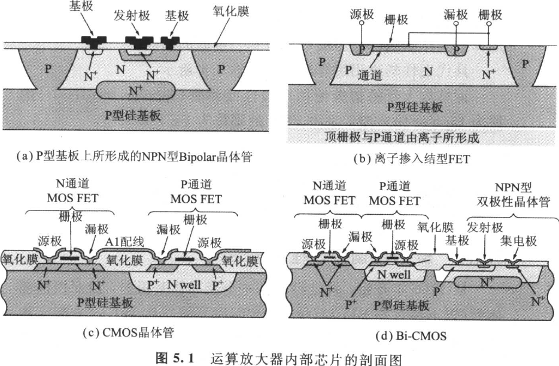
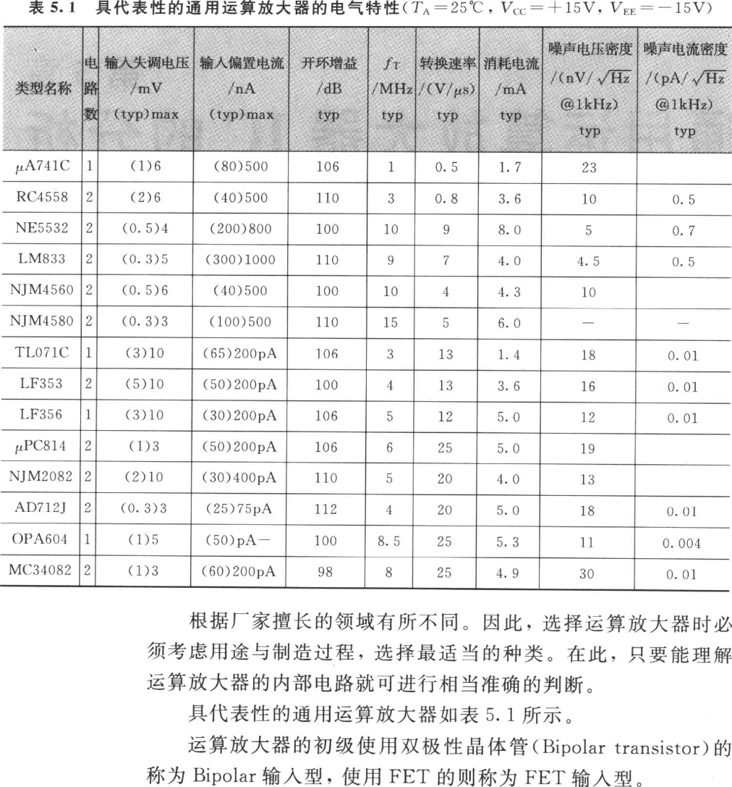

# 第 5 章　通用运算放大器 IC 的分析

<!-- 来源：PDF 第 151 页；原书第 137 页 -->

并无特别的优缺点，却用途广泛（All-round）的运算放大器称为通用（General purpose）型。由于应用广泛，所以具有价格最公道、容易取得的特性，本章首先分析具有代表性通用运算放大器的内部电路。

## ◆ 通用运算放大器

半导体厂家把自家公司的运算放大器以用途不同进行分类，又按照制造过程的不同表示于图 5.1。有以下的类型（Type）：

- 双极（Bipolar）型；
- BiFET 型；
- CMOS 型；
- Bi-CMOS 型。

<!-- 来源：PDF 第 152 页；原书第 138 页 -->

根据厂家擅长的领域有所不同。因此，选择运算放大器时必须考虑用途与制造过程，选择最适当的种类。在此，只要能理解运算放大器的内部电路就可进行相当准确的判断。

具代表性的通用运算放大器如表 5.1 所示。

运算放大器的初级使用双极性晶体管（Bipolar transistor）的称为 Bipolar 输入型，使用 FET 的则称为 FET 输入型。
