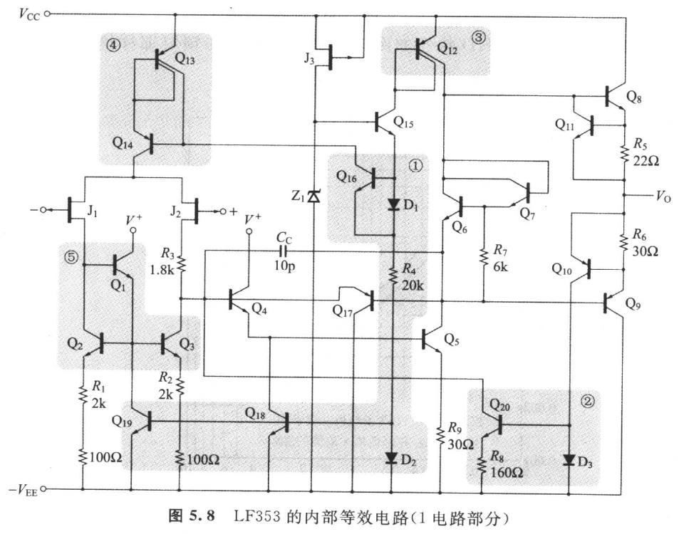
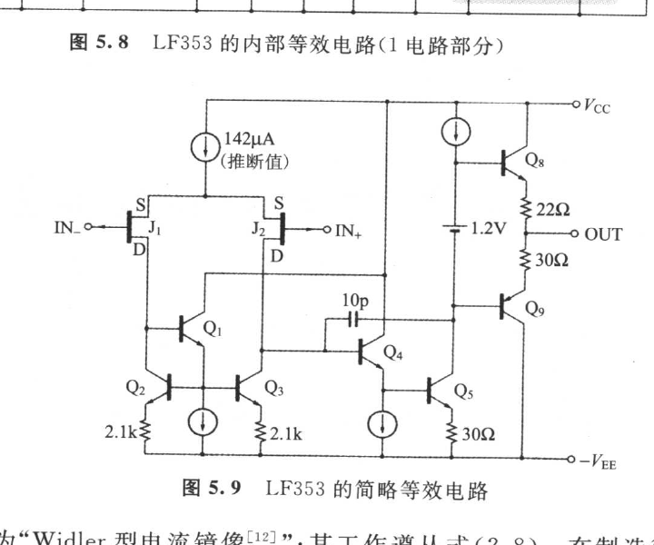
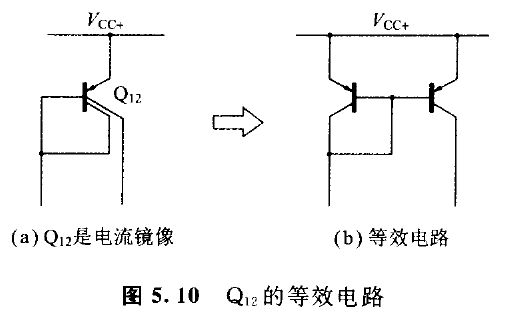
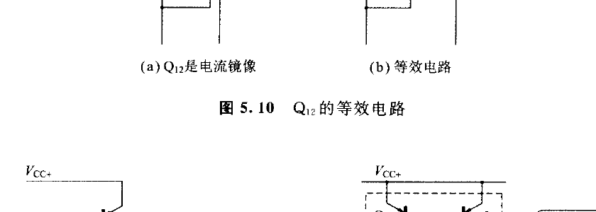
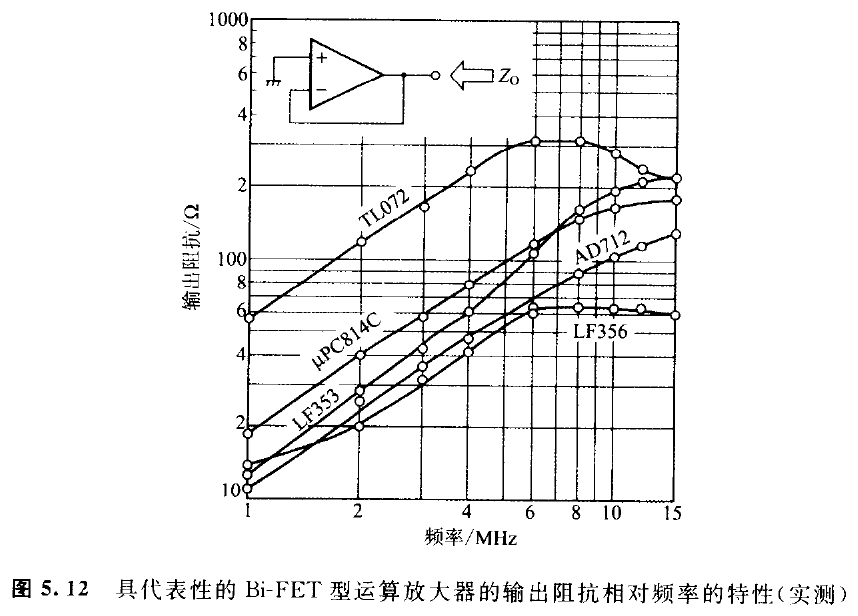
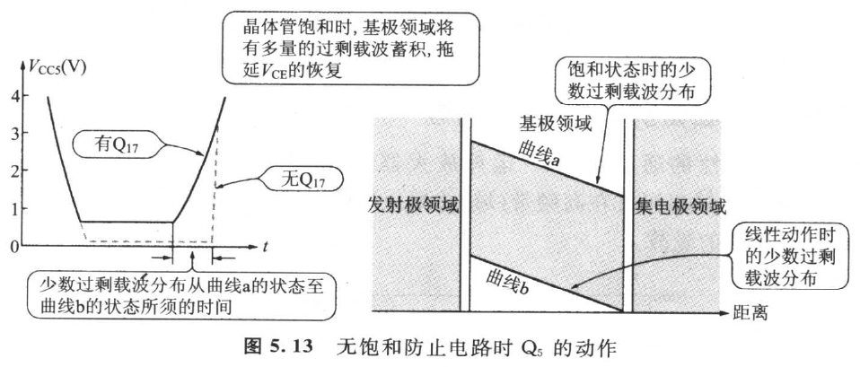
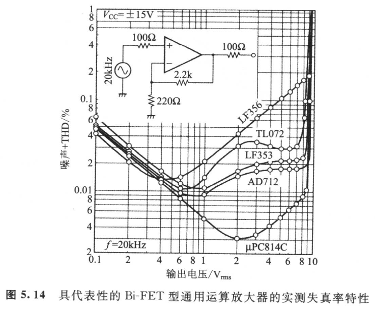
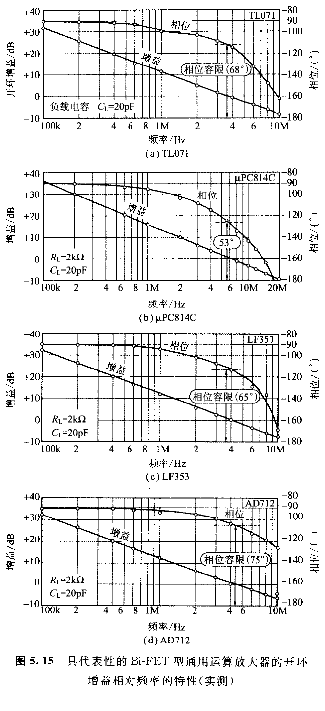

## 5.2　Bi-FET 型运算放大器 LF353 的分析

<!-- 来源：PDF 第 157 页；原书第 143 页 -->

NS 公司的 LF353 是与 TL072 管脚兼容（Pin Compatible）的 Bi-FET 型运算放大器。内部电路虽复杂，但除去偏压电路与保护电路时，却可获得图 5.9 所示的简略等效电路。

### 5.2.1　Widler 型电流镜像与 Wilson 型电流镜像

LF353 的内部（图 5.8）有以下的电流镜像：

1. (\\(D_1\\)、\\(Q_{10}\\))(\\(D_2\\)、\\(Q_{18}\\))(\\(D_3\\)、\\(Q_{19}\\))；
2. \\(D_5\\)、\\(Q_{20}\\)、\\(R_9\\)；
3. \\(Q_{15}\\)；
4. \\(Q_{13}\\)、\\(Q_{14}\\)；
5. \\(Q_1\\)、\\(Q_2\\)、\\(Q_3\\)。

其中，① 如前说明一样。

② 只在从属电流源端的发射极连接电阻的非对称电流镜像称为"Widler 型电流镜像"[2,3]，其工作遵从式(2.8)。在制造微小电流源时使用此 Widler 型。

③ 是图 5.10(b) 所示的电流镜像，与①等效。

④ 称为"Wilson 型电流镜像"[13]。图 5.8 的 \\(Q_{14}\\) 的集电极电流从属于 \\(Q_{16}\\) 的集电极电流。由于 Wilson 型镜加有多量的负反馈，所以 \\(Q_{14}\\) 的输出电阻相对较高（为发射极接地输出电阻的 (\\(h_{FE}\\)/2) 倍），而且电流镜像的电流放大倍数(\\(I_{C14}\\)/\\(I_{C16}\\)) 有极为接近于 1 的优点。

<!-- 来源：PDF 第 158 页；原书第 144 页 -->

下面来计算图 5.11 所示 Wilson 型电流镜像的电流放大倍数 M。

<!-- 来源：PDF 第 159 页；原书第 145 页 -->

在图 5.11(b)中由点线所包围的部分是 Type①的电流镜像，故

\\[
I_{\mathrm{C}2}=\left(\frac{h_{\mathrm{FE}}}{2+h_{\mathrm{FE}}}\right)I_{\mathrm{E}3}
\tag{5.5a}
\\]

根据基尔霍夫电流法则

\\[
I_1=I_{\mathrm{C}2}\mid I_{\mathrm{E}3}=I_{\mathrm{C}2}+\frac{I_{\mathrm{E}3}}{1+h_{\mathrm{FE}}}
\tag{5.5b}
\\]

从而

\\[
I_1=\left(\frac{h_{\mathrm{FE}}}{2+h_{\mathrm{FE}}}+\frac{1}{1+h_{\mathrm{FE}}}\right)I_{\mathrm{E}3}
\tag{5.5c}
\\]

在此，因

\\[
I_{\mathrm{E}3}=\left(\frac{1+h_{\mathrm{FE}}}{h_{\mathrm{FE}}}\right)I_{\mathrm{C}3}
\tag{5.5d}
\\]

故将此式代入式(5.5c)，然后把 \\(I_{E3}\\) 消去，加以整理，则得

\\[
M=\frac{I_{\mathrm{C}2}}{I_1}=\frac{h_{\mathrm{FE}}^2+2h_{\mathrm{FE}}}{h_{\mathrm{FE}}^2+2h_{\mathrm{FE}}+2}\approx 1-\frac{2}{h_{\mathrm{FE}}^2}
\tag{5.6}
\\]

如果 \\(h_{FE}\\)=200，则 M≈0.999 95。实际上由于 BJT 的饱和和电流有误差，不致于得到这样的数值，但由此可知 Wilson 型在本质上是非常优异的电路。

### 5.2.2　LF353 的初级共源极电流

假定图 5.8 的 \\(Z_1\\) 的齐纳电压为 5.6V，则 \\(R_4\\) 有下面的电流 \\(I\\) 通过。

\\[
I=\frac{5.6-(V_{\mathrm{BE}15}+V_{\mathrm{D}1}+V_{\mathrm{D}4})}{R_4}=\frac{3.8}{20\times10^3}=190(\mu\mathrm{A})
\tag{5.7}
\\]

\\(I\\) 将分流于电流镜像 \\(D_1\\)、\\(D_6\\)。假设 \\(D_{16}\\) 的饱和电流与 \\(D_1\\) 的饱和和电流之比为 n，则可成立下式，即

\\[
\frac{I_{\mathrm{E}16}}{I_{\mathrm{D}1}}=n
\tag{5.8}
\\]

从而，

\\[
I_{\mathrm{C}16}\approx190\mu\mathrm{A}\times\left(\frac{I_{\mathrm{E}16}}{I_{\mathrm{BE}6}+I_{\mathrm{D}1}}\right)=190\mu\mathrm{A}\times\left(\frac{n}{n+1}\right)
\tag{5.9}
\\]

如果 n=3，则 \\(I_{C16}\\)≈142μA，Wilson 型电流镜像 \\(Q_{14}\\) 的 \\(I_C\\) 也约为 142μA。

<!-- 来源：PDF 第 160 页；原书第 146 页 -->

### 5.2.3　转换速率的计算

从 \\(Q_{11}\\) 的 \\(I_C\\)=142μA 与补偿电容 \\(C_C\\)=10 pF，可算出转换速率 SR 为：

\\[
\mathrm{SR}=\frac{142\mu\mathrm{A}}{10\times10^{-12}}=14.2\,\mathrm{V/\mu s}
\tag{5.10}
\\]

额定值为 13 V/μs（参照表 5.1）。

### 5.2.4　输出电流的限制电路

几乎所有的运算放大器，为防止运算放大器在输出短路时由发热而导致被坏，内部都隐藏有输出电流限制电路。LF353 的正向输出电流是由 \\(Q_{11}\\) 进行限制，反向输出电流则由 \\(Q_{10}\\)·\\(D_3\\)·\\(Q_{20}\\) 加以限制，不妨详加查看一下。

\\(Q_8\\) 的基极电流由 \\(Q_{20}\\) 的集电极供给，但 \\(Q_9\\) 的发射极电流达到 +20 mA 时，\\(R_5\\)=22Ω 的两端电压为 0.44 V，\\(V_{BE}\\) 吸收 \\(I_{C12}\\) 而呈充分的正向偏压，\\(I_{C12}\\) 的大部分都流进 \\(Q_{11}\\) 的集电极。其结果是 \\(Q_8\\) 的基极电流受抑制，而发射极电流饱和。

<!-- 来源：PDF 第 161 页；原书第 147 页 -->

再者，\\(Q_{11}\\) 在 \\(V_{BE11}\\)=0.44 V 时成为充足的正向偏压，原因是输出电流达到 +20 mA 时，则由自身发热而导致运算放大器的内部温度上升，而且 \\(Q_{11}\\) 的 \\(I_C\\)-\\(V_{BE}\\) 曲线如第 2 章 图 2.8 所示向左方偏移的缘故。

另一方面，输出电流若达到 -17 mA 时，则 \\(Q_9\\)=(ON→\\(D_3\\)=(ON→\\(Q_{20}\\)=(ON→\\(Q_{20}\\) 吸进 \\(J_2\\) 的漏极(Drain)电流→\\(Q_1\\) 的基极电流减少，\\(Q_2\\) 的集电极电流也减少→\\(Q_9\\) 的基极电流受抑制，发射极电流饱和。

### 5.2.5　输出阻抗相对频率的特性

具代表性的通用 BiFET 运算放大器的实测频率特性如图 5.12 所示。输出阻抗在高频带(域)之所以增加，是由于反馈量在高频域减少的缘故。

一般而言，若从运算放大器的输出端返回向输入的电压负反馈量用 F(倍)，开环输出阻抗用 (\\(Z_O\\))_open，闭环输出阻抗则用 (\\(Z_O\\))_closed 表示，下式就可成立。

\\[
(Z_{\mathrm{O}})_{\mathrm{closed}}=\frac{(Z_{\mathrm{O}})_{\mathrm{open}}}{F}
\tag{5.11}
\\]

<!-- 来源：PDF 第 162 页；原书第 148 页 -->

### 5.2.6　防止 Q₉ 饱和的电路

\\(Q_9\\) 是第二级放大电路，而图 5.8 的 \\(Q_7\\) 的基极-发射极结，相当于第 3 章 图 3.18 所示的 \\(D_6\\)，可防止 \\(Q_9\\) 的饱和。正常工作时，\\(Q_{17}\\) 的基极-发射极间反向偏压，所以 \\(Q_{17}\\) 如同不存在。

如果无 \\(Q_{17}\\)，则当输入过大时，\\(Q_9\\) 的中性领域将产生如图 5.13 所示的过剩少数载波蓄积，即使过大输入消失，但在蓄积电荷成为零之前，仍有 \\(Q_9\\) 的 \\(I_C\\) 流动，以拖延 \\(V_{CE}\\) 的恢复。

### 5.2.7　失真率特性与频率特性

具代表性的通用 Bi-FET 运算放大器的实测失真率特性如图 5.14 所示。

<!-- 来源：PDF 第 163 页；原书第 149 页 -->

还有，实测的开环增益相对频率的特性则如图 5.15 所示，可以看出全反馈都有充分的相位容限。

