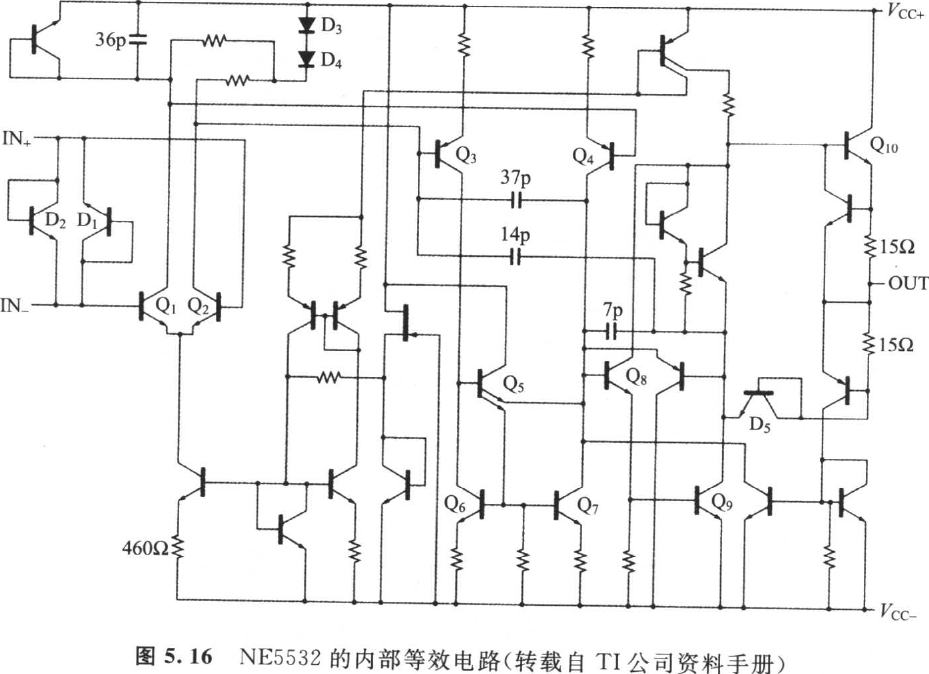
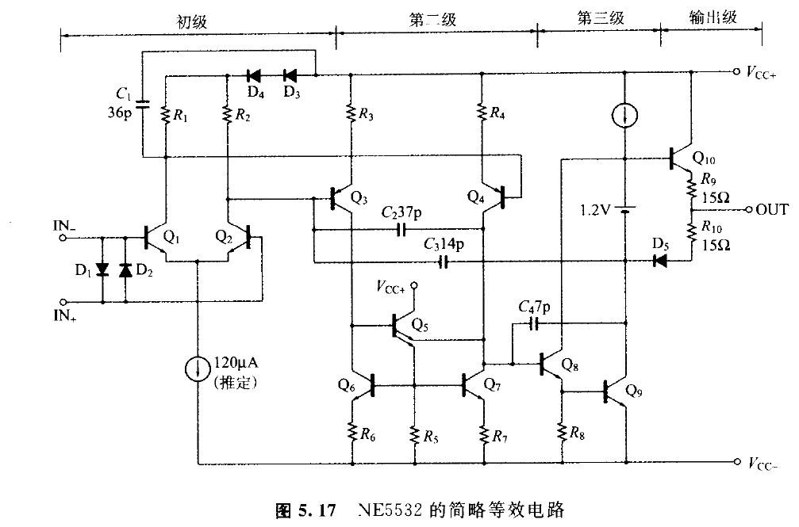
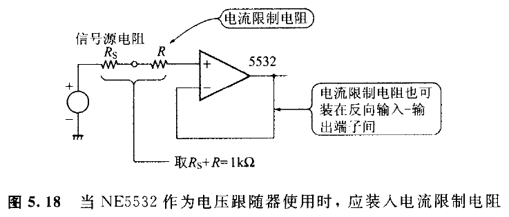
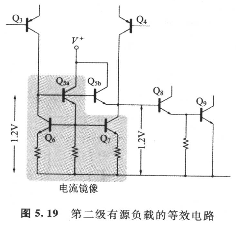
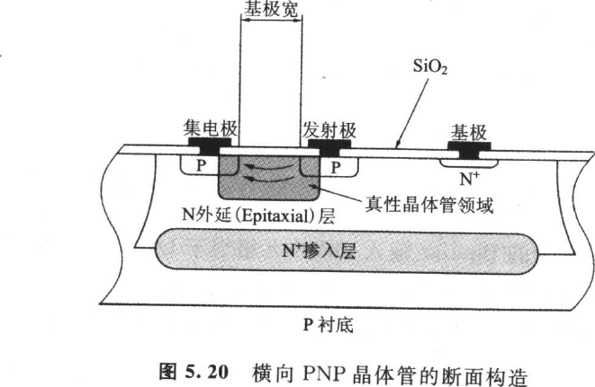
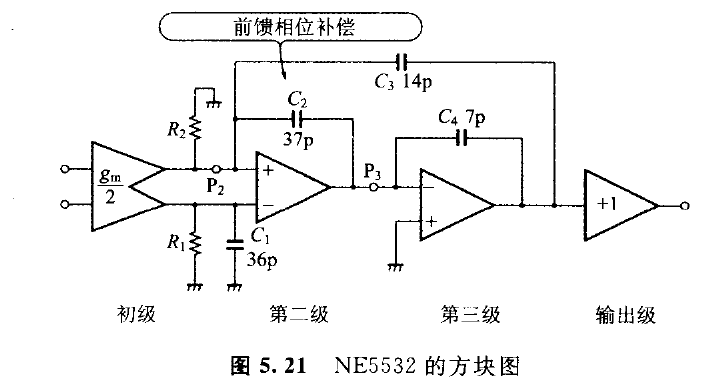
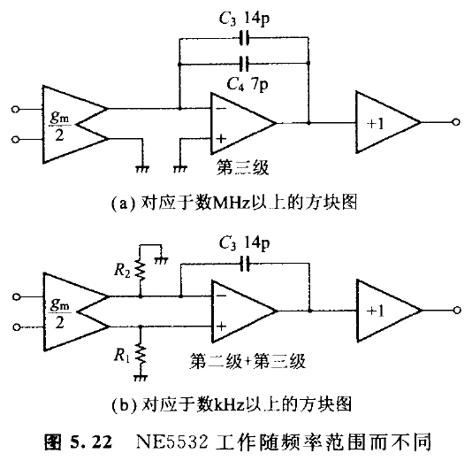
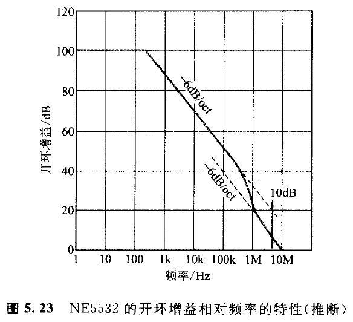

## 5.3　Bipolar 运算放大器 NE5532 的分析

<!-- 来源：PDF 第 164 页；原书第 150 页 -->

此运算放大器属于 Signetics 公司，该公司随后被飞利浦公司所收购。但是，具有相同类型名的运算放大器（Second Source）已由各公司所提供。

初级差动元件使用 NPN 型 BJT 的通用运算放大器。输入噪声级小到 5 nV/√Hz，归类于低噪声类型并不见怪。在电源电压=±18 V，600Ω 的负载下可得 10V_RMS 的输出电压。

具有宽频带、超低失真率、巨大的相位容限等优点，并具有以音响为中心，活跃广阔的领域。内部电路如图 5.16 所示，简略等效电路则如图 5.17 所示。

### 5.3.1　输入端子间二极管的任务

如果 BJT 的基极-发射极结崩溃（Break Down）时，\\(h_{FE}\\) 就减少，而噪声增加。因此 NE5532 在差动输入端子间插入 \\(D_1\\)、\\(D_2\\)，用以防止 \\(Q_1\\) 与 \\(Q_2\\) 的崩溃。运算放大器在线性工作时，差动输入电压非常小，所以通常 \\(D_1\\) 与 \\(D_2\\) 在实质上是非导通的。

<!-- 来源：PDF 第 165 页；原书第 151 页 -->

但是，像这样的运算放大器（NE5532）作为电压跟随器（Voltage Follower）使用时，当施加电源投入时，有过大电流经 \\(D_1\\)、\\(D_2\\) 的危险，所以如图 5.18 所示插入电流限制电阻。

表 5.1 所示的 Bipolar 输入 OP 并无相当于 \\(D_1\\)、\\(D_2\\) 的二极管。这些运算放大器由于初级差动元件而属于后述的横向（Lateral）PNP 晶体管构造，从而导致基极-发射极结的崩溃电压高（在 30 V 以上）。

### 5.3.2　电流镜像与饱和防止电路

图 5.17 的 \\(Q_6\\)、\\(Q_8\\)、\\(Q_7\\) 的等效电路如图 5.19 所示，\\(Q_{2a}\\)、\\(Q_8\\)、\\(Q_7\\)、\\(Q_9\\) 构成电流镜像。过大输入 \\(Q_{3b}\\) 时，应防止 \\(Q_7\\) 的 \\(V_{CE}\\) 饱和。正常工作时，\\(Q_{3b}\\) 的基极-发射极间大致为零，\\(Q_{3b}\\) 如同没有。

### 5.3.3　横向（Lateral）PNP 晶体管

在一块半导体基板上，由 NPN 晶体管连接在一起再形成具有同等性能的 PNP 晶体管（Wafer 制作过程变复杂）时，成本会高涨，所以通用运算放大器需要 PNP 晶体管时，使用便宜的"Lateral PNP 晶体管"。

Lateral PNP 晶体管的断面构造如图 5.20 所示，这是把 NPN 型 BJT 的集电极领域转用作 PNP 的基极领域，电流在基极领域内做横向（Lateral）流动。

<!-- 来源：PDF 第 166 页；原书第 152 页 -->

如第 4 章(4.1)所示，BJT 的正向转移时间 \\(τ_F\\)，即载波的基极运行时间，与基极宽的乘方成正比。但是 Lateral PNP 的基极宽约为 NPN 的十倍，Lateral PNP 的 \\(τ_F\\) 比 NPN 大两位数。从而 Lateral PNP 的暂态频率 \\(f_T\\)，比 NPN 型低两位数左右的 5～10 倍（参照第 3 章附录 A 的式(A.24)，应用该制造过程造出不频率好的 PNP 晶体管。

### 5.3.4　前馈（Feed-forward）相位补偿

图 5.17 的 \\(Q_3\\)、\\(Q_4\\) 因属于横向 PNP，所以频率特性并不好，因此要改善频率特性，而插入 \\(C_2\\)=37 pF，并且仔细考虑高频带信号，旁路 \\(Q_3\\)、\\(Q_4\\) 与 \\(Q_8\\) 的基极连接。因高频信号通过 \\(C_2\\) 向前传送，所以称为"前馈（相位）补偿（Feed-forward Compensation）"[14]。

图 5.17 所示，NE5532 是由三级电压放大+输出级构成，如图 5.21 所示的方块表示。进而 \\(C_2\\) 被视为短路的高频率则归结于图 5.22(a) 所示的方块图。另外数百 kHz 以下的频率便归结于图 5.22(b)所示的方块图。

<!-- 来源：PDF 第 167 页；原书第 153 页 -->

(\\(C_3\\)+\\(C_4\\))在图 5.22(a)中作为局部负反馈电容使用，频率在数 MHz 以上时，其开环增益 A 为：

\\\[
A=\frac{g_{\mathrm{m}}}{j\omega(C_3+C_4)}
\tag{5.12}
\\\]

从而单位增益频率 \\(f_T\\) 是

\\\[
f_{\mathrm{T}}=\frac{g_{\mathrm{m}}/2}{2\pi(C_3+C_4)}=\frac{1.2\times10^{-3}}{6.28\times(14+7)\times10^{-12}}=9.1(\mathrm{MHz})
\\\]

不妨再回到图 5.21。节点(Node)\\(P_2\\) 与 \\(P_3\\) 属同相，故由 \\(C_2\\) 施加正反馈时，有可能不稳定。因此借助 \\(C_3\\)=14 pF 施加局部负反馈以抵消正反馈。频率在数百 kHz 以下（第 2 级+第 3 级）时，增益会非常高，所以归结于图 5.22(b)的方块图。从而开环增益

<!-- 来源：PDF 第 168 页；原书第 154 页 -->

A 为：

\\\[
A=\frac{g_{\mathrm{m}}}{j\omega C_3}
\tag{5.13}
\\\]

增益带宽积 GBP 是

\\\[
\mathrm{GBP}=\frac{G_{\mathrm{m}}}{2\pi C_3}=\frac{2.4\times10^{-3}}{6.28\times14\times10^{-12}}=27\,(\mathrm{MHz})
\\\]

像这样，使用前馈相位补偿的运算放大器的 \\(f_T\\) 与 GB 积并不一致。从式(5.12)与式(5.13)，应可形成如图 5.23 所示的频率特性。

