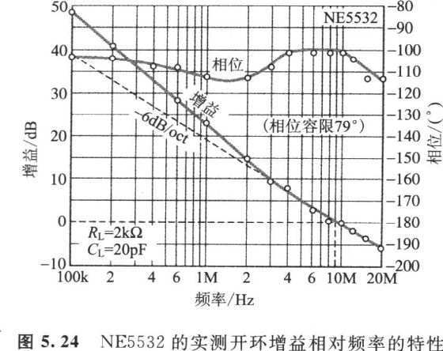
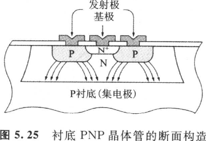
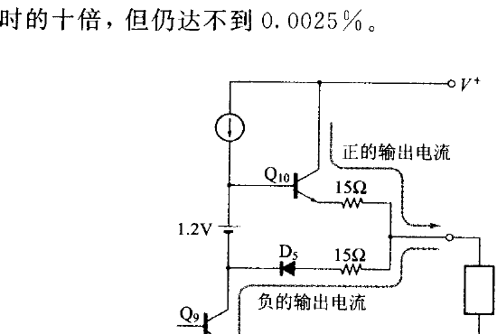
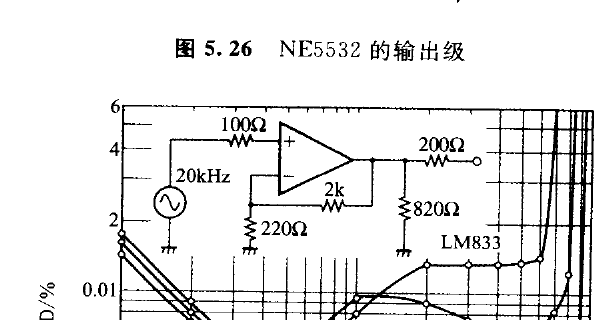

实测频率特性如图 5.24 所示，与预料的特性相同。

### 5.3.5　非对称 AB 级工作的输出级

几乎所有的通用运算放大器，输出级跟随器均使用 P 型半导体基板作为集电极的衬底（Substrate）PNP 晶体管（参照图 5.25）。衬底 PNP，虽比横向向 PNP 流过的集电极电流大，但比 NPN 型小，\\(h_{FE}\\) 与 \\(f_T\\) 也不如 NPN 型。

<!-- 来源：PDF 第 169 页；原书第 155 页 -->

因此用衬底 PNP 替换 NE5532，使用 NPN 型 PJT 的二极管连接（\\(D_9\\)）（图 5.26）。只是输出级从 \\(Q_{10}\\) 流出正的输出电流和负的输出电流，并流入 \\(Q_9\\) 的集电极的非对称 AB 级工作。

\\(Q_9\\) 的负载阻抗随信号的正负而变动，而且发生非直线失真。但是，实测的失真率如图 5.27 所示为超群的超低失真。原因是，\\(Q_9\\) 由 \\(C_3\\) 与 \\(C_4\\) 借加有多量的局部反馈。如果把全面的负反馈也加上去，则作用于 \\(Q_9\\) 的负反馈量在总体反馈时就达到 100%。假定 \\(Q_9\\) 的失真率即使有 25%，但总体反馈时的失真率仍为：

\\\[
25\%\div10^5=0.000\,25\%
\\\]

<!-- 来源：PDF 第 170 页；原书第 156 页 -->

图 5.27 的测试电路的反馈率是 0.1，所以失真率为总体反馈时的十倍，但仍达不到 0.0025%。

