# 第 6 章　高精度、低噪声运算放大器 IC 的分析

<!-- 来源：PDF 第 171 页；原书第 157 页 -->

识别并对直流微小信号进行放大的运算放大器称为高精度（Precision）运算放大器，识别并对交流微小信号进行放大的运算放大器则称之为低噪声运算放大器。

## 6.1 高精度运算放大器的构成与 OP07

### 6.1.1 高精度运算放大器

满足以下条件的运算放大器称为高精度型运算放大器为：

- 输入失调电压及其失调小；
- 输入偏置电流小；
- 开环增益高。

具代表性的高精度运算放大器如表 6.1 所示。

<!-- 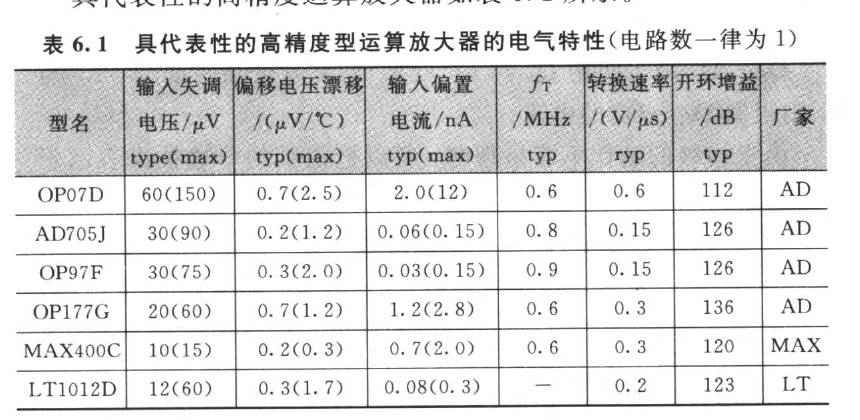 -->

**表 6.1　具代表性的高精度型运算放大器的电气特性（电路数一律为 1）**

| 型号 | 输入失调电压 /μV typ(max) | 偏移电压漂移 /(μV/℃) typ(max) | 输入偏置电流 /nA typ(max) | \(f_T\) /MHz typ | 转换速率 /(V/μs) typ | 开环增益 /dB typ | 厂家 |
|---|---:|---:|---:|---:|---:|---:|---|
| OP07D | 60(150) | 0.7(2.5) | 2.0(12) | 0.6 | 0.6 | 112 | AD |
| AD705J | 30(90) | 0.2(1.2) | 0.06(0.15) | 0.8 | 0.15 | 126 | AD |
| OP97F | 30(75) | 0.3(2.0) | 0.03(0.15) | 0.9 | 0.15 | 126 | AD |
| OP177G | 20(60) | 0.7(1.2) | 1.2(2.8) | 0.6 | 0.3 | 136 | AD |
| MAX400C | 10(15) | 0.2(0.3) | 0.7(2.0) | 0.6 | 0.3 | 120 | MAX |
| LT1012D | 12(60) | 0.3(1.7) | 0.08(0.3) | — | 0.2 | 123 | LT |

**表 6.1　具代表性的高精度型运算放大器的电气特性（电路数一律为 1）**

被称为高精度运算放大器的不计其数，但使用最多的是 OP07。就像似以的高精度运算放大器的代名词那样，为达到高精度，在设计电路时所费的心思几乎全都集中在此运算放大器。

运算放大器的输入失调电压基本由初级的有源元件（Active-element）决定。双极性晶体管 BJT 与 JFET 相比，BJT 的输入失调电压能够做得比较小，但常温时却有基极电流比 JFET 的栅极电流多数位数的缺点。因此，就要尽力缩小输入偏置电流。

### 6.1.2 输入偏置电流抵消电路

OP07 检测出初级 BJT 的基极电流，并用电流镜像抵消输入偏置电流。OP07 的简略等效电路如图 6.1 所示。初级由 \\(Q_1\\)～\\(Q_6\\) 构成，\\(Q_1\\) 与 \\(Q_2\\) 是差动放大电路，\\(Q_3\\) 与 \\(Q_4\\) 则为纵向连接晶体管（Cascode transistor）。

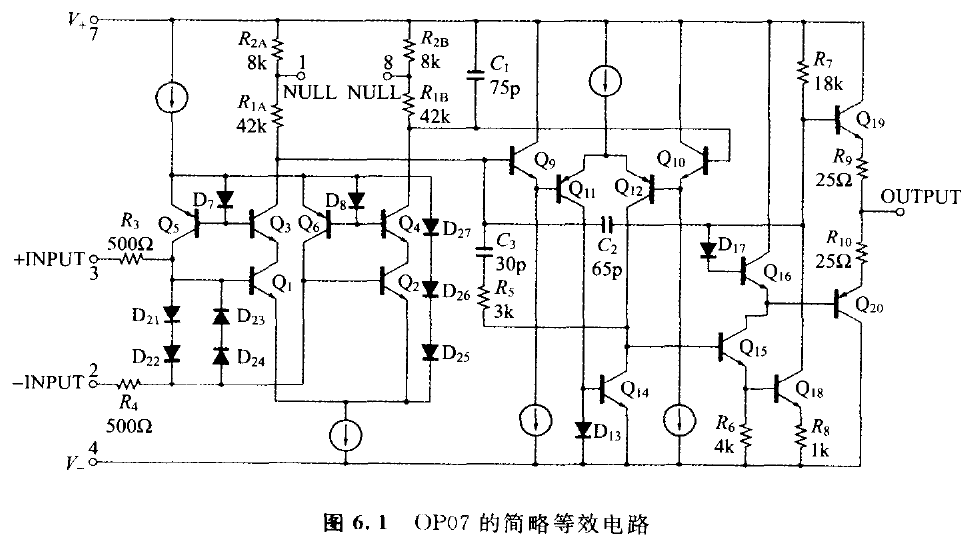

**图 6.1　OP07 的简略等效电路**

<!-- 来源：PDF 第 172 页；原书第 158 页 -->

\\(D_{21}\\)～\\(D_{24}\\) 用于防止 \\(Q_1\\) 与 \\(Q_2\\) 的基极-发射极结的崩溃，\\(R_3\\) 与 \\(R_4\\) 则限制 \\(D_{21}\\)～\\(D_{24}\\) 的电流。

由于初级的动作不容易理解，所以把初级的单边抽出表示于图 6.2。\\(D_{25}\\)、\\(D_{26}\\)、\\(D_{27}\\) 与 1.8 V 的电池等效。\\(Q_1\\) 与 \\(Q_3\\) 构成 Cascode Bootstrap，\\(Q_3\\) 的基极电位由 \\(Q_1\\) 的发射极电位提升而得到为 1.2 V（下式）。

\\[
V_{\mathrm{D}25}+V_{\mathrm{D}26}+V_{\mathrm{D}27}-V_{\mathrm{D}7}
\approx 1.2(\mathrm{V})
\\]

\\(D_4\\) 流有 \\(Q_2\\) 的基极电流 \\(I_{\mathrm{B}3}\\)，\\(Q_7\\) 与 \\(Q_8\\) 构成电流镜像。\\(Q_8\\) 的集电极电流 \\(I_{C5}\\) 是

\\[
I_{C5}\approx I_{\mathrm{D}7}\approx I_{\mathrm{B}3}
\tag{6.1}
\\]

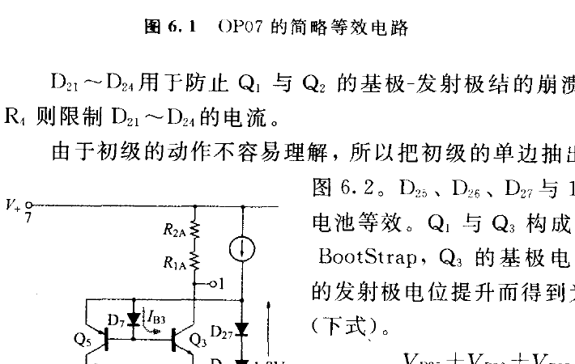

**图 6.2　OP07 的初级的 1/2 等效电路**

从而输入偏置电流 \\(I_{\mathrm{bias}}\\) 为：

\\[
I_{\mathrm{bias}}=I_{\mathrm{B}1}-I_{C5}\approx I_{\mathrm{B}1}-I_{\mathrm{B}3}\approx 0
\tag{6.2}
\\]

\\(I_{\mathrm{bias}}\\) 的符号不一定，但可看出 \\(I_{\mathrm{bias}}\\) 绝对值大致的标准。\\(Q_1\\) 与 \\(Q_3\\) 的集电极电流为 8 μA 左右，\\(Q_5\\) 的 \\(h_{\mathrm{FE}}\\) 者为 200，则 \\(Q_1\\) 与 \\(Q_2\\) 的各基极电流约为 40 nA。

\\(Q_5\\) 属于横向 PNP。从而 \\(h_{\mathrm{FE}}\\) 相当小，因此 \\(D_7\\) 与 \\(Q_5\\) 的电流镜像匹配的并不好，以致 \\(I_{C5}\\) 与 \\(I_{\mathrm{B}1}\\) 之间有 5%～20% 的误差[15]。假设此误差为 5%，则输入偏置电流约为 2 nA（参照图 6.3）。

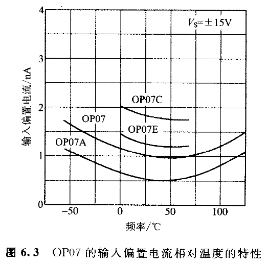

**图 6.3　OP07 的输入偏置电流相对温度的特性**

<!-- 来源：PDF 第 173 页；原书第 159 页 -->

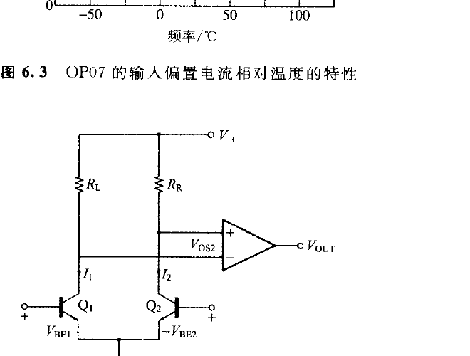

**图 6.4　初级为电阻负载的运算放大器的等效电路**

### 6.1.3 减小输入失调电压的窍门

为使 OP07 输入失调电压最小化，对图 6.1 所示 \\(R_{2A}\\) 与 \\(R_{2B}\\) 的值在中测（Wafer test）时施加微调（Trimming）。

如 OP07 初级为电阻负载的运算放大器，以图 6.4 的等效电路表示[16]，输入失调电压 \\(V_{OS}\\) 可由下式表达：

\\[
\begin{aligned}
V_{OS}&=(V_{BE1}-V_{BE2})|V_{OUT}=0\\\\
&=\frac{kT}{q}\ln\frac{I_1 I_{S2}}{I_2 I_{S1}}
\end{aligned}
\tag{6.3}
\\]

（\\(I_{S1}\\)：\\(Q_1\\) 的饱和电流，\\(I_{S2}\\)：\\(Q_2\\) 的饱和电流）

在此第二级的失调电压 \\(V_{OS2}\\) 如果远小于 \\(I_1 \cdot R_L\\)，事实上 \\(I_1 \cdot R_L=I_2 \cdot R_L\\) 将成立。从而式(6.3)将成为：

\\[
V_{OS}=\frac{kT}{q}\ln\frac{R_R I_{S2}}{R_L I_{S1}}
\tag{6.4}
\\]

因此，只要对 \\(R_R/R_L\\) 施以 Trimming 则满足

\\[
\left(\frac{R_R}{R_L}\right)\left(\frac{I_{S2}}{I_{S1}}\right)=1
\tag{6.5}
\\]

那么输入失调电压就会成为零。

实际上如图 6.5 所示，在 \\(R_{24}\\) 设置分接头（Tap），当 Wafer test 时把适当的邻接 Tap 加以短路，以调整 \\(R_R/R_L\\)[16]。借助短路调整电阻值的方法称为"zener zap trimming"。是在 Tap 间所连接的齐纳二极管（其实是 NPN 晶体管的基极-发射极结）中通以巨大的脉冲进发电流，并熔融短路齐纳二极管的方法。

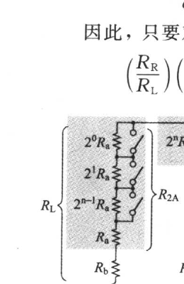

**图 6.5　运算放大器的初级负载电阻**

<!-- 来源：PDF 第 174 页；原书第 160 页 -->

### 6.1.4 OP07 的 AC 特性与噪声特性

OP07 的开环增益比通用型运算放大器 112 dB(typ)高，但 GB 积与转换速率却比通用型小，全功率(full power)响应频率并不高（图 6.6）。高精度运算放大器的器件几乎都是作为直流放大器使用，所以认为频率特性并不太重要。

可是运算放大器的噪声，一般情形时，如图 6.7 所示，以 3 dB/oct 上升。此低频带噪声成份仍叫做 1/f 噪声。1/f 噪声的渐近线与白噪声（white noise）直线相交的频率叫做 1/f 角频率。

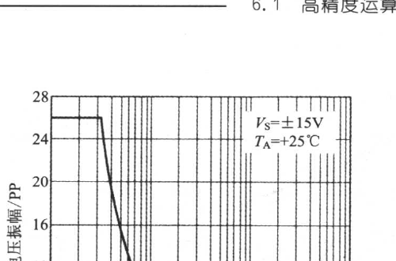

**图 6.6　OP07 的最大输出电压振幅相对频率的特性**

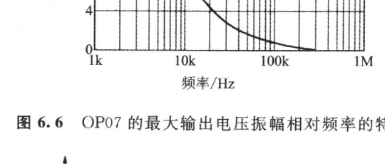

**图 6.7　1/f 噪声**

<!-- 来源：PDF 第 175 页；原书第 161 页 -->

高精度型运算放大器的特征为 1/f 角频率低。如图 6.8 所示，通用型运算放大器 4558 的 1/f 角频率约为 30 Hz，至于高精度型运算放大器的 OP07 则约为 1 Hz。

另外，虽是高精度型运算放大器，但当信号源电阻 \\(R_s\\) 的值高时，则如图 6.8 所示的曲线那样，1/f 角频率会上升。

### 6.1.5 高精度运算放大器使用于 DC 伺服电路

OP07 适用于数百 Hz 以下的微小信号放大和滤波器电路。图 6.9 就是在反馈电路中装入米勒积分器，用以抵消主放大器的失调电压的电阻（DC 伺服）。输出失调电压 \\((V_{OUT})_{DC}\\) 与运算放大器 \\(A_1\\) 及 \\(A_2\\) 的失调电压无关，如下列等于 OP07 的输入失调。

\\[
(V_{OUT})\_{DC}=V\_{OS}+(R\_6)I\_{\mathrm{bias}}
\tag{6.6}
\\]

其中，\\(V_{OS}\\) 为 OP07 的输入失调电压；\\(I_{\mathrm{bias}}\\) 为 OP07 的输入偏置电流。

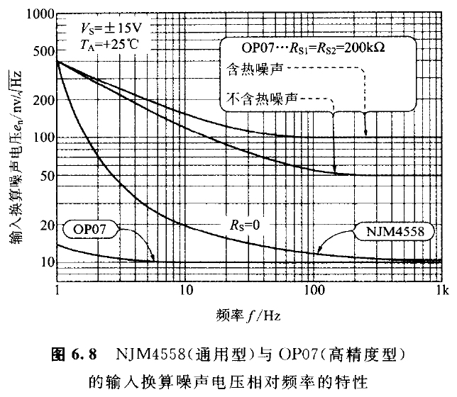

**图 6.8　NJM4558(通用型) 与 OP07(高精度型) 的输入换算噪声电压相对频率的特性**

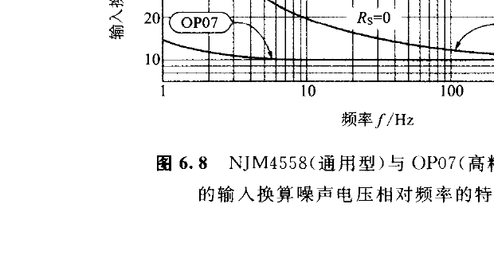

**图 6.9　DC 伺服平坦放大器**

<!-- 来源：PDF 第 176 页；原书第 162 页 -->

再者，\\(R_3\\) 会对闭环增益 \\((V_{OUT}/V_{IN})\\) 造成影响。即

\\[
\frac{V_{OUT}}{V_{IN}}=\frac{(R_1//R_3)+R_2}{(R_1//R_3)}
\tag{6.7}
\\]

当用 DC 伺服电路抵消主放大器的失调电压时，其代价是低频带的频率特性将下降（参照图 6.10）。－3 dB 低频带截止频率 \\(f_{CL}\\) 为：

\\[
f_{CL}=\left(\frac{1}{2\pi CR_6}\right)\left(\frac{R_2}{R_3}\right)\left(\frac{R_4}{R_5}\right)
\tag{6.8}
\\]

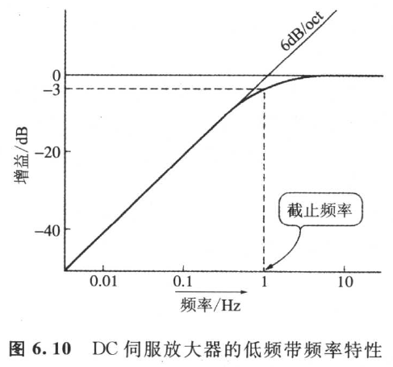

**图 6.10　DC 伺服放大器的低频带频率特性**

<!-- 来源：PDF 第 177 页；原书第 163 页 -->

## ◆ 6.2 低噪声运算放大器与噪声分析的基础[17,18]

低噪声运算放大器，特别是在处理交流微小信号时所使用的运算放大器。需要注意的是，放大的时候不应出现噪声与失真。在提出低噪声运算放大器的结构之前，不妨先对在噪声分析时的用语与概念进行说明。

### 6.2.1 噪声波的大小以乘方平均值表示

噪声有噪声电压与噪声电流两种。噪声波的大小（power）以乘方平均值进行评价。一般把不规则变数 \\(x(t)\\) 的乘方平均值记为 \\(\overline{x^2}\\)，所以

- 噪声电压 \\(v_n(t)\\) 的乘方平均值是：

\\[
\overline{v_n^2}=\lim_{T\to\infty}\frac{1}{2T}\int_{-T}^{T}[v_n(t)]^2\mathrm{d}t
\tag{6.9}
\\]

- 噪声电流 \\(i_n(t)\\) 的乘方平均值则为：

\\[
\overline{i_n^2}=\lim_{T\to\infty}\frac{1}{2T}\int_{-T}^{T}[i_n(t)]^2\mathrm{d}t
\tag{6.10}
\\]

以下定义是依据时间进行平均的定义，但仍可用总体（Ensemble）均值[19,20]来定意义。

---

**专　栏**

### 总体均值（Ensemble average）

总体均值（Ensemble average，又叫做集合平均）是指例如特性完全相同的无穷多个晶体管，在完全相同的条件下工作。在其时刻测试各晶体管所产生噪声的大小，并把所得结果进行平均，则此平均值与测试时刻无关，均为相同值。

像这样同种多数的程序在同时刻的平均叫做总体均值（Ensemble average）。使总体均值与时间平均（即遍及一个过程的长时间的平均）一致的随机处理（Random process）称为 Ergodic process。热噪声和散粒（shot）噪声属于典型的 Ergodic Process。

举例来说明，也许就像反复掷一个骰子，对所显出的点数加以以平均即为"时间平均"，多数的骰子同时掷出，对所显示出的点数进行平均则为"Ensemble 平均"。

---

<!-- 来源：PDF 第 178 页；原书第 164 页 -->

### 6.2.2 由电阻产生的热噪声

运算放大器内部所产生的支配性噪声，就是所谓的热噪声与散粒噪声。这里的热噪声是由电阻内电子的任意（Random）热运动而产生的白噪声（均勾包含在所有频率成份的噪声）。与电阻的种类无关，所有电阻都会产生热噪声。

热噪声电压 \\(v_n(t)\\) 的乘方平均值，如下式所示，与绝对温度、电阻值和频带宽成正比。

\\[
\overline{v_n^2}=4kTRB
\tag{6.11}
\\]

其中，\\(k\\) 为玻耳兹曼常数；\\(1.3805\times10^{-23}(\mathrm{J/K})\\)；\\(T\\) 为绝对温度（K）；\\(B\\) 为频带宽（Hz）；\\(R\\) 为电阻值（Ω）。

热噪声的有效电压是式(6.11)的平方根。即，

\\[
\sqrt{\overline{v_n^2}}=\sqrt{4kTRB}(V_{rms})
\tag{6.12}
\\]

当式(6.12)中 \\(B=1~Hz\\) 时，即 \\(\sqrt{4kTR}\\) 叫做"单位带宽的热噪声电压"或者"热噪声电压密度"（图 6.11），单位是 \\(V/\sqrt{\mathrm{Hz}}\\)。譬如说 1 kΩ 的热噪声电压密度在 \\(T=290~K\\) 时为：

\\[
4nV/\sqrt{\mathrm{Hz}}
\\]

如图 6.12 所示，把 1 kΩ 的电阻连接在通过频带宽＝20 kHz 的理想低通带滤波器，则根据式(6.12)，从低通带滤波器将输出如下噪声，

\\[
4nV_{RMS}\times\sqrt{20~000}=0.56\mu V_{RMS}
\\]

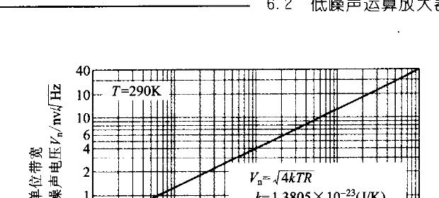

**图 6.11　每单位带宽的热噪声电压相对电阻值**

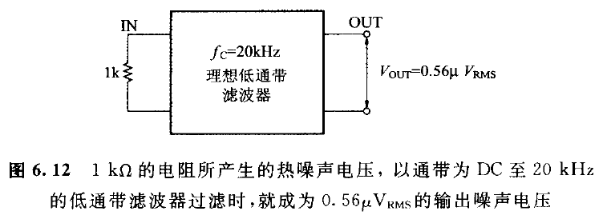

**图 6.12　1 kΩ 的电阻所产生的热噪声电压，通过带为 DC 至 20 kHz 的低通带滤波器过滤时，就成为 \\(0.56\\ \\mu\\mathrm{V}_{RMS}\\) 的输出噪声电压**

<!-- 来源：PDF 第 179 页；原书第 165 页 -->

### 6.2.3 理想双极性晶体管的散粒噪声

散粒(shot)噪声，就是根据泊松法则，因散乱过程事实上所产生的白噪声（white noise）。以半导体而言，是由各个载波独立横过 PN 接合而产生的，可当作电流的摇曳来观测。

BJT 双极性晶体管有两个 PN 结与两种载波（电子与正孔），所以合计有四个散粒噪声源，但可总括为如图 6.13 所示的有关基极电流的散粒噪声电流 \\(i_{ni}\\)，和有关集电极电流的散粒噪声电流 \\(i_{no}\\) 二者。散粒噪声电流 \\(i_{ni}\\) 与 \\(i_{no}\\) 的乘方平均值分别由下式表达。

\\[
\overline{i_{ni}^2}=2qI_B B
\tag{6.13}
\\]

\\[
\overline{i_{no}^2}=2qI_C B
\tag{6.14}
\\]

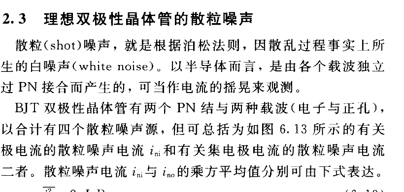

**图 6.13　双极性晶体管的散粒噪声电流源**

其中，\\(I_B\\) 为直流基极电流；\\(I_C\\) 为直流集电极电流；\\(q\\) 为电子的电荷为 \\(1.602\times10^{-19}\\) [库仑]；\\(B\\) 为频带宽（Hz）。

### 6.2.4 理想双极性晶体管的噪声等效电路

放大器的输入端子短路时的输出噪声电压，除以放大器的电压增益 |A| 所得结果叫做输入换算噪声电压。这是放大器的内部所发生的噪声，用插入于放大器的输入等噪声声电压来替代而得到的。

下面具体进行说明。如图 6.13 的点线所示把基极-发射极间进行短路，负载电阻 \\(R_L\\) 连接于集电极-发射极间时，输出噪声电压 \\(v_{no}\\) 与电压增益 |A| 是：

\\[
v_{no}=R_L i_{ic}\\\\
|A|=g_m R_L\\\\
\\]

其中，\\(g_m\\) 为晶体管的互导。

所以输入换算噪声电压 \\(v_{ni}\\) 为：

\\[
v_{ni}=\frac{v_{no}}{|A|}=\frac{i_{ic}}{g_m}
\tag{6.15}
\\]

可得图 6.14 的等效电路。

\\(v_{ni}\\) 的乘方平均值根据式(6.14)与式(6.15)可用下式表达：

\\[
\overline{v_n^2}=\frac{2qI_CB}{g_m^2}
\tag{6.16}
\\]

至于推导式(6.15)时，虽把基极-发射极间进行短路，但在图 6.14 所示的等效电路中，不把基极-发射极间进行短路时，仍可使用。

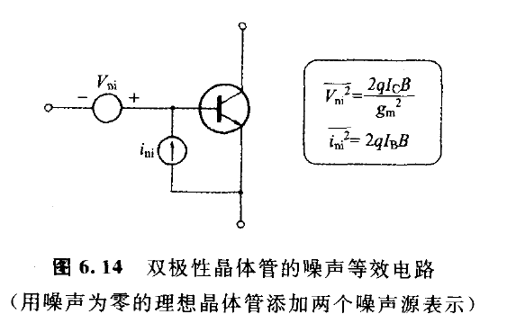

**图 6.14　双极性晶体管的噪声等效电路（用噪声为零的理想晶体管添加两个噪声源表示）**

<!-- 来源：PDF 第 181 页；原书第 166 页 -->

### 6.2.5 差动放大电路的噪声等效电路

图 6.14 所示噪声电流源 \\(i_{ni}\\) 虽然连接于基极-发射极间，但差动放大电路如图 6.15 所示，即使把 \\(i_{ni}\\) 连接在基极-GND 间，但输出噪声的大小相同。

在图 6.15 中，假定 \\(I_{C1}=I_{C2}=I_C\\)，则输入换算噪声电压 \\(v_{n1}\\) 与 \\(v_{n2}\\) 的各乘方平均值相等，而成立下式。

\\[
\overline{v_{n1}^2}=\overline{v_{n2}^2}=\frac{2qI_CB}{g_m^2}
\tag{6.17}
\\]

还有，假如 \\(I_{B1}=I_{B2}=I_B\\)，噪声电流 \\(i_{n1}\\) 与 \\(i_{n2}\\) 的各乘方平均值可用下式表达：

\\[
\overline{i_{i1}^2}=\overline{i_{i2}^2}=2qI_BB
\tag{6.18}
\\]

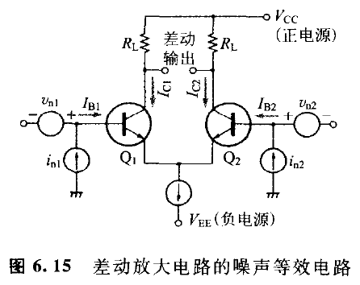

**图 6.15　差动放大电路的噪声等效电路**

<!-- 来源：PDF 第 182 页；原书第 167 页 -->

### 6.2.6 运算放大器的噪声等效电路

双极输入型运算放大器的噪声等效电路也可以用图 6.15 表示。但因差动放大电路的共模抑制比（后述）十分大，所以也可以把 \\(Q_2\\) 的输入换算噪声电压 \\(v_{n2}\\) 移动到 \\(Q_1\\) 的基极端，然后把 \\(v_{n1}\\) 与 \\(v_{n2}\\) 合并成一个噪声电压 \\(v_n\\)，便可推导出图 6.16。于是输入换算噪声电压 \\(v_n(t)\\) 就可用下式表达：

\\[
v_n(t)=v_{n1}(t)-v_{n2}(t)
\tag{6.19}
\\]

而且 \\(v_n(t)\\) 的乘方平均值为：

\\[
\overline{v_n^2}=(\overline{v_{n1}-v_{n2}})^2=\overline{v_{n1}^2}-\overline{2v_{n1}v_{n2}}+\overline{v_{n2}^2}
\tag{6.20}
\\]

在此因 \\(v_{n1}(t)\\) 与 \\(v_{n2}(t)\\) 相互独立，故可成立

\\[
\overline{v_{n1}v_{n2}}=\overline{v_{n1}} \cdot \overline{v_{n2}}=0
\tag{6.21}
\\]

把式(6.21)代入式(6.20)，则可得

\\[
\overline{v_n^2}=\overline{v_{n1}^2}+\overline{v_{n2}^2}
\tag{6.22}
\\]

而把式(6.22)代入式(6.17)，则

\\[
\overline{v_n^2}=\frac{4qI_CB}{g_m^2}
\tag{6.23}
\\]

在此根据第 2 章的式(2.1)与式(2.2)互导 \\(g_m\\) 应为：

\\[
g_m=\frac{\mathrm{d}I_C}{\mathrm{d}V_{BE}}=\left(\frac{q}{kT}\right)|I_C|
\tag{6.24}
\\]

把式(6.24)代入式(6.23)则可得下式。

\\[
\overline{v_n^2}=\left(\frac{4k^2T^2}{qI_C}\right)B
\tag{6.25}
\\]

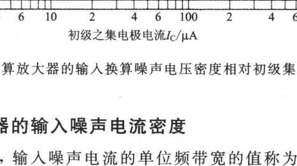

**图 6.16　运算放大器的噪声等效电路**

<!-- 来源：PDF 第 183 页；原书第 168 页 -->

### 6.2.7 运算放大器的输入换算噪声电压密度

每单位频带的输入换算噪声电压叫做"输入换算噪声电压密度"。由于该名称比较冗长，因此也称之为"输入噪声电压密度"或者"噪声电压密度"，甚至"输入噪声电压"。

初级使用理想 BJT 差动放大电路的运算放大器的输入换算噪声电压密度 \\(v_n\\)，根据式(6.25)，当为：

\\[
v_n=\sqrt{\overline{v_n^2}|_{B=1}}=\frac{2kT}{\sqrt{qI_C}}
\tag{6.26}
\\]

输入换算噪声电压密度 \\(v_n\\)，与集电极电流的平方根成反比，由此可知，想要降低 \\(v_n\\)，必须加大初级的集电极电流。

现将几个运算放大器的 \\(v_n\\) 与初级集电极电流之间的关系表示于图 6.17。虽然大于根据式(6.26)计算而得到的，但原因如下：

① 实际的晶体管在基极端子与有效基极间有基极电阻（参照第 3 章附录 A 的图 A.4），将添加其热噪声；

② 将添加初级负载电阻的热噪声和有源负载（电流镜像）的散粒噪声；

③ 将添加第二级以后的噪声；

④ 温度将随自身发热而上升。

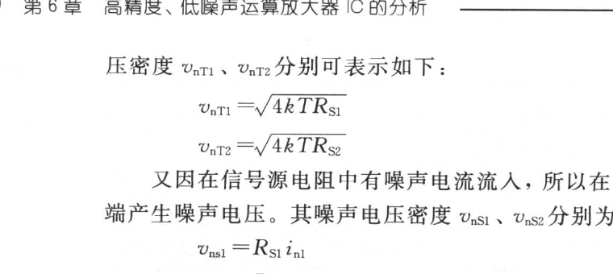

**图 6.17　双极输入型运算放大器的输入换算噪声电压密度相对初级集电极电流的特性**

<!-- 来源：PDF 第 184 页；原书第 169 页 -->

### 6.2.8 运算放大器的输入噪声电流密度

在运算放大器上，输入噪声电流的单位频带的量称为"输入噪声电流密度"。图 6.16 中以 \\(i_{n1}\\)、\\(i_{n2}\\) 记录。

图 6.14 所示的 \\(Q_1\\) 与 \\(Q_2\\) 为理想晶体管，而且当 \\(I_{B1}=I_{B2}=I_B\\) 成立时，双极输入型的输入噪声电流密度 \\(i_{n1}\\) 与 \\(i_{n2}\\)，就是在式(6.18)中代入 B=1，并取其平方根而得的值。即可用下式表示：

\\[
i_{n1}=i_{n2}=\sqrt{2qI_B}(\mathrm{A}/\sqrt{\mathrm{Hz}})
\tag{6.27}
\\]

### 6.2.9 信号源电阻的影响

运算放大器的实际应用电路，如图 6.18 所示在输入端子连接有信号源电阻 \\(R_{S1}\\) 与 \\(R_{S2}\\)。电阻将产生热噪声，此时的热噪声电压密度 \\(v_{nT1}\\)、\\(v_{nT2}\\) 分别可表示如下：

\\[
v_{nT1}=\sqrt{4kTR_{S1}}
\tag{6.28a}
\\]
\\[
v_{nT2}=\sqrt{4kTR_{S2}}
\tag{6.28b}
\\]

又因在信号源电阻中有噪声电流流入，所以在 \\(R_S\\) 与 \\(R_S\\) 的两端产生噪声电压。其噪声电压密度 \\(v_{ns1}\\)、\\(v_{ns2}\\) 分别为：

\\[
v_{ns1}=R_{S1}i_{n1}
\tag{6.29a}
\\]
\\[
v_{ns2}=R_{S2}i_{n2}
\tag{6.29b}
\\]

从面如图 6.18，可用拥有五个电压噪声源的图 6.19 的等效电路替代。

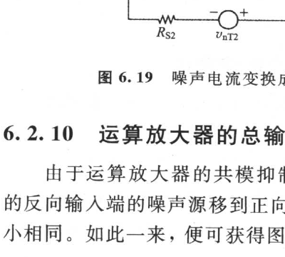

**图 6.18　已考虑信号源电阻的噪声等效电路**

<!-- 来源：PDF 第 185 页；原书第 170 页 -->

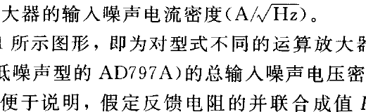

**图 6.19　噪声电流变换成噪声电压的噪声等效电路**

### 6.2.10 运算放大器的总输入噪声电压密度

由于运算放大器的共模抑制比非常大，所以把图 6.19 所示的反向输入端的噪声源移到正向输入端，这时输出噪声电压的大小相同。如此一来，便可获得图 6.20 的等效电路。

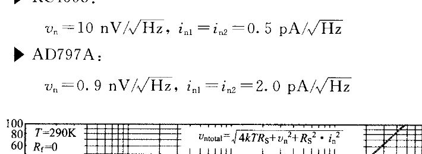

**图 6.20　把所有的噪声源集中于正向输入端的噪声等效电路**

五个噪声电压的总和即为总输入噪声电压密度 \\(v_{ntotal}\\)，因为五个噪声源独立，所以

\\[
\begin{aligned}
v_{ntotal}&=\sqrt{v_n T_1^2+v_n T_2^2+v_n^2+R_s^2 i_{n1}^2+R_f^2 i_{n2}^2}\\\\
&=\sqrt{4kT(R_s+R_f)+v_n^2+R_s^2 i_{n1}^2+R_f^2 i_{n2}^2}
\end{aligned}
\tag{6.30}
\\]

其中，\\(R_s\\) 为信号源电阻（Ω）；\\(R_f\\) 为反馈电阻 \\(R_1\\) 与 \\(R_2\\) 的并联合成值（Ω）；\\(v_n\\) 为运算放大器的输入换算噪声电压密度（V/\\(\sqrt{\mathrm{Hz}}\\)）；\\(i_{n1}\\)、\\(i_{n2}\\) 为运算放大器的输入噪声电流密度（A/\\(\sqrt{\mathrm{Hz}}\\)）。

图 6.21 所示图形，即为对型式不同的运算放大器（通用型的 RC4558 与低噪声型的 AD797A）的总输入噪声电压密度进行比较的结果。为便于说明，假定反馈电阻的并联合成值 \\(R_t\\) 为零。又运算放大器的输入换算噪声电压密度 \\(v_n\\)，与输入噪声电流密度 \\(i_{n1}\\) 与 \\(i_{n2}\\)，使用如下资料手册所记载的标准值。

▶ RC4558：

\\(v_n=10~nV/\sqrt{Hz},~i_{n1}=i_{n2}=0.5~pA/\sqrt{Hz}\\)

▶ AD797A：

\\(v_n=0.9~nV/\sqrt{Hz},~i_{n1}=i_{n2}=2.0~pA/\sqrt{Hz}\\)

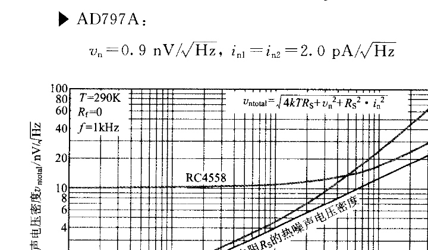

**图 6.21　运算放大器的总输入噪声电压密度相对信号源电阻的特性**

<!-- 来源：PDF 第 186 页；原书第 171 页 -->

正如从图 6.21 可知，信号源电阻 \\(R_s\\) 低时，AD797A 绝对处于低噪声。信号源电阻高时，在式(6.30)中 \\(R_s^2 \cdot i_{n1}^2\\) 占优势，所以 \\(i_n\\) 值小的 RC4558 就较有利。

因此当 \\(R_s\\) 低时，就要根据噪声电压密度，而当 \\(R_s\\) 高时，则根据噪声电流密度来选择运算放大器。

一般均称噪声电压密度小的运算放大器为低噪声型，因此此类型的集电极电流比通用型运算放大器大，所以自然基极电流会增加，噪声电流密度也随之增加。选择的大略标准如下所示：

- \\(R_s<1~kΩ\\) 为低噪声型；
- \\(1~kΩ<R_s<30~kΩ\\) 为通用型双极输入型；
- \\(R_s>30~kΩ\\) 为 FET 输入型。

### 6.2.11 反馈率的倒数——噪声增益(Noise gain)

在图 6.20 中，当把节点(Node)1 接地时就成为反向放大器，节点 2 接地则形成正向放大器，但二者的输出噪声电压 \\(v_{no}\\) 完全相同。即

\\[
v_{no}=v_{ntotal}\left(\frac{R_1+R_2}{R_1}\right)\sqrt{B}(V_{RMS})
\tag{6.31}
\\]

其中，\\(v_{ntotal}\\) 为总输入噪声电压密度（V/\\(\sqrt{Hz}\\)）（参照式(6.30)）；B 为频带宽（Hz）。

可是式(6.31)中的 \\((R_1+R_2)/R_1\\)，是反馈率 β 的倒数，但此反馈率的倒数就称之为"噪声增益"。正向放大器的闭环增益虽与噪声增益一致，但反向放大器的闭环增益却与噪声增益不同。譬如说反向放大器的闭环增益，设若 \\(R_2→0\\) 时将收敛为零，但噪声增益则收敛于 1。

采用此噪声增益的概念，则输出噪声电压、输出失调电压和负反馈的稳定性，可不区分反向放大器、正向放大器，而做统一性的考虑[21]。

<!-- 来源：PDF 第 187 页；原书第 172 页 -->

## ◆ 6.3 低噪声运算放大器 AD797 的构成

### 6.3.1 AD797 的开环增益

现将具代表性的低噪声运算放大器的电气特性列于表 6.2 中。这里除 AD743/AD745/AD797 以外，均与 OP07 同属三级电压放大结构。

AD797 属于较新的运算放大器，利用 Folded cascode 电路与巧妙的噪声抵消电路，实现超低噪声与超低失真率。图 6.22 表示 AD797 经简化的等效电路。

在图 6.22 上 \\(Q_1\\)、\\(Q_2\\)、\\(Q_3\\)、\\(Q_4\\) 是 Folded cascode 电路，\\(Q_5\\)、\\(Q_6\\) 则为电流镜像（Current Mirror）。如第 4 章所说明，Folded cascode 电路的增益是由由 Cascode 晶体管的输出电阻进行抑制。但是 AD797 则以 \\(Q_{12}\\) Bootstrap \\(Q_5\\)、\\(Q_6\\) 的共发射极，而把图 6.22 所示 A、B、C 点在交流上保持同电位，以抵消 \\(Q_4\\) 的输出电阻，并获得非常高的开环增益。

<!-- 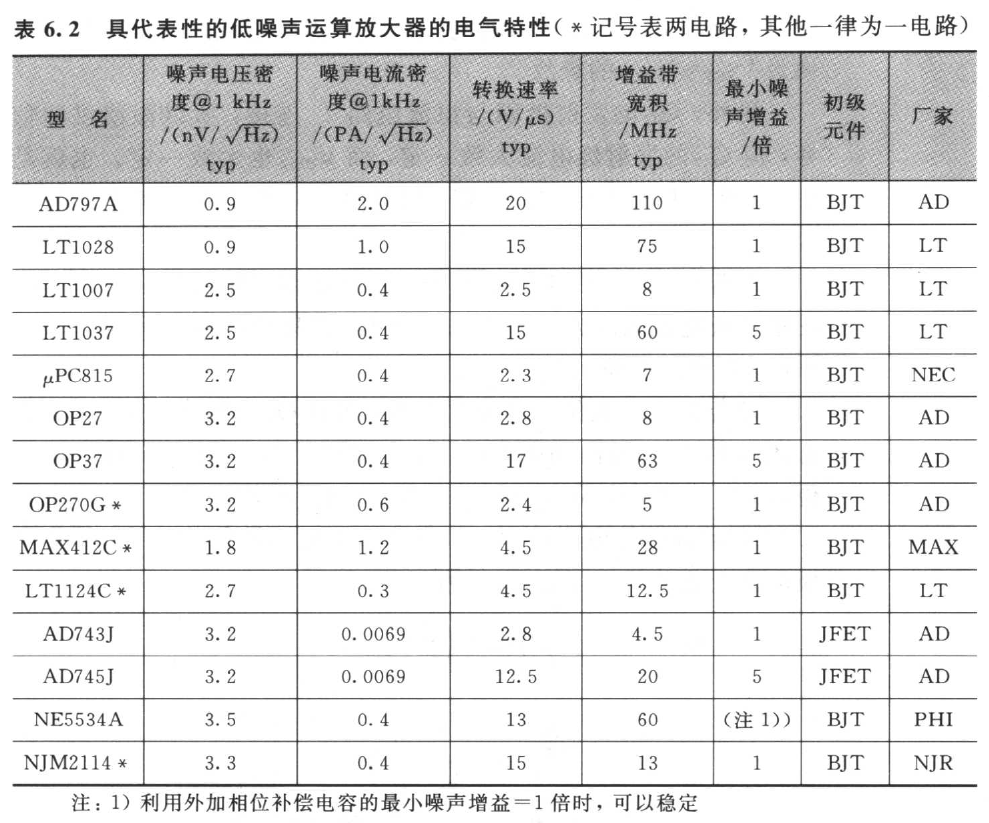 -->

**表 6.2　具代表性的低噪声运算放大器的电气特性（* 记号表两电路，其他一律为一电路）**

| 型号 | 噪声电压密度 @1 kHz /\\(\mathrm{nV}/\sqrt{\mathrm{Hz}}\\) typ | 噪声电流密度 @1 kHz /\\(\mathrm{pA}/\sqrt{\mathrm{Hz}}\\) typ | 转换速率 /(V/μs) typ | 增益带宽积 /MHz typ | 最小噪声增益 /倍 | 初级元件 | 厂家 |
|---|---:|---:|---:|---:|---:|---|---|
| AD797A | 0.9 | 2.0 | 20 | 110 | 1 | BJT | AD |
| LT1028 | 0.9 | 1.0 | 15 | 75 | 1 | BJT | LT |
| LT1007 | 2.5 | 0.4 | 2.5 | 8 | 1 | BJT | LT |
| LT1037 | 2.5 | 0.4 | 15 | 60 | 5 | BJT | LT |
| μPC815 | 2.7 | 0.4 | 2.3 | 7 | 1 | BJT | NEC |
| OP27 | 3.2 | 0.4 | 2.8 | 8 | 1 | BJT | AD |
| OP37 | 3.2 | 0.4 | 17 | 63 | 5 | BJT | AD |
| OP270G* | 3.2 | 0.6 | 2.4 | 5 | 1 | BJT | AD |
| MAX412C* | 1.8 | 1.2 | 4.5 | 28 | 1 | BJT | MAX |
| LT11124C* | 2.7 | 0.3 | 4.5 | 12.5 | 1 | BJT | LT |
| AD743J | 3.2 | 0.0069 | 2.8 | 4.5 | 1 | JFET | AD |
| AD745J | 3.2 | 0.0069 | 12.5 | 20 | 5 | JFET | AD |
| NE5534A | 3.5 | 0.4 | 13 | 60 | 注 1 | BJT | PHI |
| NJM2114* | 3.3 | 0.4 | 15 | 13 | 1 | BJT | NJR |

注 1：利用外加相位补偿电容，在最小噪声增益为 1 倍时可以稳定。

**表 6.2　具代表性的低噪声运算放大器的电气特性（* 记号表两电路，其他一律为一电路）**

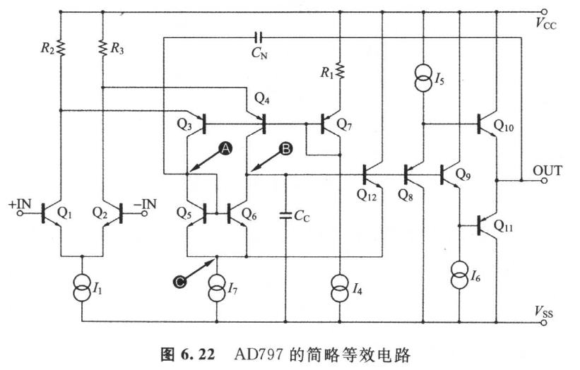

**图 6.22　AD797 的简略等效电路**

下面，不妨进行定量计算。

总之，A 点与 B 点属同电位。原因是，A 点的电位只比 C 点

<!-- 来源：PDF 第 188 页；原书第 173 页 -->

的电位高 \\(V_{BES}\\)，还有 B 点的电位只比 C 点的电位高 \\(V_{BE12}\\)，说且可视为 \\(V_{BES}\approx V_{BE12}\\) 的缘故。

另外，\\(Q_{12}\\) 的发射极因与恒流电路 \\(I_7\\) 连接，所以即使使加信号，但 \\(Q_{12}\\) 的发射极电流大致一定，而 \\(V_{BE12}\\) 也大致一定。也就是说，B 点与 C 点的电位差一定，因此 A、B、C 点在交流上为同电位。

设若 \\(Q_1\\)、\\(Q_2\\) 的各互导为 \\(g_m\\)，当供加差动输入电压 \\(v_{in}\\) 时，\\(Q_3\\) 的集电极电流只减少 \\((g_m/2)v_{in}\\)。又 \\(Q_4\\) 的集电极电流只增加 \\((g_m/2)v_n\\)，B 点的电位上升。

设若 B 点的电位上升分量为 \\(v_o\\)，则在 \\(Q_4\\) 的输出电阻 \\(r_{ob4}\\) 中将有图 6.23 所示方向的电流 \\((v_o/r_{ob4})\\) 流动。因 A 点与 B 点为同电位，所以 A 点的电位也一样只上升 \\(v_o\\)。\\(Q_3\\) 的输出电阻 \\(r_{ob3}\\) 中有图 6.23 所示方向的电流 \\((v_o/r_{ob3})\\) 流动。而电流镜像 \\(Q_5\\)、\\(Q_6\\) 的集电极电流变化分量 \\(i_{C5}\\)、\\(I_{C6}\\) 应当为：

\\[
i_{C5}=i_{C6}\approx\left(\frac{g_m}{2}\right)v_{in}+\left(\frac{v_o}{r_{ob4}}\right)
\tag{6.32}
\\]

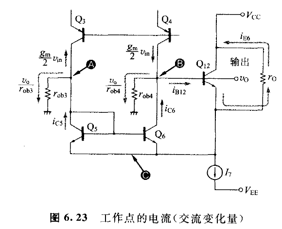

**图 6.23　工作点的电流(交流变化量)**

倘若 B 点适用基尔霍夫电流法则，则 \\(Q_{12}\\) 的基极电流变化分量 \\(i_{B12}\\) 是

\\[
i_{B12}=\left(\frac{g_m}{2}\right)v_{in}-\left(\frac{v_o}{r_{ob4}}\right)+i_{C6}
\tag{6.33}
\\]

把式(6.32)代入式(6.33)时，则有

\\[
i_{B12}=g_mv_{in}+\left(\frac{v_o}{r_{ob4}}-\frac{v_o}{r_{ob3}}\right)
\tag{6.34}
\\]

假定 \\(Q_3\\) 与 \\(Q_4\\) 的特性大致相等，则因 \\(r_{ob3}\approx r_{ob4}\\)，故式(6.34)

<!-- 来源：PDF 第 189 页；原书第 174 页 -->

应为：

\\[
i_{B12}\approx g_mv_{in}
\\]

也就是说，\\(Q_3\\) 的输出电阻与 \\(Q_4\\) 的输出电阻被抵消。而 \\(Q_{12}\\) 的发射极电流变化分量 \\(i_{E12}\\) 为：

\\[
i_{E12}\approx h_{fe12}i_{B12}\approx h_{fe12}g_mv_{in}
\tag{6.35}
\\]

由于 \\(Q_{12}\\) 的发射极与恒流电路 \\(I_7\\) 相连接，所以 \\(i_{E12}\\) 将如图 6.23 所示流通于 \\(Q_{12}\\) 的输出电阻 \\(r_o\\) 中，而产生以下的输出电压 \\(v_o\\)。

\\[
v_o\approx i_{E12}r_o\approx h_{fe12}i_{B12}r_o=(g_mh_{fe12}r_o)v_{in}
\tag{6.36}
\\]

从而，

\\[
Gain=(v_o/v_{in})\approx g_mh_{fe12}r_o
\tag{6.37}
\\]

假定 \\(g_m=35~mS,~h_{fe12}=200,~r_o=200\\)，则

\\[
Gain=35\times10^{-3}\times200\times2\times10^5=1.4\times10^8\ \mathrm{倍}
\\]

即可得开环增益 ≈123 dB。

同图 6.23 一样的电路，也使用过古老的 LM308。LM308 可以说是过去式的类别，但却是具有精彩技术的运算放大器。

### 6.3.2 AD797 的相位补偿电容

如图 6.22 所示，与等效电路的 B 点所连接的 \\(C_C\\)，就是隐藏在内的相位补偿电容（＝50 pF）。连接于 A 点的 \\(C_N\\)，是为抵消输出级失真的外加电容。也可以省略此 \\(C_N\\)，高频带开环增益 \\(A_O\\) 与 \\(C_N\\) 无关，在近似上为：

\\[
A_O=\frac{g_m}{j\omega C_C}\\\\
（g_m：Q_1、Q_2 的各互导）
\tag{6.38}
\\]

从而增益带宽积 GBP 为：

\\[
GBP=\frac{g_m}{2\pi C_C}=\frac{35\times10^{-3}}{6.28\times50\times10^{-12}}\approx110~(\mathrm{MHz})
\\]

资料手册所记载的开环增益、频率特性如图 6.24 所示。在 1 MHz 的增益是 100 倍，即 GB 积＝100 MHz，大致与计算值一致。

### 6.3.3 输出级的失真消除电路

AD797 具有消除输出级失真的机能，其原理如图 6.25 所示。如果没有外加电容器 \\(C_N\\)，B 点的交流电位 \\(V_B\\) 近似于

\\[
V_B=\left(\frac{g_m}{j\omega C_C}\right)V_{IN}
\tag{6.39}
\\]

<!-- 来源：PDF 第 190 页；原书第 175 页 -->

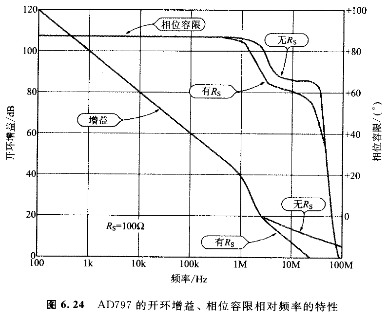

**图 6.24　AD797 的开环增益、相位容限相对频率的特性**

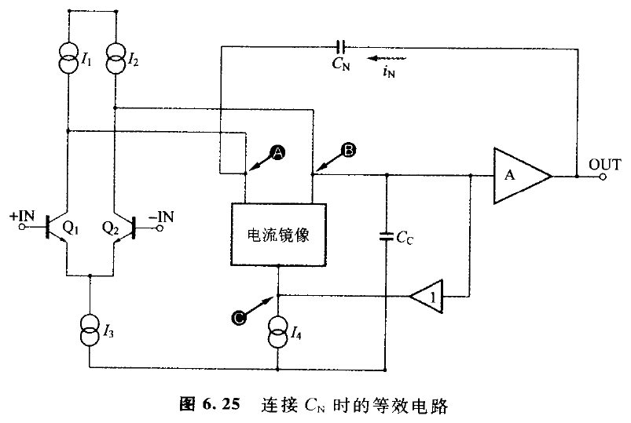

**图 6.25　连接 \\(C_N\\) 时的等效电路**

（\\(V_{IN}\\)：\\(Q_1\\)、\\(Q_2\\) 的差动输入电压）

因此，输出级的电压增益若以 A 表示，则输出级电压 \\(V_{OUT}\\) 为：

\\[
V_{OUT}=\left(\frac{g_m}{j\omega C_C}\right)AV_{IN}
\tag{6.40}
\\]

A 约为 1 倍，但因 A 随负载电流而呈动态变化，所以成为产生非直线失真的原因。

在此，若接有 \\(C_N\\) 时，则流通过 \\(C_N\\) 的电流 \\(i_N\\) 应为：

\\[
i_N=j\omega C_N(V_{OUT}-V_A)\\\\
（式中，V_A：A 点的电位）
\tag{6.41}
\\]

因 A 点与 B 点是同电位，所以若以 B 点的电位 \\(V_B\\) 取代式(6.41)的电位 \\(V_A\\)，则

\\[
i_N=j\omega C_N(V_{OUT}-V_B)
\tag{6.42}
\\]

\\(i_N\\) 在电流镜像中由 A 点流向 C 点，有大约数值相同的电流则由 B 点流向 C 点。此电流不但流回 \\(C_N\\) 中，而且在 \\(C_N\\) 的两端产生如下的电压

\\[
-i_N\times(1/j\omega C_N)
\\]

从而，

\\[
\begin{aligned}
V_B&=\frac{g_m}{j\omega C_C}V_{IN}-\frac{i_N}{j\omega C_N}\\\\
&=\frac{g_m}{j\omega C_C}V_{IN}-\frac{j\omega C_N(V_{OUT}-V_B)}{j\omega C_C}
\end{aligned}
\\]

因此只要 \\(C_N=C_C\\)，下式就会成立

\\[
V_B=\frac{g_m}{j\omega C_C}V_{IN}-(V_{OUT}-V_B)
\\]

经整理后可得下式

\\[
V_{OUT}=\frac{g_m}{j\omega C_C}V_{IN}
\tag{6.43}
\\]

式(6.43)，与在式(6.40)中取 A=1 时等效。也就是说，A 虽然呈动态变化，但输出级的增益经常被控制在 1 倍，就是指输出级的非直线失真与输出阻抗为零。

现将 AD797 的实测失真率特性表示于图 6.26，连接 \\(C_N\\) 时，失真率锐减。

此 AD797 的失真消除机构，是根据与 1980 年代的高级音响扩大器(Audio Amp)所采用图 6.27 的工作原理同样的概念而制作的。即从输入信号减去所检测出的误差，并消除输出级的误差而得到的[22,23,24]。

如此一来输出的所有误差都归于零，所以非直线失真也成为零。AD797 是按：

① 由 \\(C_N\\) 检测出误差，并变换成误差电流；

② 电流镜像做相位反向；

③ 借助 \\(C_C\\) 再变换成误差电压。

再从输入信号减去。

<!-- 来源：PDF 第 192 页；原书第 178 页 -->

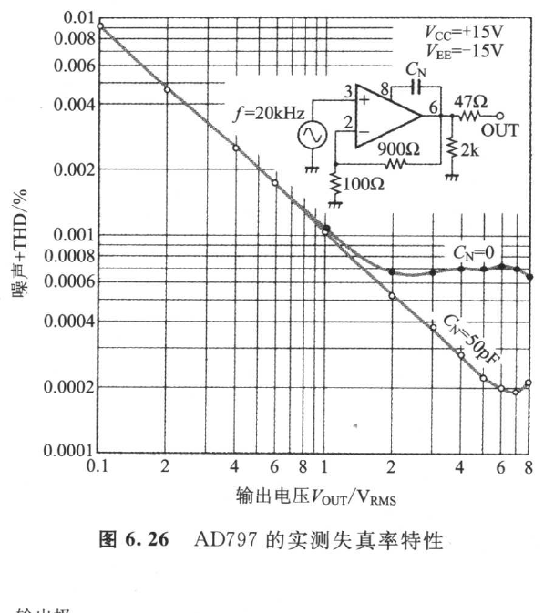

**图 6.26　AD797 的实测失真率特性**

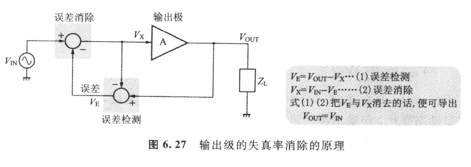

**图 6.27　输出级的失真消除的原理**
