<!-- 来源：PDF 第 193–201 页；原书第 177–187 页 -->

# 第 7 章　高速宽频带运算放大器的分析

直到近年，高速宽频带运算放大器才臻于充实。其结果，也导致运算放大器在通信用途上广加使用。在此虽称之为高速宽频带运算放大器，但严格而言，转接速率（Slew rate）高的运算放大器称为高速型，GB 积和 \\(f_T\\) 高的运算放大器则称为宽频带型。

## 7.1　普通的高速宽频带运算放大器

### 7.1.1　高速宽频带运算放大器有两种类型

高速宽频带运算放大器按其电路构成的不同可分为两种类型。为电压反馈型和电流反馈型的两种类型（Type）。电压反馈型，就是迄今为止所介绍的那种普通的运算放大器。

1980 年，由于出现了被叫做电流反馈型的新型运算放大器，所以初级使用差动放大电路的新型运算放大器，为区别起见，在此就称之为电压反馈型。无从推移的运算放大器即为电压反馈型。

至于电流反馈型运算放大器，在初级使用互补发射极接地电路，将在 7.2 节对其细节加以介绍。首先介绍电压反馈型高速宽频带运算放大器，其代表性的电压反馈型高速宽频带运算放大器如表 7.1 所示。

### 7.1.2　形成高速 PNP 晶体管的 VIP Process 的 LM61 系列

在一块半导体基板上形成 PNP 晶体管的技术，是从前就已经有的事，但其动作与高速相差悬殊，前面已加以介绍。尽管如此，1980 年，在一块半导体基板上形成拥有与 NPN 型同等性能的高速 PNP 晶体管的 Process 技术（AD 公司的 CB Process 和 NS 公司的 VIP Process 等）已被确立。其结果是，即使不借助如前馈补偿那样复杂的电路，也能够制造出高速运算放大器。

LM361 系列名叫 LM6361/6364/6365 的运算放大器，是由 NS 公司用被称为 VIP Process 的 Process 所制成的电压反馈型运算放大器。其电气特性如表 7.2 所示，简略等效电路则表示于图 7.1。\\(Q_1\\)、\\(Q_2\\)、\\(Q_3\\)、\\(Q_4\\) 为 Folded Cascode 电路，\\(Q_5\\)、\\(Q_6\\)、\\(Q_3\\) 则构成威尔森型电流镜像。

<!--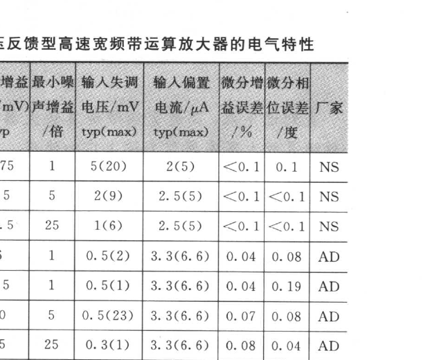-->

| 型号 | 转换速率 /(V/μs) typ | GB积 /MHz typ | 开环增益 /(V/mV) typ | 最小噪声电压 /(nV/√Hz) /倍 | 输入失调电压 /mV typ(max) | 输入偏置电流 /μA typ(max) | 微分增益误差 /% | 微分相位误差 /度 | 厂家 |
|------|------|------|------|------|------|------|------|------|------|
| LM6361 | 300 | 50 | 0.75 | 1 | 5(20) | 2(5) | &lt;0.1 | 0.1 | NS |
| LM6364 | 300 | 175 | 2.5 | 5 | 2(9) | 2.5(5) | &lt;0.1 | &lt;0.1 | NS |
| LM6365 | 300 | 725 | 10.5 | 25 | 1(6) | 2.5(5) | &lt;0.1 | &lt;0.1 | NS |
| AD817A | 350 | 50 | 6 | 1 | 0.5(2) | 3.3(6.6) | 0.04 | 0.08 | AD |
| AD847J | 300 | 50 | 5.5 | 1 | 0.5(1) | 3.3(6.6) | 0.04 | 0.19 | AD |
| AD848J | 300 | 175 | 20 | 5 | 0.5(23) | 3.3(6.6) | 0.07 | 0.08 | AD |
| AD849J | 300 | 725 | 85 | 25 | 0.3(1) | 3.3(6.6) | 0.08 | 0.04 | AD |
| CLC425AJ | 350 | 1900 | 63 | 10 | 0.1(0.8) | 12(20) | — | — | NS |
| LM6172* | 3000 | 100 | 20 | 1 | 0.4(3) | 1.2(3) | 0.28 | 0.8 | NS |
| LT1226 | 400 | 1000 | 150 | 25 | 0.3(1) | 4(8) | 0.7 | 0.6 | LT |
| LT1360 | 800 | 50 | 9 | 1 | 0.3(1) | 0.3(1) | 0.2 | 0.3 | LT |
| AD9631A | 1300 | 320 | 0.25 | 1 | 3(10) | 2(7) | 0.03 | 0.02 | AD |
| MAX4265 | 900 | 400 | 56 | 1 | 1(9) | 3.5(40) | 0.015 | 0.03 | MAX |
| MAX4216* | 600 | 200 | 1.1 | 1 | 4(9) | 5.4(9) | 0.02 | 0.02 | MAX |
| OPA655P | 290 | 240 | 0.8 | 1 | 1(2) | 5 pA (125pA) | 0.006 | 0.009 | TI |

（\* 记号表含有两电路）

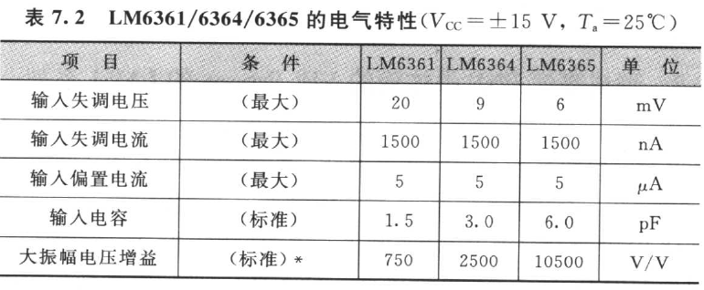

**表 7.2 LM6361/6364/6365 的电气特性**

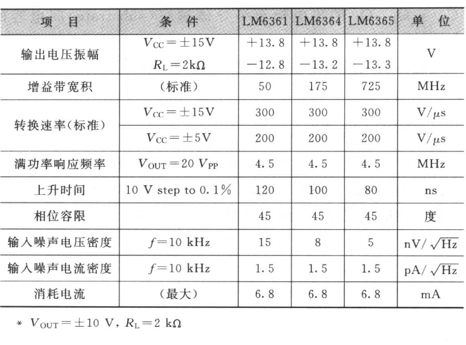

**表 7.2（续表） LM6361/6364/6365 的电气特性**

### 7.1.3　LM6361/6364 以局部电流反馈稳定化

请看等效电路图 7.1，LM6361 与 6364 是利用 \\(Q_1\\) 与 \\(Q_2\\) 的各发射极所射入的 \\(R_1\\)、\\(R_2\\) 加挂局部电流反馈，以降低 GB 积。开环增益 \\(A\\) 为：

\\[ |A(f)| \approx \left(\frac{g_m}{1+g_mR}\right)\frac{1}{2\pi fC} \tag{7.1} \\]

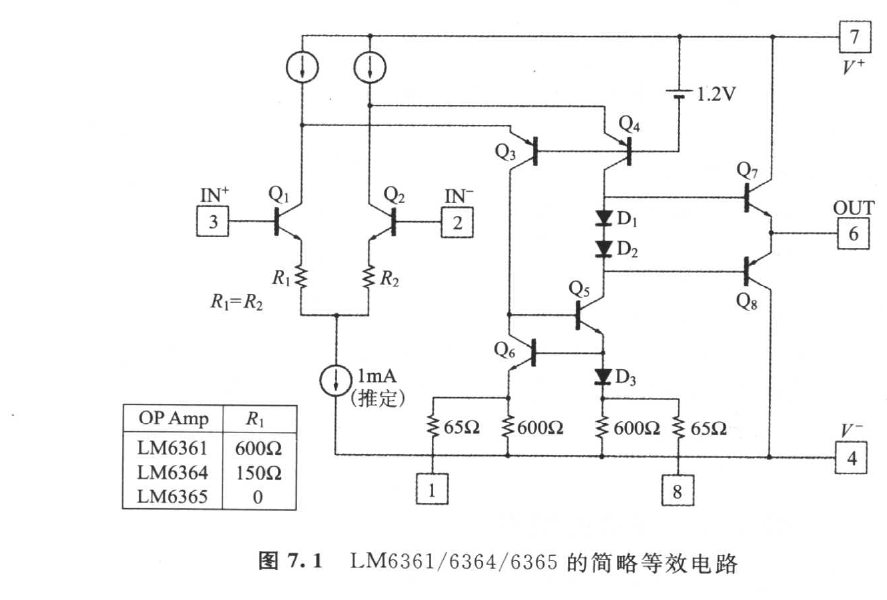

**图 7.1 LM6361/6364/6365 的简略等效电路**

其中，\\(g_m\\) 为 \\(Q_1\\)、\\(Q_2\\) 的各互导；\\(R = R_1 = R_2\\)；\\(C\\) 为 \\(Q_4\\)、\\(Q_5\\)、\\(Q_6\\)、\\(Q_8\\) 的 \\(C_{ob}\\) 与 \\(Q_4\\)、\\(Q_5\\) 的集电极至半导体衬底（substrate）间电容的总和。

此运算放大器的增益带宽积 GBP，在式（7.1）的左边置以 1，根据 \\(f\\) 的解，便可求出。

\\[ \mathrm{GBP} = \left(\frac{g_m}{1+g_mR}\right)\frac{1}{2\pi C} \tag{7.2} \\]

像这样在初级插入发射极电阻时，即使初级的共发射极电流大，但借助于电流反馈的作用，GB 积仍可得到抑制，所以可在不降低稳定性的情况下，得到高转换速率。但是，有必要事先了解由于此局部电流反馈，将带来以下的副作用：

① 开环增益下降；

② 输入换算噪声电压增加；

③ 输入失调电压增加。

> **专栏　有关局部电流反馈**
>
> 如果图 7.1 的 \\(R_1\\) 与 \\(R_2\\) 的值为零，当在管脚（pin）3—2 输入微小差动电压 \\(V_{ID}\\) 时，\\(Q_1\\) 的基极-发射极间电压只增加 \\(V_{ID}/2\\)，即
>
> \\[ \Delta V_{BE1} = \frac{V_{ID}}{2} \tag{7.A} \\]
>
> 在此如图插入 \\(R_1\\) 时，其两端将产生 \\(R_1\Delta I_{E1}\\) 的电压，所以
>
> \\[ \Delta V_{BE1} = \frac{V_{ID}}{2} - R_1\Delta I_{E1} \tag{7.B} \\]
>
> 也就是说，\\(\Delta V_{BE1}\\) 只减少 \\(R_1\\) 的电压降分量。在此，
>
> \\[ \Delta I_{E1} \approx \Delta I_{C1} = g_m\Delta V_{BE1} \tag{7.C} \\]
>
> 但 \\(g_m\\) 是 \\(Q_1\\) 的互导。
>
> 把（7.C）代入（7.B）并消去 \\(I_{E1}\\)，再加以整理，则
>
> \\[ \Delta V_{BE1} = \frac{V_{ID}/2}{1+R_1g_m} \tag{7.D} \\]
>
> 此式表示 \\(Q_1\\) 的输入电压将减低 \\(1/(1+R_1g_m)\\)，即 \\(Q_1\\) 的输出电流因 \\(R_1\\) 被减少，而负反馈于输入。因此，称之为局部反馈是言之有理的。
>
> 此负反馈将改善初级的频率特性与初级的失真率。在 \\(Q_2\\) 的发射极插入 \\(R_2\\) 也具有相同的功能。

### 7.1.4　确认开环增益的结果

低频带时的开环增益（Open Loop Gain）\\(A\\) 为：

\\[ A = \left(\frac{g_m}{1+g_mR}\right)h_{fe}R_L \tag{7.3} \\]

其中，\\(g_m\\) 为 \\(Q_1\\)、\\(Q_2\\) 的各互导；\\(R = R_1 = R_2\\)；\\(h_{fe}\\) 为 \\(Q_7\\)、\\(Q_8\\) 的各电流放大倍数；\\(R_L\\) 为运算放大器的负载电阻。

在此倘若把 \\(g_m = 20\\) mS，\\(h_{fe} = 250\\)，\\(R_L = 2\\) kΩ 代入式（7.3），则可算出

\\[ A = \left(\frac{0.02}{1+0.02\times 600}\right)\times 250\times 2000 = 770 \\]

此结果与表 7.2 所示特性的大振幅电压增益（=750 倍）相符。此开环增益比通用运算放大器约少 40 dB，但用作高速宽频带运算放大器的音响并不成问题。

### 7.1.5　负载电容大，仍不致振荡的结构

在第二级晶体管的基极-集电极间插入相位补偿电容的一般运算放大器，若在负载上连接电容成分时，由于 GB 积降低较小，只有输出级的相位落后滞后，以致容易导致振荡。

至于由如图 7.1 所示电路构成的运算放大器 LM6361/6364/6365 等，则具有不论接多大的负载电容 \\(C_L\\)，也不致于振荡的优点。由于 GB 积降低低，所以当连接负载电容 \\(C_L\\) 后，式（7.1）的 \\(C\\) 在等效上成为：

\\[ C + \frac{C_L}{h_{fe}} \\]

式中，\\(h_{fe}\\) 为 \\(Q_7\\)、\\(Q_8\\) 的各电流放大倍数。

### 7.1.6　LM6361 系列的其他特性

▶ 输入换算噪声电压密度 \\(v_n\\)

相位于 \\(R_1\\) 与 \\(R_2\\) 之值为零的 LM6365 的 \\(v_n\\) 为 5 nV/√Hz，而 \\(R_1 = R_2 = 600\\) Ω 的 LM6361 的 \\(v_n\\) 却是 15 nV/√Hz。输入换算噪声电压密度 \\(v_n\\) 增加的原因是，添加了 \\((R_1+R_2)\\) 的热噪声，还有初级的有效 \\(g_m\\) 因局部电流反馈而减少，如前所述电流镜像的噪声也起作用。

▶ 输入失调电压

由于存在 \\(R_1\\) 与 \\(R_2\\)，其误差 \\(\Delta R\\)，将造成 \\((\Delta R \times I_C)\\) 的输入失调电压。从而 LM6361 的最大输入失调电压，将比无 \\(R_1\\)、\\(R_2\\) 的 LM6365 增加 14 mV（参表 7.2）。

▶ 噪声增益

LM6361/6364/6365，分别在噪声增益 \\(G_N = 1\\) 倍/5 倍/25 倍以上时稳定工作。LM6365 的增益带宽积 GBP 高达 725 MHz，但因闭环截止频率 \\(f_C\\) 为：

\\[ f_C = \frac{\mathrm{GBP}}{G_N} \tag{7.4} \\]

所以在 \\(G_N = 25\\) 倍使用时，则 \\(f_C\\) 将成为 29 MHz。

另一方面，LM6361 的 GBP 量仅为 50 MHz，但在 \\(G_N = 1\\) 倍使用时，\\(f_C\\) 就成为 50 MHz，而超过 LM6365 的 \\(f_C\\)。

▶ 差动输入电压

LM6361/6364/6365 在输入端子间并无保护二极管。因此，在使用时，必须把差动输入电压抑制在 ±5 V 以内。

### 7.1.7　LM361 系列上位依赖 CB Process 的 AD847 系列

此 IC 采用 AD 公司的 CB Process 所制成的高速宽频带运算放大器，可作为 6364/6365 的上位互换机种。所谓 CB Process 就是在一块半导体衬底上构成 \\(h_{fe} = 200\\)，\\(f_T = 600 \sim 800\\) MHz 与 NPN 型具有相同性能 PNP 型晶体管的技术。图 7.2 表示芯片（chip）的断面构造。

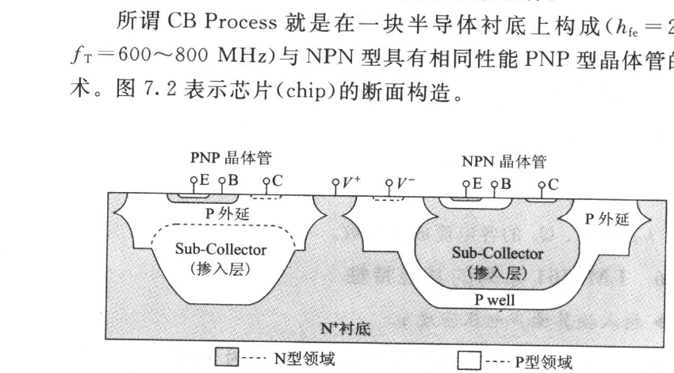

**图 7.2 由 CB Process 所构成的 NPN 晶体管与 PNP 晶体管**

AD847/848/849 的简略等效电路如图 7.3 所示。因通过异极性达林顿发射极跟随器增加输出级的 \\(h_{fe}\\)，所以开环增益比 LM6361/6364/6365 约增大一位数（参照表 7.1）。其结果，可施加充分的负反馈，影响频带的失真率并不逊色于一般的运算放大器（图 7.4）。

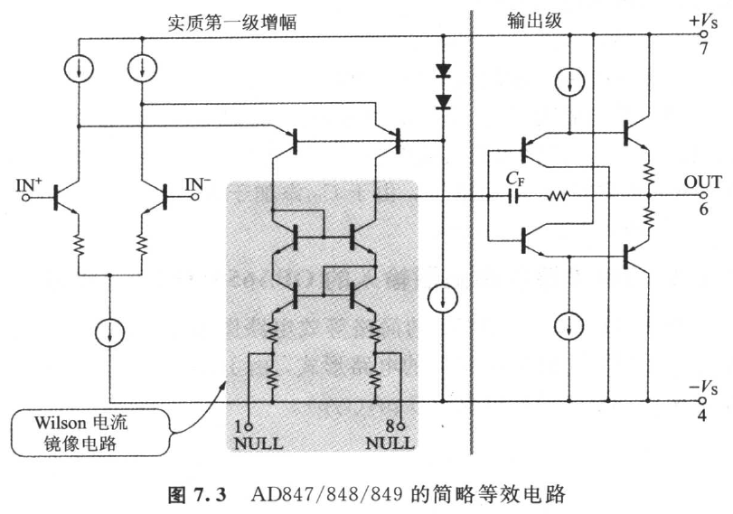

**图 7.3 AD847/848/849 的简略等效电路**

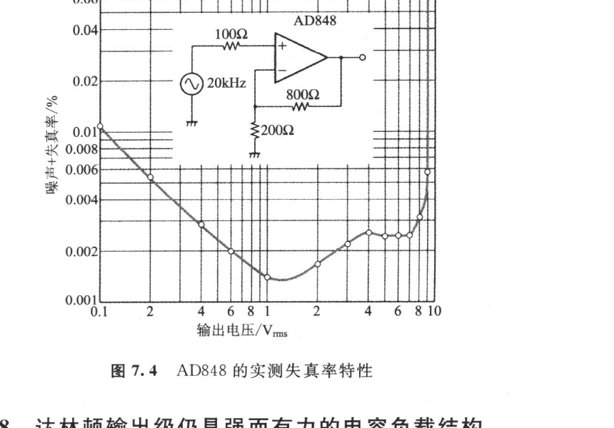

**图 7.4 AD848 的实测失真率特性**

### 7.1.8　达林顿输出级仍具强而有力的电容负载结构

AD847/848/849 的输出级为达林顿接续。原来在电容负载时就容易起振荡，但借助于隐藏相位补偿电容 \\(C_F\\) 的作用，无论负载电容如何，仍能稳定地工作。

相位补偿电容 \\(C_F\\)，因为在输出端子被 Bootstrap，所以输出级的等效输入电容 \\(C_{IN}\\) 为：

\\[ 
C_{IN} = C_F[1 - G(j\omega)] \tag{7.5}\\\\
（G(j\omega)：输出级的电压增益）
\\]

当负载电容为零时，\\(G(j\omega)\\) 可视为 1 倍，所以 \\(C_{IN}\\) 为零，GB 积满足式（7.2）。连接大的负载电容时，则因高频带的 \\(G(j\omega)\\) 减少，所以 \\(C_{IN}\\) 依式（7.5）而增加。由于 \\(C_{IN}\\) 添加于式（7.2）的 \\(C\\)，以致 GB 积下降，而维持稳定性。

### 7.1.9　JFET 源极跟随器输入的 OPA655（DG 与 DP 小）

现将 TI 公司 OPA655 的简略等效电路图表示于图 7.5。这是图 7.1 所示 LM6361 系列的电路形式，由 JFET 的源极跟随器驱动构成。输入偏置电流仅 5 pA（typ）。

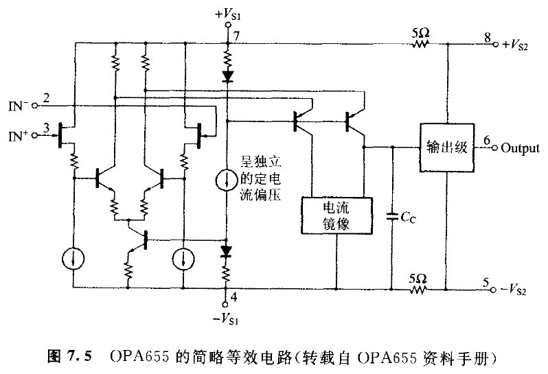

**图 7.5 OPA655 的简略等效电路（转载自 OPA655 资料手册）**

高速运算放大器的主要用途是视频（Video）放大器。如果放大器的增益与相位随亮度信号电平（Level）而变化，色信号的振幅与相位就会变化。振幅的变化对色度（chroma）产生影响，相位的变化则对色彩（Hue）产生影响。

因此作为判断放大器直线性的参数（Parameter），便规定有微分增益误差与微分相位误差。

即放大器的 DC 输出电平（Level），摆振于 0—1 V 时的电压增益与相位的变化分别称为"微分增益误差（Differential Gain Error）"，"微分相位误差（Differential Phase Error）"。此项误差由彩色副载波频率（NTSC 方式约 3.58 MHz）进行测试。

电压反馈型高速宽频带运算放大器的电气特性如表 7.1 所示，请观察 DG、DP 栏。

OPA655 的微分增益误差 DG 与微分相位误差 DP 如下，其特征是极其微小。即

\\[ 
\mathrm{DG} = 0.006\\% (\mathrm{typ})
\\]

\\[ 
\mathrm{DP} = 0.009^\circ (\mathrm{typ})
\\]

<!-- 来源：PDF 第 201–210 页；原书第 187–196 页 -->

## 7.2　截止频率不变化的电流反馈型运算放大器

### 7.2.1　普通的运算放大器与电压反馈型运算放大器的缺点

电压反馈型运算放大器具有以下的缺点：

① 闭环截止频率 \\(f_C\\) 与噪声增益 \\(G_N\\) 之间有如式（7.4）所示的关系。因此，增大闭环增益时，截止频率就降低（参照图 7.6）。

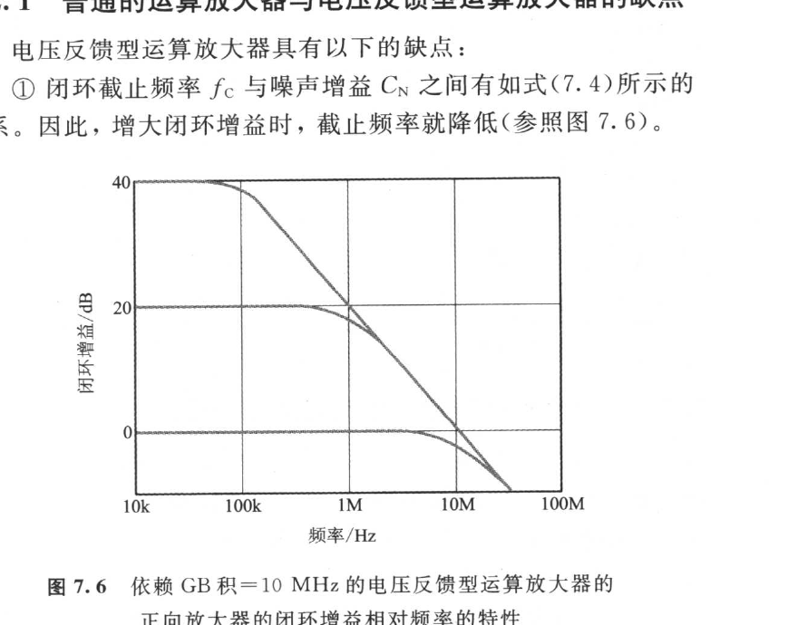

**图 7.6 依赖 GB积=10 MHz 的电压反馈型运算放大器的正向放大器的闭环增益相对频率的特性**

② 如第 2 章图 2.17 所示，运算放大器的转换速率 SR 根据初级差动放大电路的共发射极电流 \\(I\\) 与相位补偿电容 \\(C_f\\) 应为：

\\[ \mathrm{SR} = \frac{I}{C_f} \tag{7.6} \\]

从稳定性的观点考虑，不能够随便削减 \\(C_f\\)。因此，欲增大转换速率，只有增加 \\(I\\) 一种办法。这样，在双极运算放大器的情形下，输入偏压电流就增加。

能够消除这些缺点的是，1985 年由 Comlinear 公司提出的"电流反馈型运算放大器"。当初虽属混合（Hybrid）IC，但大约在同时期，由一块半导体芯片构成与 NPN 型同等高速 PNP 晶体管的上述 Process 技术得以确立，所以采用此 Process 的单片（Monolithic）IC 的电流反馈型运算放大器，就在高速宽频带领域中得到应用。

现将具代表性的电流反馈型运算放大器列于表 7.3。

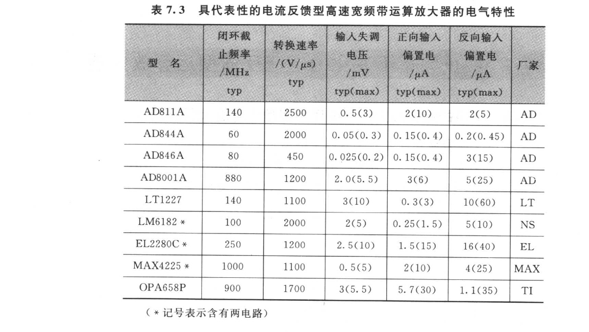

**表 7.3 具代表性的电流反馈型高速宽频带运算放大器的电气特性**

<!-- 表 7.3：已改用 markdown 表格格式 -->
| 型号 | 闭环截止频率 /MHz typ | 转换速率 /(V/μs) typ | 输入失调电压 /mV typ(max) | 正向偏置电流 /μA typ(max) | 反向偏置电流 /μA typ(max) | 厂家 |
|------|------|------|------|------|------|------|
| AD811A | 140 | 2500 | 0.5(3) | 2(10) | 2(5) | AD |
| AD844A | 60 | 2000 | 0.05(0.3) | 0.15(0.4) | 0.2(0.45) | AD |
| AD846A | 80 | 450 | 0.025(0.2) | 0.15(0.4) | 3(15) | AD |
| AD8001A | 880 | 1200 | 2.0(5.5) | 3(6) | 5(25) | AD |
| LT1227 | 140 | 1100 | 3(10) | 0.3(3) | 10(60) | LT |
| LM6182* | 100 | 2000 | 2(5) | 0.25(1.5) | 5(10) | NS |
| EL2280C* | 250 | 1200 | 2.5(10) | 1.5(15) | 16(40) | EL |
| MAX4225* | 1000 | 1100 | 0.5(5) | 2(10) | 4(25) | MAX |
| OPA658P | 900 | 1700 | 3(5.5) | 5.7(30) | 1.1(35) | TI |

（\* 记号表示含有两电路）

### 7.2.2　电流反馈型运算放大器的工作原理

现将 AD 公司的电流反馈型运算放大器 AD844 的简略等效电路表示于图 7.7。初级由 \\(Q_1\\) 与 \\(Q_2\\) 所构成，\\(Q_1\\)、\\(Q_2\\) 在等效电路上，从正向输入端子（IN+）看时是互补发射极接地，但反向输入端子（IN−）看则为互补基极接地。

AD844 实际上的第二级是 Wilson 型电流镜像，但图 7.7 有简化。\\(Q_5\\)、\\(Q_6\\)、\\(Q_7\\)、\\(Q_8\\) 属异极性达林顿发射极跟随器输出级。\\(Q_3\\)、\\(Q_4\\)、\\(Q_5\\)、\\(Q_6\\) 的各 \\(C_{ob}\\)，与 \\(Q_3\\)、\\(Q_4\\) 的集电极至衬底（Substrate）间电容的总和即为相位补偿电容 \\(C_{COMP}\\)。

那么，下面来思考图 7.8 所示正向放大器的工作。

从反向输入端子可见信号源电阻 \\((R_1 // R_2)\\) 有 \\(Q_1\\)、\\(Q_2\\) 的发射极电流的变化分量流动，初级馈加则有局部电流反馈。此反馈量 \\(F\\) 如下：

\\[ F = 1 + g_m(R_1 // R_2) \tag{7.7} \\]

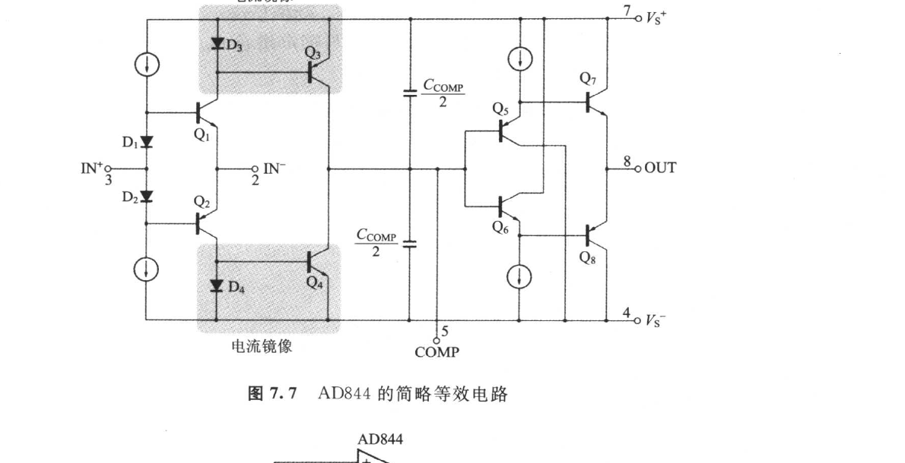

**图 7.7 AD844 的简略等效电路**

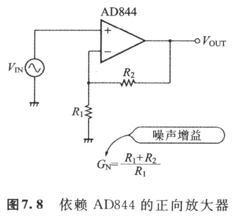

**图 7.8 依赖 AD844 的正向放大器**

（\\(g_m\\)：初级的互导）

此局部电流反馈像 LM6361 的发射极电阻 \\(R_1\\)、\\(R_2\\) 一样执行其功能。于是，图 7.8 的放大器的高频带开环增益，即为在式（7.1）中代入 \\(R = R_1 // R_2\\) 与 \\(C = C_{COMP}\\) 所得到的结果，增益带宽积 GBP 则为在式（7.2）中代入 \\(R = R_1 // R_2\\) 与 \\(C = C_{COMP}\\) 所得到的结果。即

\\[ \mathrm{GBP} = \left(\frac{g_m}{1+g_m(R_1 // R_2)}\right)\frac{1}{2\pi C_{COMP}} \tag{7.8} \\]

在此如果 \\(g_m(R_1 // R_2) \gg 1\\)，就能够近似为：

\\[ \mathrm{GBP} \approx \left(\frac{1}{R_1 // R_2}\right)\frac{1}{2\pi C_{COMP}} \tag{7.9} \\]

闭环截止频率（Closed Loop Cut-off）频率 \\(f_C\\)，是把式（7.9）代入式（7.4），而得

\\[ f_C = \frac{\mathrm{GBP}}{G_N} = \left(\frac{R_1}{R_1 + R_2}\right)\mathrm{GBP} \approx \frac{1}{2\pi R_2 C_{COMP}} \tag{7.10} \\]

也就是说，闭环截止频率 \\(f_C\\)，与噪声增益 \\(G_N\\) 无关，而取决于时常数 \\((R_2 C_{COMP})\\)。

因此当 \\(R_2\\) 固定而 \\(R_1\\) 可变时，则如图 7.9 所示，在 \\(f_C\\) 保持不变的情况下，能够改变闭环增益。换言之，就是降低 \\(R_1\\) 的值，则式（7.4）的分母 \\(G_N\\) 增加，但因分子 GBP 也增加，所以 \\(f_C\\) 便不变化。

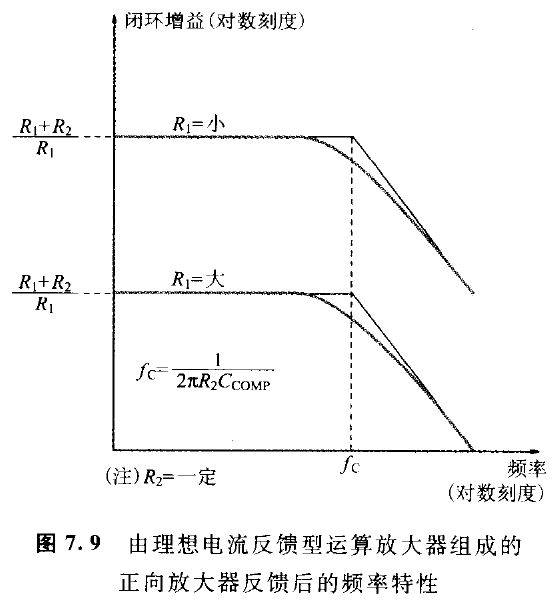

**图 7.9 由理想电流反馈型运算放大器组成的正向放大器反馈后的频率特性**

### 7.2.3　转移阻抗（Trans-impedance）的概念

式（7.9）与（7.10）是在 \\(g_m(R_1 // R_2) \gg 1\\) 的前提下推导出的近似式。初级由电压增益 = ±1 倍的理想缓冲器（Buffer）与串联电阻 \\(R_{IN}\\) 替代，\\(R_{IN}\\) 是从图 7.7 的反向输入端子看 \\(Q_1\\)、\\(Q_2\\) 的发射极（基极接地）输入电阻。这是初级的互导的倒数。即

\\[ R_{IN} = \frac{1}{g_m} \tag{7.11} \\]

称 \\(R_T\\) 为转移电阻（Transfer resistance），\\(C_T\\) 则为转移电容（Transfer capacity）的参数，\\(R_T\\) 与 \\(C_T\\) 的并联和叫做转移阻抗（Trans-impedance）。即

\\[ Z_T = R_T // \left(\frac{1}{j\omega C_T}\right) = \frac{R_T}{1+j\omega R_T C_T} \tag{7.12} \\]

在 AD844 中，转移电阻 \\(R_T\\) 是由第二级 \\((Q_3, Q_4)\\) 的输出电阻与输出级 \\((Q_5, Q_6, Q_7, Q_8)\\) 的等效输入电阻并联而成。转移电容 \\(C_T\\) 则与图 7.7 的相位补偿电容 \\(C_{COMP}\\) 相等。即

\\[ C_T = C_{COMP} \tag{7.13} \\]

下面使用图 7.10 的等效电路，计算图 7.8 的正向放大器闭环增益。

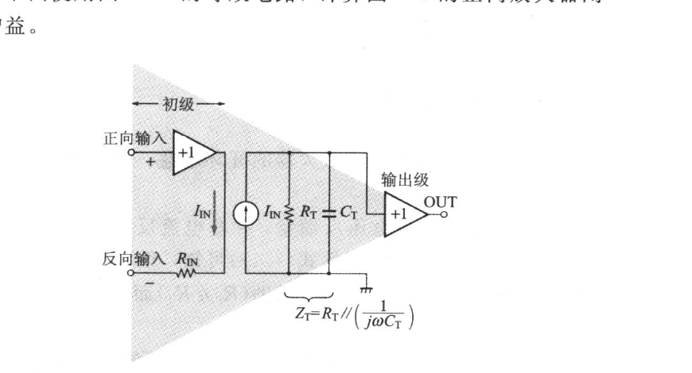

**图 7.10 电流反馈型运算放大器的等效电路**

若把戴维宁定理应用于图 7.8 的反馈电路，则便可推导出图 7.11 的等效电路。而且，

\\[ I_{IN} = \frac{V_{IN} - \beta V_{OUT}}{R_{IN} + (R_1 // R_2)} \tag{7.14} \\]

\\[ V_{OUT} = I_{IN} Z_T \tag{7.15} \\]

式中，\\(\beta\\) 表示反馈率，\\(\beta = \dfrac{R_1}{R_1 + R_2}\\)。

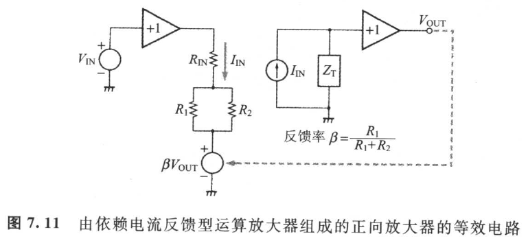

**图 7.11 由依赖电流反馈型运算放大器组成的正向放大器的等效电路**

联立方程式（7.14）、式（7.15），消去 \\(I_{IN}\\) 并加以整理，则得

\\[ \frac{V_{OUT}}{V_{IN}} = \left(\frac{Z_T}{R_{IN} + (R_1 // R_2)}\right)\frac{1}{1 + \left(\dfrac{Z_T}{R_{IN} + (R_1 // R_2)}\right)\beta} \tag{7.16} \\]

式中，若令

\\[ \frac{Z_T}{R_{IN} + (R_1 // R_2)} = A \tag{7.17} \\]

则式（7.16）可改写为：

\\[ \frac{V_{OUT}}{V_{IN}} = \frac{A}{1 + A\beta} \tag{7.18} \\]

\\(A\\) 是电流反馈型运算放大器的开环增益，而（7.18）为闭环增益。

分母 \\((1 + A\beta)\\) 是电压反馈量，并非电流反馈量。但是，对于电流反馈型运算放大器根据式（7.17）可知，开环增益 \\(A\\) 与反馈电阻 \\((R_1 // R_2)\\) 有关，原因是初级借助 \\((R_1 // R_2)\\) 而馈加有局部电流反馈所引起的。

另外，下面计算已考虑局部电流反馈时的高频带开环增益 \\(A\\)。按高频带，可认为：

\\[ Z_T = \frac{1}{j\omega C_T} \\]

故，将此代入式（7.17），则有

\\[ A = \frac{1}{j\omega C_T [R_{IN} + (R_1 // R_2)]} \tag{7.19} \\]

从而增益带宽积 GBP 为：

\\[ \mathrm{GBP} = \frac{1}{2\pi C_T [R_{IN} + (R_1 // R_2)]} \tag{7.20} \\]

闭环截止频率 \\(f_C\\) 则为：

\\[ f_C = \frac{\mathrm{GBP}}{G_N} = \frac{1}{2\pi C_T (R_{IN} G_N + R_2)} \tag{7.21} \\]

式中 \\(G_N\\) 是噪声增益，即反馈率 \\(\beta\\) 的倒数。

\\[ G_N = \frac{1}{\beta} = \frac{R_1 + R_2}{R_1} \\]

既然如此，就具体来计算 AD844 闭环截止频率 \\(f_C\\)。把资料手册上记载的 \\(R_{IN} = 50\\) Ω，\\(C_T = C_{COMP} = 4.5\\) pF 代入式（7.21），并将所算出的 \\(f_C\\) 列于表 7.4。

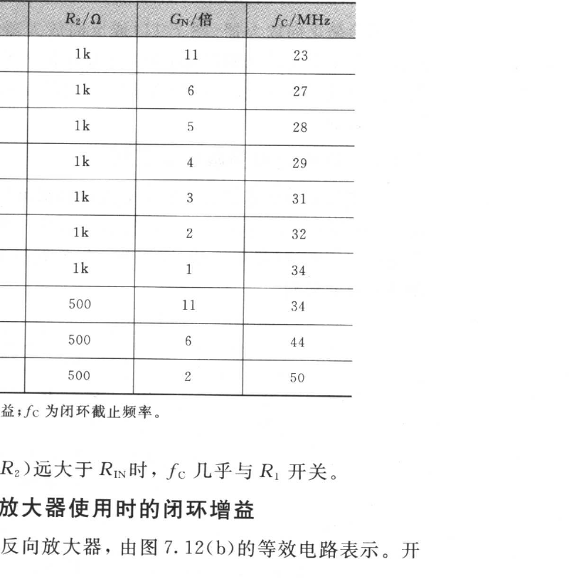

**表 7.4 AD844 的闭环截止频率**

可知当\\((R_1//R_2)\\)远大于\\(R_{IN}\\)时，\\(f_C\\)几乎与\\(R_1\\)无关。

### 7.2.4　以反向放大器使用时的闭环增益

图 7.12（a）的反向放大器，由图 7.12（b）的等效电路表示。开环增益为：

\\[ \frac{V_{OUT}}{V_{IN}} = -\frac{R_2}{R_1}\left(\frac{A\beta}{1 + A\beta}\right) \approx -\frac{R_2}{R_1} \tag{7.22} \\]

但是开环增益 \\(A\\) 是由上述式（7.17）表示，高频带的开环增益则以式（7.19）表示，闭环截止频率由式（7.21）所示。

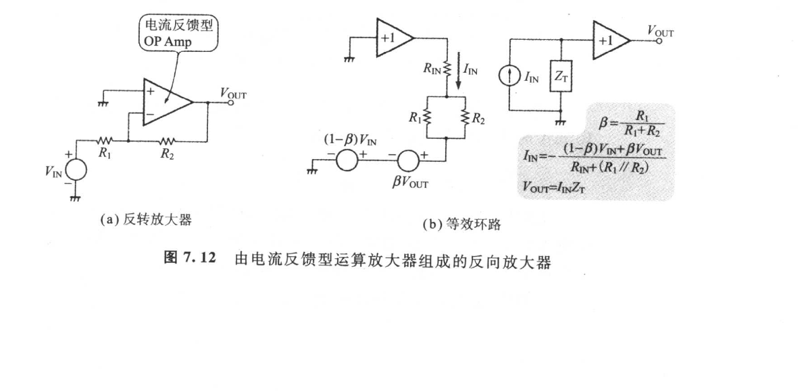

**图 7.12 由电流反馈型运算放大器组成的反向放大器**

### 7.2.5　如何看待电流反馈型运算放大器的输出阻抗

无论是正向放大器（图 7.11）或反向放大器（图 7.12），都有足够的电压负反馈从输出端子馈加于反向输入端子。只是电流反馈型运算放大器的反馈后输出阻抗，与电压反馈型运算放大器并无太大差别。

### 7.2.6　转换速率受限制的原因

电流反馈型运算放大器由于全级（段）都可以 AB 级（甲乙类）动作，所以并不像电压反馈型运算放大器的转换速率，靠初级的发射极偏压电流（静止电流）来限制，但是转换速率却受 \\(C_{COMP}\\) 的驱动电流的限制。

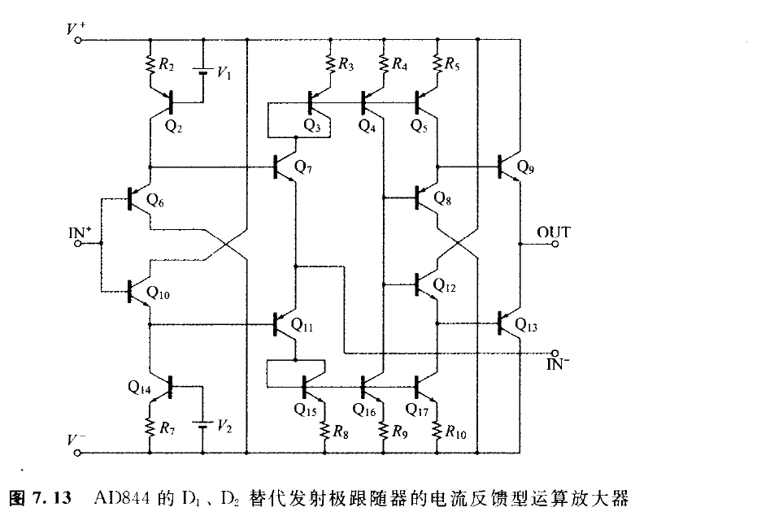

**图 7.13 AD844 的 D1、D2 替代发射极跟随器的电流反馈型运算放大器 EL2880C 的简略等效电路**

AD844 当电源电压为 ±15 V 时，电流镜像的输出电流约在 10 mA 时达到饱和。转换速率 SR 为：

\\[ \mathrm{SR} = \frac{I_{COMP}}{C_{COMP}} = \left(\frac{10 \mathrm{mA}}{4.5 \mathrm{pF}}\right) = 2200 \mathrm{V/μs} \\]

正向放大时的转换速率比此值低，原因是 AD844 的输入偏压电路（\\(D_1\\) 与 \\(D_2\\) 与恒流电路）的上升成为瓶颈而导致的。输入偏压电路的 \\(D_1\\)、\\(D_2\\) 替代发射极跟随器的电流反馈型运算放大器（图 7.13），即使是反向放大但转换速率也不致下降。

### 7.2.7　容许差动输入电压低，需加注意

高速运算放大器的容许差动输入电压偏低，因而需加注意。超过额定值时，即使不致于造成破坏，却有引起输入失调电压的变化和噪声增加的危险，对输入电流的最大额定值也需加注意。

### 7.2.8　宽频带 AC-DC 变换器上的应用

AD811 是较新颖的电流反馈型运算放大器，如表 7.3 所示，有如下的特征：

- 转换速率 = 2500 V/μs（当 \\(V_{OUT} = 20 V_{P-P}\\) 时）；
- 输入偏置电压 ≈ 0.5 mV (typ)；
- 以 ±5～±15 V 的电源电压工作；
- 低失真率，且高稳定。

现将使用 AD811 的宽频带 AC-DC 变换器（交流信号经平均值检波而获得 DC 电压的电路）表示于图 7.14。在此电路上，\\(D_1\\) 与 \\(D_2\\) 将在过大输入时保护 AD811。正常工作时属非导通，乃以结电容少的转换用硅二极管为适当。

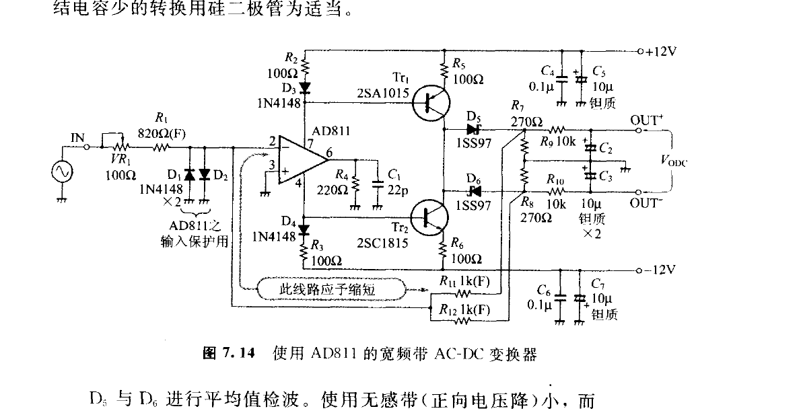

**图 7.14 使用 AD811 的宽频带 AC-DC 变换器**

\\(D_5\\) 与 \\(D_6\\) 进行平均值检波。使用无感带（正向电压降）小，而响应快速的 SBD（肖特基势垒二极管）。正向电流 = 1 mA，而正向电压约 0.4 V 的小信号用 SBD（1SS97，1SS88，1SS165 等）比较好。虽然正向电压约 0.2 V 的 1SS86 等在无感带上很理想，但逆电流多，温度上升时，因 AC-DC 变换精度下降，所以不适用。

为缩小 \\(D_5\\) 与 \\(D_6\\) 的无感带，以 2SA1015/2SC1815 对 \\(D_5\\) 与 \\(D_6\\) 做电流驱动 [23]，而 \\((D_3, R_2, T_{r1}, R_5)\\) 与 \\((D_4, R_3, T_{r2}, R_6)\\) 构成电流镜像。\\(T_{r1}\\) 与 \\(T_{r2}\\) 的合成输出电流 \\(I\\) 近似上等于流过 \\(R_4\\) 的电流。

\\[ 
I = \frac{V(6)}{R_4} \tag{7.23}\\\\
（V(6)：AD811 的管脚6的输出电压）
\\]

\\(D_5\\) 与 \\(D_6\\)，由于 I 受电流驱动而无感带锐减，进而为提升精度，以 \\(R_{11}\\) 与 \\(R_{12}\\)，加上 \\(D_5\\)、\\(D_6\\) 的半波输出负反馈于 AD811 的反向输入。

\\(C_1 = 22\\) pF 是相位补偿电容。对于 1 \\(V_{RMS}\\) 的正弦波输入而言，调整半固定电阻 VR，使 \\(V_{ODC}\\) 成为 1 V。

容许输入电压受检波二极管的耐压控制，输入电压的实用界限在 ±5 V。实测的频率特性如图 7.15 所示，但频率小于 6 MHz 时在 ±0.1 dB 以内。

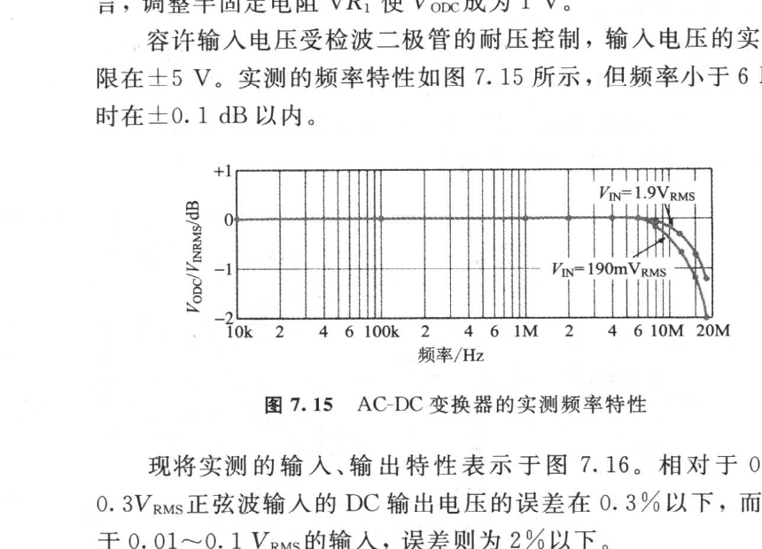

**图 7.15 AC-DC 变换器的实测频率特性**

现将实测的输入、输出特性表示于图 7.16。相对于 0.1～0.3 \\(V_{RMS}\\) 正弦波输入的 DC 输出电压的误差在 0.3% 以下，而相对于 0.01～0.1 \\(V_{RMS}\\) 的输入，误差则为 2% 以下。

<!-- 来源：PDF 第 210–218 页；原书第 197–204 页 -->

## 7.3　JFET 输入高速宽频带运算放大器

还有比通用运算放大器高增益且高速宽频带，其他特性也优于通用型数倍的高性能 JFET 输入运算放大器。AD 公司的 AD845 和 TI 公司的 OPA627/637 即为其代表。其电气特性如表 7.5 所示。

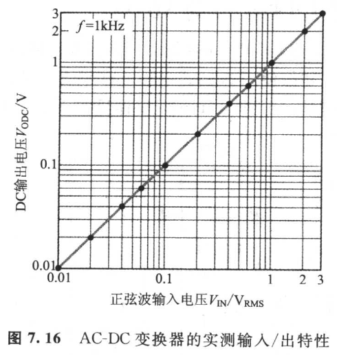

**图 7.16 AC-DC 变换器的实测输入/出特性**

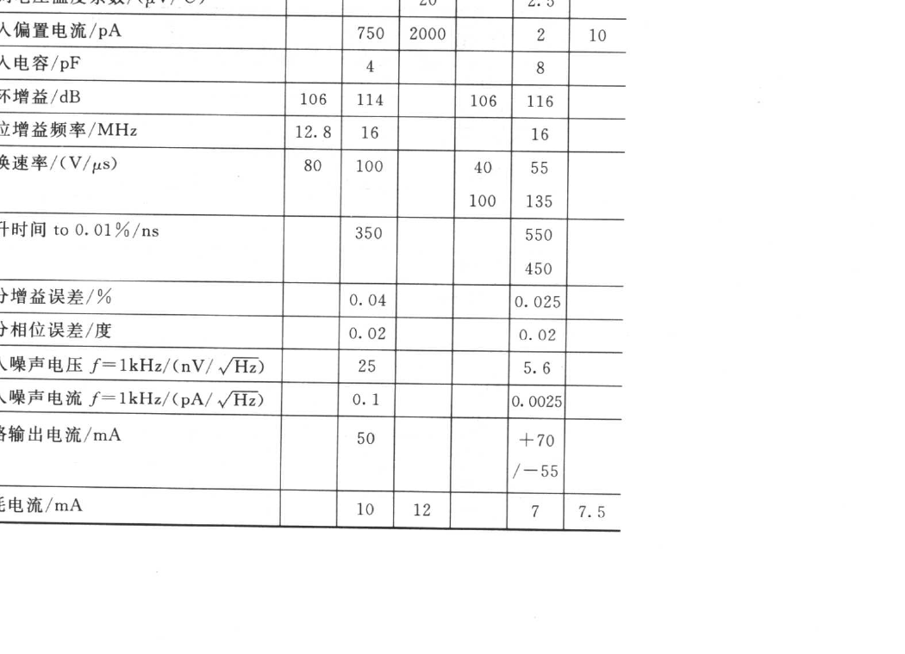

**表 7.5 JFET 输入高速宽频带运算放大器的主要特性**

<!-- 表 7.5：已改用 markdown 表格格式（原 colspan 已展开） -->
| 项目 | | AD845J | | | OPA627 | |
|------|------|------|------|------|------|------|
| 厂家 | | AD | | | TI | |
| | 最小 | 标准 | 最大 | 最小 | 标准 | 最大 |
| 电源电压 /V | | | ±18 | | | ±18 |
| 输入失调电压 /mV | | 0.7 | 1.5 | | 0.13 | 0.25 |
| 失调电压温度系数 /(μV/℃) | | |20 | | 2.5 | |
| 输入偏置电流 /pA | | 750 | 2000 | | 2 | 10 |
| 输入电容 /pF | | 4 | | | 8 | |
| 开环增益 /dB | 106 | 114 | | 106 | 116 | |
| 单位增益频率 /MHz | 12.8 | 16 | | | 16 | |
| 转换速率 /(V/μs) | 80 | 100 | | 40 | 55 | |
| | | | | 100 | 135 | |
| 上升时间 0.01% /ns | | 350 | | | 550 | |
| | | | | | 450 | |
| 微分增益误差 /% | | 0.04 | | | 0.025 | |
| 微分相位误差 /度 | | 0.02 | | | 0.02 | |
| 噪声电压 1kHz /(nV/√Hz) | | 25 | | | 5.6 | |
| 噪声电流 1kHz /(pA/√Hz) | | 0.1 | | | 0.0025 | |
| 短路输出电流 /mA | | 50 | | | +70/−55 | |
| 消耗电流 /mA | | 10 | 12 | | 7 | 7.5 |

### 7.3.1　基于 CB Process 的 AD845

这是采用上述 CB Process 的运算放大器，其简略等效电路如图 7.17 所示。初级使用 N 通道（channel）JFET，把输入电容抑制在 4 pF。GB 积是 16 MHz（typ），整体反馈下稳定工作。

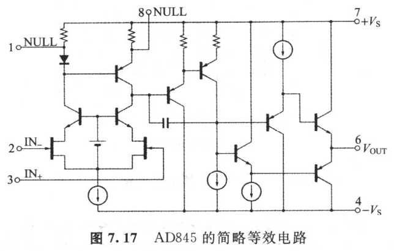

**图 7.17 AD845 的简略等效电路**

高速型开环增益达到 114 dB（typ），因馈加多量的负反馈，所以失真极低。表 7.6 列出了主要运算放大器的高谐波失真率（THD）的实测值。图 7.18 则为失真率的实测电路。与其他运算放大器相比较，可知在 10 kHz 时的失真非常小。

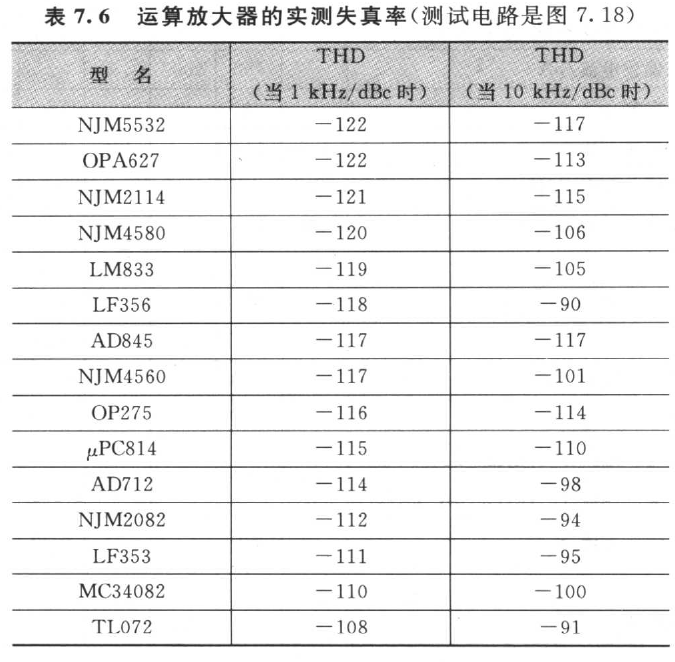

**表 7.6 运算放大器的实测失真率**

<!-- 表 7.6：已改用 markdown 表格格式 -->
| 型号 | THD（1 kHz / dBc） | THD（10 kHz / dBc） |
|------|------|------|
| NJM5532 | −122 | −117 |
| OPA627 | −122 | −113 |
| NJM2114 | −121 | −115 |
| NJM4580 | −120 | −106 |
| LM833 | −119 | −105 |
| LF356 | −118 | −90 |
| AD845 | −117 | −117 |
| NJM4560 | −117 | −101 |
| OP275 | −116 | −114 |
| μPC814 | −115 | −110 |
| AD712 | −114 | −98 |
| NJM2082 | −112 | −94 |
| LF353 | −111 | −95 |
| MC34082 | −110 | −100 |
| TL072 | −108 | −91 |

### 7.3.2　基于 Difet Process 的 OPA627/637

此运算放大器就是 TI 公司采用介质分离 Process Difet 的 JFET 输入运算放大器。Difet 成本虽比 BiFET 高，但能够减小栅极漏电流和栅极输入电容。

OPA627 与 OPA637 虽然电路构成相同，但只有隐藏的相位补偿电容不同。OPA627 以整体反馈稳定工作，OPA637 则在噪声增益在 5 倍以上时稳定工作。

现将 OPA627 的简略等效电路表示于图 7.19。\\(Q_3\\)、\\(Q_4\\) 与 \\(Q_5\\)、\\(Q_6\\) 是电流镜像。在此电路上（\\(Q_3\\) 与 \\(Q_5\\) 的发射极面积比）与（\\(Q_4\\) 与 \\(Q_6\\) 的发射极面积比）要是均为 \\(n\\) 时，则下式就成立。

\\[ I_{C3} + I_{C4} = \left(\frac{n}{n+1}\right)I_1 = \text{一定} \tag{7.24} \\]

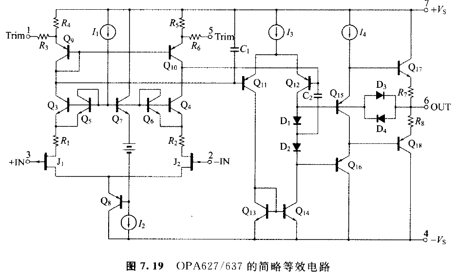

**图 7.19 OPA627/637 的简略等效电路**

也就是说 \\(Q_5\\)、\\(Q_6\\) 是被 \\(J_1\\)、\\(J_2\\) 所驱动的基极接地差动放大电路。

另外，\\(J_1\\)、\\(J_2\\) 属漏极（Drain）接地。初级的互导 \\(g_m\\) 可用下式表达。

\\[ 
g_m = \frac{n}{n+1}\left\lbrace\frac{1}{\frac{1}{g_{m1}} + \frac{1}{g_{m2}} + R_1 + R_2 + \frac{4V_T}{I_1}}\right\rbrace 
\tag{7.25} 
\\]

其中，\\(g_{m1}\\) 为 \\(J_1\\) 的互导（S）；\\(g_{m2}\\) 为 \\(J_2\\) 的互导（S）；\\(V_T\\) 为热电压（=25.85 mV（当 300 K 时））；\\(I_1\\) 为定电流源 \\(I_1\\) 的电流值（A）。

\\(Q_7\\) 与 \\(Q_8\\) 是用于 Boot strape \\(J_1\\)、\\(J_2\\) 的漏极保持 \\(V_{DS}\\) 为一定值，抵消栅极、漏极间电容 \\(C_{GD}\\) 对 \\(V_{DS}\\) 的依赖性。

\\(Q_3\\) 与 \\(Q_4\\) 是用于限制输出短路时的输出电流，输出电流要是是在 ±45 mA 以内时，实质上为非导通。

OPA627 的初级有许多噪声源，但输入换算噪声电压为 \\(5.6 nV / \sqrt{Hz}\\)（当 1 kHz 时）微小时，表示 \\(J_1\\) 与 \\(J_2\\) 的 \\(g_m\\) 值非常大。

### 7.3.3　显示高速性的重要参数——上升时间

作为评价高速性的参数（Parameter），与转换速率（Slew rate）同等重要的还有被称为上升时间参数。上升（Settling）时间，是指阶跃响应（step response）对常态振幅输入指定误差为止的时间（参照图 7.20），通常误差都指定为 to 0.1% 或 to 0.01%。

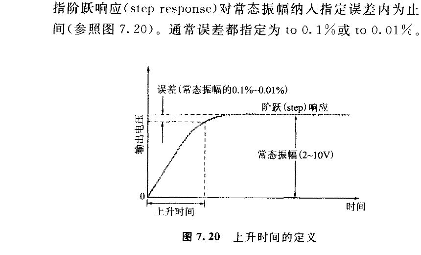

**图 7.20 上升时间的定义**

一般情况下，高速宽频带型运算放大器虽然上升时间短，但相位容限少，相位随着频率一起做复杂变化的 Feed Forward 补偿运算放大器，由于响应的过冲（Overshoot），以致上升时间有增长的倾向。

AD845 与 OPA627 的上升时间反映出真实的相位特性，而呈现相应转换速率和 GB 积的微小值（参照表 7.5）。

### 7.3.4　OPA627 在宽频带平衡放大器方面的应用

图 7.21 是驱动 Seelas Logic 公司 A-D Converter CS5396 的平衡放大器（差动输入/差动输出放大器）的例子 [26]。此 CS5396，是最大取样频率 = 96 kHz/24 bit，分辨能动态范围 120 dB 的超高性能的 ΔΣ 型 A-D Converter [27][28]，欲充分（100%）发挥其实力，驱动放大器需满足以下条件：

- THD < 0.0001%（20 Hz—20 kHz）；
- 总输出噪声电压 < 2 μV\\(_{RMS}\\)（20 Hz—20 kHz）；
- 最大输入电压 = 13 V\\(_{RMS}\\)/最大输出电压 = ±2 V；
- 可在 100 Ω 负载供给 ±20 mA 的电流。

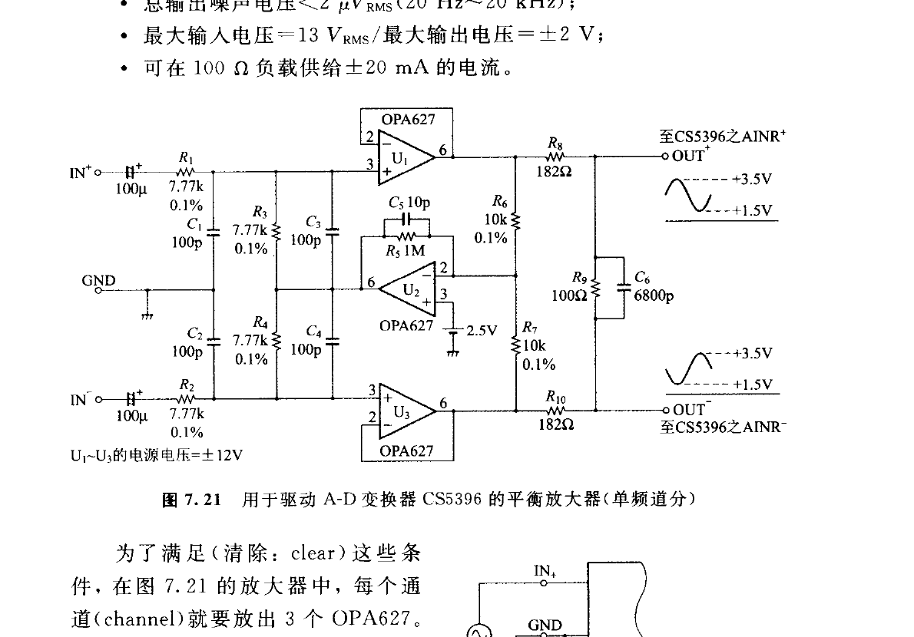

**图 7.21 用于驱动 A-D 变换器 CS5396 的平衡放大器（单频道）**

为了满足（清除：clear）这些条件，在图 7.21 的放大器中，每个通道（channel）就要放出 3 个 OPA627。此放大器以差动输入为原则，但因馈加有强力的同相负反馈（后述），所以单端（Single ended）接输入（图 7.22）也毫无问题。

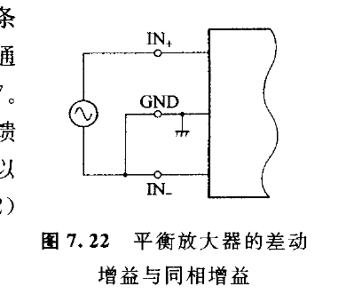

**图 7.22 平衡放大器的差动增益与同相增益**

### 7.3.5　什么是平衡放大器上的共模抑制比

差动输入−差动输出放大器＝平衡放大器，如此定义增益。

▶ 差模增益 \\(A_{VD}\\)

如图 7.23（a）所示，当输入端子 1 供加以 \\((+V_{ID}/2)\\)，输入端子供加以 \\((-V_{ID}/2)\\) 时，出现于输出端子的电压 \\(V_{O1}\\) 与 \\(V_{O2}\\)，可如下定义：

\\[ A_{VD} = \frac{V_{O1} - V_{O2}}{V_{ID}} \tag{7.26} \\]

▶ 共模增益 \\(A_{VC}\\)

如图 7.23（b）所示，供加连结两输入端子的共有输入电压 \\(V_{IC}\\) 时，出现于输出端子的电压 \\(V_{O1}\\)、\\(V_{O2}\\) 做如下定义：

\\[ A_{VC} = \frac{(V_{O1} + V_{O2})/2}{V_{IC}} \tag{7.27} \\]

\\(V_{IC}\\) 即 \\([(V_{IN1} + V_{IN2})/2]\\) 叫同相输入电压，\\([(V_{O1} + V_{O2})/2]\\) 则叫同相输出电压。

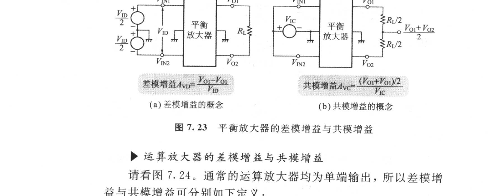

**图 7.23 平衡放大器的差模增益与共模增益**

▶ 运算放大器的差模增益与共模增益

请看图 7.24。通常的运算放大器均为单端输出，所以差模增益与共模增益可分别如下定义：

\\[ \text{差模增益 } A_{VD} = \frac{V_{OUT}}{V_{ID}} \tag{7.28} \\]

\\[ \text{共模增益 } A_{VC} = \frac{V_{OUT}}{V_{IC}} \tag{7.29} \\]

差模增益 \\(A_{VD}\\) 与共模增益 \\(A_{VC}\\) 之比叫做共模抑制比 CMRR（Common Mode Rejection Ratio），通常用 dB 表示。

\\[ \mathrm{CMRR} = 20\lg(A_{VD}/A_{VC})(\mathrm{dB}) \tag{7.30} \\]

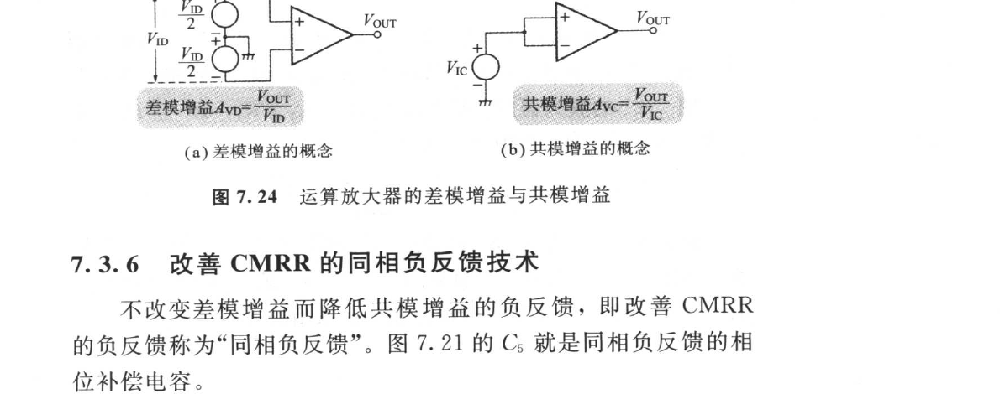

**图 7.24 运算放大器的差模增益与共模增益**

### 7.3.6　改善 CMRR 的同相负反馈技术

不改变差模增益而降低共模增益的负反馈，即改善 CMRR 的负反馈称为"同相负反馈"。图 7.21 的 \\(C_5\\) 就是同相负反馈的相位补偿电容。

同相负反馈的稳定性，可用相对于同相信号的环路增益（Loop Gain）的相位容限加以判断。想要计算同相负反馈的环路增益，应把图 7.21 的输入端子 IN+ 与 IN− 分别接地，而且将两输出端子（OUT+ 与 OUT−）加以短路，于是从电路的对称性便推导出图 7.25 的等效电路。

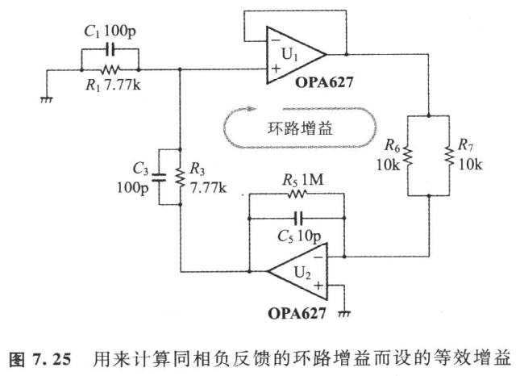

**图 7.25 用来计算同相负反馈的环路增益而设的等效增益**

环路增益 \\(G_L(j\omega)\\) 近似上为：

\\[ G_L(j\omega) = \frac{1}{2}\left(\frac{R_5}{R_6 // R_7}\right)\left(\frac{1}{1 + j\omega R_5 C_5}\right)G_1(j\omega) \tag{7.31} \\\\
（G_1(j\omega)：U_1 的总反馈时闭环增益）
\\]

同相负反馈的环路增益为 1 倍的频率，即增益交点频率 \\(f_C\\) 近似上可为：

\\[ f_C = \frac{1}{2\pi R_6 C_5} \tag{7.32} \\]

倘若时常数 \\(R_6 C_5\\) 设定得使 \\(f_C\\) 远低于 \\(U_1\\)（OPA627）的单位增益（Unity Gain）频率（=16 MHz）时，便可获得足够的相位容限。

图 7.21 的放大器的 CMRR，当 \\(R_1 = R_2 = R_3 = R_4\\) 且 \\(R_6 = R_7\\) 又 \\(R_8 = R_{10}\\) 成立时，在中频带频率，

\\[ 
\mathrm{CMRR} = 20\lg\left\[\left\(1 + \frac{R_5}{R_6}\right\)\left\(\frac{R_9}{2R_8 + R_9}\right\)\right\](\mathrm{dB}) \tag{7.33} 
\\]

此式子，暗示增加 \\(R_5\\) 的值时，CMRR 就增加。原电路的 \\(R_5\\) 为 1 MΩ，但若省去 \\(R_5\\)（也就是取 \\(R_5 = \infty\\)），则 CMRR 就更加改善。再者，纵然省去 \\(R_5\\)，但动作点和差模增益并不改变。