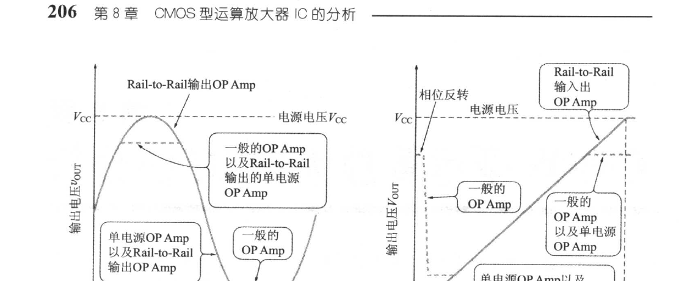
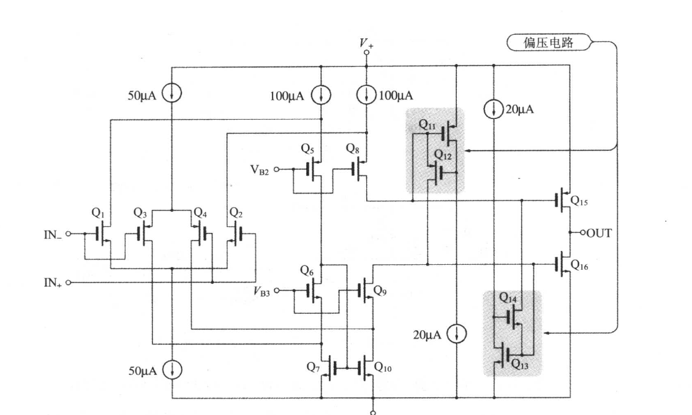
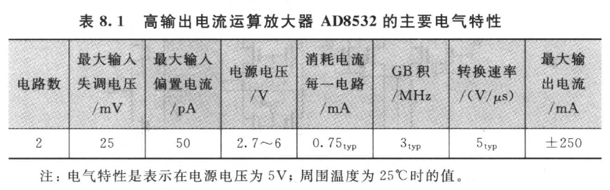
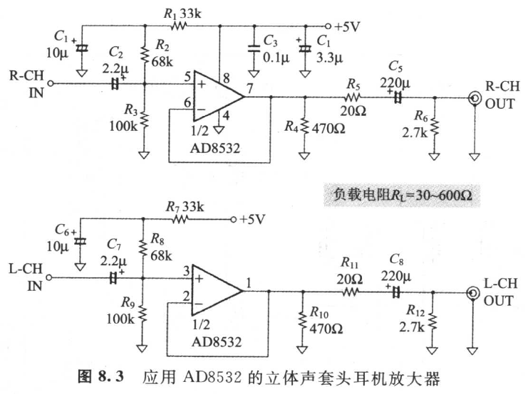
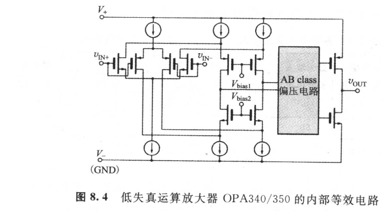
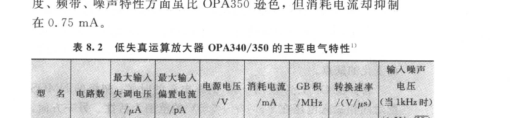
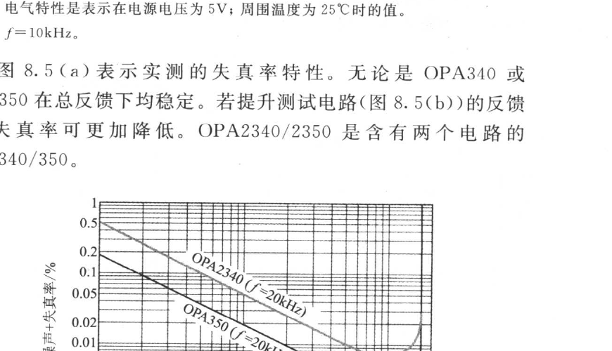

<!-- 来源：PDF 第 219–223 页；原书第 205–209 页 -->

# 第 8 章　CMOS 型运算放大器 IC 的分析

将来的运算放大器以 Bipolar 型和 Bi-FET 型为主流。但是，由于近数年来需求急速扩张的便携式机器上所使用的运算放大器，需要低电源电压工作，而且耗电少，所以对 CMOS 型运算放大器十分有利。

## 8.1　CMOS 运算放大器的出现与高性能化

### 8.1.1　低功耗化与 Rail-to-Rail 动作

以往的 CMOS 运算放大器的性能虽比 Bipolar 运算放大器逊色，但最近的 CMOS 运算放大器由于制造过程和电路方式的改良，输入失调电压、噪声特性、转换速率、GB 积等诸特性均有显著提升。

运算放大器以低电源电压使用时的最大问题是，Dynamic range（可处理信号振幅的大小）的降低。为抑制其动态范围（Dynamic range）降低到最小限度而出现的，称为"Rail to Rail 输入/出运算放大器[29]"的放大器（以下简写作 R-R 输入/输出运算放大器）。

以前一般的运算放大器，输出级采用互补发射极跟随器。如图 8.1(a) 的点线所示，输出电压不能够完全达到电源电压。另外同相输入电压范围由于比电源电压范围狭窄，若作为电压跟随器（Voltage Follower）使用时，输出的最大振幅如图 8.1(b) 的点线所示，在输入级就被限制。同理，同相输入电压随组件而处低位时，也会有相位反转的缺点。

另一方面，R-R 输入/输出运算放大器以单电源使用时，有如下的特征：

1. 同相输入电压范围涵盖 0 V 至电源电压；
2. 输出电压摆至 0 V 至电源电压。

① 叫 R-R 输入，② 则叫 R-R 输出，R-R 输入且为 R-R 输出的运算放大器称之为"R-R 输入输出运算放大器"。

"Rail-to-Rail"就是表示，同相输入电压范围和输出电压范围能够摆动于 0 V 线与电源电压线（两电源的情形就是负电源线与正电源线）两条轨道（Rail）之间的意思。R-R 输入/出运算放大器，无论是 Bipolar Process 或 CMOS Process 均可制造。

### 8.1.2　CMOS Rail-to-Rail 运算放大器 AD8532

这是 CMOS 的 R-R 输入/出运算放大器，最近的高性能运算放大器通常都不公开等效电路，但 AD8532 在资料手册却公开等效电路（图 8.2）。

> ▶ AD8532 的内部动作
>
> 初级是由 \\(Q_1\\)～\\(Q_4\\) 所构成。为使同相输入电压范围扩展至电源电压，\\(Q_2\\) 的 NMOS 配对（Pair）与 \\(Q_3\\)、\\(Q_4\\) 的 PMOS 配对并联连接。同相输入电压接近电源电压 \\(V_+\\) 时，PMOS 配对截止（Cut off），但 NMOS 配对呈活性（Active）。反之，同相输入电压接近电源电压 \\(V_-\\) 时，则 NMOS 截止，而 PMOS 却呈活性（Active）。
>
> \\(Q_5\\)、\\(Q_6\\)、\\(Q_8\\)、\\(Q_9\\) 是栅极接地。而与初级一起构成 Folded Cascode 电路。\\(Q_7\\) 与 \\(Q_{10}\\) 是电流镜像。

为使输出电压摆至电源电压，输出级为 \\(Q_{15}\\) 与 \\(Q_{16}\\) 的互补源极接地。\\(Q_{11}\\)～\\(Q_{14}\\) 是为使输出级做 AB class 动作而设的偏压电路。

> ▶ 在立体声套头耳机放大器方面的应用

现将 AD8532 的电气特性列于表 8.1 中。

| 电路数 | 最大输入失调电压 /mV | 最大输入偏置电流 /pA | 电源电压 /V | 消耗电流每一电路 /mA | GB积 /MHz | 转换速率 /(V/μs) | 最大输出电流 /mA |
|------|------|------|------|------|------|------|------|
| 2 | 25 | 50 | 2.7～6 | 0.75 typ | 3 typ | 5 typ | ±250 |

注：电气特性是表示在电源电压为 5 V；周围温度为 25℃ 时的值。

图 8.3 是有效地利用 AD8532 的高输出电流特性，在套头耳机放大器方面的应用实例。\\(R_1\\) 与 \\(C_1\\) 是防止电源噪声环绕而入的低通带滤波器。AD8532 因为并无隐藏输出保护电路，所以有必要插入电流限制电阻 \\(R_5\\)。

### 8.1.3　低失真的运算放大器 OPA340/350/2340/2350

虽然一直有"CMOS 运算放大器失真大"的现象，但 TI 公司的 OPA340/350，已实现克服此形象的低失真率。

OPA340/350，是电路构成与 AD8532 同样的 CMOS 型 R-R 输入/出运算放大器。内部组成为（图 8.4）：

- 初级。NMOS 配对与 PMOS 配对并联差动放大；
- 第二级。Folded Cascode 电路；
- 输出级。AB class 互补源极接地。

> ▶ 失真率特性

OPA340/350 的主要电气特性如表 8.2 所示。OPA340 在速度、频带、噪声特性方面虽比 OPA350 逊色，但消耗电流却抑制在 0.75 mA。

| 型号 | 电路数 | 最大输入失调电压 /μV | 最大输入偏置电流 /pA | 电源电压 /V | 消耗电流 /mA | GB积 /MHz | 转换速率 /(V/μs) | 输入噪声电压(1kHz)/(\\(nV/\\sqrt{\\mathrm{Hz}}\\)) |
|------|------|------|------|------|------|------|------|------|
| OPA340 | 1 | ±500 | ±10 | 2.7～5.5 | 0.75 typ | 5.5 typ | 6 typ | 25 typ |
| OPA350 | 1 | ±500 | ±10 | 2.7～5.5 | 5.2 typ | 38 typ | 22 typ | 7 typ |

注：1）电气特性是表示在电源电压为 5 V；周围温度为 25℃ 时的值。2）f=10 kHz。

图 8.5(a) 表示实测的失真率特性。无论是 OPA340 或 OPA350 在总反馈下均稳定。若提升测试电路（图 8.5(b)）的反馈率，失真率可更加降低。OPA2340/2350 是含有两个电路的 OPA340/350。

