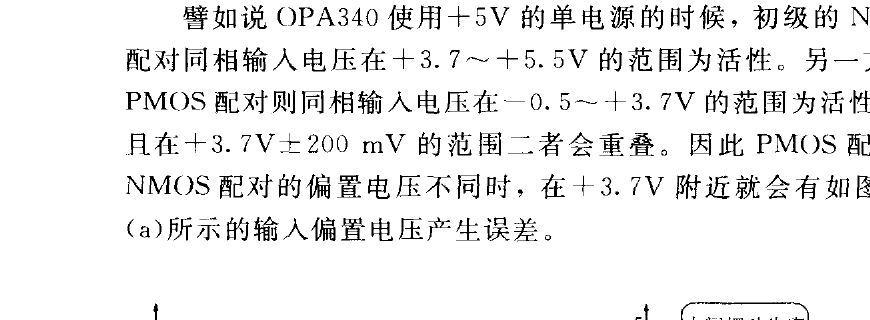
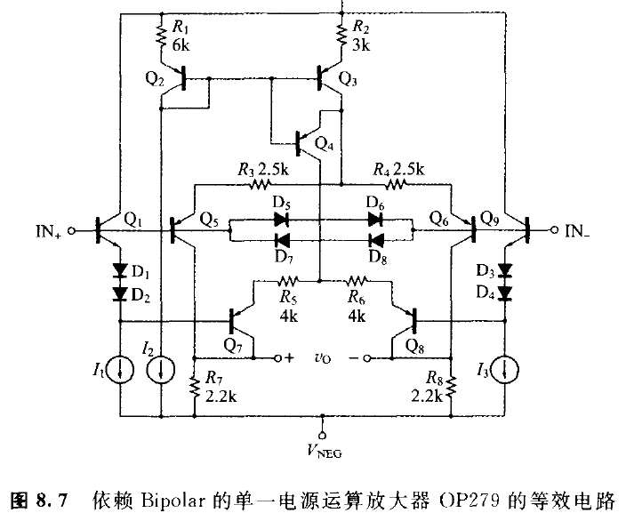
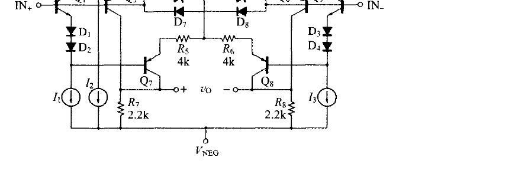
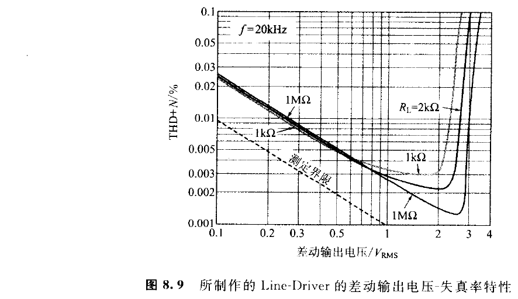
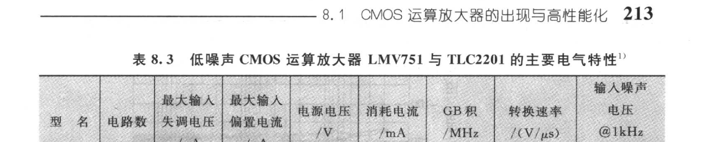
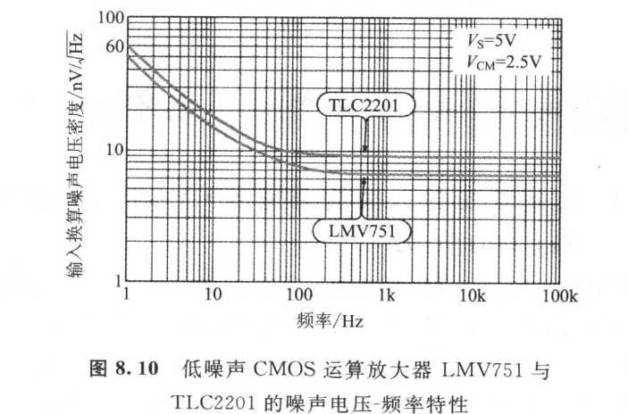
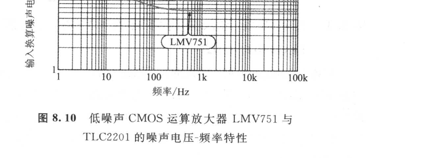
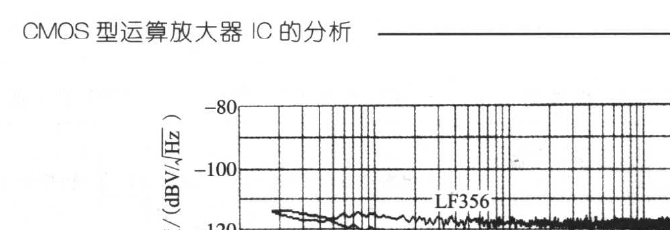

<!-- 来源：PDF 第 224–228 页；原书第 210–214 页 -->

### 8.1.4　R-R 输入特有的中间摆动（mid-swing）失真，需加注意

可是，初级把 PMOS 配对与 NMOS 配对的差动放大做并联连接的 R-R 输入运算放大器，却有输入偏置电压随同相输入电压而变化的缺点。

譬如说 OPA340 使用 +5 V 的单电源的时候，初级的 NMOS 配对同相输入电压在 +3.7～+5.5 V 的范围为活性。另一方面，PMOS 配对则同相输入电压在 −0.5～+3.7 V 的范围为活性。而且在 +3.7 V±200 mV 的范围二者会重叠。因此 PMOS 配对与 NMOS 配对的偏置电压不同时，在 +3.7 V 附近就会有如图 8.6(a) 所示的输入偏置电压产生误差。

若用这样的运算放大器构成 Voltage Follower 电路，则如图 8.6(b) 所示，在 +3.7 V 附近输入/出特性就会有失调电压的误差发生。这叫做中间摆动失真（mid-swing distortion）。

中间摆动失真并非是 CMOS 所特有的，Bipolar 的 R-R 输入运算放大器也可能发生此现象。譬如像图 8.7 所示的 OP279，当初级为 PNP 配对与 NPN 配对并联接续的时候，要是 PNP 配对与 NPN 配对的输入失调电压不同时，依然会产生中间摆动失真。

总之，当初级为差动放大电路的并联接时，无论 Bipolar 与 CMOS 都有发生中间摆动失真的可能性。

### 8.1.5　避免中间摆动失真的方法

避免中间摆动失真的方法，其一是尽可能选择输入失调电压小的运算放大器。附带一提的是 OPA340/350 的输入失调电压抑制在 ±500 μV 以下。

方法之二就是，同相输入电压不要跨 PMOS 配对与 NMOS 配对的重叠领域，而对同相输入电压加以控制。图 8.8 即为此方法，避免中间摆动失真现象的差动输出 Line Driver 的实例。

当 \\(R_3=R_5\\) 且 \\(R_4=R_6\\) 成立时，在中频带领域为：

\\[ V_{OUT1} = V_{COM} + \frac{R_2}{R_1}V_{IN} \tag{8.1a} \\]

\\[ V_{OUT2} = V_{COM} - \frac{R_2}{R_1}V_{IN} \tag{8.1b} \\]

而 OPA2340 的管脚 2，3，5，6 的电位事实上等于 \\(V_{COM}\\)，即 +2.5 V。因此，两个运算放大器的各同相输入电压与信号无关，被固定于 +2.5 V，收纳在中间摆动失真不发生的领域（图 8.6(a) 中领域 Ⓐ）。

此放大器的实测失真率特性表示于图 8.9。低输出时的恶化属噪声成分，当差动输出电压在 2 V\\(_{RMS}\\) 以内时，失真率成分则低于 0.003%。

### 8.1.6　CMOS 的低噪声运算放大器 LMV751

一般来说 CMOS 运算放大器都有 1/f corner 频率高，噪声多的倾向。但是，最近和 Bipolar 型与 Bi-FET 型并驾齐驱的低噪声 CMOS 运算放大器已出现。譬如说有 NS 公司的 LMV751 与 TI 公司的 TLC2201（参照表 8.3）。

如图 8.10 所示，LMV751 的 1 kHz 的输入噪声电压密度为 6.5 \\(nV/\\sqrt{\\mathrm{Hz}}\\)，优于 Bi-FET 型运算放大器 LF356 的 12 \\(nV/\\sqrt{\\mathrm{Hz}}\\)，逼近 Bipolar 型的 NE5532 的 5 \\(nV/\\sqrt{\\mathrm{Hz}}\\)。

使用 LMV751 的 +5 V 单电源/闭环增益 = 40 dB 的放大器（图 8.11），其输出噪声电压的 FET 分析结果如图 8.12 所示。50 Hz 以上的噪声比电源电压 = ±15 V/闭环增益 = 40 dB 的 LF356 约略低 6 dB。

| 型号 | 电路数 | 最大输入失调电压 /μV | 最大输入偏置电流 /pA | 电源电压 /V | 消耗电流 /mA | GB积 /MHz | 转换速率 /(V/μs) | 输入噪声电压@1kHz /(\\(nV/\\sqrt{\\mathrm{Hz}}\\)) |
|------|------|------|------|------|------|------|------|------|
| LMV751 | 1 | 1.0 | 100 | 5.5 max | 0.6 typ | 5 typ | 2.3 typ | 6.5 typ |
| TLC2201 | 1 | 0.5 | 100 | 16 max | 1 typ | 1.8 typ | 2.5 typ | 8 typ |

注：1）电气特性是表示在电源电压为 5 V；周围温度为 25℃ 时的值。

TLC2201 的输入噪声电压密度（图 8.10），比 LMV751 稍大 8 \\(nV/\\sqrt{\\mathrm{Hz}}\\)（当 1 kHz 时），但电源电压的最大额定，TLC2201 相对于 LMV751 的 5.5 V 却高 16 V。

