<!-- 来源：PDF 第 228–235 页；原书第 214–221 页 -->

## 8.2　更进一步发展的 CMOS 运算放大器族群

### 8.2.1　自行补正输入失调电压的 CMOS 运算放大器 TLC4501/4502

被称为"chopper 型"型式的运算放大器，具有输入失调电压为数 μV，漂移（Drift）在 0.01 μV/℃ 以下的高 DC 精度。但是，截波（chopper）型由于隐藏的模拟开关（Analog Switch）在 100 Hz～10 kHz 左右的计时器（clock）中经常为 ON/OFF，所以会发生可听频带的 Chopping Noise。

TI 公司的 R-R 输出 CMOS 运算放大器 TLC4501/4502，虽和截波型一样取消输入失调电压，但隐藏开关只在电源投入后关闭一次，而且之后不再开闭，因而无 Chopping Noise，就同一般的运算放大器一样工作。

表 8.4 列有 TLC4501 的主要电气特性。另外，TLC4502 是含有 4501 两个电路的运算放大器。输入失调电压如表 8.5 所规定，虽比截波型大一位数左右，但却比通用型小二位数左右。

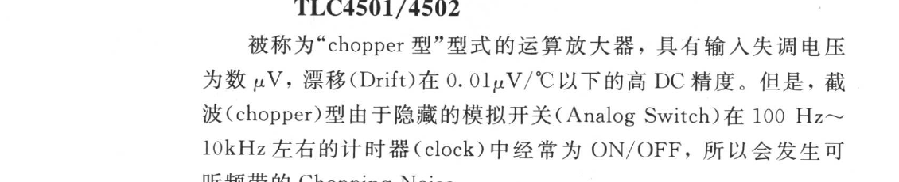

| 电路数 | 最大输入失调电压 /μV | 输入偏置电流 /pA | 电源电压 /V | 消耗电流 /mA | GB积 /MHz | 转换速率 /(V/μs) | 输入噪声电压(1kHz)/(nV/√Hz) |
|------|------|------|------|------|------|------|------|
| 1 | 参照表 8.5 | 1 typ | 7 max | 1 typ | 4.2 typ | 2.5 typ | 12 typ |

注：1）电气特性是表示在电源电压为 5 V，周围温度为 25℃ 时的值。

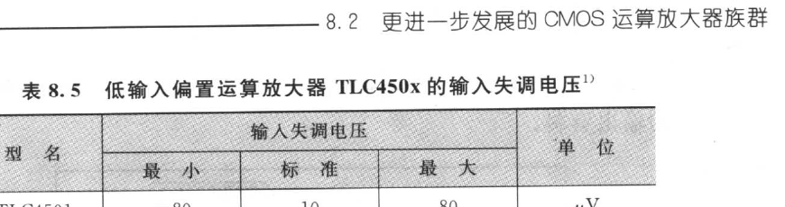

| 型号 | 输入失调电压 最小 | 输入失调电压 标准 | 输入失调电压 最大 | 单位 |
|------|------|------|------|------|
| TLC4501 | −80 | 10 | 80 | μV |
| TLC4501A | −40 | 10 | 40 | μV |
| TLC4502 | −100 | 10 | 100 | μV |
| TLC4502A | −50 | 10 | 50 | μV |

注：1）输入失调电压是在整个温度范围内（\\(T_A\\) = 0～70℃）的值。

现将采用图 8.13 的测试电路所测得的输入失调电压相对温度的特性表示于图 8.14。

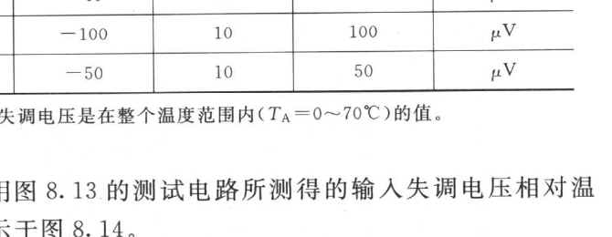

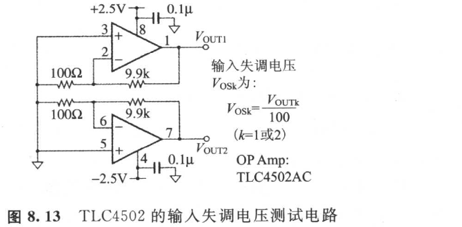

### 8.2.2　消除失调电压的结构

现将 TLC4501/4502 的功能方块表示于图 8.15。内部放大器的副（Sub）输入端子施加有 D-A 变换器输出。SAR（Successive Approximation Register，逐次比较 Register）收藏有 A-D 变换器的输出资料。

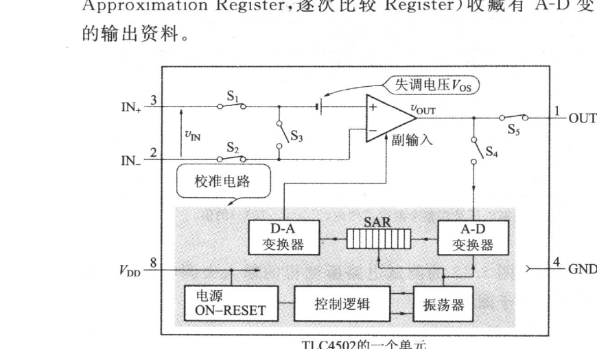

> ▶ 校准模式（Calibration Mode）
>
> 施加电源时，借助电源 ON 复置就进入校准模式。在此模式中，当内部开关 \\(S_1\\)、\\(S_2\\)、\\(S_5\\) 开时，\\(S_3\\)、\\(S_4\\) 闭。
>
> 放大器的内部输出电压 \\(V_{OUT}\\) 经 A-D 变换器，SAR、D-A 变换器全反馈于副输入端子。内部放大器的差动放大增益若以 \\(G_1\\) 表示，输入失调电压以 \\(V_{OS}\\) 表示，副输入端子至输出端子的增益则以 \\(G_2\\) 表示，则 \\(V_{OUT}=G_1V_{OS}-G_2V_{OUT}\\)
>
> 故
>
> \\[ V_{OUT} = \frac{G_1V_{OS}}{1+G_2} \tag{8.2} \\]
>
> 此 \\(V_{OUT}\\) 将被保存于 SAR。

> ▶ 正常模式（Normal Mode）
>
> 校准模式在电源供加后 300 ms 以内便结束了。之后，在电源切断以前就停留在正常模式。在此模式不但振荡器停止，而且内部开关处于图 8.15 的状态。因为式（8.2）的 \\(V_{OUT}\\) 直接加于副输入端子，所以输出电压 \\(V_{OUT}\\) 成为：
>
> \\[ V_{OUT} = G_1(V_{IN} + V_{OS}) - G_2\left(\frac{G_1V_{OS}}{1+G_2}\right) = G_1\left(V_{IN} + \frac{V_{OS}}{1+G_2}\right) \tag{8.3} \\]
>
> 式（8.3）表示输入失调电压 \\(V_{OS}\\) 减少为 \\((1+G_2)\\) 分之 1。

### 8.2.3　使用 TLC4501 的高精度电压源

图 8.16 是 MAXIM 公司的高精度电压保证电路，MAX6350 的输出电压，用计数器（Counter）IC 的 74HC390 与低通带滤波器进行精密分压，并在无调整时，可获得 1.000 V±0.2 mV 的电压[30]。

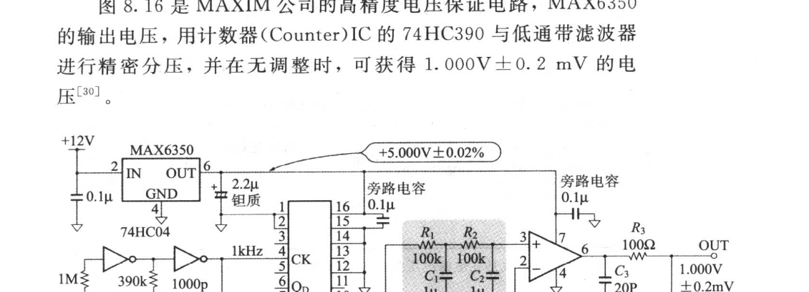

MAX6350 是输出电压 = 5.000 V，初期精度 = ±0.02（%），漂移 = 1 ppm/℃（max）的三端子电压保证[31]。74HC390 为 CMOS 逻辑的（2 进 + 5 进）计数器。其电源端子（接脚 16）有 MAX6350 的输出电压供给。

若 74HC390 的管脚 4 提供计时器（clock），管脚 7 就会输出工作（Duty）比 = 20% 的方波。再通过 \\(R_1\\)、\\(C_1\\)、\\(R_2\\)、\\(C_2\\) 的低通带滤波器，则可获得刚好为 74HC390 的电源电压的 20%，即 1.000 V±0.02% 的 DC 电压。从 DC 电压精度的角度看，虽然计时器频率越低越好，但过低时，残留脉动（ripple）就会增加。\\(f_{CLK}\\) 在 1 kHz 左右最适当。

用 TLC4501 的电压跟随器（Voltage Follower）降低输出阻抗。\\(R_3\\)、\\(R_4\\)、\\(C_3\\) 是为防止由于连接于输出端子的电缆静电电容所造成的振荡而设的相位补偿元件。输出端子上 DC 的输出阻抗为 0.01 Ω。

另外，从 74HC390 的管脚 5 取出输出，并通过低通滤波器便可得 2.000 V 的 DC 电压。又若管脚 5 输出比 74HC04 相位反转，再通过低通滤波器（Low Pass Filter），则可得 3.000 V 的 DC 电压。

### 8.2.4　在 2V 以下工作的 CMOS 运算放大器 NJU7096

大多的运算放大器不但从未在 2 V 以下的电源电压工作，而且性能会大幅下降。不过 CMOS 运算放大器 NJU7096（新日本无线），却在仅为 1 V 的单电源下稳定地工作。表 8.6 列出了主要的电气特性。

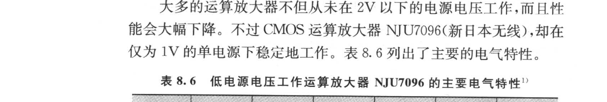

| 电路数 | 最大输入失调电压 /mV | 最大输入偏置电流 /pA | 电源电压 /V | 消耗电流每一电路 /mA | GB积 /MHz | 转换速率 /(V/μs) |
|------|------|------|------|------|------|------|
| 2 | 4 | 1 | 1～5.5 | 0.2 typ | 1 typ | 2.4 typ |

注：1）电气特性是在电源电压为 3 V；周围温度为 25℃ 时的值。

NJU7096 虽然消耗电流少，但是转换速率和 GB 积却大，最适于便携式机器。但因源极（流出）输出电流的供给能力低，所以有必要在源极输出电流纳入 58 μA 以下的负载使用。失真率为 1% 的输出电压振幅经测得的结果表示于图 8.17。

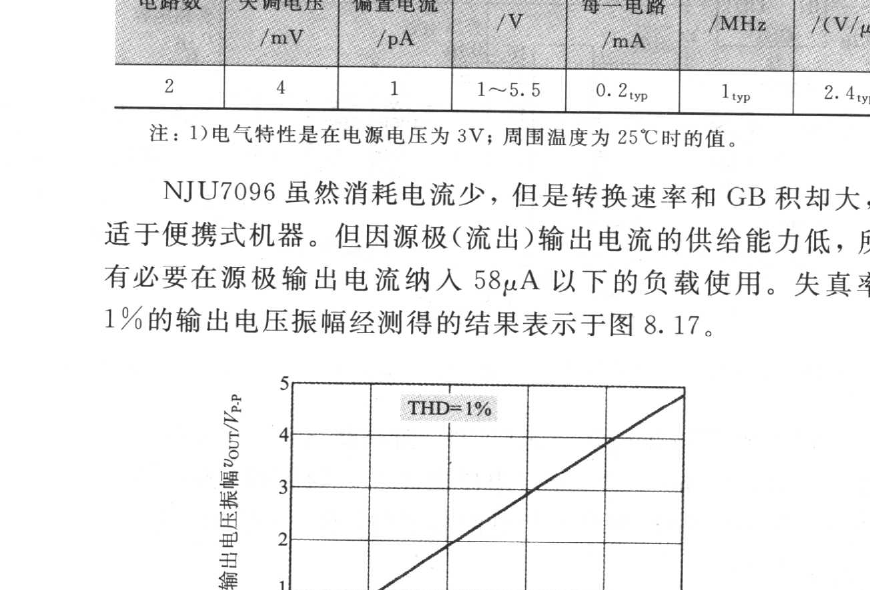

### 8.2.5　在低电源电压稳定振荡的正弦波振荡器方面的应用

反馈型的正弦波振荡器，电源电压低时，振幅的稳定化就困难。例如图 8.18 的振荡器，是由齐纳二极管（Zener Diode）导通，再适当截割波形的尖头以防止运算放大器的饱和。因此，电源电压若下降到二极管不致导通的程度，不但振荡停止，而且运算放大器又会饱和，这时输出大为失真。

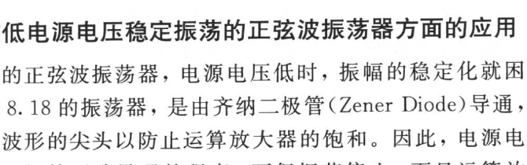

图 8.19，就是使用两个 NJU7096 把问题解决的正弦波振荡器。重点有以下两点：

- 振幅控制使用比较器（Comparator）；
- \\(C_2\\) 的有效电容通过 Boot-strap 给予改变。

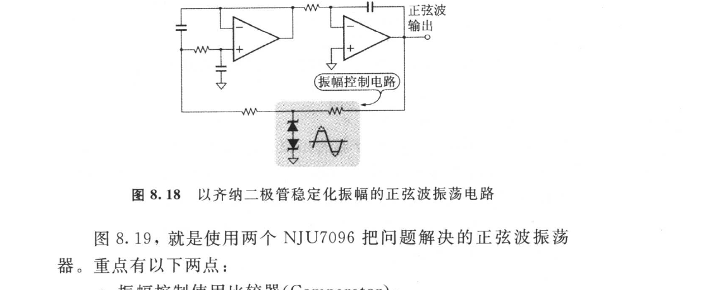

IC\\(_1\\) 作为比较器工作，电路在振荡状态时，IC\\(_1\\) 的输出为方波。因 NJU7096 为 rail-to-rail 输出，所以输出方波的振幅大致等于电源电压 \\(V_{DD}\\)，方波的基本波成分的两波峰振幅为 \\(4V_{DD}/\pi\\)。

至于比较器的输入电压等于 IC\\(_3\\) 的输出电压 \\(V_{OUT}\\)，所以相对于振荡基本波的比较器的增益 \\(G\\) 可用下式表达：

\\[ G = \frac{4}{\pi}\frac{V_{DD}}{V_{OUT}} \tag{8.4} \\]

此式表示输出电压 \\(V_{OUT}\\) 增加时，增益就减少。因此 \\(V_{OUT}\\) 的振幅若变化，则运算放大器就依 IC\\(_1\\)→IC\\(_2\\)→IC\\(_3\\)→IC\\(_1\\) 循环变化，环路增益抵消其变化，并保持 \\(V_{OUT}\\) 的振幅为一定值。

在振荡频率 \\(f_O\\) 在常态状态下的环路增益 \\(G_L(f_O)\\) 为：

\\[ G_L(f_O) = \frac{\sqrt{R_1R_2C_1}}{2R_3}\frac{C_1}{C_2}\frac{4}{\pi}\frac{V_{DD}}{V_{OUT}} = 1 \tag{8.5} \\]

输出电压的两波峰振幅，求解式（8.5）可求得 \\(V_{OUT}\\) 为：

\\[ V_{OUT} = \frac{\sqrt{R_1R_2C_1}}{2R_3}\frac{C_1}{C_2}\frac{4V_{DD}}{\pi} \tag{8.6} \\]

由 IC\\(_2\\) 形成的反向积分器的相位可滞后 270°，所以借助次级的 Sallen-key 型低通滤波器使相位滞后 90° 的频率，将使环路的相位旋转 360°、振荡。因此振荡频率取决于 \\(R_1\\)、\\(R_2\\)、\\(C_1\\)、\\(C_2\\)。

IC\\(_4\\) 与 \\(VR_1\\) 采用 Bootstrap \\(C_2\\)，并改变 \\(C_2\\) 的有效电容。\\(C_2\\) 的有效电容 \\(C_{eq}\\) 满足下式。

\\[ C_{eq} = kC_2 \\]

式中，\\(k = \dfrac{R_A}{R_A+R_B}\\)

而振荡频率 \\(f_O\\) 则为：

\\[ f_O = \frac{1}{2\pi\sqrt{R_1C_1R_2kC_2}} \tag{8.7} \\]

至于振幅的计算，因为式（8.6）并不含有 \\(kC_2\\)，所以即使 \\(k\\) 可变，但 \\(V_{OUT}\\) 的振幅依旧不变。

振荡波的失真率也可以计算。此振荡器也可以叫做由积分器与 Sallen-key 的低通滤波器，对 IC\\(_1\\) 的方波输出的高谐波成分加以滤波的电路。滤波后的残留失真几乎都属第 3 次高谐波，失真率 \\(D_3\\) 使用 Sallen-key 低通滤波器的 Q，可如下算出：

\\[ D_3 = \frac{1}{81}\times\frac{1}{Q} = \frac{1}{81}\times 2\sqrt{\frac{kC_2}{C_1}}\times 100\% \tag{8.8} \\]

若设 \\(C_1\\) = 0.01 μF，\\(C_2\\) = 330 pF，\\(k\\) = 0.768，便可获得 \\(f_O\\) = 1 kHz，\\(D_3\\) = 0.393%。

现将失真率、输出电压以及振荡频率-电源电压的实测特性表示于图 8.20。又电源电压 = 1 V 时的输出波形与失真成分表示于照片 8.1。

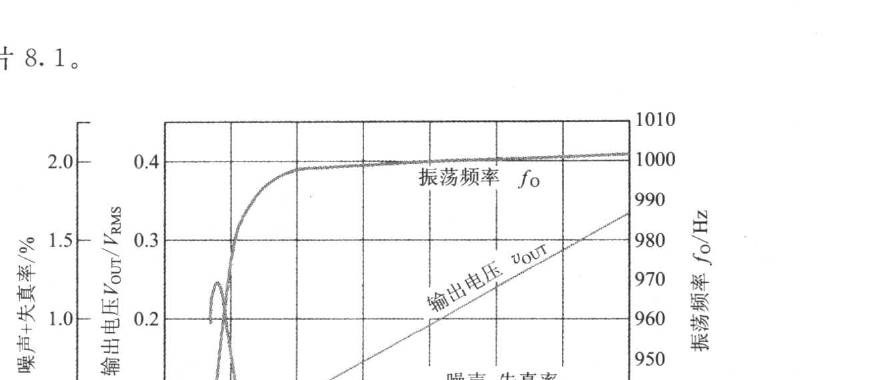

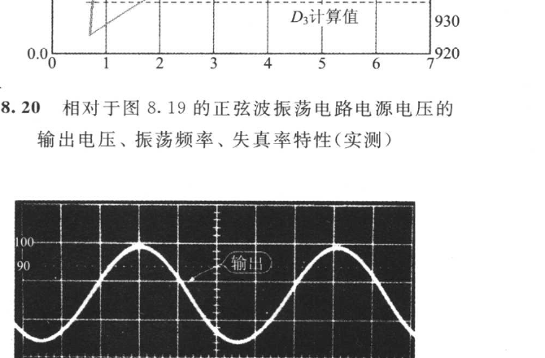